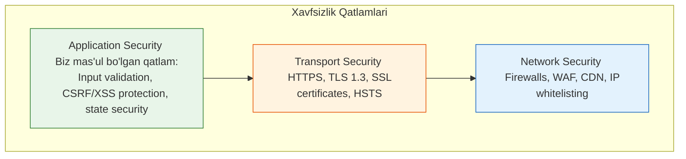

# Authentication va Security

## Kirish

> [!IMPORTANT]
> **Nima uchun muhim?**  
> Veb-sayt xavfsizligi — bu shunchaki qo'shimcha imkoniyat emas, u zamonaviy dasturlashning asosiy talabidir. Siz yozgan loyiha qanchalik tez va chiroyli ishlamasin, agar u orqali foydalanuvchilarning maxfiy ma'lumotlari, parollari yoki to'lov kartalari sizib chiqsa (data breach), loyiha va jamoaning reputatsiyasi butunlay yo'q bo'ladi. Har bir frontend dasturchi o'zi yozayotgan client-side kodning qayeri zaifligini va uni qanday xavfsiz holatga keltirishni bilishi shart.

> [!NOTE]
> **Real-hayot analogiyasi: "Uy xavfsizligi"**  
> - **Authentication (Autentifikatsiya - Login):** Bu sizning uyingizning old eshigidagi qulf. Siz kalit bilan kelib qulfni ochasiz (O'zingizni tanitasiz - "Men bu uyning egasiman").
> - **Authorization (Avtorizatsiya - Ruxsat):** Eshikdan kirganingizdan so'ng, sizning hamma xonaga kirish huquqingiz bor, lekin mehmon sifatida kelgan odam faqat mehmonxonaga kira oladi, yotoqxona yoki seyf xonasiga kira olmaydi (Ruxsatlar cheklovi).
> - **Security Vulnerabilities (Zaifliklar):** XSS — bu kimdir derazadan maxfiy kuzatuv kamerasi o'rnatishi. CSRF — bu sizni chalg'itib, bilmasdan orqa eshikni ochib qo'yishga majburlashi.

---

## Bo'lim Tarkibi

| # | Mavzu | Tavsif |
|---|-------|--------|
| 01 | [JWT (JSON Web Tokens)](./01-jwt.md) | Token struktura, signing, verification, refresh token pattern |
| 02 | [Cookies](./02-cookies.md) | Cookie attributes, secure flags, SameSite, session management |
| 03 | [LocalStorage Risks](./03-localstorage-risks.md) | Storage xavflari, token saqlash strategiyalari, alternativlar |
| 04 | [XSS (Cross-Site Scripting)](./04-xss.md) | XSS turlari, attack vectors, sanitization, CSP |
| 05 | [CSRF (Cross-Site Request Forgery)](./05-csrf.md) | CSRF mexanizmi, token patterns, SameSite cookies |
| 06 | [CORS (Cross-Origin Resource Sharing)](./06-cors.md) | Same-origin policy, preflight requests, headers configuration |
| 07 | [Best Practices](./07-best-practices.md) | Defense in depth, security checklist, audit metodlari |

## Nima Uchun Security Muhim?

### Real Statistika
- 2023-yilda XSS hujumlar web zaifliklarning **40%** ni tashkil etdi
- CSRF orqali yirik kompaniyalar millionlab dollar yo'qotdi
- JWT noto'g'ri ishlatilganda data breach'lar ro'y berdi

### Interview'da Security Savollari
Senior pozitsiyalar uchun security bilimi **majburiy**:
- JWT vs Session-based auth
- XSS prevention strategiyalari
- CORS muammolarini hal qilish
- Secure cookie configuration

## Xavfsizlik Piramidasi (Security Pyramid)



Frontend developer sifatida biz **Application Security** qatlamiga mas'ulmiz:
- Input validation
- Output encoding
- Authentication/Authorization
- Secure data storage
- API security

## Asosiy Tushunchalar

### Authentication vs Authorization
```
Authentication (AuthN): KIM sen?
├── Login/Password
├── OAuth/OIDC
├── Biometric
└── MFA

Authorization (AuthZ): NIMA qila olasan?
├── Role-based (RBAC)
├── Permission-based
├── Attribute-based (ABAC)
└── Resource-based
```

### Security Headers
```http
Content-Security-Policy: default-src 'self'
X-Content-Type-Options: nosniff
X-Frame-Options: DENY
X-XSS-Protection: 1; mode=block
Strict-Transport-Security: max-age=31536000
Referrer-Policy: strict-origin-when-cross-origin
```

## O'rganish Tartibi

1. **JWT** - zamonaviy authentication asosi
2. **Cookies** - session management va secure storage
3. **LocalStorage Risks** - nima uchun localStorage xavfli
4. **XSS** - eng keng tarqalgan web zaiflik
5. **CSRF** - state-changing request hujumlari
6. **CORS** - cross-origin muammolar va yechimlar
7. **Best Practices** - barcha bilimlarni birlashtirish

## Defense in Depth

Xavfsizlik bir qatlamda emas, ko'p qatlamda ta'minlanadi:

```
┌────────────────────────────────────────────────────┐
│                    WAF/CDN                         │
├────────────────────────────────────────────────────┤
│                 Rate Limiting                      │
├────────────────────────────────────────────────────┤
│              Input Validation                      │
├────────────────────────────────────────────────────┤
│           Output Encoding (XSS)                    │
├────────────────────────────────────────────────────┤
│        Authentication (JWT/Session)                │
├────────────────────────────────────────────────────┤
│           Authorization (RBAC)                     │
├────────────────────────────────────────────────────┤
│         CSRF/CORS Protection                       │
├────────────────────────────────────────────────────┤
│          Secure Data Storage                       │
└────────────────────────────────────────────────────┘
```

## Praktik Mashqlar

Har bir bo'limda:
- **Zaif kod** - xato qanday ko'rinishini tushunish
- **Xavfsiz kod** - to'g'ri implementatsiya
- **Attack scenarios** - real hujum usullari
- **Prevention** - himoya strategiyalari

## Foydali Resurslar

### OWASP
- [OWASP Top 10](https://owasp.org/www-project-top-ten/)
- [OWASP Cheat Sheets](https://cheatsheetseries.owasp.org/)
- [OWASP Testing Guide](https://owasp.org/www-project-web-security-testing-guide/)

### Tools
- [Burp Suite](https://portswigger.net/burp) - security testing
- [OWASP ZAP](https://www.zaproxy.org/) - automated scanner
- [jwt.io](https://jwt.io/) - JWT debugging

**Eslatma:** Security bilimini faqat himoya va o'rganish maqsadida ishlating. Ethical hacking (oq xakerlik) va mas'uliyatli xabar berish (responsible disclosure) prinsiplarini hurmat qiling.

---

## Eng Yaxshi Amaliyotlar (Best Practices)

1. **Faol o'rganish (OWASP Top 10):** OWASP (Open Web Application Security Project) tomonidan e'lon qilinadigan eng xavfli 10 ta zaiflik ro'yxatini doimo o'rganib boring. Har bir yozayotgan kodingizni shu ro'yxatga solishtiring.
2. **Kliyent xavfsizligini nazorat qilish (CSP):** Sahifalaringizga qat'iy Content Security Policy (CSP) sarlavhalarini o'rnating. Bu siz bilmagan begona skriptlarning (XSS) ishga tushib ketishini oldini oladi.
3. **Ishonchsizlik (Never Trust Kliyent):** Hech qachon foydalanuvchidan (kliyentdan) kelayotgan ma'lumotga ishonmang. Har doim inputlarni tozalang (sanitization) va backend tomonida ikkinchi marta tekshiring.

---

## Xulosa

Ushbu xavfsizlik bo'limining yakuniy xulosasi:

| Muammo | Ta'siri | Himoya Usuli |
| --- | --- | --- |
| **XSS (Cross-Site Scripting)** | Brauzerda begona JS kod ishga tushadi | Input sanitization, CSP, HttpOnly Cookies |
| **CSRF (Request Forgery)** | Foydalanuvchi nomidan soxta so'rov yuboriladi | SameSite Cookie, CSRF Token |
| **LocalStorage zaifligi** | XSS orqali JWT va maxfiy ma'lumotlar o'g'irlanadi| JWT ni faqat HttpOnly secure cookieda saqlash |
| **CORS muammolari** | Begona domenlardan resurslarga ruxsat berish | Originlarni to'g'ri whitelist qilish |
