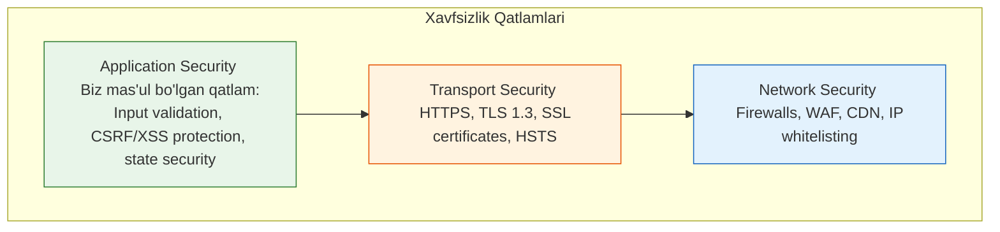

# Authentication va Security

## Kirish

> [!IMPORTANT]
> **Nima uchun muhim?**  
> Veb-sayt xavfsizligi — bu shunchaki qo'shimcha imkoniyat emas, u zamonaviy dasturlashning asosiy talabidir. Siz yozgan loyiha qanchalik tez va chiroyli ishlamasin, agar u orqali foydalanuvchilarning maxfiy ma'lumotlari, parollari yoki to'lov kartalari sizib chiqsa (data breach), loyiha va jamoaning reputatsiyasi butunlay yo'q bo'ladi. Har bir frontend dasturchi o'zi yozayotgan client-side kodning qayeri zaifligini va uni qanday xavfsiz holatga keltirishni bilishi shart.

> [!NOTE]
> **Real-hayot analogiyasi: "Uy xavfsizligi"**  
> - **Authentication (Autentifikatsiya - Login):** Bu sizning uyingizning old eshigidagi qulf. Siz kalit bilan kelib qulfni ochasiz (O'zingizni tanitasiz - "Men bu uyning egasiman").
> - **Authorization (Avtorizatsiya - Ruxsat):** Eshikdan kirganingizdan so'ng, sizning hamma xonaga kirish huquqingiz bor, lekin mehmon sifatida kelgan odam faqat mehmonxonaga kira oladi, yotoqxona yoki seyf xonasiga kira olmaydi (Ruxsatlar cheklovi).
> - **Security Vulnerabilities (Zaifliklar):** XSS — bu kimdir derazadan maxfiy kuzatuv kamerasi o'rnatishi. CSRF — bu sizni chalg'itib, bilmasdan orqa eshikni ochib qo'yishga majburlashi.

---

## 🟢 Junior (Asoslar va Tushunchalar)

Frontend developer sifatida biz **Application Security** (Ilova Xavfsizligi) qatlamiga mas'ulmiz. Biz qila oladigan eng asosiy ishlar:
1. Inputlarni tekshirish (Foydalanuvchi kiritgan ma'lumotga ishonmaslik).
2. Xavfsiz Login qildirish (Auth tokenlarni to'g'ri saqlash).
3. Ekranga chiqarayotganda zararli kodlarni tozalash.

### Bo'lim Tarkibi

Ushbu bo'limda siz eng ko'p uchrashi mumkin bo'lgan xavfsizlik muammolari va texnologiyalarini o'rganasiz:

| # | Mavzu | Tavsif |
|---|-------|--------|
| 01 | [JWT (JSON Web Tokens)](./01-jwt.md) | Zamonaviy va holatsiz (stateless) login tizimi siri. Tokenlar va ularni ishlatish. |
| 02 | [XSS (Cross-Site Scripting)](./04-xss.md) | Saytingizga begona (Hacker) JavaScript kodi qanday kirib keladi va nima ziyon yetkazadi. |
| 03 | [CORS (Cross-Origin Resource Sharing)](./06-cors.md) | Serverga so'rov yuborganda hammamizni qiynaydigan "Qizil Xato" siri va uni yengish. |

---

## 🟡 Middle (Amaliyot va Detallar)

### Xavfsizlik Piramidasi (Security Pyramid)
Tizim himoyasi faqat bir joyda emas, qatlamlarda quriladi:



Biz yozgan React/Vue kodimiz qanchalik xavfsiz bo'lmasin, agar u yomon sozlangan server (HTTP) yoki xavfli tarmoq ustida ishlasa, himoyaning qadr-qimmati tushib ketadi.

### Asosiy Tushunchalar
```
Authentication (AuthN): KIM sen?
├── Login/Password
├── OAuth (Google/Github orqali kirish)
├── Biometric (Barmoq izi/FaceID)
└── MFA (Ikki bosqichli tasdiqlash)

Authorization (AuthZ): NIMA qila olasan?
├── Role-based (RBAC) (Masalan: Admin, User, Guest)
├── Permission-based (Masalan: O'qishga ruxsat, Yozishga ruxsat)
└── Resource-based (Masalan: Faqat o'zining postlarini tahrirlash)
```

---

## 🔴 Senior (Arxitektura va Optimizatsiya)

### Defense in Depth (Chuqur Himoya)
Katta loyihalarda xavfsizlik "Bitta qulf qo'yish" emas, balki qulf ketidan qulf qo'yish (Defense in depth) hisoblanadi. Agar bitta himoya o'pirilsa (Masalan WAF teshilsa), navbatdagi himoya (Input validation) o'z so'zini aytishi kerak.

```
┌────────────────────────────────────────────────────┐
│                    WAF/CDN                         │
├────────────────────────────────────────────────────┤
│                 Rate Limiting                      │
├────────────────────────────────────────────────────┤
│              Input Validation                      │
├────────────────────────────────────────────────────┤
│           Output Encoding (XSS)                    │
├────────────────────────────────────────────────────┤
│        Authentication (JWT/Session)                │
├────────────────────────────────────────────────────┤
│           Authorization (RBAC)                     │
├────────────────────────────────────────────────────┤
│         CSRF/CORS Protection                       │
├────────────────────────────────────────────────────┤
│          Secure Data Storage                       │
└────────────────────────────────────────────────────┘
```

### Security Headers (Himoya Sarlavhalari)
Server qaytarayotgan har bir javobda brauzerni cheklovchi xavfsizlik sarlavhalari bo'lishi shart. Agar Server/DevOps buni unutgan bo'lsa, Senior Frontendchi sifatida buni talab qilishingiz kerak:
```http
Content-Security-Policy: default-src 'self'
X-Content-Type-Options: nosniff
X-Frame-Options: DENY
X-XSS-Protection: 1; mode=block
Strict-Transport-Security: max-age=31536000
Referrer-Policy: strict-origin-when-cross-origin
```

---

## Eng Yaxshi Amaliyotlar (Best Practices)

1. **Faol o'rganish (OWASP Top 10):** OWASP (Open Web Application Security Project) tomonidan e'lon qilinadigan eng xavfli 10 ta zaiflik ro'yxatini doimo o'rganib boring. Har bir yozayotgan kodingizni shu ro'yxatga solishtiring.
2. **Kliyent xavfsizligini nazorat qilish (CSP):** Sahifalaringizga qat'iy Content Security Policy (CSP) sarlavhalarini o'rnating. Bu siz bilmagan begona skriptlarning (XSS) ishga tushib ketishini oldini oladi.
3. **Ishonchsizlik (Never Trust Kliyent):** Hech qachon foydalanuvchidan (kliyentdan) kelayotgan ma'lumotga ishonmang. Har doim inputlarni tozalang (sanitization) va backend tomonida ikkinchi marta tekshiring.

---

## Xulosa

Ushbu xavfsizlik bo'limining yakuniy xulosasi:

| Muammo | Ta'siri | Himoya Usuli |
| --- | --- | --- |
| **XSS (Cross-Site Scripting)** | Brauzerda begona JS kod ishga tushadi | Input sanitization, CSP, HttpOnly Cookies |
| **CSRF (Request Forgery)** | Foydalanuvchi nomidan soxta so'rov yuboriladi | SameSite Cookie, CSRF Token |
| **LocalStorage zaifligi** | XSS orqali JWT va maxfiy ma'lumotlar o'g'irlanadi| JWT ni faqat HttpOnly secure cookieda saqlash |
| **CORS muammolari** | Begona domenlardan resurslarga ruxsat berish | Originlarni to'g'ri whitelist qilish |

O'rganish uchun Foydali Resurslar:
- [OWASP Top 10](https://owasp.org/www-project-top-ten/)
- [jwt.io](https://jwt.io/) - JWT debugging
- Burp Suite, OWASP ZAP (Security testing vositalari)
