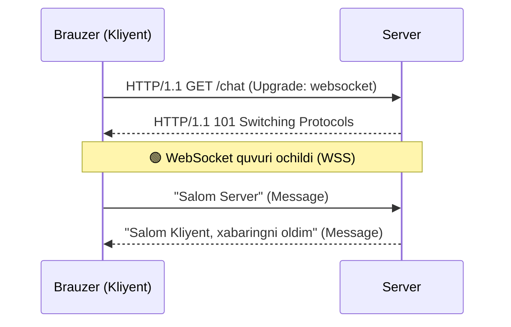

# WebSocket

## Kirish

> [!IMPORTANT]
> **Nima uchun muhim?**  
> An'anaviy veb-saytlar HTTP protokoli orqali ishlaydi, unda faqat kliyent (brauzer) so'rov yuborishi mumkin, server esa faqat javob beradi (Request-Response). Agar sizga chat ilovasi, live sport natijalari yoki birja narxlari kabi ma'lumotlarni soniya sayin yangilab turish kerak bo'lsa, har soniyada HTTP so'rov yuborish (Polling) serverni charchatib, tarmoqni to'ldirib yuboradi. **WebSocket** esa bir marta ulanish o'rnatilgach, server va brauzer orasida doimiy va ikki tomonlama (full-duplex) tezyurar yo'l ochadi. Endi server ham istalgan paytda yangi xabarni kliyentga push qila oladi.

> [!NOTE]
> **Real-hayot analogiyasi: "Pochta xati vs Telefon qo'ng'irog'i"**  
> - **HTTP (Pochta xati):** Siz do'stingizga xat yozib yuborasiz (Request). U xatni olib o'qiydi va javob yozib pochtaga beradi (Response). Agar siz undan yana qandaydir ma'lumot bilmoqchi bo'lsangiz, yana qaytadan pochta orqali xat yuborishingiz kerak bo'ladi (Polling). Bu sekin.
> - **WebSocket (Telefon qo'ng'irog'i):** Siz do'stingizga telefon qilasiz va u go'shakni ko'taradi (Handshake). Go'shakni ikkala tomon ham qo'ymaydi (Persistent connection). Endi ikkalangiz ham istalgan paytda bir-biringizga gapirishingiz mumkin (Full-duplex) va bu pochta xatiga qaraganda ancha tez.

---

## 🟢 Junior (Asoslar va Tushunchalar)

Junior dasturchi WebSocket qanday ulanishini va asosiy Event larni bilishi kerak.

### WebSocket Qanday Ishlaydi?
WebSocket ulanishi oddiy HTTP so'rov orqali boshlanadi. Brauzer Serverga: *"Men HTTP orqali gaplashmoqchi emasman, kel WebSocket ga o'taylik (Upgrade)"* deb so'rov yuboradi. Server bunga rozi bo'lsa `101 Switching Protocols` javobini qaytaradi va HTTP ulanish uzilmasdan WebSocket deb nomlangan "doimiy quvur" ga aylanadi.



### Asosiy API (Frontend)
Brauzerda WebSocket ishlatish juda oson. Atigi 4 ta muhim Event bor: `onopen`, `onmessage`, `onerror`, `onclose`.

```javascript
// 1. Ulanishni boshlash (wss - xavfsiz websocket)
const ws = new WebSocket('wss://api.example.com/chat');

// 2. Ulanish ochilganda (Go'shak ko'tarilganda)
ws.onopen = () => {
  console.log('Serverga ulandik!');
  // Xabar yuborish
  ws.send(JSON.stringify({ type: 'hello', text: 'Salom hammaga!' }));
};

// 3. Serverdan xabar kelganda
ws.onmessage = (event) => {
  const data = JSON.parse(event.data);
  console.log('Serverdan keldi:', data);
};

// 4. Xatolik
ws.onerror = (error) => {
  console.error('Xatolik yuz berdi:', error);
};

// 5. Ulanish yopilganda (Go'shak qo'yilganda)
ws.onclose = () => {
  console.log('Aloqa uzildi.');
};
```

---

## 🟡 Middle (Amaliyot va Detallar)

Middle dasturchi Frameworklar (Vue) bilan integratsiya qilishni va Reconnect (Qayta ulanish) muammolarini hal qilishni biladi.

### Reconnect (Qayta ulanish) Muammosi
WebSocket dagi eng katta muammo — internet uzilib qolsa ulanish uziladi (close). Oddiy kod o'z-o'zidan qayta ulanmaydi!
Shuning uchun Vue loyihalarida o'zimiz "Avtomatik qayta ulanuvchi" (Auto-reconnect) mantiqni yozishimiz yoki maxsus composable (masalan, VueUse dagi `useWebSocket`) ishlatishimiz kerak.

### "Exponential Backoff" (Aqlli qayta ulanish)
Agar server vaqtincha o'chib qolsa (Deploy vaqtida), sizning kodingiz har soniyada qayta ulanaversa, minglab userlar serverni "DDoS" qilib o'ldirib qo'yishi mumkin. Bunga qarshi Exponential Backoff ishlatiladi:
- 1-urinish: 1 soniya kutib ulanadi
- 2-urinish: 2 soniya kutadi
- 3-urinish: 4 soniya kutadi
- 4-urinish: 8 soniya kutadi...

```javascript
// Vue Composition API da WebSocket Composable yozish
import { ref, onMounted, onUnmounted } from 'vue';

export function useMyWebSocket(url) {
  const data = ref(null);
  let ws = null;
  let attempt = 0;
  
  function connect() {
    ws = new WebSocket(url);
    
    ws.onmessage = (e) => {
      data.value = JSON.parse(e.data);
    };
    
    ws.onclose = () => {
      // Aqlli qayta ulanish (Exponential Backoff)
      const delay = Math.min(1000 * Math.pow(2, attempt), 30000); 
      setTimeout(() => {
        attempt++;
        connect();
      }, delay);
    };
    
    ws.onopen = () => {
      attempt = 0; // Ulanganda urinishlarni nolga tushiramiz
    };
  }
  
  onMounted(connect);
  onUnmounted(() => ws?.close()); // Sahifadan ketganda albatta o'chirish kerak!
  
  return { data };
}
```
**E'tibor bering:** `onUnmounted` da `ws.close()` qilish juda muhim, aks holda Vue sahifalarida yursangiz ochiq qolgan socketlar ko'payib memory leak bo'ladi.

---

## 🔴 Senior (Arxitektura va Optimizatsiya)

Senior dasturchi Load Balancing (kengayish) masalalari, Heartbeat mexanizmlari va Binary Datani optimize qilish bilan shug'ullanadi.

### Heartbeat (Ping/Pong) Mexanizmi
Ba'zi Network (Proksi) serverlar agar trubadan hech narsa o'tmay (Jimjitlik) 30-60 soniya tursa, ulanishni yopib yuboradi. Yoki kimdir "Airplane mode" ga tushib qolsa, Socket "Close" signali bermasdan yopilib qoladi (Stale connection). 
Shuning uchun Client ham, Server ham doimiy tirikligini tasdiqlab (Heartbeat) turishi kerak.
- Server Ping yuboradi.
- Client unga darhol Pong yuboradi.
Agar Pong kelmasa, server Socket ni o'lik deb hisoblab xotiradan tozalaydi. Buni Application (Ping xabar formatida) yoki Protokol o'zining ichki (Opcode: 0x9 va 0xA) qatlamida amalga oshirish mumkin.

### Scaling (Gorizontal Kengaytirish)
Sizda foydalanuvchilar ko'paydi va bitta Node.js server yetmay qoldi. Siz 3 ta Node.js server (Load Balancer ostida) ko'tardingiz. 
- Alisher (1-serverga ulandi)
- Bobur (2-serverga ulandi)
Endi Alisher Boburga chatdan xabar yuborsa, u faqat 1-serverga boradi. 2-server Boburga uni qanday qilib jo'natadi? Ikkita alohida WebSocket serverlari o'rtasida aloqa yo'q!

**Yechim (Redis Pub/Sub):**
Barcha WebSocket serverlar bitta markaziy Redis ga ulanadi. Alisherning xabari 1-serverga kelgach, 1-server uni Redis ga (Publish) yuboradi. Barcha serverlar Redisni eshitib (Subscribe) turishibdi. 2-server xabarni ushlab olib, o'zining Socket lariga qarab "Bobur" ni topadi va unga jo'natadi. Socket.io da buni Socket.io-Redis-Adapter qilib beradi.

### Binary Data (Tezlik)
Agar siz qimmatli qog'ozlar birjasida ishlasangiz va ma'lumotlar millisoniyada o'zgarib tursa JSON juda sekinlik va xotira katta joy oladi. WebSocket orqali JSON matnlarini emas, to'g'ridan to'g'ri baytlarni (ArrayBuffer) yuborish mumkin:
```javascript
ws.binaryType = 'arraybuffer'; // Bizga binary keladi
ws.onmessage = (event) => {
  if (event.data instanceof ArrayBuffer) {
    // Protobuf yoki Custom DataView orqali bit/baytlarni parsing qilish
    const view = new DataView(event.data);
    console.log('Binary number:', view.getFloat64(0)); 
  }
};
```
Bu katta tezlik (Low latency) va kam hajmli trafikni (Bandwidth) kafolatlaydi.

### Intervyu Savoli
**"Agar men oddiy Chat loyihasini qilsam va Serverim bitta bo'lsa ham Socket.io ishlatishim shartmi yoki oddiy Native WebSocket (ws) yetarlimi?"**
*Javob:*
Native WebSocket hozirda barcha brauzerlarda 100% qo'llab-quvvatlanadi va u yetarli. Ammo Native WebSocket sizga faqatgina "Quvur" (Connection) beradi xolos. Socket.io kabi kutubxonalar esa sizga ushbu quvur ustiga o'rnatilgan tayyor qo'shimcha imkoniyatlarni (Auto-Reconnect, Heartbeat, Xonalarga (Rooms) ajratish, Fallback (Polling) texnologiyalari va Redis Adapter) beradi. Agar bularni hammasini Native WebSocket orqali (VueUse ishlatmasdan va hkz) noldan o'zingiz yozib chiqmoqchi bo'lsangiz - bu velosipedni qaytadan kashf qilish bo'ladi. Shu sababli ko'pchilik jamoalar baribir abstraction library larni tanlashadi. Lekin oddiy loyihalar, misol uchun faqatgina bitta "Live Notifications" ulanishi uchun o'ta og'ir Socket.io ni klientga yuklash ortiqchadir, u yerda Native WS yoki VueUse qulayroq.

---

## Eng Yaxshi Amaliyotlar (Best Practices)

1. **WSS (WebSocket Secure) ishlatish shart:** Ishlab chiqarish (production) muhitida hech qachon shifrlanmagan `ws://` dan foydalanmang. Doimo `wss://` ishlating (bu HTTPS ning muqobili bo'lib, yo'ldagi proksi-serverlar yoki provayderlar ma'lumotlarni o'qib olishidan yoki to'sishidan saqlaydi).
2. **Heartbeat (Ping/Pong) o'rnating:** WebSocket ulanishlari ba'zida tarmoq uzilishi tufayli jimgina "o'lib qoladi" va brauzer buni bilmaydi. Har 30 soniyada server va kliyent o'rtasida Ping/Pong xabarlarini yuborish orqali ulanishning tirikligini tekshirib turing (Heartbeat).
3. **Qayta ulanishda backoff qo'llang:** Tarmoq uzilganda kliyentlar darhol va tinimsiz qayta ulanishga harakat qilib serverni o'ldirib qo'ymaydi (thundering herd). Qayta ulanish vaqtini asta-sekin oshiradigan `Exponential Backoff + Jitter` strategiyasidan foydalaning.

---

## Xulosa

WebSocket bo'yicha yakuniy xulosa:

| Xususiyati | WebSocket | HTTP Polling |
| --- | --- | --- |
| **Aloqa yo'nalishi** | Ikki tomonlama (Full-Duplex) | Bir tomonlama (Kliyent so'raydi) |
| **Header overhead** | Juda kichik (bir marta ulanish o'rnatilgach, faqat 2-6 bayt) | Har bir requestda to'liq sarlavha (1KB+) |
| **Tezlik (Latency)** | Real-time (bir zumda) | Sekin (polling intervaliga bog'liq) |
| **Mos keluvchi loyihalar**| Chatlar, Live o'yinlar, Birjalar | Odatiy dashboardlar, analytics |

Kichik ehtiyojlar uchun esa faqatgina Serverdan Kliyentga keluvchi yengilroq yana bir texnologiya — SSE (Server-Sent Events) ham mavjud bo'lib, ular haqida keyingi darsda gaplashamiz.

**Keyingi qadam:** [02-sse.md](./02-sse.md) - Server-Sent Events (SSE) va uni WebSocket dan afzalliklari.
