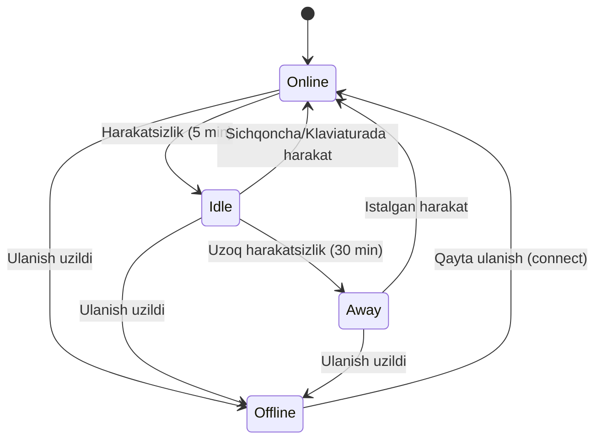

# Presence Systems

## Kirish

> [!IMPORTANT]
> **Nima uchun muhim?**  
> Foydalanuvchilarning tarmoqda faolligini kuzatish (Online/Offline statusi) har qanday collaborative (birgalikda ishlaydigan) yoki ijtimoiy ilovalarda (masalan, Telegram, Slack, Google Docs) juda muhim. Agar foydalanuvchining interneti uzilsa-yu, uni boshqalarga 10 daqiqa davomida "Online" deb ko'rsatib tursangiz, boshqa foydalanuvchilar javob kutaverib charchashadi va ilova sifatsiz ko'rinadi. **Presence System** orqali foydalanuvchining faolligini millisekundlarda aniqlab, uning statusini real-vaqtda boshqalarga ko'rsatish mumkin.

> [!NOTE]
> **Real-hayot analogiyasi: "Ofisdagi Ishchi (Online, Idle, Away)"**  
> Tasavvur qiling, ofisdagi bitta ishchining statusini kuzatyapsiz.  
> - **Online (Ish stolida faol):** Ishchi stolda o'tiribdi, kompyuterda nimadir yozmoqda (Kliyent voqealari: click, mousemove, keydown).
> - **Idle (Harakatsiz):** Ishchi stolda o'tiribdi, lekin ko'zini yumib dam olyapti (5 daqiqa davomida hech qanday klaviaturada yoki sichqonchada faollik yo'q). Status avtomatik "Idle" ga o'tadi.
> - **Away (Ketgan):** Ishchi tushlik qilishga yoki majlisga ketgan (30 daqiqadan ko'proq faollik yo'q).
> - **Offline (Binoda yo'q):** U binodan chiqib ketdi (WebSocket ulanishi uzildi).

---

## Presence States

### State Transitions (Holat O'tishlari)



## Presence Architecture

### Client-Side

```javascript
class PresenceClient {
  constructor(wsManager, options = {}) {
    this.ws = wsManager;
    this.options = {
      heartbeatInterval: 30000,     // 30 seconds
      idleTimeout: 300000,          // 5 minutes
      awayTimeout: 1800000,         // 30 minutes
      activityEvents: ['mousemove', 'keydown', 'click', 'scroll', 'touchstart'],
      ...options
    };

    this.currentStatus = 'online';
    this.customStatus = null;
    this.lastActivity = Date.now();
    this.heartbeatTimer = null;
    this.idleCheckTimer = null;
    this.subscribedUsers = new Set();

    this.setupActivityTracking();
    this.startHeartbeat();
    this.startIdleCheck();
  }

  // Activity tracking
  setupActivityTracking() {
    const handleActivity = this.throttle(() => {
      const wasIdle = this.currentStatus === 'idle' || this.currentStatus === 'away';
      this.lastActivity = Date.now();

      if (wasIdle) {
        this.setStatus('online');
      }
    }, 1000);

    this.options.activityEvents.forEach((event) => {
      document.addEventListener(event, handleActivity, { passive: true });
    });

    // Page visibility
    document.addEventListener('visibilitychange', () => {
      if (document.hidden) {
        this.setStatus('away');
      } else {
        this.lastActivity = Date.now();
        this.setStatus('online');
      }
    });
  }

  // Heartbeat
  startHeartbeat() {
    this.heartbeatTimer = setInterval(() => {
      this.sendHeartbeat();
    }, this.options.heartbeatInterval);

    // Initial heartbeat
    this.sendHeartbeat();
  }

  sendHeartbeat() {
    this.ws.send({
      type: 'presence:heartbeat',
      status: this.currentStatus,
      customStatus: this.customStatus,
      timestamp: Date.now()
    });
  }

  // Idle detection
  startIdleCheck() {
    this.idleCheckTimer = setInterval(() => {
      const inactiveTime = Date.now() - this.lastActivity;

      if (inactiveTime > this.options.awayTimeout) {
        if (this.currentStatus !== 'away' && this.currentStatus !== 'dnd') {
          this.setStatus('away');
        }
      } else if (inactiveTime > this.options.idleTimeout) {
        if (this.currentStatus !== 'idle' && this.currentStatus !== 'dnd') {
          this.setStatus('idle');
        }
      }
    }, 10000);
  }

  // Status management
  setStatus(status, customMessage = null) {
    // DND is user-set, don't auto-change
    if (this.currentStatus === 'dnd' && status !== 'dnd' && !customMessage) {
      return;
    }

    this.currentStatus = status;
    if (customMessage !== null) {
      this.customStatus = customMessage;
    }

    this.ws.send({
      type: 'presence:status',
      status: this.currentStatus,
      customStatus: this.customStatus,
      timestamp: Date.now()
    });

    this.emit('statusChange', {
      status: this.currentStatus,
      customStatus: this.customStatus
    });
  }

  // Subscribe to other users' presence
  subscribe(userIds) {
    userIds.forEach((id) => this.subscribedUsers.add(id));

    this.ws.send({
      type: 'presence:subscribe',
      userIds
    });
  }

  unsubscribe(userIds) {
    userIds.forEach((id) => this.subscribedUsers.delete(id));

    this.ws.send({
      type: 'presence:unsubscribe',
      userIds
    });
  }

  // Handle presence updates from server
  handlePresenceUpdate(update) {
    this.emit('presenceUpdate', update);
  }

  // Cleanup
  destroy() {
    clearInterval(this.heartbeatTimer);
    clearInterval(this.idleCheckTimer);

    // Send offline status
    this.ws.send({
      type: 'presence:offline',
      timestamp: Date.now()
    });
  }

  // Utilities
  throttle(fn, delay) {
    let lastCall = 0;
    return (...args) => {
      const now = Date.now();
      if (now - lastCall >= delay) {
        lastCall = now;
        fn(...args);
      }
    };
  }

  // Event emitter
  listeners = new Map();

  on(event, handler) {
    if (!this.listeners.has(event)) {
      this.listeners.set(event, new Set());
    }
    this.listeners.get(event).add(handler);
    return () => this.listeners.get(event).delete(handler);
  }

  emit(event, data) {
    this.listeners.get(event)?.forEach((h) => h(data));
  }
}
```

### Server-Side (Node.js)

```javascript
class PresenceServer {
  constructor(wss, options = {}) {
    this.wss = wss;
    this.options = {
      heartbeatTimeout: 45000,    // 45 seconds (heartbeat + buffer)
      cleanupInterval: 60000,     // 1 minute
      ...options
    };

    // User presence data
    this.presenceData = new Map();
    // userId -> Set<connectionId>
    this.userConnections = new Map();
    // userId -> Set<subscriberUserId>
    this.subscribers = new Map();

    this.startCleanupJob();
  }

  // Handle new connection
  handleConnection(ws, userId) {
    const connectionId = this.generateId();

    // Track connection
    if (!this.userConnections.has(userId)) {
      this.userConnections.set(userId, new Set());
    }
    this.userConnections.get(userId).add(connectionId);

    // Store connection reference
    ws.connectionId = connectionId;
    ws.userId = userId;

    // Set initial presence
    this.updatePresence(userId, {
      status: 'online',
      lastSeen: Date.now(),
      connections: this.userConnections.get(userId).size
    });

    // Notify subscribers
    this.broadcastPresence(userId);

    return connectionId;
  }

  // Handle disconnect
  handleDisconnect(ws) {
    const { userId, connectionId } = ws;

    if (!userId) return;

    const connections = this.userConnections.get(userId);
    if (connections) {
      connections.delete(connectionId);

      if (connections.size === 0) {
        // Last connection - user is offline
        this.updatePresence(userId, {
          status: 'offline',
          lastSeen: Date.now(),
          connections: 0
        });
        this.userConnections.delete(userId);
      } else {
        // Still has other connections
        this.updatePresence(userId, {
          connections: connections.size
        });
      }

      this.broadcastPresence(userId);
    }
  }

  // Handle heartbeat
  handleHeartbeat(userId, data) {
    const presence = this.presenceData.get(userId) || {};

    this.updatePresence(userId, {
      status: data.status || 'online',
      customStatus: data.customStatus,
      lastSeen: Date.now(),
      lastHeartbeat: Date.now()
    });

    // Status o'zgargan bo'lsa broadcast
    if (presence.status !== data.status || presence.customStatus !== data.customStatus) {
      this.broadcastPresence(userId);
    }
  }

  // Handle status change
  handleStatusChange(userId, status, customStatus) {
    this.updatePresence(userId, {
      status,
      customStatus,
      lastSeen: Date.now()
    });

    this.broadcastPresence(userId);
  }

  // Handle subscription
  handleSubscribe(subscriberUserId, targetUserIds) {
    targetUserIds.forEach((targetUserId) => {
      if (!this.subscribers.has(targetUserId)) {
        this.subscribers.set(targetUserId, new Set());
      }
      this.subscribers.get(targetUserId).add(subscriberUserId);

      // Send current presence
      const presence = this.getPresence(targetUserId);
      this.sendToUser(subscriberUserId, {
        type: 'presence:update',
        userId: targetUserId,
        ...presence
      });
    });
  }

  handleUnsubscribe(subscriberUserId, targetUserIds) {
    targetUserIds.forEach((targetUserId) => {
      this.subscribers.get(targetUserId)?.delete(subscriberUserId);
    });
  }

  // Update presence data
  updatePresence(userId, updates) {
    const current = this.presenceData.get(userId) || {};
    this.presenceData.set(userId, { ...current, ...updates });
  }

  // Get presence
  getPresence(userId) {
    const data = this.presenceData.get(userId);

    if (!data) {
      return { status: 'offline', lastSeen: null };
    }

    // Check if heartbeat timed out
    if (data.lastHeartbeat &&
        Date.now() - data.lastHeartbeat > this.options.heartbeatTimeout) {
      return { ...data, status: 'offline' };
    }

    return data;
  }

  // Broadcast presence to subscribers
  broadcastPresence(userId) {
    const presence = this.getPresence(userId);
    const subscriberIds = this.subscribers.get(userId);

    if (!subscriberIds) return;

    const message = {
      type: 'presence:update',
      userId,
      ...presence
    };

    subscriberIds.forEach((subscriberId) => {
      this.sendToUser(subscriberId, message);
    });
  }

  // Send to specific user
  sendToUser(userId, message) {
    const connections = this.userConnections.get(userId);
    if (!connections) return;

    this.wss.clients.forEach((client) => {
      if (connections.has(client.connectionId)) {
        client.send(JSON.stringify(message));
      }
    });
  }

  // Cleanup stale connections
  startCleanupJob() {
    setInterval(() => {
      const now = Date.now();

      this.presenceData.forEach((data, userId) => {
        if (data.lastHeartbeat &&
            now - data.lastHeartbeat > this.options.heartbeatTimeout) {
          // Stale - mark as offline
          if (data.status !== 'offline') {
            this.updatePresence(userId, { status: 'offline' });
            this.broadcastPresence(userId);
          }
        }
      });
    }, this.options.cleanupInterval);
  }

  // Bulk presence query
  getMultiplePresence(userIds) {
    return userIds.map((userId) => ({
      userId,
      ...this.getPresence(userId)
    }));
  }

  generateId() {
    return `${Date.now()}-${Math.random().toString(36).substr(2, 9)}`;
  }
}
```

## Distributed Presence (Redis)

```javascript
import Redis from 'ioredis';

class DistributedPresence {
  constructor(redisUrl, serverId) {
    this.redis = new Redis(redisUrl);
    this.pubsub = new Redis(redisUrl);
    this.serverId = serverId;

    this.setupPubSub();
  }

  setupPubSub() {
    this.pubsub.subscribe('presence:updates');

    this.pubsub.on('message', (channel, message) => {
      if (channel === 'presence:updates') {
        const data = JSON.parse(message);

        // Ignore own server's messages
        if (data.serverId === this.serverId) return;

        this.handleRemotePresenceUpdate(data);
      }
    });
  }

  // Set presence
  async setPresence(userId, presence) {
    const key = `presence:${userId}`;

    await this.redis.hset(key, {
      status: presence.status,
      customStatus: presence.customStatus || '',
      lastSeen: Date.now().toString(),
      serverId: this.serverId
    });

    // Expire after heartbeat timeout
    await this.redis.expire(key, 60);

    // Publish update
    await this.redis.publish('presence:updates', JSON.stringify({
      userId,
      ...presence,
      serverId: this.serverId
    }));
  }

  // Get presence
  async getPresence(userId) {
    const key = `presence:${userId}`;
    const data = await this.redis.hgetall(key);

    if (!data || Object.keys(data).length === 0) {
      return { status: 'offline', lastSeen: null };
    }

    return {
      status: data.status,
      customStatus: data.customStatus || null,
      lastSeen: parseInt(data.lastSeen)
    };
  }

  // Get multiple presence
  async getMultiplePresence(userIds) {
    const pipeline = this.redis.pipeline();

    userIds.forEach((userId) => {
      pipeline.hgetall(`presence:${userId}`);
    });

    const results = await pipeline.exec();

    return userIds.map((userId, index) => {
      const data = results[index][1];

      if (!data || Object.keys(data).length === 0) {
        return { userId, status: 'offline', lastSeen: null };
      }

      return {
        userId,
        status: data.status,
        customStatus: data.customStatus || null,
        lastSeen: parseInt(data.lastSeen)
      };
    });
  }

  // Track online users count
  async getOnlineCount() {
    const keys = await this.redis.keys('presence:*');
    let onlineCount = 0;

    for (const key of keys) {
      const status = await this.redis.hget(key, 'status');
      if (status === 'online' || status === 'idle') {
        onlineCount++;
      }
    }

    return onlineCount;
  }

  // Cleanup
  async cleanup() {
    await this.redis.quit();
    await this.pubsub.quit();
  }
}
```

## Real-World Case: Slack-like Presence

```javascript
class SlackPresence {
  constructor(wsManager, redisClient) {
    this.ws = wsManager;
    this.redis = redisClient;

    this.presenceClient = new PresenceClient(wsManager, {
      heartbeatInterval: 30000,
      idleTimeout: 300000,  // 5 minutes
      awayTimeout: 1800000  // 30 minutes
    });

    this.channelMembers = new Map();
    this.userStatuses = new Map();

    this.setupHandlers();
  }

  setupHandlers() {
    // Local status changes
    this.presenceClient.on('statusChange', (data) => {
      this.broadcastToChannels(data);
    });

    // Remote presence updates
    this.ws.on('presence:update', (data) => {
      this.userStatuses.set(data.userId, data);
      this.emit('userPresenceChanged', data);
    });

    // Channel join/leave
    this.ws.on('channel:joined', (data) => {
      this.subscribeToChannelMembers(data.channelId);
    });

    this.ws.on('channel:left', (data) => {
      this.unsubscribeFromChannelMembers(data.channelId);
    });
  }

  // Join channel and subscribe to members' presence
  async joinChannel(channelId) {
    const members = await this.fetchChannelMembers(channelId);

    this.channelMembers.set(channelId, new Set(members));

    // Subscribe to all members' presence
    this.presenceClient.subscribe(members);

    return members;
  }

  // Leave channel
  leaveChannel(channelId) {
    const members = this.channelMembers.get(channelId);

    if (members) {
      // Unsubscribe from members not in other channels
      const membersToUnsubscribe = [...members].filter((userId) => {
        for (const [chId, chMembers] of this.channelMembers) {
          if (chId !== channelId && chMembers.has(userId)) {
            return false;
          }
        }
        return true;
      });

      this.presenceClient.unsubscribe(membersToUnsubscribe);
      this.channelMembers.delete(channelId);
    }
  }

  // Typing indicator
  async startTyping(channelId) {
    await this.ws.send({
      type: 'typing:start',
      channelId,
      userId: this.currentUserId,
      timestamp: Date.now()
    });
  }

  async stopTyping(channelId) {
    await this.ws.send({
      type: 'typing:stop',
      channelId,
      userId: this.currentUserId
    });
  }

  // Get channel members with presence
  getChannelMembersWithPresence(channelId) {
    const memberIds = this.channelMembers.get(channelId);
    if (!memberIds) return [];

    return [...memberIds].map((userId) => ({
      userId,
      presence: this.userStatuses.get(userId) || { status: 'offline' }
    }));
  }

  // Set custom status
  setCustomStatus(emoji, text, clearAfter = null) {
    this.presenceClient.setStatus(this.presenceClient.currentStatus, {
      emoji,
      text,
      clearAfter: clearAfter ? Date.now() + clearAfter : null
    });
  }

  // Clear custom status
  clearCustomStatus() {
    this.presenceClient.setStatus(this.presenceClient.currentStatus, null);
  }

  // DND mode
  enableDoNotDisturb(duration = null) {
    this.presenceClient.setStatus('dnd');

    if (duration) {
      setTimeout(() => {
        this.presenceClient.setStatus('online');
      }, duration);
    }
  }

  disableDoNotDisturb() {
    this.presenceClient.setStatus('online');
  }

  async fetchChannelMembers(channelId) {
    const response = await fetch(`/api/channels/${channelId}/members`);
    return response.json();
  }

  broadcastToChannels(presenceData) {
    this.channelMembers.forEach((members, channelId) => {
      if (members.has(this.currentUserId)) {
        this.ws.send({
          type: 'presence:broadcast',
          channelId,
          userId: this.currentUserId,
          ...presenceData
        });
      }
    });
  }

  listeners = new Map();

  on(event, handler) {
    if (!this.listeners.has(event)) {
      this.listeners.set(event, new Set());
    }
    this.listeners.get(event).add(handler);
    return () => this.listeners.get(event).delete(handler);
  }

  emit(event, data) {
    this.listeners.get(event)?.forEach((h) => h(data));
  }
}
```

## Typing Indicator Implementation

```javascript
class TypingIndicator {
  constructor(wsManager) {
    this.ws = wsManager;
    this.typingUsers = new Map(); // channelId -> Map<userId, timeout>
    this.typingTimeout = 5000; // 5 seconds

    this.setupHandlers();
  }

  setupHandlers() {
    this.ws.on('typing:start', (data) => {
      this.addTypingUser(data.channelId, data.userId);
    });

    this.ws.on('typing:stop', (data) => {
      this.removeTypingUser(data.channelId, data.userId);
    });
  }

  addTypingUser(channelId, userId) {
    if (!this.typingUsers.has(channelId)) {
      this.typingUsers.set(channelId, new Map());
    }

    const channelTyping = this.typingUsers.get(channelId);

    // Clear existing timeout
    if (channelTyping.has(userId)) {
      clearTimeout(channelTyping.get(userId));
    }

    // Set new timeout
    const timeout = setTimeout(() => {
      this.removeTypingUser(channelId, userId);
    }, this.typingTimeout);

    channelTyping.set(userId, timeout);

    this.emit('typingChanged', {
      channelId,
      typingUsers: this.getTypingUsers(channelId)
    });
  }

  removeTypingUser(channelId, userId) {
    const channelTyping = this.typingUsers.get(channelId);

    if (channelTyping && channelTyping.has(userId)) {
      clearTimeout(channelTyping.get(userId));
      channelTyping.delete(userId);

      this.emit('typingChanged', {
        channelId,
        typingUsers: this.getTypingUsers(channelId)
      });
    }
  }

  getTypingUsers(channelId) {
    const channelTyping = this.typingUsers.get(channelId);
    return channelTyping ? [...channelTyping.keys()] : [];
  }

  // Format typing message
  getTypingMessage(channelId, userNames) {
    const users = this.getTypingUsers(channelId);

    if (users.length === 0) return null;
    if (users.length === 1) return `${userNames[users[0]]} is typing...`;
    if (users.length === 2) {
      return `${userNames[users[0]]} and ${userNames[users[1]]} are typing...`;
    }
    return `${userNames[users[0]]} and ${users.length - 1} others are typing...`;
  }

  listeners = new Map();
  on(event, handler) {
    if (!this.listeners.has(event)) this.listeners.set(event, new Set());
    this.listeners.get(event).add(handler);
    return () => this.listeners.get(event).delete(handler);
  }
  emit(event, data) {
    this.listeners.get(event)?.forEach((h) => h(data));
  }
}

// Client-side typing with debounce
class TypingTracker {
  constructor(typingIndicator, channelId) {
    this.indicator = typingIndicator;
    this.channelId = channelId;
    this.isTyping = false;
    this.stopTypingDebounced = this.debounce(this.stopTyping.bind(this), 3000);
  }

  onInput() {
    if (!this.isTyping) {
      this.isTyping = true;
      this.indicator.ws.send({
        type: 'typing:start',
        channelId: this.channelId
      });
    }

    this.stopTypingDebounced();
  }

  stopTyping() {
    if (this.isTyping) {
      this.isTyping = false;
      this.indicator.ws.send({
        type: 'typing:stop',
        channelId: this.channelId
      });
    }
  }

  debounce(fn, delay) {
    let timeout;
    return (...args) => {
      clearTimeout(timeout);
      timeout = setTimeout(() => fn(...args), delay);
    };
  }
}
```

## NOTO'G'RI vs TO'G'RI Kodlar

### 1. Heartbeat Implementation

```javascript
// NOTO'G'RI: Server-side timeout yo'q
client.on('heartbeat', (data) => {
  presence.set(data.userId, { status: 'online' });
});

// TO'G'RI: Timeout bilan
client.on('heartbeat', (data) => {
  const expireAt = Date.now() + HEARTBEAT_TIMEOUT;
  presence.set(data.userId, {
    status: 'online',
    lastHeartbeat: Date.now(),
    expireAt
  });
});

// Cleanup job
setInterval(() => {
  presence.forEach((data, userId) => {
    if (Date.now() > data.expireAt) {
      presence.set(userId, { status: 'offline' });
      broadcastPresence(userId);
    }
  });
}, CLEANUP_INTERVAL);
```

### 2. Activity Tracking

```javascript
// NOTO'G'RI: Har harakat event yuboradi
document.addEventListener('mousemove', () => {
  ws.send({ type: 'activity' }); // Server overload!
});

// TO'G'RI: Throttle bilan
let lastActivitySent = 0;

document.addEventListener('mousemove', () => {
  const now = Date.now();
  if (now - lastActivitySent > 5000) { // Har 5 soniyada max
    lastActivitySent = now;
    ws.send({ type: 'activity' });
  }
}, { passive: true });
```

### 3. Subscription Management

```javascript
// NOTO'G'RI: Memory leak - unsubscribe yo'q
function viewProfile(userId) {
  ws.send({ type: 'presence:subscribe', userId });
}

// TO'G'RI: Cleanup bilan
const subscriptions = new Set();

function viewProfile(userId) {
  if (!subscriptions.has(userId)) {
    subscriptions.add(userId);
    ws.send({ type: 'presence:subscribe', userId });
  }

  return () => {
    subscriptions.delete(userId);
    ws.send({ type: 'presence:unsubscribe', userId });
  };
}
```

### 4. Typing Indicator

```javascript
// NOTO'G'RI: Spam yuborish
input.addEventListener('keydown', () => {
  ws.send({ type: 'typing' }); // Har keystroke!
});

// TO'G'RI: Debounce va state tracking
let isTyping = false;
let stopTypingTimeout;

input.addEventListener('input', () => {
  if (!isTyping) {
    isTyping = true;
    ws.send({ type: 'typing:start' });
  }

  clearTimeout(stopTypingTimeout);
  stopTypingTimeout = setTimeout(() => {
    isTyping = false;
    ws.send({ type: 'typing:stop' });
  }, 3000);
});
```

### 5. Distributed Presence

```javascript
// NOTO'G'RI: Server-local presence
const presence = new Map(); // Boshqa server'lar ko'rmaydi!

// TO'G'RI: Shared storage (Redis)
async function setPresence(userId, status) {
  await redis.hset(`presence:${userId}`, { status, lastSeen: Date.now() });
  await redis.publish('presence:updates', JSON.stringify({ userId, status }));
}
```

## Reconnect Bug'larni Hal Qilish

### 1. Stale Presence After Reconnect

```javascript
// MUAMMO: Reconnect'da eski presence qoladi

// YECHIM: Reconnect'da presence refresh
ws.on('connected', async () => {
  // Immediately send current presence
  await presenceClient.sendHeartbeat();

  // Re-subscribe to all users
  const subscribedUsers = [...presenceClient.subscribedUsers];
  if (subscribedUsers.length > 0) {
    ws.send({
      type: 'presence:subscribe',
      userIds: subscribedUsers
    });
  }
});
```

### 2. Presence Flapping

```javascript
// MUAMMO: Network instability'da tez-tez online/offline

// YECHIM: Grace period
class PresenceWithGracePeriod {
  constructor(options) {
    this.gracePeriod = options.gracePeriod || 10000;
    this.pendingOffline = new Map();
  }

  handleDisconnect(userId) {
    // Darhol offline qilmaslik
    const timeout = setTimeout(() => {
      this.setOffline(userId);
      this.pendingOffline.delete(userId);
    }, this.gracePeriod);

    this.pendingOffline.set(userId, timeout);
  }

  handleReconnect(userId) {
    // Grace period ichida qayta ulansa - cancel
    const timeout = this.pendingOffline.get(userId);
    if (timeout) {
      clearTimeout(timeout);
      this.pendingOffline.delete(userId);
    }
  }
}
```

### 3. Multiple Connections Same User

```javascript
// MUAMMO: User bir nechta tab ochganda

// YECHIM: Connection counting
class MultiConnectionPresence {
  constructor() {
    this.userConnections = new Map();
  }

  addConnection(userId, connectionId) {
    if (!this.userConnections.has(userId)) {
      this.userConnections.set(userId, new Set());
      // First connection - set online
      this.setOnline(userId);
    }
    this.userConnections.get(userId).add(connectionId);
  }

  removeConnection(userId, connectionId) {
    const connections = this.userConnections.get(userId);
    if (connections) {
      connections.delete(connectionId);

      if (connections.size === 0) {
        // Last connection - set offline
        this.setOffline(userId);
        this.userConnections.delete(userId);
      }
    }
  }
}
```

## Vue.js Composable

```javascript
// composables/usePresence.js
import { ref, computed, onMounted, onUnmounted, watch } from 'vue';

export function usePresence(wsManager, options = {}) {
  const myStatus = ref('online');
  const customStatus = ref(null);
  const subscribedUsers = ref(new Map());
  const typingUsers = ref(new Map());

  const {
    heartbeatInterval = 30000,
    idleTimeout = 300000,
    awayTimeout = 1800000
  } = options;

  let heartbeatTimer = null;
  let idleTimer = null;
  let lastActivity = Date.now();

  // Activity tracking
  function handleActivity() {
    lastActivity = Date.now();
    if (myStatus.value === 'idle' || myStatus.value === 'away') {
      setStatus('online');
    }
  }

  // Status setting
  function setStatus(status, custom = null) {
    if (myStatus.value === 'dnd' && status !== 'dnd') return;

    myStatus.value = status;
    if (custom !== null) {
      customStatus.value = custom;
    }

    wsManager.send({
      type: 'presence:status',
      status,
      customStatus: customStatus.value
    });
  }

  // Heartbeat
  function sendHeartbeat() {
    wsManager.send({
      type: 'presence:heartbeat',
      status: myStatus.value,
      customStatus: customStatus.value
    });
  }

  // Idle check
  function checkIdle() {
    const inactive = Date.now() - lastActivity;

    if (inactive > awayTimeout && myStatus.value !== 'away') {
      setStatus('away');
    } else if (inactive > idleTimeout && myStatus.value === 'online') {
      setStatus('idle');
    }
  }

  // Subscribe to users
  function subscribe(userIds) {
    wsManager.send({
      type: 'presence:subscribe',
      userIds
    });
  }

  function unsubscribe(userIds) {
    userIds.forEach((id) => subscribedUsers.value.delete(id));
    wsManager.send({
      type: 'presence:unsubscribe',
      userIds
    });
  }

  // Get user presence
  function getPresence(userId) {
    return subscribedUsers.value.get(userId) || { status: 'offline' };
  }

  // Typing
  function getTypingUsers(channelId) {
    return typingUsers.value.get(channelId) || [];
  }

  // Setup
  onMounted(() => {
    // Activity listeners
    ['mousemove', 'keydown', 'click', 'scroll'].forEach((event) => {
      document.addEventListener(event, handleActivity, { passive: true });
    });

    // Visibility
    document.addEventListener('visibilitychange', () => {
      if (document.hidden) {
        setStatus('away');
      } else {
        handleActivity();
      }
    });

    // Heartbeat
    heartbeatTimer = setInterval(sendHeartbeat, heartbeatInterval);

    // Idle check
    idleTimer = setInterval(checkIdle, 10000);

    // WS handlers
    wsManager.on('presence:update', (data) => {
      subscribedUsers.value.set(data.userId, data);
    });

    wsManager.on('typing:start', (data) => {
      if (!typingUsers.value.has(data.channelId)) {
        typingUsers.value.set(data.channelId, new Set());
      }
      typingUsers.value.get(data.channelId).add(data.userId);
    });

    wsManager.on('typing:stop', (data) => {
      typingUsers.value.get(data.channelId)?.delete(data.userId);
    });

    // Initial heartbeat
    sendHeartbeat();
  });

  onUnmounted(() => {
    clearInterval(heartbeatTimer);
    clearInterval(idleTimer);

    wsManager.send({ type: 'presence:offline' });
  });

  return {
    myStatus,
    customStatus,
    subscribedUsers: computed(() => subscribedUsers.value),
    setStatus,
    subscribe,
    unsubscribe,
    getPresence,
    getTypingUsers,
    setCustomStatus: (emoji, text) => setStatus(myStatus.value, { emoji, text }),
    clearCustomStatus: () => setStatus(myStatus.value, null),
    setDoNotDisturb: () => setStatus('dnd'),
    clearDoNotDisturb: () => setStatus('online')
  };
}
```

## Interview Savollari

### 1. Presence system qanday ishlaydi?

**Javob:**
1. Client connection ochganda server'ga `online` status yuboriladi
2. Client muntazam heartbeat yuborib turadi (30 sek)
3. Server heartbeat kelmasa `offline` deb belgilaydi
4. Client activity yo'q bo'lsa `idle`, keyin `away` ga o'tadi
5. Boshqa user'lar presence'ga subscribe bo'lib, update oladi

### 2. Heartbeat nima uchun kerak?

**Javob:**
1. Connection alive ekanligini tekshirish
2. Network muammolarini aniqlash
3. Zombie connection'larni cleanup qilish
4. Accurate online status maintain qilish

```javascript
// Client
setInterval(() => ws.send({ type: 'heartbeat' }), 30000);

// Server
if (Date.now() - lastHeartbeat > 45000) {
  setOffline(userId);
}
```

### 3. Distributed presence qanday implement qilinadi?

**Javob:**
1. Redis - shared presence storage
2. Pub/Sub - server'lar o'rtasida sync
3. TTL - auto-expire for offline detection

```javascript
// Set
await redis.hset(`presence:${userId}`, { status: 'online' });
await redis.expire(`presence:${userId}`, 60);

// Publish
await redis.publish('presence', JSON.stringify({ userId, status }));
```

### 4. Typing indicator optimization qanday?

**Javob:**
1. Debounce - har keystroke yubormaslik
2. Timeout - 3-5 sek keyin auto-stop
3. Throttle - server spam prevention

```javascript
// Start typing faqat holat o'zgarganda
if (!isTyping) {
  isTyping = true;
  ws.send({ type: 'typing:start' });
}

// Auto-stop debounce
clearTimeout(stopTimeout);
stopTimeout = setTimeout(stopTyping, 3000);
```

### 5. Multiple tab/device bilan presence qanday handle qilinadi?

**Javob:**
Connection counting approach:
- Har connection alohida track qilinadi
- Online = kamida 1 active connection
- Offline = 0 connections

```javascript
userConnections.get(userId).size > 0 ? 'online' : 'offline'
```

## Eng Yaxshi Amaliyotlar (Best Practices)

1. **Ko'p qurilmalarni (Multiple Tabs/Devices) to'g'ri hisoblang:** Foydalanuvchi bir vaqtning o'zida ham telefonda, ham kompyuterda (yoki brauzerda 3 ta tabda) saytingizni ochishi mumkin. Agar u bitta tabni yopsa, uni darhol "Offline" qilib qo'ymang. Serverda foydalanuvchining umumiy ulanishlar sonini hisoblang (Active connection count). Faqatgina barcha ulanishlar soni `0` ga teng bo'lgandagina uni "Offline" deb e'lon qiling.
2. **Typing Indicatorni (Yozmoqda...) throttle qiling:** Foydalanuvchi xabar yozayotganda, har bir harf bosilganda serverga "yozmoqda" degan xabar yuboravermang. `Throttle` (masalan har 3 soniyada bir marta jo'natish) va harf yozishdan to'xtaganidan keyin 3 soniyadan so'ng avtomatik o'chadigan `Debounce` taymerini qo'llang.
3. **Redis SET/GET o'rniga Hash/ZSET ishlating:** Millionlab foydalanuvchilarning statuslarini tezkor o'qish va yozish uchun Redis bazasidan foydalaning. Ularning online vaqtlarini (timestamp) Redis Sorted Set (ZSET) da saqlash orqali ma'lum vaqt heartbeat bermagan foydalanuvchilarni bitta so'rovda ("offline" deb) tozalash (cleanup background job) juda qulay va tez ishlaydi.

---

## Xulosa

Presence Systems bo'yicha yakuniy xulosa:

| Holat | Qachon o'tadi? | UI Ko'rinishi | Kliyent faolligi |
| --- | --- | --- | --- |
| **Online** | Ulanish o'rnatilganda va faol bo'lganda | Yashil nuqta (Active) | Klaviatura / sichqoncha harakati bor |
| **Idle** | 5 daqiqa davomida harakatsiz bo'lsa | Sariq nuqta (Idle) | Sahifa ochiq, lekin harakat yo'q |
| **Away** | 30 daqiqadan ko'p harakatsiz bo'lsa | Kulrang nuqta (Away) | Kompyuter tark etilgan |
| **Offline** | WebSocket/SSE uzilganda (0 active connection) | Kulrang nuqta / "Offline" | Ulanish butunlay uzilgan |

Keyingi bo'lim: [Chat Implementation](./06-chat-implementation.md)
