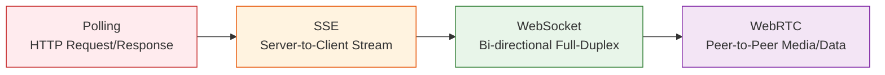

# Realtime Systems

## Kirish

> [!IMPORTANT]
> **Nima uchun muhim?**  
> Bugungi kunda foydalanuvchilar veb-saytda sahifani yangilamasdan (refresh qilmasdan) turib ma'lumotlar jonli ravishda yangilanib turishini kutiladi. Chatlardagi xabarlar, taksi buyurtmasidagi mashina harakati, birjadagi aksiyalar narxi — barchasi soniyaning milliy ulushlarida uzatiladi. **Realtime Systems (Real-vaqt tizimlari)** bo'limida siz ushbu jonli aloqani ta'minlovchi barcha usullar va ularning qachon qaysi birini tanlash bo'yicha senior darajadagi qaror qabul qilish ko'nikmasiga ega bo'lasiz.

> [!NOTE]
> **Real-hayot analogiyasi: "Axborot yetkazish usullari"**  
> - **Polling (Muntazam so'rash):** Har 5 soniyada borib do'stingizdan "Yangi xat bormi?" deb so'rash.
> - **SSE (Stream):** Radio eshitish (Server faqat gapiradi, siz faqat eshitasiz).
> - **WebSocket (Doimiy aloqa):** Telefon qo'ng'irog'i (Ikkala tomon ham xohlagan vaqtda darhol gaplasha oladi).
> - **WebRTC (Peer-to-peer):** Ikki kishining yuzma-yuz o'tirib gaplashishi (Server aralashmasdan to'g'ridan-to'g'ri aloqa).

---

## Bo'lim Tarkibi

| # | Mavzu | Tavsif |
|---|-------|--------|
| 01 | [WebSocket](./01-websocket.md) | Full-duplex aloqa, protocol handshake, binary data, heartbeat |
| 02 | [Server-Sent Events](./02-sse.md) | One-way streaming, auto-reconnect, event types |
| 03 | [Polling](./03-polling.md) | Short/long polling, exponential backoff, adaptive intervals |
| 04 | [Reconnect Strategies](./04-reconnect-strategies.md) | Exponential backoff, jitter, connection state machine |
| 05 | [Presence Systems](./05-presence-systems.md) | Online/offline tracking, heartbeat, distributed presence |
| 06 | [Chat Implementation](./06-chat-implementation.md) | Real-time chat, message delivery, typing indicators |
| 07 | [Live Notifications](./07-live-notifications.md) | Push notifications, toast systems, notification queue |

## Realtime Texnologiyalar Taqqoslash

### Realtime Texnologiyalar Spektri


*Tepadan pastga qarab murakkablik ortadi, lekin kechikish (latency) va tarmoq yuki kamayadi.*

## Qachon Qaysi Texnologiyani Ishlatish?

### WebSocket

**Ideal holatlar:**
- Chat ilovalar (Slack, Discord)
- Real-time gaming
- Trading platformalari
- Collaborative editing (Google Docs)
- Live sports scores

**Afzalliklari:**
- Full-duplex (ikki tomonlama)
- Minimal overhead (2 byte header)
- Binary data qo'llab-quvvatlash

**Kamchiliklari:**
- Load balancer murakkabligi
- Stateful connection management
- Proxy/firewall muammolari

### Server-Sent Events (SSE)

**Ideal holatlar:**
- News feeds
- Stock price updates
- Social media timeline
- Log streaming
- Build status updates

**Afzalliklari:**
- Automatic reconnection
- HTTP/2 multiplexing
- Simple implementation
- EventSource API

**Kamchiliklari:**
- Server → Client only
- Text data only (Base64 kerak binary uchun)
- Browser connection limits

### Polling

**Ideal holatlar:**
- Legacy system integration
- Infrequent updates
- Simple notification checks
- Fallback mechanism

**Afzalliklari:**
- Universal support
- Stateless
- Simple debugging
- Works with any infrastructure

**Kamchiliklari:**
- High latency
- Server load
- Battery/bandwidth waste

## Realtime Architecture Patterns

### 1. Hub and Spoke Pattern

```
                    ┌─────────────┐
                    │   Message   │
                    │     Hub     │
                    └─────────────┘
                          │
          ┌───────────────┼───────────────┐
          │               │               │
          ▼               ▼               ▼
    ┌──────────┐    ┌──────────┐    ┌──────────┐
    │ Client A │    │ Client B │    │ Client C │
    └──────────┘    └──────────┘    └──────────┘
```

### 2. Pub/Sub Pattern

```
    Publishers              Broker              Subscribers
    ──────────              ──────              ───────────

    ┌─────────┐         ┌──────────┐         ┌─────────────┐
    │ Service │ ──────► │          │ ──────► │ WebSocket   │
    │   A     │         │          │         │ Connections │
    └─────────┘         │  Redis/  │         └─────────────┘
                        │  Kafka   │
    ┌─────────┐         │          │         ┌─────────────┐
    │ Service │ ──────► │          │ ──────► │ SSE         │
    │   B     │         │          │         │ Connections │
    └─────────┘         └──────────┘         └─────────────┘
```

### 3. Room-Based Architecture

```
    ┌───────────────────────────────────────────────────────┐
    │                    WebSocket Server                    │
    │  ┌─────────────┐  ┌─────────────┐  ┌─────────────┐   │
    │  │   Room 1    │  │   Room 2    │  │   Room 3    │   │
    │  │  (Chat A)   │  │  (Chat B)   │  │ (Dashboard) │   │
    │  │             │  │             │  │             │   │
    │  │ ┌─┐ ┌─┐ ┌─┐│  │ ┌─┐ ┌─┐    │  │ ┌─┐ ┌─┐ ┌─┐│   │
    │  │ │U│ │U│ │U││  │ │U│ │U│    │  │ │U│ │U│ │U││   │
    │  │ └─┘ └─┘ └─┘│  │ └─┘ └─┘    │  │ └─┘ └─┘ └─┘│   │
    │  └─────────────┘  └─────────────┘  └─────────────┘   │
    └───────────────────────────────────────────────────────┘
```

## Production Checklist

### Connection Management
- [ ] Exponential backoff with jitter
- [ ] Maximum reconnection attempts
- [ ] Connection state machine
- [ ] Graceful degradation (fallback to polling)

### Message Handling
- [ ] Message acknowledgment
- [ ] Idempotency keys
- [ ] Message ordering
- [ ] Duplicate detection
- [ ] Message queue for offline

### Scaling
- [ ] Sticky sessions yoki Redis pub/sub
- [ ] Connection pooling
- [ ] Horizontal scaling strategy
- [ ] Load balancer configuration

### Monitoring
- [ ] Connection count metrics
- [ ] Message latency tracking
- [ ] Error rate monitoring
- [ ] Reconnection frequency

### Security
- [ ] Authentication on connect
- [ ] Message validation
- [ ] Rate limiting
- [ ] Origin validation

## Common Bugs va Yechimlar

### 1. Connection Leak

```javascript
// NOTO'G'RI: Connection yopilmagan
function subscribe() {
  const ws = new WebSocket(url);
  ws.onmessage = handleMessage;
  // Component unmount qilinganda ws.close() chaqirilmagan
}

// TO'G'RI: Cleanup bilan
function subscribe() {
  const ws = new WebSocket(url);
  ws.onmessage = handleMessage;

  return () => {
    ws.close(1000, 'Component unmounted');
  };
}
```

### 2. Reconnect Storm

```javascript
// NOTO'G'RI: Barcha clientlar bir vaqtda reconnect qiladi
ws.onclose = () => {
  setTimeout(() => connect(), 1000);
};

// TO'G'RI: Jitter bilan
ws.onclose = () => {
  const jitter = Math.random() * 1000;
  setTimeout(() => connect(), baseDelay + jitter);
};
```

### 3. Memory Leak (Event Listeners)

```javascript
// NOTO'G'RI: Listeners to'planib qoladi
ws.onmessage = (event) => {
  // Har safar yangi listener qo'shiladi
};

// TO'G'RI: Bir marta qo'shish
ws.addEventListener('message', handleMessage, { once: false });
// Cleanup
ws.removeEventListener('message', handleMessage);
```

## O'rganish Tartibi

1. **WebSocket** - realtime asosi
2. **SSE** - oddiy one-way streaming
3. **Polling** - fallback va legacy
4. **Reconnect Strategies** - production reliability
5. **Presence Systems** - user tracking
6. **Chat Implementation** - to'liq misol
7. **Live Notifications** - UI integration

## Interview Tayyorgarlik

Har bir faylda interview savollari mavjud. Asosiy mavzular:

1. WebSocket vs HTTP - farqlari va qachon ishlatish
2. Reconnection strategiyalari - exponential backoff
3. Scaling challenges - sticky sessions, Redis pub/sub
4. Message ordering - distributed systems
5. Presence systems - heartbeat, timeout
6. Error handling - graceful degradation

## Real-World Case Studies

| Kompaniya | Texnologiya | Use Case |
|-----------|-------------|----------|
| Slack | WebSocket | Real-time messaging |
| Twitter | SSE | Timeline updates |
| Uber | WebSocket | Driver/rider location |
| Discord | WebSocket + UDP | Voice + text chat |
| GitHub | SSE | Action logs streaming |
| Figma | WebSocket | Collaborative design |

## Eng Yaxshi Amaliyotlar (Best Practices)

1. **To'g'ri texnologiyani tanlang (Qaror Daraxti):** Agar sizga faqat serverdan keladigan data kerak bo'lsa, og'ir WebSocket yozib yurmang (SSE ishlating). Ikki tomonlama ma'lumot almashish (masalan chat) kerak bo'lsagina WebSocket ishlating.
2. **Qayta ulanishlarni (Reconnection) aslo unutmang:** Internet har daqiqada uzilishi mumkin. Production loyihada doimo Exponential Backoff + Jitter strategiyasidan foydalanib reconnection mantiqini yozing.
3. **Resurslarni tozalash (Cleanup):** Komponent o'chirilganda (destroy/unmount) barcha ochiq WebSocket ulanishlarini yoki EventSource tinglovchilarini tozalashni (`close()`) unutmang. Aks holda xotirada joy qolmaydi (Memory leaks).

---

## Xulosa

Real-time tizimlar bo'yicha yakuniy taqqoslash:

| Texnologiya | Ma'lumot yo'nalishi | Tarmoq yuki | Murakkabligi | Ishlatish sohasi |
| --- | --- | --- | --- | --- |
| **Polling** | Kliyent -> Server | 🔴 Juda yuqori |  Oson | Legacy tizimlar, sekin yangilanuvchi ma'lumotlar |
| **SSE** | Server -> Kliyent | 🟢 Kam |  Oson | ChatGPT streaming, News feeds, Dashboard logs |
| **WebSocket**| Kliyent <-> Server | 🟢 Juda kam | 🟡 O'rtacha | Chatlar, multiplayer o'yinlar, real-time collaboration |

**Eslatma:** Kod misollarini brauzer konsoli va Node.js'da ishlatib ko'ring. Real loyihalarda har xil tarmoq sharoitlarini sinab ko'rish uchun Chrome DevTools > Network > Throttling sozlamalaridan foydalaning.
