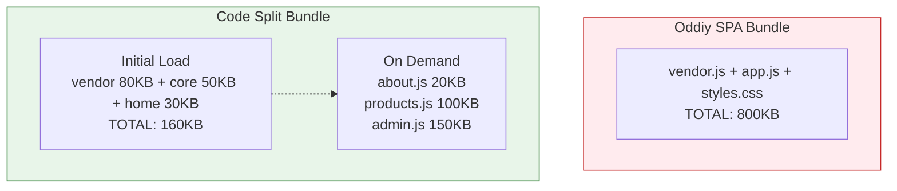

# Code Splitting

Code splitting - bu JavaScript bundle'ni kichikroq qismlarga bo'lish texnikasi. Bu initial load vaqtini sezilarli kamaytiradi va foydalanuvchiga faqat kerakli kodni yuboradi.

## Nazariya

> [!IMPORTANT]
> **Nima uchun muhim?**  
> Foydalanuvchi sizning saytingizga kirganda barcha kodlar jamlangan bitta ulkan JS faylni (bundle.js) tortib olsa, bu sayt qotishiga olib keladi. Code Splitting "Hamma narsani bitta sumkaga tiqmasdan, faqat kerakli qismlarini alohida jildlarga solish" degani. 500KB o'rniga faqat joriy sahifaga kerakli 50KB kod yuklanadi. Qolgani - foydalanuvchi boshqa sahifaga o'tgandagina (Lazy Loading bilan birga) yuklanadi.

> [!NOTE]
> **Real-hayot analogiyasi: "Pitseriya va Retseptlar Kitobi"**  
> - **Monolitik Bundle (Yomon):** Pitseriyaga ishga kirdingiz. Sizga dunyodagi hamma ovqatlar (Pitsa, Palov, Sushi) retsepti bor 10 ming sahifali kitobni qo'lingizga berishdi. Uni ko'tarib yurish og'ir, o'qishga vaqt ketadi, vaholanki siz faqat Pitsa tayyorlaysiz.
> - **Code Splitting (Yaxshi):** Sizga faqatgina Pitsa bo'limi yirtib olingan 10 varaqli kitobcha berishdi. Vaqti kelib sizga Sushi buyurtma qilishsagina, Sushi retsepti yozilgan qo'shimcha varaqni olib kelasiz.

### Muammo va Yechim



### Splitting Strategiyalari

```
1. Entry Points - Multiple entry files
2. Dynamic Imports - import() syntax
3. Vendor Splitting - node_modules alohida
4. Route-based - Har sahifa alohida chunk
5. Component-based - Og'ir komponentlar alohida
```

## Route-Based Splitting

### Sekin Variant

```javascript
// Barcha sahifalar bitta bundle'da
import Home from './pages/Home.vue';
import About from './pages/About.vue';
import Products from './pages/Products.vue';
import ProductDetail from './pages/ProductDetail.vue';
import Cart from './pages/Cart.vue';
import Checkout from './pages/Checkout.vue';
import Admin from './pages/Admin.vue';
import Analytics from './pages/Analytics.vue';

const routes = [
  { path: '/', component: Home },
  { path: '/about', component: About },
  { path: '/products', component: Products },
  { path: '/product/:id', component: ProductDetail },
  { path: '/cart', component: Cart },
  { path: '/checkout', component: Checkout },
  { path: '/admin', component: Admin },
  { path: '/analytics', component: Analytics }
];

// Bundle: 1.2MB (hammasi bitta faylda)
```

### Tez Variant

```javascript
// Vue Router lazy loading
const routes = [
  {
    path: '/',
    name: 'home',
    component: () => import('./pages/Home.vue')
  },
  {
    path: '/about',
    name: 'about',
    component: () => import('./pages/About.vue')
  },
  {
    path: '/products',
    name: 'products',
    // Chunk nomi berish (debugging uchun)
    component: () => import(
      /* webpackChunkName: "products" */
      './pages/Products.vue'
    )
  },
  {
    path: '/product/:id',
    name: 'product-detail',
    component: () => import(
      /* webpackChunkName: "products" */
      './pages/ProductDetail.vue'
    )
    // products chunk'ga qo'shiladi
  },
  {
    path: '/cart',
    name: 'cart',
    component: () => import('./pages/Cart.vue')
  },
  {
    path: '/checkout',
    name: 'checkout',
    component: () => import('./pages/Checkout.vue')
  },
  // Admin section - alohida chunk group
  {
    path: '/admin',
    component: () => import(
      /* webpackChunkName: "admin" */
      './layouts/AdminLayout.vue'
    ),
    children: [
      {
        path: '',
        component: () => import(
          /* webpackChunkName: "admin" */
          './pages/Admin.vue'
        )
      },
      {
        path: 'analytics',
        component: () => import(
          /* webpackChunkName: "admin" */
          './pages/Analytics.vue'
        )
      }
    ]
  }
];

// Initial: 150KB
// Chunks: products(80KB), admin(200KB), cart(30KB), ...
```

## Vendor Splitting

### Vite Konfiguratsiya

```javascript
// vite.config.js
import { defineConfig } from 'vite';
import vue from '@vitejs/plugin-vue';

export default defineConfig({
  plugins: [vue()],
  build: {
    rollupOptions: {
      output: {
        manualChunks: {
          // Core vendor - har doim kerak
          'vendor-core': ['vue', 'vue-router', 'pinia'],

          // UI library
          'vendor-ui': ['@headlessui/vue', '@heroicons/vue'],

          // Utils
          'vendor-utils': ['lodash-es', 'date-fns', 'axios'],

          // Charts - faqat analytics sahifada
          'vendor-charts': ['chart.js', 'vue-chartjs'],

          // Editor - faqat content sahifada
          'vendor-editor': ['@tiptap/vue-3', '@tiptap/starter-kit']
        }
      }
    }
  }
});
```

### Advanced Splitting

```javascript
// vite.config.js
export default defineConfig({
  build: {
    rollupOptions: {
      output: {
        manualChunks(id) {
          // node_modules ichidagi modullar
          if (id.includes('node_modules')) {
            // Vue ecosystem
            if (id.includes('vue') || id.includes('pinia')) {
              return 'vendor-vue';
            }

            // UI components
            if (id.includes('headlessui') || id.includes('heroicons')) {
              return 'vendor-ui';
            }

            // Date utilities
            if (id.includes('date-fns') || id.includes('dayjs')) {
              return 'vendor-date';
            }

            // Heavy libraries - alohida
            if (id.includes('chart.js')) {
              return 'vendor-charts';
            }

            if (id.includes('xlsx') || id.includes('exceljs')) {
              return 'vendor-excel';
            }

            if (id.includes('pdfjs') || id.includes('jspdf')) {
              return 'vendor-pdf';
            }

            // Qolgan vendor
            return 'vendor-misc';
          }

          // Application code
          if (id.includes('/pages/admin/')) {
            return 'admin';
          }

          if (id.includes('/pages/dashboard/')) {
            return 'dashboard';
          }
        }
      }
    }
  }
});
```

## Component-Based Splitting

### Heavy Component Splitting

```vue
<!-- ProductGallery.vue - og'ir komponent -->
<script setup>
import { defineAsyncComponent, ref } from 'vue';

// 3D viewer - faqat kerak bo'lganda
const Product3DViewer = defineAsyncComponent(() =>
  import(
    /* webpackChunkName: "3d-viewer" */
    './Product3DViewer.vue'
  )
);

// Image zoom - hover'da
const ImageZoom = defineAsyncComponent(() =>
  import('./ImageZoom.vue')
);

// Video player - video bo'lganda
const VideoPlayer = defineAsyncComponent(() =>
  import('./VideoPlayer.vue')
);

const props = defineProps<{
  product: Product;
}>();

const show3D = ref(false);
</script>

<template>
  <div class="product-gallery">
    <!-- Static images - darhol ko'rinadi -->
    <div class="main-image">
      
    </div>

    <!-- 3D viewer - button bosilganda -->
    <button @click="show3D = true" v-if="product.has3DModel">
      3D Ko'rish
    </button>

    <Suspense v-if="show3D">
      <Product3DViewer :model-url="product.modelUrl" />
      <template #fallback>
        <div class="loading">3D model yuklanmoqda...</div>
      </template>
    </Suspense>

    <!-- Video - agar mavjud bo'lsa -->
    <VideoPlayer v-if="product.videoUrl" :src="product.videoUrl" />
  </div>
</template>
```

### Feature-Based Splitting

```javascript
// features/index.js
// Har bir feature alohida chunk

export const loadAnalytics = () => import(
  /* webpackChunkName: "feature-analytics" */
  './analytics'
);

export const loadReporting = () => import(
  /* webpackChunkName: "feature-reporting" */
  './reporting'
);

export const loadNotifications = () => import(
  /* webpackChunkName: "feature-notifications" */
  './notifications'
);

export const loadChat = () => import(
  /* webpackChunkName: "feature-chat" */
  './chat'
);
```

```vue
<!-- Dashboard.vue -->
<script setup>
import { ref, onMounted } from 'vue';
import { loadAnalytics, loadChat } from '@/features';

const AnalyticsWidget = ref(null);
const ChatWidget = ref(null);

onMounted(async () => {
  // Parallel loading
  const [analytics, chat] = await Promise.all([
    loadAnalytics(),
    loadChat()
  ]);

  AnalyticsWidget.value = analytics.default;
  ChatWidget.value = chat.default;
});
</script>

<template>
  <div class="dashboard">
    <component :is="AnalyticsWidget" v-if="AnalyticsWidget" />
    <component :is="ChatWidget" v-if="ChatWidget" />
  </div>
</template>
```

## Webpack vs Vite Splitting

### Webpack

```javascript
// webpack.config.js
module.exports = {
  optimization: {
    splitChunks: {
      chunks: 'all',
      minSize: 20000, // 20KB dan kichik chunk qilmaslik
      maxSize: 244000, // 244KB dan katta bo'lsa bo'lish
      minChunks: 1,
      maxAsyncRequests: 30,
      maxInitialRequests: 30,
      cacheGroups: {
        // Vendor splitting
        defaultVendors: {
          test: /[\\/]node_modules[\\/]/,
          priority: -10,
          reuseExistingChunk: true
        },
        // Common code
        default: {
          minChunks: 2,
          priority: -20,
          reuseExistingChunk: true
        },
        // Vue ecosystem
        vue: {
          test: /[\\/]node_modules[\\/](vue|vue-router|pinia)[\\/]/,
          name: 'vendor-vue',
          chunks: 'all',
          priority: 20
        },
        // UI library
        ui: {
          test: /[\\/]node_modules[\\/](@headlessui|@heroicons)[\\/]/,
          name: 'vendor-ui',
          chunks: 'all',
          priority: 15
        }
      }
    }
  }
};
```

### Vite (Rollup)

```javascript
// vite.config.js
export default defineConfig({
  build: {
    chunkSizeWarningLimit: 500, // 500KB warning
    rollupOptions: {
      output: {
        // Chunk naming
        chunkFileNames: (chunkInfo) => {
          const facadeModuleId = chunkInfo.facadeModuleId
            ? chunkInfo.facadeModuleId.split('/').pop().replace('.vue', '')
            : 'chunk';
          return `js/${facadeModuleId}-[hash].js`;
        },

        // Asset naming
        assetFileNames: (assetInfo) => {
          const extType = assetInfo.name.split('.').pop();
          if (/png|jpe?g|svg|gif|tiff|bmp|ico/i.test(extType)) {
            return 'images/[name]-[hash][extname]';
          }
          if (/woff2?|ttf|eot/i.test(extType)) {
            return 'fonts/[name]-[hash][extname]';
          }
          return 'assets/[name]-[hash][extname]';
        },

        // Manual chunks
        manualChunks: {
          'vue-core': ['vue', 'vue-router', 'pinia'],
          'ui-lib': ['@headlessui/vue']
        }
      }
    }
  }
});
```

## Real-World Case: Dashboard Application

### Muammo

```
Bundle Analysis:
- main.js: 1.8MB
- FCP: 6.5s
- TTI: 12s

Top Contributors:
- chart.js: 450KB
- xlsx: 380KB
- monaco-editor: 520KB
- pdfjs: 280KB
```

### Splitting Strategy

```javascript
// 1. Route-based splitting
const routes = [
  {
    path: '/dashboard',
    component: () => import('./DashboardLayout.vue'),
    children: [
      {
        path: '',
        component: () => import('./pages/Overview.vue')
      },
      {
        path: 'analytics',
        component: () => import(
          /* webpackChunkName: "analytics" */
          /* webpackPrefetch: true */
          './pages/Analytics.vue'
        )
      },
      {
        path: 'reports',
        component: () => import(
          /* webpackChunkName: "reports" */
          './pages/Reports.vue'
        )
      },
      {
        path: 'editor',
        component: () => import(
          /* webpackChunkName: "editor" */
          './pages/CodeEditor.vue'
        )
      }
    ]
  }
];

// 2. Heavy library lazy loading
// pages/Analytics.vue
async function initCharts() {
  const { Chart, registerables } = await import('chart.js');
  Chart.register(...registerables);
  return Chart;
}

// pages/Reports.vue
async function exportToExcel(data) {
  const XLSX = await import('xlsx');
  const ws = XLSX.utils.json_to_sheet(data);
  const wb = XLSX.utils.book_new();
  XLSX.utils.book_append_sheet(wb, ws, 'Report');
  XLSX.writeFile(wb, 'report.xlsx');
}

// pages/CodeEditor.vue
const MonacoEditor = defineAsyncComponent({
  loader: async () => {
    const monaco = await import('monaco-editor');
    // Monaco workers setup
    return import('./MonacoWrapper.vue');
  },
  loadingComponent: EditorSkeleton,
  delay: 100
});
```

### Vite Config

```javascript
// vite.config.js
export default defineConfig({
  build: {
    rollupOptions: {
      output: {
        manualChunks(id) {
          // Heavy libraries - alohida chunks
          if (id.includes('chart.js')) {
            return 'vendor-charts';
          }
          if (id.includes('xlsx') || id.includes('exceljs')) {
            return 'vendor-excel';
          }
          if (id.includes('monaco-editor')) {
            return 'vendor-monaco';
          }
          if (id.includes('pdfjs')) {
            return 'vendor-pdf';
          }

          // Core vendors
          if (id.includes('node_modules')) {
            if (id.includes('vue')) return 'vendor-vue';
            return 'vendor-misc';
          }
        }
      }
    }
  }
});
```

### Natija

```
Before:
- main.js: 1.8MB
- FCP: 6.5s
- TTI: 12s

After:
- main.js: 180KB
- vendor-vue.js: 120KB
- vendor-charts.js: 450KB (lazy)
- vendor-excel.js: 380KB (lazy)
- vendor-monaco.js: 520KB (lazy)

- FCP: 1.2s
- TTI: 2.8s

Improvement: 75% tezroq!
```

## Bundle Analyzer

### Webpack Bundle Analyzer

```javascript
// webpack.config.js
const BundleAnalyzerPlugin = require('webpack-bundle-analyzer')
  .BundleAnalyzerPlugin;

module.exports = {
  plugins: [
    new BundleAnalyzerPlugin({
      analyzerMode: 'static',
      reportFilename: 'bundle-report.html',
      openAnalyzer: false
    })
  ]
};
```

### Rollup Plugin Visualizer

```javascript
// vite.config.js
import { visualizer } from 'rollup-plugin-visualizer';

export default defineConfig({
  plugins: [
    visualizer({
      filename: 'dist/stats.html',
      open: true,
      gzipSize: true,
      brotliSize: true
    })
  ]
});
```

### Source Map Explorer

```bash
# Install
npm install -g source-map-explorer

# Analyze
source-map-explorer dist/assets/*.js

# Multiple files
source-map-explorer dist/assets/*.js --html result.html
```

## Prefetch Strategy

### Route-Level Prefetch

```vue
<script setup>
import { onMounted } from 'vue';
import { useRoute, useRouter } from 'vue-router';

const route = useRoute();
const router = useRouter();

onMounted(() => {
  // Joriy sahifaga bog'liq sahifalarni prefetch
  const prefetchMap = {
    '/products': ['/product/:id', '/cart'],
    '/cart': ['/checkout'],
    '/checkout': ['/order-confirmation']
  };

  const routesToPrefetch = prefetchMap[route.path] || [];

  routesToPrefetch.forEach(routePath => {
    const matchedRoute = router.resolve(routePath);
    const component = matchedRoute.matched[0]?.components?.default;

    if (typeof component === 'function') {
      // Idle callback - brauzer bo'sh bo'lganda
      requestIdleCallback(() => {
        component(); // Lazy component'ni trigger
      });
    }
  });
});
</script>
```

### Link-Based Prefetch

```vue
<!-- SmartLink.vue -->
<script setup>
import { ref, onMounted, onUnmounted } from 'vue';
import { useRouter } from 'vue-router';

const props = defineProps<{
  to: string;
  prefetch?: boolean;
}>();

const router = useRouter();
const linkRef = ref<HTMLAnchorElement>();
let observer: IntersectionObserver | null = null;
let prefetched = false;

function prefetchRoute() {
  if (prefetched) return;

  const route = router.resolve(props.to);
  const component = route.matched[0]?.components?.default;

  if (typeof component === 'function') {
    component();
    prefetched = true;
  }
}

onMounted(() => {
  if (props.prefetch === false) return;

  observer = new IntersectionObserver(
    ([entry]) => {
      if (entry.isIntersecting) {
        prefetchRoute();
        observer?.disconnect();
      }
    },
    { rootMargin: '50px' }
  );

  if (linkRef.value) {
    observer.observe(linkRef.value);
  }
});

onUnmounted(() => {
  observer?.disconnect();
});
</script>

<template>
  <router-link ref="linkRef" :to="to" @mouseenter="prefetchRoute">
    <slot />
  </router-link>
</template>
```

## Interview Savollari

### 1. Code splitting qachon kerak emas?

**Javob:**
```
Code splitting kerak EMAS:
1. Juda kichik ilovalar (< 50KB)
2. Offline-first ilovalar (Service Worker cache)
3. Internal tools (network tez, cache uzun)
4. Single-page landinglar

Code splitting KERAK:
1. SPA 100KB dan katta
2. Public-facing ilovalar
3. Mobile foydalanuvchilar ko'p
4. SEO muhim (SSR/SSG bilan)
5. E-commerce, dashboards

Haddan tashqari splitting ham XATO:
- Har component alohida = HTTP overhead
- Optimal: 50-150KB chunks
- Balans: network requests vs bundle size
```

### 2. manualChunks vs automatik splitting qachon?

**Javob:**
```javascript
// Automatik splitting YAXSHI:
// - Oddiy ilovalar
// - Webpack defaults ishlaydi
optimization: {
  splitChunks: {
    chunks: 'all' // Webpack o'zi hal qiladi
  }
}

// manualChunks KERAK:
// 1. Vendor library versiyalash
manualChunks: {
  // Versiya o'zgarmasa cache qoladi
  'vendor-vue-3.4': ['vue', 'vue-router']
}

// 2. Heavy library izolyatsiya
manualChunks: {
  'vendor-charts': ['chart.js'], // Faqat kerak bo'lganda
  'vendor-pdf': ['pdfjs']
}

// 3. Feature-based
manualChunks: {
  'admin-module': ['/src/admin/'],
  'user-module': ['/src/user/']
}

// 4. Shared dependencies
manualChunks: {
  'shared-utils': ['lodash-es', 'date-fns']
}
```

### 3. Circular dependency code splitting'da qanday hal qilinadi?

**Javob:**
```javascript
// Muammo: A -> B -> A
// a.js
import { funcB } from './b.js';
export const funcA = () => funcB();

// b.js
import { funcA } from './a.js'; // Circular!
export const funcB = () => funcA();

// Yechim 1: Common module
// common.js
export const sharedData = {};

// a.js
import { sharedData } from './common.js';
export const funcA = () => sharedData.value;

// b.js
import { sharedData } from './common.js';
export const funcB = () => sharedData.value;

// Yechim 2: Lazy import
// b.js
export const funcB = async () => {
  const { funcA } = await import('./a.js');
  return funcA();
};

// Yechim 3: Dependency injection
class ServiceA {
  constructor(serviceB) {
    this.serviceB = serviceB;
  }
}
```

### 4. HTTP/2 code splitting'ga qanday ta'sir qiladi?

**Javob:**
```
HTTP/1.1:
- 6 parallel connections limit
- Ko'p chunk = bottleneck
- Optimal: 3-5 chunks

HTTP/2:
- Multiplexing - 100+ parallel
- Ko'p chunk OK
- Server push
- Optimal: 10-20 chunks

Strategiya:
// HTTP/1.1 uchun
manualChunks: {
  'vendor': [...allVendors], // Bitta katta vendor
  'app': [...allApp]
}

// HTTP/2 uchun
manualChunks(id) {
  // Ko'p kichik chunks
  if (id.includes('vue')) return 'vue';
  if (id.includes('router')) return 'router';
  // ...
}

// Tekshirish
// Chrome DevTools > Network > Protocol
// h2 = HTTP/2
```

### 5. Dynamic import() va static import farqi nima?

**Javob:**
```javascript
// Static import
// - Build vaqtida aniq
// - Tree shaking mumkin
// - Top-level only
// - Sinxron
import { utils } from './utils.js';

// Dynamic import()
// - Runtime'da yuklash
// - Har qanday joyda
// - Promise qaytaradi
// - Code splitting trigger

// Dynamic import use cases:
// 1. Route-based splitting
const Home = () => import('./Home.vue');

// 2. Conditional loading
if (userRole === 'admin') {
  const admin = await import('./admin-panel.js');
}

// 3. Event-based loading
button.onclick = async () => {
  const { exportPDF } = await import('./pdf-utils.js');
  exportPDF(data);
};

// 4. Feature flags
if (featureFlags.newDashboard) {
  const Dashboard = await import('./NewDashboard.vue');
}

// Static import afzalliklari:
// - Tree shaking
// - Static analysis
// - IDE autocomplete
// - Type checking
```

## Best Practices

### 1. Chunk Size Guidelines

```javascript
// Optimal chunk sizes
const CHUNK_SIZES = {
  vendor: '100-150KB', // Core vendor
  route: '30-80KB',    // Per route
  component: '10-50KB', // Lazy components
  utility: '5-20KB'    // Utility chunks
};

// Warning thresholds
build: {
  chunkSizeWarningLimit: 500, // 500KB warning
  rollupOptions: {
    output: {
      // Juda katta chunk'larni bo'lish
      experimentalMinChunkSize: 10000 // 10KB minimum
    }
  }
}
```

### 2. Loading States

```vue
<script setup>
import { defineAsyncComponent } from 'vue';

const AsyncComponent = defineAsyncComponent({
  loader: () => import('./HeavyComponent.vue'),
  loadingComponent: () => import('./Skeleton.vue'),
  errorComponent: () => import('./ErrorState.vue'),
  delay: 200,
  timeout: 10000
});
</script>
```

### 3. Naming Convention

```javascript
// Chunk naming for debugging
const routes = [
  {
    path: '/admin',
    component: () => import(
      /* webpackChunkName: "admin-layout" */
      './AdminLayout.vue'
    )
  }
];

// Vite
build: {
  rollupOptions: {
    output: {
      chunkFileNames: 'js/[name]-[hash].js',
      entryFileNames: 'js/[name]-[hash].js'
    }
  }
}
```

## Eng Yaxshi Amaliyotlar (Best Practices)

1. **Vite da manualChunks:** Barcha NPM kutubxonalaringizni (Vue, Router, Pinia) bitta `vendor` chunk ga, e-commerce qismlari (Stripe, Axios) ni `ecommerce` chunk ga bo'lishni unutmang. Aks holda Vite/Webpack barini aralashtirib yuborishi mumkin.
2. **Qancha Kichik, Shuncha Yaxshi... emasmikan?:** Juda ko'p kichik fayllarga (masalan, har bir fayl 1-2KB) ajratib yubormang. Brauzer yuzlab fayllarni yuklash o'rniga, bitta 50KB faylni yuklagani afzal. Optimal chunk hajmi 30KB - 100KB atrofida bo'lishi tavsiya etiladi.
3. **Kutubxonalarni Code Splitting qilish:** Og'ir kutubxonalarni (masalan ECharts, Moment.js) hamma joyda import qilmang. Ularni faqatgina shu kutubxona kerak bo'ladigan komponentlardagina `import()` qiling.

---

## Xulosa

Code splitting samarali qo'llash uchun:

1. **Route-based** - har sahifa alohida chunk
2. **Vendor splitting** - core vs heavy libraries
3. **Component-based** - og'ir komponentlar lazy
4. **Analyze** - bundle analyzer ishlatish
5. **Prefetch** - kutilgan navigatsiya uchun

```javascript
// Ideal Structure
Initial Load (150KB):
├── vendor-core.js (80KB)
├── app.js (50KB)
└── home.js (20KB)

On Demand:
├── product.js (30KB)
├── cart.js (25KB)
├── checkout.js (40KB)
└── admin.js (150KB) + vendor-charts.js (100KB)
```
