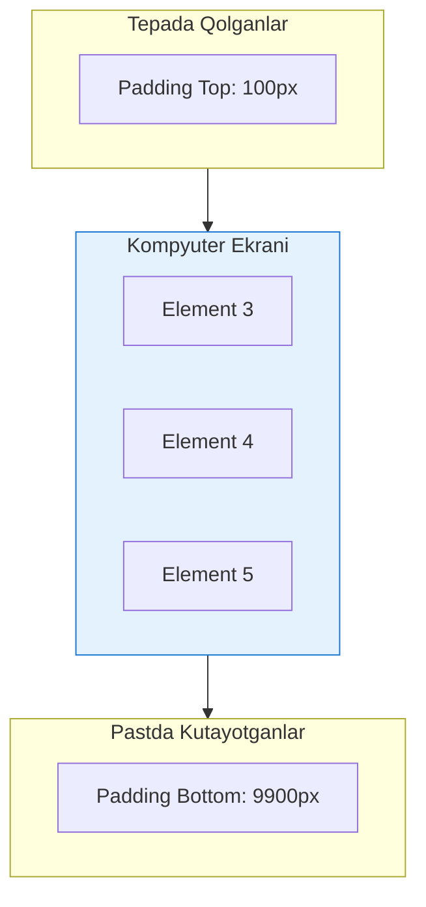

# Virtual Scrolling

## Kirish

> [!IMPORTANT]
> **Nima uchun muhim?**  
> Agar sizda 10,000 ta obyektdan iborat ma'lumot (masalan, foydalanuvchilar ro'yxati yoki chat xabarlari) bo'lsa va ularni hammasini bittada HTML (DOM) ga chizsangiz, brauzer muzlab qoladi. Chunki brauzer uchun har bir HTML teg (div, span) og'ir yuk hisoblanadi. **Virtual Scrolling** orqali biz brauzerni "aldab", faqat ekranda ko'rinib turgan qismidagina (masalan 20 ta) HTML elementlarni chizamiz, foydalanuvchi pastga tushgan sari o'sha 20 ta element ma'lumotlarini almashtirib boraveramiz. Natija — 10 mingta ma'lumot bo'lsa ham tezlik o'zgarmaydi.

> [!NOTE]
> **Real-hayot analogiyasi: "Kinoteatr Lentalari va Projektor"**  
> - **An'anaviy (Yomon):** Filmning 10,000 ta kadrini devorga yonma-yon ilib chiqib tomoshabinni yugurtirish. Bu qimmat, sekin va ahmoqona usul.  
> - **Virtual Scrolling (Yaxshi):** Tomoshabin o'tiradi, faqat bitta ekran (Viewport) mavjud. Kadrlarning o'zi tezlik bilan aylanib keladi, lekin har doim faqat bitta kadr ko'rsatiladi. Lenta qanchalik uzun bo'lmasin, ishlatiladigan ekran hajmi o'zgarmaydi.

---

## 🟢 Junior (Asoslar va Tushunchalar)

Junior dasturchilar ma'lumotlarni ko'rsatishda odatda tsikl (`v-for`) ishlatib, bor narsani ekranga chiqarishadi. Agar massivdagi elementlar soni oz (masalan, 100 ta) bo'lsa, bu muammo emas. Ammo ma'lumot minglab bo'lsa, kompyuter qotishni boshlaydi. 

### Muammo: Katta Ro'yxatlar

```vue
<!-- XATO: 10 mingta DOM elementni bittada chizish -->
<script setup>
import { ref } from 'vue';

const items = ref(Array.from({ length: 10000 }, (_, i) => ({
  id: i,
  title: `Item ${i}`
})));
</script>

<template>
  <div class="list-container" style="height: 600px; overflow: auto;">
    <div v-for="item in items" :key="item.id" class="list-item">
      <h3>{{ item.title }}</h3>
    </div>
  </div>
</template>
```

### Qanday Ishlaydi? (Nazariya)


Virtual scroll'ning ishlash mantig'i: tepada va pastda haqiqiy HTML elementlar o'rniga shunchaki bo'shliq (`padding` yoki transform) saqlanib turiladi. Bu skroll bar'ning (o'ng tomondagi tushirish chizig'i) uzunligini tabiiy qilib ushlab turadi va brauzer faqat o'rtadagi ekran hajmidagi DOM'larni render qiladi.

---

## 🟡 Middle (Amaliyot va Detallar)

Middle dasturchilar "velosipedni qaytadan ixtiro qilmaslik" (Don't reinvent the wheel) tamoyiliga ko'ra tayyor va sinalgan kutubxonalardan foydalanadi. Odatda ma'lumotlarning bo'yi bir xil (`Fixed Height`) bo'ladi, ba'zida esa matn miqdoriga qarab turlicha (`Dynamic Height`) bo'lishi mumkin. 

### @vueuse/core yordamida oson yechim

VueUse kutubxonasi tarkibida juda ajoyib `useVirtualList` funktsiyasi mavjud bo'lib, eng ko'p qo'llaniluvchi va oddiy usul hisoblanadi.

```vue
<script setup>
import { ref } from 'vue';
import { useVirtualList } from '@vueuse/core';

const allItems = ref(Array.from({ length: 10000 }, (_, i) => ({
  id: i,
  name: `Foydalanuvchi ${i}`
})));

// 1. list - ekranda ko'rinadigan qism
// 2. containerProps - o'rab turuvchi element sozlamalari
// 3. wrapperProps - itemlar o'rab turuvchisi sozlamalari
const { list, containerProps, wrapperProps } = useVirtualList(allItems, {
  itemHeight: 60, // Har bir qator bo'yi (majburiy agar o'zgarmas bo'lsa)
  overscan: 10 // Ekranga sig'adiganidan tashqari +10 ta oldindan tayyorlab turish
});
</script>

<template>
  <div v-bind="containerProps" style="height: 500px; overflow: auto;">
    <div v-bind="wrapperProps">
      <!-- v-for faqat "list" ni aylanadi, ya'ni ekrandagini -->
      <div v-for="{ data, index } in list" :key="data.id" class="item" style="height: 60px;">
        {{ index }} - {{ data.name }}
      </div>
    </div>
  </div>
</template>
```
Bu holda har xil `scroll`, `padding` hisob-kitoblarini kodning o'zi avtomatik hisoblaydi!

---

## 🔴 Senior (Arxitektura va Optimizatsiya)

Senior dasturchi *Overscan* parametrlarini to'g'ri belgilashni, Grid o'lchamdagi kompleks jadvallarni (Data Tables) optimallashtirishni hamda *Dynamic Height* (Kutib olinayotgan element balandligi oldindan noma'lum) muammolarini `@tanstack/vue-virtual` yordamida `ResizeObserver` orqali yechishni biladi.

### Tanstack Virtual (Dynamic Height uchun)
Tasavvur qiling, bu bir chat dasturi, va xabarlar (uzun yoki qisqa matn) ekanligiga qarab balandligi turlicha. Qaysi xabar qancha joy egallashini oldindan bilib bo'lmaydi.

```vue
<script setup>
import { ref } from 'vue';
import { useVirtualizer } from '@tanstack/vue-virtual';

const parentRef = ref(null);
const items = Array.from({ length: 10000 }, (_, i) => ({
  id: i,
  text: i % 2 === 0 ? 'Qisqa xabar' : 'Bu juda uzooooq va bir necha qatorni egallaydigan uzun matn. Balandlik oldindan noma\'lum.'
}));

const virtualizer = useVirtualizer({
  count: items.length,
  getScrollElement: () => parentRef.value,
  estimateSize: () => 50, // Dastlabki taxminiy balandlik (muhim!)
  overscan: 5
});
</script>

<template>
  <div ref="parentRef" style="height: 500px; overflow: auto;">
    <div
      :style="{
        height: `${virtualizer.getTotalSize()}px`, // Barcha hisoblangan matnlar bo'yi
        width: '100%',
        position: 'relative'
      }"
    >
      <div
        v-for="virtualRow in virtualizer.getVirtualItems()"
        :key="virtualRow.key"
        :data-index="virtualRow.index"
        :ref="virtualizer.measureElement" <!-- ResizeObserver mana shu yerda ulanadi -->
        :style="{
          position: 'absolute',
          top: 0,
          left: 0,
          width: '100%',
          transform: `translateY(${virtualRow.start}px)`
        }"
      >
        <div class="row">
          {{ items[virtualRow.index].text }}
        </div>
      </div>
    </div>
  </div>
</template>
```
Yuqoridagi `:ref="virtualizer.measureElement"` kodi, haqiqiy ma'lumot HTML'da render bo'lib chiqishi bilanoq, uning uzunligini o'lchaydi (ResizeObserver orqali) va hamma o'lchamlarni avtomatik qayta taxlaydi.

### Intervyu Savoli
**"Overscan nima va nechta bo'lishi kerak?"**
*Javob:*
Overscan bu - faqat ko'rinadigan qismni emas, ekrandan yuqorida va pastda ko'rinmaydigan qo'shimcha elementlarni oldindan chizib tayyorlab qo'yish (buffer). Agar Overscan 0 bo'lsa va foydalanuvchi tezlik bilan scroll qilsa, brauzer darhol chizib ulgurolmay oqish bo'shliqlar (flicker) paydo bo'ladi. Agar Overscan juda ko'p bo'lsa (masalan 100 ta), u holda keraksiz ko'p element yasaladi va maqsadga xizmat qilmaydi. Odatda *Overscan* 3 tadan 10 tagacha (ekran razmeriga qarab) qo'yilishi optimal sanaladi.

---

## Eng Yaxshi Amaliyotlar (Best Practices)

1. **Tayyor Kutubxonani ishlating:** Virtual scrollni noldan yozish (ayniqsa balandligi o'zgaruvchan elementlar uchun) juda murakkab, baglar ko'p chiqadi. Vue loyihalarida VueUse (`useVirtualList`), `@tanstack/vue-virtual` yoki `vue-virtual-scroller` kabi sinovdan o'tgan kutubxonalardan foydalaning.
2. **Overscan qilish:** Ekranga sig'ishidan ko'ra 3-5 ta qo'shimcha elementni doim chizib turing. Bu scroll davomida "Oq fonda yarmi yo'q komponent" chiqib qolishining (Flicker effect) oldini oladi.
3. **Paginatsiya bilan birlashtiring:** Garchand Virtual Scroll DOM ni tezlashtirsa ham, agar xotirada 1 million qator JSON obyekti tursa u RAM (Tezkor xotira) ni to'ldirib qo'yadi. Shuning uchun "Infinite Scroll" da faqat keraklicha (masalan har 100 tadan) yuklab olish mantiqini (Pagination) virtual scroll bilan qo'shib ishlating.

---

## Xulosa

Virtual scrolling strategiyasi:

1. **Fixed height** - Barcha elementlar balandligi bir xil bo'lsa (Eng oson va tez, VueUse `useVirtualList` yetarli).
2. **Dynamic height** - Balandligi har xil bo'lsa, masalan matnli xabarlar (`@tanstack/vue-virtual` va ResizeObserver orqali o'lchash majburiy).
3. **Overscan** - Silliq o'tish uchun qo'shimcha elementlar tayyorlash.

| Ma'lumot Soni | Tavsiya Qilinadigan Usul | Sabab |
| --- | --- | --- |
| **< 100 ta** | Oddiy tsikl (`v-for`) | DOM bemalol ko'taradi, ortiqcha plugin shart emas. |
| **100 - 1000 ta** | Virtual ixtiyoriy | Agar Karta kabi murakkab UI bo'lsa - Virtual qiling. |
| **1000+ ta** | Virtual MAJBURIY | UI mutlaqo qotib qoladi. |
| **10,000+ ta** | Virtual + Backend Pagination | Xotira (RAM) qotadi, Infinite Loading qo'shish kerak. |
