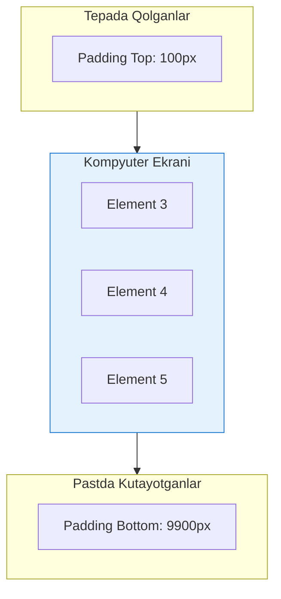

# Virtual Scrolling

## Kirish

> [!IMPORTANT]
> **Nima uchun muhim?**  
> Agar sizda 10,000 ta obyektdan iborat ma'lumot (masalan, foydalanuvchilar ro'yxati yoki chat xabarlari) bo'lsa va ularni hammasini bittada HTML (DOM) ga chizsangiz, brauzer muzlab qoladi. Chunki brauzer uchun har bir HTML teg (div, span) og'ir yuk hisoblanadi. **Virtual Scrolling** orqali biz brauzerni "aldab", faqat ekranda ko'rinib turgan qismidagina (masalan 20 ta) HTML elementlarni chizamiz, foydalanuvchi pastga tushgan sari o'sha 20 ta element ma'lumotlarini almashtirib boraveramiz. Natija — 10 mingta ma'lumot bo'lsa ham tezlik o'zgarmaydi.

> [!NOTE]
> **Real-hayot analogiyasi: "Kinoteatr Lentalari va Projektor"**  
> - **An'anaviy (Yomon):** Filmning 10,000 ta kadrini devorga yonma-yon ilib chiqib tomoshabinni yugurtirish. Bu qimmat, sekin va ahmoqona usul.  
> - **Virtual Scrolling (Yaxshi):** Tomoshabin o'tiradi, faqat bitta ekran (Viewport) mavjud. Kadrlarning o'zi tezlik bilan aylanib keladi, lekin har doim faqat bitta kadr ko'rsatiladi. Lenta qanchalik uzun bo'lmasin, ishlatiladigan ekran hajmi o'zgarmaydi.

## Nazariya

### Muammo: Katta Ro'yxatlar va Yechim

| Xususiyat | An'anaviy Render (Traditional) | Virtual Scrolling |
| --- | --- | --- |
| **Elementlar soni** | 10,000 ta element | 10,000 ta ma'lumot |
| **DOM Tugunlari** | 10,000 ta DOM tuguni | Faqat 20-30 ta DOM tuguni (Visible) |
| **Xotira sarfi** | 500MB+ | ~50MB |
| **Dastlabki yuklanish** | 3-5 soniya qotish | <100ms (Bir zumda) |
| **Aylantirish (Scroll)** | Qotadi (Laggy, 10-20 FPS) | Silliq (Smooth, 60 FPS) |

### Qanday Ishlaydi?


Tepada va pastda haqiqiy HTML elementlar o'rniga shunchaki bo'shliq (`padding` yoki transform) ushlab turiladi. Bu skroll bar uzunligini tabiiy qilib ko'rsatadi.

## Oddiy Implementation

### Sekin Variant

```vue
<!-- XATO: Hammasi render qilinadi -->
<script setup>
import { ref } from 'vue';

const items = ref(Array.from({ length: 10000 }, (_, i) => ({
  id: i,
  title: `Item ${i}`,
  description: `Description for item ${i}`
})));
</script>

<template>
  <div class="list-container" style="height: 600px; overflow: auto;">
    <!-- 10,000 DOM element! -->
    <div
      v-for="item in items"
      :key="item.id"
      class="list-item"
    >
      <h3>{{ item.title }}</h3>
      <p>{{ item.description }}</p>
    </div>
  </div>
</template>
```

### Tez Variant: Virtual List

```vue
<!-- VirtualList.vue -->
<script setup>
import { ref, computed, onMounted, onUnmounted } from 'vue';

interface Props {
  items: any[];
  itemHeight: number;
  containerHeight: number;
  overscan?: number; // Qo'shimcha elementlar (smooth scroll uchun)
}

const props = withDefaults(defineProps<Props>(), {
  overscan: 3
});

const containerRef = ref<HTMLElement>();
const scrollTop = ref(0);

// Hisoblashlar
const totalHeight = computed(() => props.items.length * props.itemHeight);

const startIndex = computed(() => {
  const index = Math.floor(scrollTop.value / props.itemHeight);
  return Math.max(0, index - props.overscan);
});

const endIndex = computed(() => {
  const visibleCount = Math.ceil(props.containerHeight / props.itemHeight);
  const index = startIndex.value + visibleCount + props.overscan * 2;
  return Math.min(props.items.length, index);
});

const visibleItems = computed(() => {
  return props.items.slice(startIndex.value, endIndex.value).map((item, i) => ({
    ...item,
    _virtualIndex: startIndex.value + i
  }));
});

const offsetY = computed(() => startIndex.value * props.itemHeight);

// Scroll handler
function handleScroll(event: Event) {
  const target = event.target as HTMLElement;
  scrollTop.value = target.scrollTop;
}

// RAF throttle
let rafId: number | null = null;

function throttledScroll(event: Event) {
  if (rafId) return;

  rafId = requestAnimationFrame(() => {
    handleScroll(event);
    rafId = null;
  });
}

onMounted(() => {
  containerRef.value?.addEventListener('scroll', throttledScroll, { passive: true });
});

onUnmounted(() => {
  containerRef.value?.removeEventListener('scroll', throttledScroll);
  if (rafId) cancelAnimationFrame(rafId);
});
</script>

<template>
  <div
    ref="containerRef"
    class="virtual-list-container"
    :style="{ height: `${containerHeight}px` }"
  >
    <!-- Total height spacer -->
    <div :style="{ height: `${totalHeight}px`, position: 'relative' }">
      <!-- Visible items -->
      <div :style="{ transform: `translateY(${offsetY}px)` }">
        <div
          v-for="item in visibleItems"
          :key="item.id"
          class="virtual-list-item"
          :style="{ height: `${itemHeight}px` }"
        >
          <slot :item="item" :index="item._virtualIndex" />
        </div>
      </div>
    </div>
  </div>
</template>

<style scoped>
.virtual-list-container {
  overflow-y: auto;
  overflow-x: hidden;
}

.virtual-list-item {
  box-sizing: border-box;
}
</style>
```

### Ishlatish

```vue
<script setup>
import VirtualList from './VirtualList.vue';

const items = Array.from({ length: 10000 }, (_, i) => ({
  id: i,
  title: `Product ${i}`,
  price: Math.random() * 100
}));
</script>

<template>
  <VirtualList
    :items="items"
    :item-height="80"
    :container-height="600"
    :overscan="5"
    v-slot="{ item, index }"
  >
    <div class="product-item">
      <span class="index">{{ index }}</span>
      <h3>{{ item.title }}</h3>
      <span class="price">${{ item.price.toFixed(2) }}</span>
    </div>
  </VirtualList>
</template>
```

## @vueuse/core bilan

```vue
<script setup>
import { ref } from 'vue';
import { useVirtualList } from '@vueuse/core';

const allItems = ref(Array.from({ length: 10000 }, (_, i) => ({
  id: i,
  name: `Item ${i}`,
  status: i % 3 === 0 ? 'active' : 'inactive'
})));

const { list, containerProps, wrapperProps } = useVirtualList(allItems, {
  itemHeight: 60,
  overscan: 10
});
</script>

<template>
  <div v-bind="containerProps" class="container">
    <div v-bind="wrapperProps">
      <div
        v-for="{ data, index } in list"
        :key="data.id"
        class="item"
      >
        <span class="index">#{{ index }}</span>
        <span class="name">{{ data.name }}</span>
        <span :class="['status', data.status]">{{ data.status }}</span>
      </div>
    </div>
  </div>
</template>

<style scoped>
.container {
  height: 500px;
  overflow: auto;
  border: 1px solid #e2e8f0;
  border-radius: 8px;
}

.item {
  height: 60px;
  display: flex;
  align-items: center;
  gap: 1rem;
  padding: 0 1rem;
  border-bottom: 1px solid #f1f5f9;
}

.status.active {
  color: #22c55e;
}

.status.inactive {
  color: #94a3b8;
}
</style>
```

## Dynamic Height Items

### Muammo

```
Fixed height: har element 60px - oson
Dynamic height: har element turli - qiyin!

Yechimlar:
1. Estimated height + measure
2. ResizeObserver
3. Pre-calculate heights
```

### ResizeObserver bilan

```vue
<!-- DynamicVirtualList.vue -->
<script setup>
import { ref, computed, onMounted, onUnmounted, watch } from 'vue';

interface Props {
  items: any[];
  estimatedHeight: number;
  containerHeight: number;
}

const props = defineProps<Props>();

const containerRef = ref<HTMLElement>();
const scrollTop = ref(0);

// Har element uchun haqiqiy height
const measuredHeights = ref<Map<number, number>>(new Map());

// Position cache
const positions = computed(() => {
  const result: { top: number; height: number }[] = [];
  let top = 0;

  for (let i = 0; i < props.items.length; i++) {
    const height = measuredHeights.value.get(i) || props.estimatedHeight;
    result.push({ top, height });
    top += height;
  }

  return result;
});

const totalHeight = computed(() => {
  const last = positions.value[positions.value.length - 1];
  return last ? last.top + last.height : 0;
});

// Visible items
const visibleRange = computed(() => {
  const start = scrollTop.value;
  const end = start + props.containerHeight;

  let startIndex = 0;
  let endIndex = props.items.length;

  // Binary search for start
  let low = 0;
  let high = positions.value.length - 1;

  while (low <= high) {
    const mid = Math.floor((low + high) / 2);
    const pos = positions.value[mid];

    if (pos.top + pos.height < start) {
      low = mid + 1;
    } else if (pos.top > start) {
      high = mid - 1;
    } else {
      startIndex = mid;
      break;
    }
  }

  startIndex = Math.max(0, low - 2);

  // Find end
  for (let i = startIndex; i < positions.value.length; i++) {
    if (positions.value[i].top > end) {
      endIndex = i + 2;
      break;
    }
  }

  return { startIndex, endIndex: Math.min(endIndex, props.items.length) };
});

const visibleItems = computed(() => {
  const { startIndex, endIndex } = visibleRange.value;
  return props.items.slice(startIndex, endIndex).map((item, i) => ({
    ...item,
    _index: startIndex + i,
    _top: positions.value[startIndex + i]?.top || 0
  }));
});

// Measure item heights
const resizeObserver = new ResizeObserver((entries) => {
  entries.forEach(entry => {
    const index = Number(entry.target.dataset.index);
    const height = entry.contentRect.height;

    if (measuredHeights.value.get(index) !== height) {
      measuredHeights.value.set(index, height);
    }
  });
});

function observeItem(el: HTMLElement | null) {
  if (el) {
    resizeObserver.observe(el);
  }
}

function handleScroll(event: Event) {
  scrollTop.value = (event.target as HTMLElement).scrollTop;
}

onUnmounted(() => {
  resizeObserver.disconnect();
});
</script>

<template>
  <div
    ref="containerRef"
    class="dynamic-list"
    :style="{ height: `${containerHeight}px` }"
    @scroll="handleScroll"
  >
    <div :style="{ height: `${totalHeight}px`, position: 'relative' }">
      <div
        v-for="item in visibleItems"
        :key="item.id"
        :ref="observeItem"
        :data-index="item._index"
        :style="{
          position: 'absolute',
          top: `${item._top}px`,
          left: 0,
          right: 0
        }"
      >
        <slot :item="item" :index="item._index" />
      </div>
    </div>
  </div>
</template>
```

## Vue Virtual Scroller

```bash
npm install vue-virtual-scroller
```

```vue
<script setup>
import { RecycleScroller, DynamicScroller, DynamicScrollerItem } from 'vue-virtual-scroller';
import 'vue-virtual-scroller/dist/vue-virtual-scroller.css';

const items = ref(/* ... */);
</script>

<template>
  <!-- Fixed height items -->
  <RecycleScroller
    class="scroller"
    :items="items"
    :item-size="60"
    key-field="id"
    v-slot="{ item, index }"
  >
    <div class="item">
      {{ index }} - {{ item.name }}
    </div>
  </RecycleScroller>

  <!-- Dynamic height items -->
  <DynamicScroller
    class="scroller"
    :items="items"
    :min-item-size="40"
    key-field="id"
  >
    <template #default="{ item, index, active }">
      <DynamicScrollerItem
        :item="item"
        :active="active"
        :data-index="index"
      >
        <div class="dynamic-item">
          <h3>{{ item.title }}</h3>
          <p>{{ item.description }}</p>
        </div>
      </DynamicScrollerItem>
    </template>
  </DynamicScroller>
</template>

<style scoped>
.scroller {
  height: 500px;
}
</style>
```

## Tanstack Virtual

```bash
npm install @tanstack/vue-virtual
```

```vue
<script setup>
import { ref } from 'vue';
import { useVirtualizer } from '@tanstack/vue-virtual';

const parentRef = ref<HTMLElement>();

const items = Array.from({ length: 10000 }, (_, i) => ({
  id: i,
  name: `Row ${i}`,
  height: 40 + Math.floor(Math.random() * 60) // 40-100px
}));

const virtualizer = useVirtualizer({
  count: items.length,
  getScrollElement: () => parentRef.value,
  estimateSize: () => 60, // O'rtacha taxmin
  overscan: 5
});
</script>

<template>
  <div ref="parentRef" class="container">
    <div
      :style="{
        height: `${virtualizer.getTotalSize()}px`,
        width: '100%',
        position: 'relative'
      }"
    >
      <div
        v-for="row in virtualizer.getVirtualItems()"
        :key="row.key"
        :style="{
          position: 'absolute',
          top: 0,
          left: 0,
          width: '100%',
          transform: `translateY(${row.start}px)`
        }"
      >
        <div class="row" :style="{ height: `${items[row.index].height}px` }">
          {{ items[row.index].name }}
        </div>
      </div>
    </div>
  </div>
</template>

<style scoped>
.container {
  height: 500px;
  overflow: auto;
}

.row {
  display: flex;
  align-items: center;
  padding: 0 1rem;
  border-bottom: 1px solid #e2e8f0;
}
</style>
```

## Virtual Grid

```vue
<!-- VirtualGrid.vue -->
<script setup>
import { ref, computed } from 'vue';
import { useVirtualizer } from '@tanstack/vue-virtual';

const props = defineProps<{
  items: any[];
  columns: number;
  rowHeight: number;
  gap: number;
}>();

const parentRef = ref<HTMLElement>();

const rowCount = computed(() => Math.ceil(props.items.length / props.columns));

const virtualizer = useVirtualizer({
  count: rowCount.value,
  getScrollElement: () => parentRef.value,
  estimateSize: () => props.rowHeight + props.gap,
  overscan: 2
});

function getItemsForRow(rowIndex: number) {
  const start = rowIndex * props.columns;
  const end = Math.min(start + props.columns, props.items.length);
  return props.items.slice(start, end);
}
</script>

<template>
  <div ref="parentRef" class="grid-container">
    <div
      :style="{
        height: `${virtualizer.getTotalSize()}px`,
        position: 'relative'
      }"
    >
      <div
        v-for="row in virtualizer.getVirtualItems()"
        :key="row.key"
        class="grid-row"
        :style="{
          position: 'absolute',
          top: `${row.start}px`,
          left: 0,
          right: 0,
          height: `${rowHeight}px`,
          display: 'grid',
          gridTemplateColumns: `repeat(${columns}, 1fr)`,
          gap: `${gap}px`
        }"
      >
        <div
          v-for="item in getItemsForRow(row.index)"
          :key="item.id"
          class="grid-item"
        >
          <slot :item="item" />
        </div>
      </div>
    </div>
  </div>
</template>
```

## Real-World Case: Data Table

### Muammo

```
Admin dashboard table:
- 50,000 rows
- 15 columns
- Filtering, sorting, selection
- Initial render: 8+ soniya
- Scroll: 5-10 FPS
```

### Yechim

```vue
<!-- VirtualDataTable.vue -->
<script setup>
import { ref, computed, watch } from 'vue';
import { useVirtualizer } from '@tanstack/vue-virtual';

interface Column {
  key: string;
  label: string;
  width: number;
  sortable?: boolean;
}

const props = defineProps<{
  data: any[];
  columns: Column[];
  rowHeight?: number;
}>();

const emit = defineEmits(['sort', 'select']);

const containerRef = ref<HTMLElement>();
const selectedRows = ref<Set<number>>(new Set());
const sortConfig = ref<{ key: string; direction: 'asc' | 'desc' } | null>(null);

// Sorted data
const sortedData = computed(() => {
  if (!sortConfig.value) return props.data;

  const { key, direction } = sortConfig.value;

  return [...props.data].sort((a, b) => {
    const aVal = a[key];
    const bVal = b[key];

    if (aVal < bVal) return direction === 'asc' ? -1 : 1;
    if (aVal > bVal) return direction === 'asc' ? 1 : -1;
    return 0;
  });
});

// Virtualizer
const virtualizer = useVirtualizer({
  count: sortedData.value.length,
  getScrollElement: () => containerRef.value,
  estimateSize: () => props.rowHeight || 48,
  overscan: 10
});

// Sort handler
function handleSort(column: Column) {
  if (!column.sortable) return;

  if (sortConfig.value?.key === column.key) {
    sortConfig.value.direction =
      sortConfig.value.direction === 'asc' ? 'desc' : 'asc';
  } else {
    sortConfig.value = { key: column.key, direction: 'asc' };
  }

  emit('sort', sortConfig.value);
}

// Selection
function toggleRow(index: number) {
  if (selectedRows.value.has(index)) {
    selectedRows.value.delete(index);
  } else {
    selectedRows.value.add(index);
  }
  emit('select', Array.from(selectedRows.value));
}

function toggleAll() {
  if (selectedRows.value.size === sortedData.value.length) {
    selectedRows.value.clear();
  } else {
    selectedRows.value = new Set(sortedData.value.map((_, i) => i));
  }
}

// Total width
const totalWidth = computed(() =>
  props.columns.reduce((sum, col) => sum + col.width, 0) + 48 // checkbox
);
</script>

<template>
  <div class="virtual-table">
    <!-- Header -->
    <div class="table-header" :style="{ width: `${totalWidth}px` }">
      <div class="cell checkbox">
        <input
          type="checkbox"
          :checked="selectedRows.size === sortedData.length"
          :indeterminate="selectedRows.size > 0 && selectedRows.size < sortedData.length"
          @change="toggleAll"
        >
      </div>
      <div
        v-for="column in columns"
        :key="column.key"
        class="cell header-cell"
        :class="{ sortable: column.sortable }"
        :style="{ width: `${column.width}px` }"
        @click="handleSort(column)"
      >
        {{ column.label }}
        <span v-if="sortConfig?.key === column.key" class="sort-icon">
          {{ sortConfig.direction === 'asc' ? '↑' : '↓' }}
        </span>
      </div>
    </div>

    <!-- Body -->
    <div
      ref="containerRef"
      class="table-body"
    >
      <div
        :style="{
          height: `${virtualizer.getTotalSize()}px`,
          width: `${totalWidth}px`,
          position: 'relative'
        }"
      >
        <div
          v-for="row in virtualizer.getVirtualItems()"
          :key="row.key"
          class="table-row"
          :class="{ selected: selectedRows.has(row.index) }"
          :style="{
            position: 'absolute',
            top: `${row.start}px`,
            height: `${rowHeight || 48}px`
          }"
        >
          <div class="cell checkbox">
            <input
              type="checkbox"
              :checked="selectedRows.has(row.index)"
              @change="toggleRow(row.index)"
            >
          </div>
          <div
            v-for="column in columns"
            :key="column.key"
            class="cell"
            :style="{ width: `${column.width}px` }"
          >
            <slot
              :name="`cell-${column.key}`"
              :value="sortedData[row.index][column.key]"
              :row="sortedData[row.index]"
              :index="row.index"
            >
              {{ sortedData[row.index][column.key] }}
            </slot>
          </div>
        </div>
      </div>
    </div>
  </div>
</template>

<style scoped>
.virtual-table {
  border: 1px solid #e2e8f0;
  border-radius: 8px;
  overflow: hidden;
}

.table-header {
  display: flex;
  background: #f8fafc;
  border-bottom: 1px solid #e2e8f0;
  font-weight: 600;
}

.table-body {
  height: 500px;
  overflow: auto;
}

.table-row {
  display: flex;
  border-bottom: 1px solid #f1f5f9;
}

.table-row:hover {
  background: #f8fafc;
}

.table-row.selected {
  background: #eff6ff;
}

.cell {
  padding: 0 12px;
  display: flex;
  align-items: center;
  flex-shrink: 0;
}

.cell.checkbox {
  width: 48px;
  justify-content: center;
}

.header-cell.sortable {
  cursor: pointer;
  user-select: none;
}

.header-cell.sortable:hover {
  background: #f1f5f9;
}

.sort-icon {
  margin-left: 4px;
}
</style>
```

### Natija

```
Before:
- DOM nodes: 750,000 (50k rows x 15 cols)
- Initial render: 8+ soniya
- Scroll FPS: 5-10
- Memory: 800MB

After:
- DOM nodes: ~300 (visible only)
- Initial render: <100ms
- Scroll FPS: 60
- Memory: 80MB

Improvement: 80x tez render, 10x kam memory!
```

## Performance Tips

### 1. Key Optimization

```vue
<!-- XATO: index as key -->
<div v-for="(item, index) in virtualItems" :key="index">

<!-- TO'G'RI: stable ID -->
<div v-for="item in virtualItems" :key="item.id">
```

### 2. Memoization

```vue
<script setup>
import { computed, shallowRef } from 'vue';

// shallowRef - ichki o'zgarishlarni track qilmaydi
const items = shallowRef(largeArray);

// Expensive computation - cache
const processedItems = computed(() => {
  return items.value.map(item => ({
    ...item,
    displayName: `${item.firstName} ${item.lastName}`
  }));
});
</script>
```

### 3. Debounced Scroll

```javascript
// useVirtualList ichida
let scrollRAF: number | null = null;

function handleScroll(e: Event) {
  if (scrollRAF) return;

  scrollRAF = requestAnimationFrame(() => {
    const target = e.target as HTMLElement;
    scrollTop.value = target.scrollTop;
    scrollRAF = null;
  });
}
```

## Interview Savollari

### 1. Virtual scrolling va pagination farqi?

**Javob:**
```
Pagination:
- Server-side: faqat 1 page data
- User interaction: page switch
- SEO friendly (har page alohida URL)
- Network: har page yangi request

Virtual Scrolling:
- Client-side: barcha data memory'da
- Infinite scroll UX
- SEO unfriendly (JS kerak)
- Network: 1 ta katta request (yoki infinite load)

Qachon nima:
- Pagination: SEO muhim, data juda katta (1M+)
- Virtual: Real-time updates, smooth UX, <100k items

Hybrid:
- Pagination + Virtual: 1000 ta page, har page virtual
```

### 2. Overscan nima va nechta bo'lishi kerak?

**Javob:**
```
Overscan = viewport tashqarisida qo'shimcha render

Viewport: 10 ta item ko'rinadi
Overscan: 3

Render: [3 yuqori][10 ko'rinadigan][3 pastda] = 16 DOM node

Kam overscan (0-2):
+ Kam DOM, tez render
- Tez scroll'da "flicker"

Ko'p overscan (10+):
+ Smooth scroll
- Ko'p DOM, sekinroq

Optimal:
- Desktop: 5
- Mobile: 3
- Fast scroll aniqlansa: +5 vaqtincha
```

### 3. Dynamic height virtual list qanday ishlaydi?

**Javob:**
```javascript
// Asosiy muammo:
// Scroll position = item heights yig'indisi
// Lekin render qilmasdan height bilmaymiz!

// Yechim:
// 1. estimatedHeight bilan boshlash
const estimatedHeight = 60;
const totalHeight = itemCount * estimatedHeight;

// 2. Render qilinganda o'lchash
const resizeObserver = new ResizeObserver(entries => {
  entries.forEach(entry => {
    measuredHeights[entry.target.dataset.index] = entry.contentRect.height;
  });
});

// 3. Position recalculate
function getItemTop(index) {
  let top = 0;
  for (let i = 0; i < index; i++) {
    top += measuredHeights[i] || estimatedHeight;
  }
  return top;
}

// 4. Binary search scroll position
function findStartIndex(scrollTop) {
  // O(log n) qidiruv
}
```

### 4. Horizontal va vertical virtual scroll birgalikda?

**Javob:**
```vue
<!-- 2D Virtual Grid -->
<script setup>
import { useVirtualizer } from '@tanstack/vue-virtual';

// Row virtualizer
const rowVirtualizer = useVirtualizer({
  count: rowCount,
  getScrollElement: () => containerRef.value,
  estimateSize: () => 48,
  horizontal: false
});

// Column virtualizer
const columnVirtualizer = useVirtualizer({
  count: columnCount,
  getScrollElement: () => containerRef.value,
  estimateSize: () => 150,
  horizontal: true
});

// Visible cells
const visibleCells = computed(() => {
  const rows = rowVirtualizer.getVirtualItems();
  const cols = columnVirtualizer.getVirtualItems();

  return rows.flatMap(row =>
    cols.map(col => ({
      row: row.index,
      col: col.index,
      top: row.start,
      left: col.start
    }))
  );
});
</script>

<!-- Large spreadsheet uchun mos -->
```

### 5. Virtual scroll bilan search/filter qanday?

**Javob:**
```vue
<script setup>
const allItems = ref(/* 10,000 items */);
const searchQuery = ref('');

// Filtered items - compute
const filteredItems = computed(() => {
  if (!searchQuery.value) return allItems.value;

  const query = searchQuery.value.toLowerCase();
  return allItems.value.filter(item =>
    item.name.toLowerCase().includes(query)
  );
});

// Virtualizer filteredItems bilan
const virtualizer = useVirtualizer({
  count: filteredItems.value.length, // filtered count!
  getScrollElement: () => containerRef.value,
  estimateSize: () => 60
});

// Filter o'zgarganda scroll reset
watch(searchQuery, () => {
  virtualizer.scrollToIndex(0);
});
</script>

<!-- Debounce qo'shish -->
<script setup>
import { useDebounceFn } from '@vueuse/core';

const debouncedSearch = useDebounceFn((value) => {
  searchQuery.value = value;
}, 300);
</script>

<template>
  <input @input="e => debouncedSearch(e.target.value)">
</template>
```

---

## Eng Yaxshi Amaliyotlar (Best Practices)

1. **Tayyor Kutubxonani ishlating:** Virtual scrollni noldan yozish (ayniqsa balandligi o'zgaruvchan elementlar uchun) juda murakkab, baglar ko'p chiqadi. Vue loyihalarida VueUse (`useVirtualList`), `@tanstack/vue-virtual` yoki `vue-virtual-scroller` kabi sinovdan o'tgan kutubxonalardan foydalaning.
2. **Overscan qilish:** Faqat ko'rinadigan qismni emas, ekrandan 3-5 ta yuqorida va pastda turgan elementlarni ham doimiy chizib turing (Bunga Overscan deyiladi). Bu qattiq scroll qilinganda bo'sh oq joy chiqib qolishini oldini oladi.
3. **Paginatsiya bilan birlashtiring:** Garchand Virtual Scroll DOM ni tezlashtirsa ham, agar xotirada 1 million qator JSON obyekti tursa u joyni to'ldirib qo'yadi. Shuning uchun "Infinite Scroll" da faqat keraklicha (masalan har 100 tadan) yuklab olish mantiqini (Pagination) virtual scroll bilan qo'shib ishlating.

---

## Xulosa

Virtual scrolling strategiyasi:

1. **Fixed height** - Barcha elementlar balandligi bir xil bo'lsa (Eng oson, eng tez).
2. **Dynamic height** - Balandligi har xil bo'lsa (ResizeObserver + cache).
3. **Library** - `@tanstack/vue-virtual` yoki `vue-virtual-scroller` ishlatish.
4. **Overscan** - Silliq o'tish uchun 3-5 ta qo'shimcha element chizish.
5. **Keys** - Vue tsiklida `key` atributi sifatida doim barqaror ID ishlatish.

| Ma'lumot Soni | Usul |
| --- | --- |
| **< 100 ta** | Oddiy tsikl (`v-for`) |
| **100 - 1000 ta** | Virtual ixtiyoriy (Karta kabi og'ir komponentlar bo'lsa majburiy) |
| **1000+ ta** | Virtual MAJBURIY |
| **10,000+ ta** | Virtual + Backend Pagination (Infinite Loading) |
