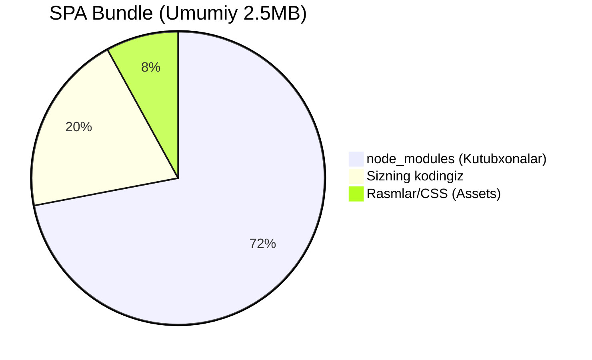

# Bundle Optimization

## Kirish

> [!IMPORTANT]
> **Nima uchun muhim?**  
> Foydalanuvchilar veb-saytingizga kirganda, brauzer JavaScript kodini ko'chirib olishi, o'qishi (parse) va ishga tushirishi kerak bo'ladi. Hatto Code Splitting qilsangiz ham, agar bitta sahifaga `moment.js` (juda og'ir sana kutubxonasi) ni butunlay yuklasangiz sahifa muzlab qolishi mumkin. **Bundle Optimization** kodning hajmini iloji boricha kichiklashtirish, faqat ishlatilgan qismlarnigina qoldirish (Tree shaking) va keraksiz bo'shliqlarni yo'q qilish (Minification) jarayonidir.

> [!NOTE]
> **Real-hayot analogiyasi: "Sayohat Jomadoni (Chemodan)"**  
> - **Optimizatsiyasiz (Yomon):** Siz 3 kunlik sayohatga ketyapsiz, lekin chemodaningizga butun yillik kiyimlaringizni, dazmolni va 10 juft oyoq kiyimni tiqib oldingiz. Uni ko'tarib yurish tugul, o'rnidan jildira olmaysiz. (JS ichida ishlatilmaydigan minglab qator kodlar - Dead Code).
> - **Optimizatsiya qilingan (Yaxshi):** Faqatgina 3 kunga yetadigan va iqlimga mos bo'lgan kiyimlarnigina olasiz. Ularni ham maxsus vakuum paketga solib, havosini so'rib siqasiz (Minification & Compression). Chemodan yengil va olib yurish oson.

## Nazariya

### Bundle Muammolari

Odatiy (optimizatsiya qilinmagan) SPA Bundle tahlili:


Aksariyat muammo loyihaga shunchaki `npm install` orqali qo'shilgan og'ir kutubxonalar (Moment, Lodash, Chart.js) da yashiringan bo'ladi.

### Optimization Texnikalari

```
1. Tree Shaking - ishlatilmagan kodni olib tashlash
2. Minification - kodni siqish
3. Compression - gzip/brotli
4. Code Splitting - bo'lish
5. Dead Code Elimination - o'lik kod
6. Dependency Analysis - paketlarni tahlil
```

## Tree Shaking

### Qanday Ishlaydi?

```javascript
// math.js - ES Module
export function add(a, b) {
  return a + b;
}

export function subtract(a, b) {
  return a - b;
}

export function multiply(a, b) {
  return a * b;
}

export function divide(a, b) {
  return a / b;
}

// app.js - faqat add ishlatiladi
import { add } from './math.js';
console.log(add(2, 3));

// BUILD NATIJASI (tree shaking bilan):
// Faqat add funksiyasi qoladi
// subtract, multiply, divide O'CHIRILADI
```

### Tree Shaking Ishlashi Uchun

```javascript
// TO'G'RI: ES Modules (static)
import { debounce } from 'lodash-es';

// XATO: CommonJS (dynamic, tree shake qilinmaydi)
const { debounce } = require('lodash');

// XATO: barrel export bilan muammo
// utils/index.js
export * from './string';
export * from './array';
export * from './date'; // hammasi import qilinadi!

// TO'G'RI: direct import
import { formatDate } from './utils/date';
```

### Side Effects

```javascript
// package.json
{
  "name": "my-library",
  "sideEffects": false, // Butun package pure
}

// Yoki specific files
{
  "sideEffects": [
    "*.css",
    "*.scss",
    "./src/polyfills.js"
  ]
}
```

```javascript
// vite.config.js
export default {
  build: {
    rollupOptions: {
      treeshake: {
        moduleSideEffects: false,
        propertyReadSideEffects: false
      }
    }
  }
};
```

## Dependency Optimization

### Katta Paketlarni Almashtirish

```javascript
// SEKIN: moment.js (300KB)
import moment from 'moment';
moment().format('YYYY-MM-DD');

// TEZ: date-fns (tree shakable, ~10KB used)
import { format } from 'date-fns';
format(new Date(), 'yyyy-MM-dd');

// Yoki: dayjs (2KB)
import dayjs from 'dayjs';
dayjs().format('YYYY-MM-DD');
```

```javascript
// SEKIN: lodash (70KB full)
import _ from 'lodash';
_.debounce(fn, 300);

// TEZ: lodash-es (tree shakable)
import { debounce } from 'lodash-es';
debounce(fn, 300);

// YOKI: individual packages
import debounce from 'lodash.debounce';
```

### Bundle Size Checking

```bash
# Install
npm install -D bundlesize

# package.json
{
  "bundlesize": [
    {
      "path": "./dist/assets/*.js",
      "maxSize": "150 kB"
    },
    {
      "path": "./dist/assets/*.css",
      "maxSize": "20 kB"
    }
  ],
  "scripts": {
    "check-size": "bundlesize"
  }
}
```

### Import Cost (VS Code)

```javascript
// VS Code extension: Import Cost
// Har import yonida hajm ko'rsatadi

import { debounce } from 'lodash-es'; // 5.4KB
import axios from 'axios'; // 14KB
import Chart from 'chart.js/auto'; // 200KB (!)
```

## Vite Optimization

### Basic Config

```javascript
// vite.config.js
import { defineConfig } from 'vite';
import vue from '@vitejs/plugin-vue';

export default defineConfig({
  plugins: [vue()],

  build: {
    // Target browsers
    target: 'es2020',

    // Minifier
    minify: 'esbuild', // yoki 'terser'

    // CSS code splitting
    cssCodeSplit: true,

    // Source maps (prod'da false)
    sourcemap: false,

    // Chunk size warning
    chunkSizeWarningLimit: 500,

    rollupOptions: {
      output: {
        // Manual chunks
        manualChunks: {
          'vendor-vue': ['vue', 'vue-router', 'pinia'],
          'vendor-ui': ['@headlessui/vue'],
          'vendor-utils': ['date-fns', 'axios']
        }
      }
    }
  },

  // Dependency pre-bundling
  optimizeDeps: {
    include: ['vue', 'vue-router', 'pinia'],
    exclude: ['@vueuse/core'] // ESM, no pre-bundle needed
  }
});
```

### Advanced Chunking

```javascript
// vite.config.js
export default defineConfig({
  build: {
    rollupOptions: {
      output: {
        manualChunks(id) {
          // node_modules splitting
          if (id.includes('node_modules')) {
            // Vue core
            if (id.includes('vue') || id.includes('@vue')) {
              return 'vendor-vue';
            }

            // Charts - lazy load qilinadi
            if (id.includes('chart.js') || id.includes('d3')) {
              return 'vendor-charts';
            }

            // Editor
            if (id.includes('tiptap') || id.includes('prosemirror')) {
              return 'vendor-editor';
            }

            // UI components
            if (id.includes('headlessui') || id.includes('radix')) {
              return 'vendor-ui';
            }

            // Utilities
            if (id.includes('lodash') || id.includes('date-fns')) {
              return 'vendor-utils';
            }

            // Qolganlar
            return 'vendor';
          }

          // App code splitting
          if (id.includes('/pages/admin/')) {
            return 'admin';
          }

          if (id.includes('/pages/dashboard/')) {
            return 'dashboard';
          }
        }
      }
    }
  }
});
```

## CSS Optimization

### Unused CSS Removal

```javascript
// vite.config.js
import { defineConfig } from 'vite';
import { PurgeCSS } from 'purgecss';

export default defineConfig({
  css: {
    postcss: {
      plugins: [
        // PurgeCSS
        {
          postcssPlugin: 'purge',
          Once(root, { result }) {
            // Production only
            if (process.env.NODE_ENV !== 'production') return;

            return new PurgeCSS().purge({
              content: ['./src/**/*.vue', './src/**/*.js'],
              css: [{ raw: root.toString() }],
              safelist: ['html', 'body', /^router-/, /^v-/]
            });
          }
        }
      ]
    }
  }
});
```

### Tailwind CSS Optimization

```javascript
// tailwind.config.js
module.exports = {
  content: [
    './index.html',
    './src/**/*.{vue,js,ts,jsx,tsx}'
  ],
  theme: {
    extend: {}
  },
  // Production build - faqat ishlatilgan classlar
  // Dev - hammasi (HMR uchun)
};

// postcss.config.js
module.exports = {
  plugins: {
    tailwindcss: {},
    autoprefixer: {},
    ...(process.env.NODE_ENV === 'production' ? {
      cssnano: {
        preset: ['default', {
          discardComments: { removeAll: true }
        }]
      }
    } : {})
  }
};
```

## Compression

### Vite Plugin Compression

```javascript
// vite.config.js
import viteCompression from 'vite-plugin-compression';

export default defineConfig({
  plugins: [
    // Gzip
    viteCompression({
      algorithm: 'gzip',
      ext: '.gz'
    }),

    // Brotli (yaxshiroq)
    viteCompression({
      algorithm: 'brotliCompress',
      ext: '.br'
    })
  ]
});
```

### Server Config

```nginx
# nginx.conf
server {
  # Brotli
  brotli on;
  brotli_types text/plain text/css application/json application/javascript;

  # Gzip fallback
  gzip on;
  gzip_types text/plain text/css application/json application/javascript;

  # Pre-compressed files
  location ~* \.(js|css|html|svg)$ {
    gzip_static on;
    brotli_static on;
  }
}
```

## Dead Code Elimination

### Development vs Production

```javascript
// Vite
if (import.meta.env.DEV) {
  console.log('Development only');
  enableDevTools();
}

// Build vaqtida bu blok to'liq O'CHIRILADI

// Production check
if (import.meta.env.PROD) {
  initAnalytics();
  initErrorTracking();
}
```

### Feature Flags

```javascript
// env.d.ts
interface ImportMetaEnv {
  VITE_FEATURE_NEW_DASHBOARD: string;
  VITE_FEATURE_DARK_MODE: string;
}

// .env.production
VITE_FEATURE_NEW_DASHBOARD=true
VITE_FEATURE_DARK_MODE=false

// app.js
if (import.meta.env.VITE_FEATURE_NEW_DASHBOARD === 'true') {
  const Dashboard = await import('./NewDashboard.vue');
}
// false bo'lsa, butun import tree shakeda o'chiriladi
```

## Bundle Analysis

### Rollup Plugin Visualizer

```javascript
// vite.config.js
import { visualizer } from 'rollup-plugin-visualizer';

export default defineConfig({
  plugins: [
    visualizer({
      filename: 'dist/stats.html',
      open: true,
      gzipSize: true,
      brotliSize: true,
      template: 'treemap' // yoki 'sunburst', 'network'
    })
  ]
});
```

### Bundle Analysis Script

```javascript
// scripts/analyze-bundle.js
import { readFileSync, readdirSync, statSync } from 'fs';
import { join } from 'path';

function analyzeBundle(dir) {
  const files = readdirSync(dir);
  const analysis = {
    js: { count: 0, size: 0, files: [] },
    css: { count: 0, size: 0, files: [] },
    other: { count: 0, size: 0, files: [] }
  };

  function processFile(filePath) {
    const stat = statSync(filePath);

    if (stat.isDirectory()) {
      readdirSync(filePath).forEach(f => processFile(join(filePath, f)));
      return;
    }

    const size = stat.size;
    const ext = filePath.split('.').pop();
    const category = ext === 'js' ? 'js' : ext === 'css' ? 'css' : 'other';

    analysis[category].count++;
    analysis[category].size += size;
    analysis[category].files.push({
      path: filePath,
      size,
      sizeKB: (size / 1024).toFixed(2)
    });
  }

  processFile(dir);

  // Sort by size
  Object.keys(analysis).forEach(key => {
    analysis[key].files.sort((a, b) => b.size - a.size);
  });

  return analysis;
}

const result = analyzeBundle('./dist');
console.log(JSON.stringify(result, null, 2));
```

## Real-World Case: Admin Dashboard

### Muammo

```
Bundle Analysis:
- main.js: 1.2MB (gzip: 380KB)
- vendor.js: 800KB (gzip: 250KB)
- Total: 2MB (gzip: 630KB)

Top offenders:
1. moment.js - 300KB
2. lodash - 70KB
3. chart.js - 200KB
4. xlsx - 380KB
5. quill editor - 250KB
```

### Optimization Steps

#### Step 1: Replace Heavy Dependencies

```javascript
// BEFORE
import moment from 'moment';
import _ from 'lodash';

// AFTER
import { format, parseISO } from 'date-fns';
import { debounce, throttle, cloneDeep } from 'lodash-es';
```

#### Step 2: Lazy Load Heavy Features

```javascript
// BEFORE - hammasi import
import Chart from 'chart.js/auto';
import XLSX from 'xlsx';
import Quill from 'quill';

// AFTER - kerak bo'lganda
async function initChart(canvas, data) {
  const { Chart, registerables } = await import('chart.js');
  Chart.register(...registerables);
  return new Chart(canvas, data);
}

async function exportExcel(data) {
  const XLSX = await import('xlsx');
  // ...
}

const Editor = defineAsyncComponent(() =>
  import('./components/QuillEditor.vue')
);
```

#### Step 3: Configure Chunks

```javascript
// vite.config.js
export default defineConfig({
  build: {
    rollupOptions: {
      output: {
        manualChunks: {
          'vue-core': ['vue', 'vue-router', 'pinia'],
          'ui-lib': ['@headlessui/vue', '@heroicons/vue'],
          'utils': ['date-fns', 'axios'],
          // Heavy - lazy loaded
          'charts': ['chart.js'],
          'excel': ['xlsx'],
          'editor': ['quill']
        }
      }
    }
  }
});
```

#### Step 4: Remove Unused

```javascript
// chart.js - faqat kerakli componentlar
// BEFORE
import Chart from 'chart.js/auto'; // 200KB

// AFTER - faqat line va bar chart
import {
  Chart,
  LineController,
  BarController,
  CategoryScale,
  LinearScale,
  PointElement,
  LineElement,
  BarElement,
  Title,
  Tooltip,
  Legend
} from 'chart.js';

Chart.register(
  LineController,
  BarController,
  CategoryScale,
  LinearScale,
  PointElement,
  LineElement,
  BarElement,
  Title,
  Tooltip,
  Legend
);
// 80KB
```

### Natija

```
BEFORE:
- main.js: 1.2MB (gzip: 380KB)
- vendor.js: 800KB (gzip: 250KB)
- Total: 2MB (gzip: 630KB)
- FCP: 4.5s

AFTER:
- main.js: 180KB (gzip: 55KB)
- vue-core.js: 120KB (gzip: 40KB)
- ui-lib.js: 50KB (gzip: 15KB)
- utils.js: 30KB (gzip: 10KB)
Initial Total: 380KB (gzip: 120KB)

Lazy loaded (on demand):
- charts.js: 80KB
- excel.js: 380KB
- editor.js: 150KB

- FCP: 1.2s

Improvement:
- Initial bundle: 80% kichikroq
- FCP: 3.7x tezroq
```

## Performance Budget

```javascript
// bundlewatch.config.js
module.exports = {
  files: [
    {
      path: 'dist/assets/index-*.js',
      maxSize: '100KB'
    },
    {
      path: 'dist/assets/vendor-*.js',
      maxSize: '150KB'
    },
    {
      path: 'dist/assets/*.css',
      maxSize: '30KB'
    }
  ],
  ci: {
    trackBranches: ['main'],
    repoBranchBase: 'main'
  }
};
```

```yaml
# .github/workflows/bundle-check.yml
name: Bundle Size Check

on: [pull_request]

jobs:
  build:
    runs-on: ubuntu-latest
    steps:
      - uses: actions/checkout@v3

      - name: Setup Node
        uses: actions/setup-node@v3

      - name: Install & Build
        run: |
          npm ci
          npm run build

      - name: Check Bundle Size
        uses: siddharthkp/bundlewatch@v0.3.3
        env:
          BUNDLEWATCH_GITHUB_TOKEN: ${{ secrets.GITHUB_TOKEN }}
```

## Interview Savollari

### 1. Tree shaking qanday ishlaydi va nima uchun CommonJS bilan ishlamaydi?

**Javob:**
```javascript
// ES Modules - STATIC analysis mumkin
// Build vaqtida qaysi export ishlatilganini aniq bilish mumkin
import { add } from './math';
// add - aniq, boshqalari o'chiriladi

// CommonJS - DYNAMIC
// Runtime'da qaysi property ishlatilganini bilish mumkin emas
const math = require('./math');
const fn = condition ? 'add' : 'subtract';
math[fn](); // Qaysi? Build vaqtida noma'lum!

// Shuning uchun:
// - ES Modules: tree shaking ✓
// - CommonJS: tree shaking ✗

// lodash vs lodash-es
import _ from 'lodash';     // CommonJS, 70KB
import { debounce } from 'lodash-es'; // ESM, 5KB
```

### 2. Gzip va Brotli farqi?

**Javob:**
```
Gzip:
- 1992 dan beri
- 100% browser support
- Tez compress/decompress
- O'rtacha siqish

Brotli:
- Google (2015)
- 95%+ browser support
- Sekinroq compress (build vaqtida OK)
- 15-25% yaxshiroq siqish
- HTTPS required

Strategiya:
1. Build vaqtida ikkalasini yaratish
   - file.js.gz
   - file.js.br

2. Server config:
   Accept-Encoding: br, gzip
   → Brotli yuborish

   Accept-Encoding: gzip
   → Gzip yuborish

3. Hajm misol:
   Original: 500KB
   Gzip: 150KB (-70%)
   Brotli: 120KB (-76%)
```

### 3. Side effects nima va package.json da qanday belgilanadi?

**Javob:**
```javascript
// Side effect = import qilinganda global state o'zgaradi

// PURE (side effect yo'q)
export function add(a, b) {
  return a + b;
}

// SIDE EFFECT
import './polyfills'; // Global o'zgartiradi
import './styles.css'; // DOM'ga qo'shiladi
console.log('Module loaded'); // Top-level code

// package.json
{
  // Hamma pure - tree shake mumkin
  "sideEffects": false,

  // Faqat ba'zilari side effect
  "sideEffects": [
    "*.css",
    "*.scss",
    "./src/polyfills.js",
    "./src/register-components.js"
  ]
}

// Webpack/Vite sideEffects: false bo'lsa
// ishlatilmagan modullarni to'liq o'chiradi
```

### 4. manualChunks vs automatik splitChunks qachon?

**Javob:**
```javascript
// Automatik (default) - SIMPLE apps
// Webpack/Rollup o'zi hal qiladi
optimization: {
  splitChunks: {
    chunks: 'all'
  }
}

// manualChunks KERAK:
// 1. Versioned vendor (long cache)
manualChunks: {
  'vendor-vue-3.4.21': ['vue', 'vue-router']
  // Version o'zgarguncha cache hit
}

// 2. Heavy libraries isolation
manualChunks: {
  'charts': ['chart.js'], // Faqat analytics sahifada
  'pdf': ['pdfjs']        // Faqat export qilganda
}

// 3. Route-based
manualChunks(id) {
  if (id.includes('/admin/')) return 'admin';
  if (id.includes('/dashboard/')) return 'dashboard';
}

// 4. Shared dependencies
manualChunks: {
  'shared': ['axios', 'date-fns'] // Ko'p joyda ishlatiladi
}
```

### 5. Bundle size qanday monitoring qilinadi CI/CD da?

**Javob:**
```yaml
# GitHub Actions
name: Bundle Size

on: pull_request

jobs:
  size:
    runs-on: ubuntu-latest
    steps:
      - uses: actions/checkout@v3

      - name: Build
        run: npm ci && npm run build

      # Option 1: bundlewatch
      - uses: siddharthkp/bundlewatch@v0.3.3
        with:
          files: |
            {
              "files": [
                { "path": "dist/*.js", "maxSize": "150KB" }
              ]
            }

      # Option 2: size-limit
      - uses: andresz1/size-limit-action@v1
        with:
          github_token: ${{ secrets.GITHUB_TOKEN }}

      # Option 3: Manual comparison
      - name: Compare sizes
        run: |
          CURRENT=$(du -sb dist | cut -f1)
          THRESHOLD=500000 # 500KB
          if [ $CURRENT -gt $THRESHOLD ]; then
            echo "Bundle too large: $CURRENT bytes"
            exit 1
          fi
```

## Eng Yaxshi Amaliyotlar (Best Practices)

1. **Faol tekshiruv (Bundle Analyzer):** Har gal kodni productionga chiqarishdan oldin `vite-plugin-bundle-visualizer` (Vite) yoki `webpack-bundle-analyzer` (Webpack/Nuxt) orqali kodingizdagi eng og'ir nuqtalarni ko'rib chiqing. Nima bunchalik og'ir ekanini tahlil qiling.
2. **Import Cost ishlatish:** VSCode da *Import Cost* degan maxsus kengaytma (extension) ni o'rnating. U har bir import qilayotgan kutubxonangiz hajmini yozayotgan paytingizdayoq yonida qizil yoki yashil rangda ko'rsatib turadi. Bu og'ir paketlarni vaqtida aniqlashga yordam beradi.
3. **Kutubxonalarning "Yengil" alternativini topish:** Masalan, `moment.js` o'rniga `dayjs` yoki `date-fns` (har bir funksiya alohida import qilinadi), `lodash` o'rniga esa `lodash-es` ishlating (Tree shaking yaxshi ishlashi uchun doim ES modullarni tanlang).

---

## Xulosa

Bundle optimization strategiyasi:

1. **Analyze** - visualizer bilan tahlil
2. **Replace** - og'ir paketlarni yengillari bilan
3. **Split** - mantiqiy chunklarga bo'lish
4. **Lazy** - og'ir featurelarni kerak paytda
5. **Compress** - gzip/brotli
6. **Monitor** - CI/CD da size check

| Target Bundle Hajmlari (gzip qilingan holatda) | Maksimal Hajm |
| --- | --- |
| **Boshlang'ich JS (Initial JS)** | < 150KB |
| **Boshlang'ich CSS (Initial CSS)**| < 30KB |
| **Har bir sahifa (Route chunk)** | < 50KB |
| **Umumiy dastlabki yuklanish (Total initial)**| < 200KB |
