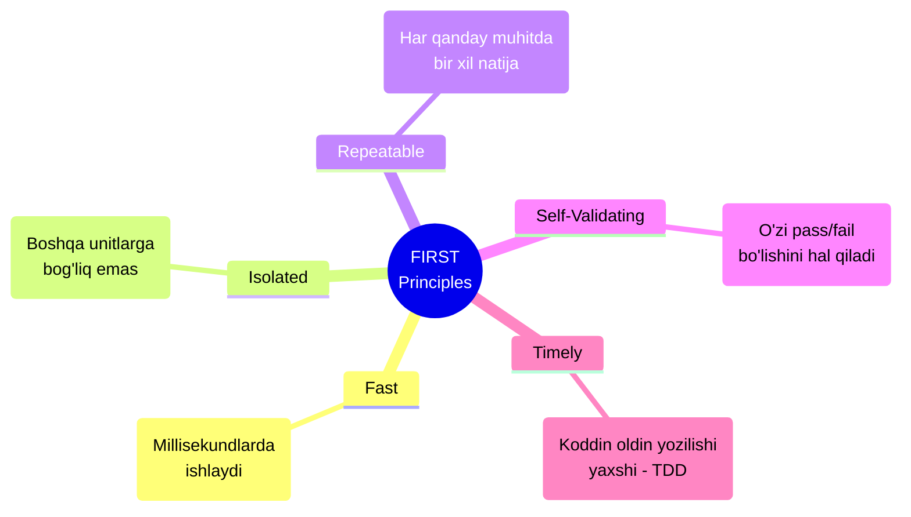

# Unit Testing

## Kirish

> [!IMPORTANT]
> **Nima uchun muhim?**  
> Unit testlar sizning kodingiz uchun "sug'urta" vazifasini o'taydi. Loyiha kattalashgan sari, kiritilgan kichik o'zgarish boshqa joyni buzib qo'yishi ehtimoli ortadi. Unit testlar bunday xatolarni mijozlarga yetib bormasidan oldin ushlab qoladi va kodni qo'rqmasdan refactoring (tozalash) qilish imkonini beradi.

> [!NOTE]
> **Real-hayot analogiyasi: "Mashina ehtiyot qismlari"**  
> Mashina yig'ish zavodini tasavvur qiling. Zavodda minglab qismlar yig'iladi. Agar rulni yoki tormoz tizimini alohida (izolyatsiyada) tekshirmasdan to'g'ridan-to'g'ri mashinaga o'rnatsak va mashina yurmasa, xato qayerda ekanligini topish juda qiyin bo'ladi.
> **Unit Test** — bu tormoz tizimini mashinaga ulashdan oldin uni maxsus stendga qo'yib, bosimi va ishlashini alohida tekshirishdir. Agar tormoz o'z-o'zidan to'g'ri ishlasa, demak nosozlik uni qanday ulangani bilan (Integration) bog'liq degan xulosaga kelinadi.

Unit test - bu kodning eng kichik mustaqil qismini (unit) izolyatsiya qilingan holda tekshirish. Unit odatda bitta funksiya, method yoki class bo'lishi mumkin.

---

## 🟢 Junior (Asoslar va Tushunchalar)

Junior dasturchi Unit Test ning qanday yozilishini (AAA pattern) va toza funksiyalarni (Pure functions) qanday sinash kerakligini biladi.

### FIRST tamoyillari
Yaxshi Unit Test quyidagi qoidalarga bo'ysunishi shart:



### AAA (Arrange-Act-Assert) Pattern

Eng ideal test yozish usuli uni 3 ta mantiqiy qismga bo'lishdir. Masalan `sum` funksiyamizni test qilamiz:

```javascript
import { test, expect } from 'vitest';
import { sum } from './math.js';

test('sum ikkita sonni to\'g\'ri qo\'shadi', () => {
  // 1. Arrange (Tayyorgarlik ko'rish)
  const a = 2;
  const b = 3;

  // 2. Act (Amalni bajarish)
  const result = sum(a, b);

  // 3. Assert (Natijani tekshirish)
  expect(result).toBe(5);
});
```

---

## 🟡 Middle (Amaliyot va Detallar)

Middle dasturchi tashqi servislarga (Backend, Database) bog'liq bo'lgan funksiyalarni sinash uchun **Test Doubles (Mock, Stub, Spy)** lardan qanday foydalanishni biladi. Chunki Unit Test da real ma'lumotlar bazasiga yoki internetga so'rov yuborilmaydi.

### Stub - "Yolg'onchi obyekt"
Agar bizning funksiyamiz ichida DB (database) ga so'rov ketayotgan bo'lsa, test paytida DB ga ulanib kutib turish xato. Shuning uchun "yolg'onchi" obyekt (Stub) yasab beramiz.

```javascript
// Real implementation'da DB dan qidirilardi:
// const user = await db.query('SELECT * FROM users WHERE id = ?', [id])

// Test uchun STUB (oldindan belgilangan javob):
const userRepositoryStub = {
  findById: async (id) => ({
    id,
    name: 'Test User',
    email: 'test@example.com'
  })
};

test('UserService STUB orqali ishlayapti', async () => {
  const userService = new UserService(userRepositoryStub);
  const user = await userService.getUser(1); // Real DB emas, tepadagi obyekt qaytadi

  expect(user.name).toBe('Test User');
});
```

### Mock va Spy - "Ayg'oqchilar"
Biron bir qadam ishladimi yoki yo'qmi bilish uchun (masalan, funksiya email yuborish buyrug'ini chaqirdimi?) `Mock` yoki `Spy` ishlatamiz. Ular funksiya haqida hisobot to'playdi.

```javascript
import { vi, test, expect } from 'vitest';

test('welcome email yuborilishini tekshirish', async () => {
  // Mock - soxta funksiya yasash
  const mockEmailService = {
    send: vi.fn().mockResolvedValue({ success: true }) // success javob beradi deymiz
  };
  
  const notificationService = new NotificationService(mockEmailService);
  await notificationService.sendWelcomeEmail('user@test.com');

  // Ayg'oqchidan hisobot so'raymiz:
  // 1. Funksiya chaqirildimi?
  expect(mockEmailService.send).toHaveBeenCalledTimes(1);
  // 2. Qanday ma'lumot (parametr) bilan chaqirildi?
  expect(mockEmailService.send).toHaveBeenCalledWith({
    to: 'user@test.com',
    subject: 'Xush kelibsiz!'
  });
});
```

---

## 🔴 Senior (Arxitektura va Optimizatsiya)

Senior dasturchi testlarning **Coverage** (Qamrovi) ga e'tibor beradi. Asinxron qismlarni, Timerlarni (setTimeout) boshqarishni biladi, hamda Flaky (Ba'zan o'tib, ba'zan yiqiladigan) testlarni aniqlab tuzatadi.

### Fake Timers (Vaqtni boshqarish)
Agar bizda `debounce` kabi 1 sekunddan keyin ishlaydigan mantiq bo'lsa, Test uni 1 sekund kutib turmaydi (Chunki Unit Test 1 millisekundda ishlashi shart). Buning o'rniga "Soxta vaqt mashinasi" dan foydalaniladi.

```javascript
import { vi, describe, test, expect, beforeEach, afterEach } from 'vitest';

describe('Debounce function', () => {
  beforeEach(() => {
    vi.useFakeTimers(); // Vaqt mashinasini yoqamiz
  });

  afterEach(() => {
    vi.useRealTimers(); // Oddiy vaqtga qaytamiz
  });

  test('debounce 1 sekunddan so\'ng chaqiriladi', () => {
    const callback = vi.fn();
    const debouncedFn = debounce(callback, 1000);

    debouncedFn(); // chaqiramiz
    expect(callback).not.toHaveBeenCalled(); // Hali ishlagani yo'q

    vi.advanceTimersByTime(1000); // Sehr! Vaqtni tezlatib 1 sekund oldinga o'tkazdik

    expect(callback).toHaveBeenCalledTimes(1); // Ana endi ishladi
  });
});
```

### Test Coverage (Test qamrovi)
Loyiha menejeri sizga "Kodimiz qanchalik test bilan qoplangan?" deb savol berganda javobni aynan Coverage orqali berasiz.
U 4 turga bo'linadi:
1. **Line Coverage**: Kodning jami necha qatori test jarayonida bajarib ko'rildi?
2. **Branch Coverage**: `if/else` shartlarining ikkala tarafi ham testga kirdimi? (Eng muhimi!)
3. **Function Coverage**: Fayldagi nechta funksiya test chaqiruvi oldi?
4. **Statement Coverage**: Nechta ifodalar ishladi.

Buyruq: `npx vitest --coverage` 
Standart bo'yicha *Lines* va *Branches* 80% dan oshishi - yaxshi sifat belgisi hisoblanadi.

### Intervyu Savoli
**"Mock va Stub o'rtasidagi farq nimada?"**
*Javob:*
- **Stub (O'rinbosar)**: Oddiygina soxta javob (Object yoki qiymat) qaytaruvchi ma'lumot. Uning bitta maqsadi bor: dastur "sinib" qolmasligi uchun (masalan DB ulanmasligi) so'ralgan ma'lumotni darhol berib yuborish. "Agar X so'ralsa, Y qaytar".
- **Mock (Ayg'oqchi)**: Bu ancha aqlliroq vosita. U chaqiruvlarni o'z xotirasiga yozib oladi. Siz Mock orqali "Shu funksiya o'zi necha marta chaqirildi? Qanday parametrlar bilan chaqirildi?" degan savollarga aniq javob olishingiz mumkin. Yana bitta tur bo'lmish **Spy** esa Mock ga o'xshaydi, lekin u obyektni soxtalashtirmaydi, asl funksiyani saqlab qolgan holda uni faqatgina pinhona kuzatadi.

---

## Eng Yaxshi Amaliyotlar (Best Practices)

1. **AAA Patterniga qat'iy rioya qiling:** Arrange (Tayyorlash), Act (Bajarish), Assert (Tekshirish) bosqichlarini har bir testda alohida ajratib yozing.
2. **Bitta Test - Bitta Mantiq:** Bitta test ichida faqat bitta ssenariyni tekshiring. Bitta `test()` ichida 20 xil narsani birdan tekshirish ertaga qayerda xato chiqqanini topishni qiyinlashtiradi.
3. **Flaky Testlardan qoching:** Ba'zan yashil (pass), ba'zan qizil (fail) bo'ladigan testlarga Flaky test deyiladi. Bunga asosan tasodifiy sonlarga (`Math.random`) va joriy vaqtga (`Date.now`) bog'liq testlar sabab bo'ladi. Ularni doim Mock yoki Fake Timer orqali mustahkamlang.
4. **Izolyatsiya muhim:** Testlar bir-biriga mutlaqo bog'liq bo'lmasligi kerak. 1-test ishlagandan keyin o'zgartirilgan o'zgaruvchilar 2-testga xalaqit bermasligi uchun ularni `beforeEach` da tozalab turing.

---

## Xulosa

Unit testing - bu sifatli va uyqusi tinch dasturchi bo'lishning asosiy kalitidir. 

| Tushuncha | Ta'rifi | Qachon ishlatiladi? |
| --- | --- | --- |
| **Pure Function** | Tashqi muhitga ta'sir qilmaydigan funksiya | Asosiy biznes logikada (oson test qilish uchun) |
| **Stub** | Soxta o'rinbosar qaytaruvchi qiymat | Tashqi servis / DB ulanishlari o'rniga |
| **Mock / Spy** | Funksiyani kuzatuvchi ayg'oqchi | Funksiya necha marta ishlatilganligini sanash kerak bo'lganda |
| **Fake Timers** | Vaqtni qisqartiruvchi muhit | setTimeout/setInterval test qilinayotganda |
| **Coverage** | Test qamrovi foizi | Loyihaning mustahkamligini baholash uchun |
