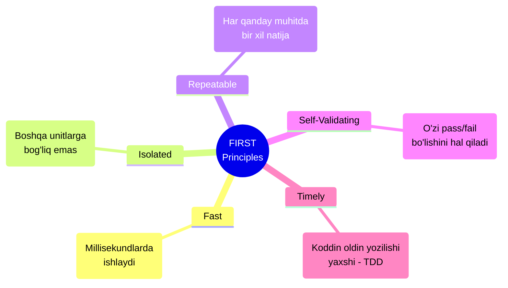

# Unit Testing

Unit testing - bu dasturiy ta'minotni test qilishning eng asosiy va muhim qatlami. Bu bo'limda unit testlarning nazariyasi, amaliyoti va real-world qo'llanilishini chuqur o'rganamiz.

## Unit Test Nima?

> [!IMPORTANT]
> **Nima uchun muhim?**  
> Unit testlar sizning kodingiz uchun "sug'urta" vazifasini o'taydi. Loyiha kattalashgan sari, kiritilgan kichik o'zgarish boshqa joyni buzib qo'yishi ehtimoli ortadi. Unit testlar bunday xatolarni mijozlarga yetib bormasidan oldin ushlab qoladi va kodni qo'rqmasdan refactoring qilish imkonini beradi.

> [!NOTE]
> **Real-hayot analogiyasi: "Mashina ehtiyot qismlari"**  
> Mashina yig'ish zavodini tasavvur qiling. Zavodda minglab qismlar yig'iladi. Agar rulni yoki tormoz tizimini alohida (izolyatsiyada) tekshirmasdan to'g'ridan-to'g'ri mashinaga o'rnatsak va mashina yurmasa, xato qayerda ekanligini topish juda qiyin bo'ladi.
> **Unit Test** — bu tormoz tizimini mashinaga ulashdan oldin uni maxsus stendga qo'yib, bosimi va ishlashini alohida tekshirishdir.

Unit test - bu kodning eng kichik mustaqil qismini (unit) izolyatsiya qilingan holda test qilish. Unit odatda bitta funksiya, method yoki class bo'lishi mumkin.

### Unit Test Xususiyatlari (FIRST)



```javascript
// Ideal unit test
test('sum ikkita sonni qo\'shadi', () => {
  // Arrange
  const a = 2
  const b = 3

  // Act
  const result = sum(a, b)

  // Assert
  expect(result).toBe(5)
})
```

## Pure Functions - Ideal Unit Test Candidates

Pure function - bu bir xil input uchun har doim bir xil output qaytaradigan va side effect'lari bo'lmagan funksiya.

```javascript
// Pure function - test qilish oson
function calculateDiscount(price, discountPercent) {
  if (discountPercent < 0 || discountPercent > 100) {
    throw new Error('Discount must be between 0 and 100')
  }
  return price - (price * discountPercent / 100)
}

// Tests
describe('calculateDiscount', () => {
  test('10% chegirma to\'g\'ri hisoblanadi', () => {
    expect(calculateDiscount(100, 10)).toBe(90)
  })

  test('0% chegirma narxni o\'zgartirmaydi', () => {
    expect(calculateDiscount(100, 0)).toBe(100)
  })

  test('100% chegirma 0 qaytaradi', () => {
    expect(calculateDiscount(100, 100)).toBe(0)
  })

  test('manfiy foiz xato beradi', () => {
    expect(() => calculateDiscount(100, -10)).toThrow('Discount must be between 0 and 100')
  })

  test('100% dan katta foiz xato beradi', () => {
    expect(() => calculateDiscount(100, 150)).toThrow()
  })
})
```

## Test Doubles: Mock, Stub, Spy, Fake

Dependency'larni izolyatsiya qilish uchun test double'lar ishlatiladi.

### Stub - Oldindan Belgilangan Qiymatlar

```javascript
// Real implementation
class UserRepository {
  async findById(id) {
    // Database query
    return await db.query('SELECT * FROM users WHERE id = ?', [id])
  }
}

// Stub
const userRepositoryStub = {
  findById: async (id) => ({
    id,
    name: 'Test User',
    email: 'test@example.com'
  })
}

// Test
test('UserService getUser stub bilan', async () => {
  const userService = new UserService(userRepositoryStub)
  const user = await userService.getUser(1)

  expect(user.name).toBe('Test User')
})
```

### Mock - Chaqiruvlarni Tekshirish

```javascript
import { vi, describe, test, expect, beforeEach } from 'vitest'

describe('NotificationService', () => {
  let emailService
  let notificationService

  beforeEach(() => {
    // Mock yaratish
    emailService = {
      send: vi.fn().mockResolvedValue({ success: true })
    }
    notificationService = new NotificationService(emailService)
  })

  test('welcome email to\'g\'ri parametrlar bilan yuboriladi', async () => {
    const user = { email: 'user@example.com', name: 'John' }

    await notificationService.sendWelcomeEmail(user)

    // Mock chaqirilganini tekshirish
    expect(emailService.send).toHaveBeenCalledTimes(1)
    expect(emailService.send).toHaveBeenCalledWith({
      to: 'user@example.com',
      subject: 'Xush kelibsiz, John!',
      template: 'welcome',
      data: { name: 'John' }
    })
  })

  test('email yuborishda xato bo\'lsa exception otiladi', async () => {
    emailService.send.mockRejectedValue(new Error('SMTP Error'))

    await expect(
      notificationService.sendWelcomeEmail({ email: 'test@test.com', name: 'Test' })
    ).rejects.toThrow('SMTP Error')
  })
})
```

### Spy - Real Funksiyani Kuzatish

```javascript
import { vi, describe, test, expect, afterEach } from 'vitest'

describe('Logger spy bilan', () => {
  afterEach(() => {
    vi.restoreAllMocks()
  })

  test('console.log chaqirilganini tekshirish', () => {
    const consoleSpy = vi.spyOn(console, 'log')

    const logger = new Logger()
    logger.info('Test message')

    expect(consoleSpy).toHaveBeenCalledWith('[INFO]', 'Test message')
  })

  test('Date.now() ni spy qilish', () => {
    const dateSpy = vi.spyOn(Date, 'now').mockReturnValue(1000)

    const timestamp = getTimestamp()

    expect(timestamp).toBe(1000)
    expect(dateSpy).toHaveBeenCalled()
  })
})
```

### Fake - Ishlaydig'an Alternative Implementation

```javascript
// Fake in-memory repository
class FakeUserRepository {
  constructor() {
    this.users = new Map()
    this.nextId = 1
  }

  async save(userData) {
    const user = { ...userData, id: this.nextId++ }
    this.users.set(user.id, user)
    return user
  }

  async findById(id) {
    return this.users.get(id) || null
  }

  async findByEmail(email) {
    return Array.from(this.users.values())
      .find(user => user.email === email) || null
  }

  async delete(id) {
    return this.users.delete(id)
  }

  // Test helper methods
  clear() {
    this.users.clear()
    this.nextId = 1
  }
}

// Tests
describe('UserService with Fake Repository', () => {
  let userRepository
  let userService

  beforeEach(() => {
    userRepository = new FakeUserRepository()
    userService = new UserService(userRepository)
  })

  test('yangi user yaratish', async () => {
    const user = await userService.createUser({
      name: 'John',
      email: 'john@example.com'
    })

    expect(user.id).toBe(1)
    expect(user.name).toBe('John')

    // Verify in fake repository
    const savedUser = await userRepository.findById(user.id)
    expect(savedUser).toEqual(user)
  })

  test('duplicate email xato beradi', async () => {
    await userService.createUser({
      name: 'John',
      email: 'john@example.com'
    })

    await expect(
      userService.createUser({
        name: 'Jane',
        email: 'john@example.com'
      })
    ).rejects.toThrow('Email already exists')
  })
})
```

## Async Code Testing

### Promises

```javascript
describe('Async operations', () => {
  // async/await - recommended
  test('fetchUser user qaytaradi', async () => {
    const user = await fetchUser(1)
    expect(user.name).toBe('John')
  })

  // resolves/rejects matchers
  test('fetchUser promise resolves', () => {
    return expect(fetchUser(1)).resolves.toHaveProperty('name', 'John')
  })

  test('fetchUser notfound uchun rejects', () => {
    return expect(fetchUser(999)).rejects.toThrow('User not found')
  })
})
```

### Timers

```javascript
import { vi, describe, test, expect, beforeEach, afterEach } from 'vitest'

describe('Debounce function', () => {
  beforeEach(() => {
    vi.useFakeTimers()
  })

  afterEach(() => {
    vi.useRealTimers()
  })

  test('debounce delay tugaguncha chaqirmaydi', () => {
    const callback = vi.fn()
    const debouncedFn = debounce(callback, 1000)

    debouncedFn()
    debouncedFn()
    debouncedFn()

    expect(callback).not.toHaveBeenCalled()

    vi.advanceTimersByTime(1000)

    expect(callback).toHaveBeenCalledTimes(1)
  })

  test('har safar chaqirganda timer reset bo\'ladi', () => {
    const callback = vi.fn()
    const debouncedFn = debounce(callback, 1000)

    debouncedFn()
    vi.advanceTimersByTime(500)

    debouncedFn()
    vi.advanceTimersByTime(500)

    expect(callback).not.toHaveBeenCalled()

    vi.advanceTimersByTime(500)
    expect(callback).toHaveBeenCalledTimes(1)
  })
})
```

### Event Emitters

```javascript
describe('EventEmitter', () => {
  test('event listener chaqiriladi', () => {
    const emitter = new EventEmitter()
    const handler = vi.fn()

    emitter.on('data', handler)
    emitter.emit('data', { value: 42 })

    expect(handler).toHaveBeenCalledWith({ value: 42 })
  })

  test('bir marta chaqiriladigan listener', () => {
    const emitter = new EventEmitter()
    const handler = vi.fn()

    emitter.once('event', handler)
    emitter.emit('event')
    emitter.emit('event')

    expect(handler).toHaveBeenCalledTimes(1)
  })
})
```

## Error Handling Tests

```javascript
describe('Error handling', () => {
  // Synchronous errors
  test('invalid input error otadi', () => {
    expect(() => validateEmail('')).toThrow()
    expect(() => validateEmail('')).toThrow('Email is required')
    expect(() => validateEmail('')).toThrow(ValidationError)
  })

  // Async errors
  test('async function error otadi', async () => {
    await expect(fetchUser(-1)).rejects.toThrow('Invalid user ID')
  })

  // Error properties
  test('custom error properties', () => {
    try {
      validateEmail('invalid')
    } catch (error) {
      expect(error).toBeInstanceOf(ValidationError)
      expect(error.field).toBe('email')
      expect(error.code).toBe('INVALID_FORMAT')
    }
  })

  // Error not thrown
  test('valid input error otmaydi', () => {
    expect(() => validateEmail('test@example.com')).not.toThrow()
  })
})
```

## Test Organization Patterns

### Describe Blocks

```javascript
describe('ShoppingCart', () => {
  let cart

  beforeEach(() => {
    cart = new ShoppingCart()
  })

  describe('addItem', () => {
    test('yangi item qo\'shadi', () => {
      cart.addItem({ id: 1, name: 'Product', price: 100 })
      expect(cart.items).toHaveLength(1)
    })

    test('mavjud item quantity ni oshiradi', () => {
      cart.addItem({ id: 1, name: 'Product', price: 100 })
      cart.addItem({ id: 1, name: 'Product', price: 100 })
      expect(cart.items).toHaveLength(1)
      expect(cart.items[0].quantity).toBe(2)
    })
  })

  describe('removeItem', () => {
    test('mavjud itemni o\'chiradi', () => {
      cart.addItem({ id: 1, name: 'Product', price: 100 })
      cart.removeItem(1)
      expect(cart.items).toHaveLength(0)
    })

    test('mavjud bo\'lmagan item uchun xato beradi', () => {
      expect(() => cart.removeItem(999)).toThrow('Item not found')
    })
  })

  describe('total', () => {
    test('bo\'sh cart uchun 0 qaytaradi', () => {
      expect(cart.total).toBe(0)
    })

    test('barcha itemlar summasini qaytaradi', () => {
      cart.addItem({ id: 1, name: 'A', price: 100 }, 2)
      cart.addItem({ id: 2, name: 'B', price: 50 }, 3)
      expect(cart.total).toBe(350)
    })
  })
})
```

### Test Data Builders

```javascript
// Builder pattern for test data
class UserBuilder {
  constructor() {
    this.user = {
      id: 1,
      name: 'Default User',
      email: 'default@example.com',
      role: 'user',
      isActive: true,
      createdAt: new Date('2024-01-01')
    }
  }

  withId(id) {
    this.user.id = id
    return this
  }

  withName(name) {
    this.user.name = name
    return this
  }

  withEmail(email) {
    this.user.email = email
    return this
  }

  withRole(role) {
    this.user.role = role
    return this
  }

  inactive() {
    this.user.isActive = false
    return this
  }

  admin() {
    this.user.role = 'admin'
    return this
  }

  build() {
    return { ...this.user }
  }
}

// Factory function
function createUser(overrides = {}) {
  return {
    id: 1,
    name: 'Test User',
    email: 'test@example.com',
    ...overrides
  }
}

// Tests
describe('UserService with builders', () => {
  test('admin user permissions', () => {
    const adminUser = new UserBuilder()
      .withId(1)
      .withName('Admin')
      .admin()
      .build()

    expect(hasAdminAccess(adminUser)).toBe(true)
  })

  test('inactive user cannot login', () => {
    const inactiveUser = new UserBuilder()
      .inactive()
      .build()

    expect(canLogin(inactiveUser)).toBe(false)
  })

  test('factory function bilan', () => {
    const user = createUser({ role: 'moderator' })
    expect(user.role).toBe('moderator')
  })
})
```

## Parameterized Tests

```javascript
describe.each([
  { input: 'test@example.com', expected: true },
  { input: 'user.name@domain.org', expected: true },
  { input: 'invalid', expected: false },
  { input: '@nodomain.com', expected: false },
  { input: 'noat.com', expected: false },
  { input: '', expected: false },
])('validateEmail($input)', ({ input, expected }) => {
  test(`returns ${expected}`, () => {
    expect(validateEmail(input)).toBe(expected)
  })
})

// Alternative syntax
test.each([
  [1, 1, 2],
  [1, 2, 3],
  [2, 2, 4],
  [-1, 1, 0],
  [0, 0, 0],
])('sum(%i, %i) = %i', (a, b, expected) => {
  expect(sum(a, b)).toBe(expected)
})

// Object array with descriptive names
test.each([
  { name: 'positive numbers', a: 2, b: 3, expected: 5 },
  { name: 'negative numbers', a: -2, b: -3, expected: -5 },
  { name: 'mixed numbers', a: -2, b: 3, expected: 1 },
  { name: 'with zero', a: 5, b: 0, expected: 5 },
])('sum: $name', ({ a, b, expected }) => {
  expect(sum(a, b)).toBe(expected)
})
```

## Real-World Misol: Order Processing

```javascript
// order-service.js
class OrderService {
  constructor(
    productRepository,
    inventoryService,
    paymentService,
    notificationService
  ) {
    this.productRepository = productRepository
    this.inventoryService = inventoryService
    this.paymentService = paymentService
    this.notificationService = notificationService
  }

  async createOrder(userId, items, paymentMethod) {
    // 1. Validate items
    const validatedItems = await this.validateItems(items)

    // 2. Calculate total
    const total = this.calculateTotal(validatedItems)

    // 3. Check inventory
    await this.checkInventory(validatedItems)

    // 4. Process payment
    const payment = await this.paymentService.charge(paymentMethod, total)

    // 5. Reserve inventory
    await this.inventoryService.reserve(validatedItems)

    // 6. Create order
    const order = {
      id: generateOrderId(),
      userId,
      items: validatedItems,
      total,
      paymentId: payment.id,
      status: 'confirmed',
      createdAt: new Date()
    }

    // 7. Send confirmation
    await this.notificationService.sendOrderConfirmation(userId, order)

    return order
  }

  async validateItems(items) {
    const validatedItems = []

    for (const item of items) {
      const product = await this.productRepository.findById(item.productId)

      if (!product) {
        throw new Error(`Product ${item.productId} not found`)
      }

      if (item.quantity <= 0) {
        throw new Error('Quantity must be positive')
      }

      validatedItems.push({
        productId: product.id,
        name: product.name,
        price: product.price,
        quantity: item.quantity
      })
    }

    return validatedItems
  }

  calculateTotal(items) {
    return items.reduce((sum, item) => sum + item.price * item.quantity, 0)
  }

  async checkInventory(items) {
    for (const item of items) {
      const available = await this.inventoryService.checkAvailability(
        item.productId,
        item.quantity
      )

      if (!available) {
        throw new Error(`Insufficient inventory for ${item.name}`)
      }
    }
  }
}

// order-service.test.js
import { vi, describe, test, expect, beforeEach } from 'vitest'

describe('OrderService', () => {
  let orderService
  let productRepository
  let inventoryService
  let paymentService
  let notificationService

  beforeEach(() => {
    // Setup mocks
    productRepository = {
      findById: vi.fn()
    }

    inventoryService = {
      checkAvailability: vi.fn().mockResolvedValue(true),
      reserve: vi.fn().mockResolvedValue(true)
    }

    paymentService = {
      charge: vi.fn().mockResolvedValue({ id: 'pay_123', status: 'success' })
    }

    notificationService = {
      sendOrderConfirmation: vi.fn().mockResolvedValue(true)
    }

    orderService = new OrderService(
      productRepository,
      inventoryService,
      paymentService,
      notificationService
    )
  })

  describe('createOrder', () => {
    test('muvaffaqiyatli order yaratadi', async () => {
      // Arrange
      productRepository.findById.mockResolvedValue({
        id: 1,
        name: 'Test Product',
        price: 100
      })

      const items = [{ productId: 1, quantity: 2 }]
      const paymentMethod = { type: 'card', token: 'tok_123' }

      // Act
      const order = await orderService.createOrder('user_1', items, paymentMethod)

      // Assert
      expect(order.status).toBe('confirmed')
      expect(order.total).toBe(200)
      expect(order.items).toHaveLength(1)

      expect(paymentService.charge).toHaveBeenCalledWith(paymentMethod, 200)
      expect(inventoryService.reserve).toHaveBeenCalled()
      expect(notificationService.sendOrderConfirmation).toHaveBeenCalled()
    })

    test('mavjud bo\'lmagan product uchun xato', async () => {
      productRepository.findById.mockResolvedValue(null)

      const items = [{ productId: 999, quantity: 1 }]

      await expect(
        orderService.createOrder('user_1', items, {})
      ).rejects.toThrow('Product 999 not found')

      expect(paymentService.charge).not.toHaveBeenCalled()
    })

    test('inventory yetarli bo\'lmasa xato', async () => {
      productRepository.findById.mockResolvedValue({
        id: 1,
        name: 'Test Product',
        price: 100
      })
      inventoryService.checkAvailability.mockResolvedValue(false)

      const items = [{ productId: 1, quantity: 100 }]

      await expect(
        orderService.createOrder('user_1', items, {})
      ).rejects.toThrow('Insufficient inventory')

      expect(paymentService.charge).not.toHaveBeenCalled()
      expect(inventoryService.reserve).not.toHaveBeenCalled()
    })

    test('payment xatosida order yaratilmaydi', async () => {
      productRepository.findById.mockResolvedValue({
        id: 1,
        name: 'Test Product',
        price: 100
      })
      paymentService.charge.mockRejectedValue(new Error('Card declined'))

      const items = [{ productId: 1, quantity: 1 }]

      await expect(
        orderService.createOrder('user_1', items, {})
      ).rejects.toThrow('Card declined')

      expect(inventoryService.reserve).not.toHaveBeenCalled()
      expect(notificationService.sendOrderConfirmation).not.toHaveBeenCalled()
    })
  })

  describe('calculateTotal', () => {
    test('bir item uchun to\'g\'ri hisoblaydi', () => {
      const items = [{ price: 100, quantity: 2 }]
      expect(orderService.calculateTotal(items)).toBe(200)
    })

    test('bir nechta item uchun to\'g\'ri hisoblaydi', () => {
      const items = [
        { price: 100, quantity: 2 },
        { price: 50, quantity: 3 }
      ]
      expect(orderService.calculateTotal(items)).toBe(350)
    })

    test('bo\'sh array uchun 0 qaytaradi', () => {
      expect(orderService.calculateTotal([])).toBe(0)
    })
  })

  describe('validateItems', () => {
    test('manfiy quantity uchun xato', async () => {
      productRepository.findById.mockResolvedValue({
        id: 1,
        name: 'Test',
        price: 100
      })

      await expect(
        orderService.validateItems([{ productId: 1, quantity: -1 }])
      ).rejects.toThrow('Quantity must be positive')
    })

    test('nol quantity uchun xato', async () => {
      productRepository.findById.mockResolvedValue({
        id: 1,
        name: 'Test',
        price: 100
      })

      await expect(
        orderService.validateItems([{ productId: 1, quantity: 0 }])
      ).rejects.toThrow('Quantity must be positive')
    })
  })
})
```

## Test Coverage

### Coverage Metrics

| Metric | Tavsif |
|--------|--------|
| **Line Coverage** | Qancha qator kod execute bo'ldi |
| **Branch Coverage** | Qancha if/else branch'lar test qilindi |
| **Function Coverage** | Qancha funksiyalar chaqirildi |
| **Statement Coverage** | Qancha statement'lar execute bo'ldi |

### Coverage Report

```bash
# Vitest coverage
npx vitest --coverage

# Jest coverage
npx jest --coverage
```

```
----------------------|---------|----------|---------|---------|
File                  | % Stmts | % Branch | % Funcs | % Lines |
----------------------|---------|----------|---------|---------|
All files             |   85.71 |    83.33 |   88.89 |   85.71 |
 order-service.js     |   90.00 |    85.00 |   100   |   90.00 |
 utils/validators.js  |   80.00 |    75.00 |   75.00 |   80.00 |
----------------------|---------|----------|---------|---------|
```

### Coverage Best Practices

```javascript
// vitest.config.js
export default {
  test: {
    coverage: {
      provider: 'v8',
      reporter: ['text', 'json', 'html'],
      exclude: [
        'node_modules/',
        'test/',
        '**/*.d.ts',
        '**/*.config.js',
        '**/index.ts' // barrel files
      ],
      thresholds: {
        lines: 80,
        branches: 80,
        functions: 80,
        statements: 80
      }
    }
  }
}
```

## Best Practices

### 1. Nima Test Qilish Kerak

```javascript
// TEST QILISH KERAK:

// Business logic
test('chegirma to\'g\'ri hisoblanadi', () => {
  expect(calculateDiscount(100, 20)).toBe(80)
})

// Edge cases
test('bo\'sh array uchun default qaytaradi', () => {
  expect(findMax([])).toBe(null)
})

// Error handling
test('invalid input uchun xato', () => {
  expect(() => processOrder(null)).toThrow()
})

// State transitions
test('order status to\'g\'ri o\'zgaradi', () => {
  const order = new Order()
  order.confirm()
  expect(order.status).toBe('confirmed')
})
```

### 2. Nima Test QILMASLIK Kerak

```javascript
// TEST QILMASLIK KERAK:

// Third-party library internals
test('axios to\'g\'ri ishlaydi', () => {}) // Noto'g'ri

// Language features
test('Array.map ishlaydi', () => {}) // Noto'g'ri

// Implementation details
test('internal state structure', () => {
  expect(component._internalState.value).toBe(1) // Noto'g'ri
})

// Getters/Setters without logic
test('getName returns name', () => {
  user.name = 'John'
  expect(user.name).toBe('John') // Foydasiz
})
```

### 3. Test Quality Indicators

```javascript
// GOOD: Descriptive, tests behavior
test('expired coupon uchun chegirma qo\'llanilmaydi', () => {
  const expiredCoupon = createCoupon({ expiresAt: yesterday })
  const cart = createCart({ total: 100 })

  const result = applyCoupon(cart, expiredCoupon)

  expect(result.discount).toBe(0)
  expect(result.error).toBe('Coupon expired')
})

// BAD: Tests implementation, not behavior
test('applyCoupon test', () => {
  const result = applyCoupon({}, {})
  expect(result).toBeDefined()
})
```

## Interview Savollari

### 1. Unit test va integration test orasidagi asosiy farq nima?

**Javob:**
Unit test bitta unit (funksiya, class)ni izolyatsiya qilgan holda test qiladi. Barcha dependency'lar mock/stub qilinadi. Juda tez ishlaydi (ms).

Integration test bir nechta unit'larning birgalikda ishlashini test qiladi. Real yoki partial dependency'lar ishlatiladi. Sekinroq (s).

```javascript
// Unit test - isolated
test('calculateTotal', () => {
  const cart = new Cart(mockProductService)
  expect(cart.calculateTotal([{price: 100}])).toBe(100)
})

// Integration test - real dependencies
test('order flow', async () => {
  const result = await orderService.createOrder(realUser, realProducts)
  const savedOrder = await db.orders.findById(result.id)
  expect(savedOrder).toBeDefined()
})
```

### 2. Mock va stub orasidagi farq nimada?

**Javob:**
- **Stub**: Oldindan belgilangan qiymatlar qaytaradi. "Agar X so'ralsa, Y qaytar."
- **Mock**: Chaqiruvlarni kuzatadi va tekshiradi. "X chaqirilganini, qanday parametrlar bilan chaqirilganini verify qil."

```javascript
// Stub - faqat qiymat qaytaradi
const userStub = { getUser: () => ({ name: 'Test' }) }

// Mock - chaqiruvni tekshiradi
const loggerMock = vi.fn()
doSomething(loggerMock)
expect(loggerMock).toHaveBeenCalledWith('specific message')
```

### 3. Test coverage 100% bo'lsa, dasturda bug yo'q deyish mumkinmi?

**Javob:**
Yo'q, 100% coverage bug yo'qligini kafolatlamaydi:

1. **Edge cases**: Coverage qaysi qatorlar execute bo'lganini ko'rsatadi, lekin barcha input kombinatsiyalarini emas
2. **Integration bugs**: Unit testlar component'lar orasidagi muammolarni ushlamaydi
3. **Race conditions**: Async/parallel kodda timing issues
4. **Business logic xatolari**: Kod ishlaydi, lekin noto'g'ri logic

```javascript
// 100% coverage, lekin bug bor
function divide(a, b) {
  return a / b  // b = 0 uchun Infinity qaytaradi
}

test('divide', () => {
  expect(divide(10, 2)).toBe(5)  // 100% coverage, lekin edge case yo'q
})
```

### 4. Flaky test nima va qanday oldini olish mumkin?

**Javob:**
Flaky test - vaqti-vaqti bilan pass/fail bo'ladigan test.

**Sabablari:**
- Timing/race conditions
- Shared state between tests
- External dependencies (network, time)
- Random data

**Yechimlari:**

```javascript
// BAD - timing dependent
test('async operation', async () => {
  startOperation()
  await sleep(100)  // Flaky!
  expect(result).toBe('done')
})

// GOOD - proper async waiting
test('async operation', async () => {
  await startOperation()
  expect(result).toBe('done')
})

// BAD - shared state
let counter = 0
test('test 1', () => { counter++ })
test('test 2', () => { expect(counter).toBe(0) })  // Flaky!

// GOOD - isolated state
beforeEach(() => { counter = 0 })

// BAD - real time
test('expires after 1 hour', () => {
  expect(isExpired(Date.now())).toBe(true)  // Flaky!
})

// GOOD - mocked time
test('expires after 1 hour', () => {
  vi.setSystemTime(new Date('2024-01-01'))
  expect(isExpired()).toBe(false)
  vi.advanceTimersByTime(3600000)
  expect(isExpired()).toBe(true)
})
```

### 5. AAA pattern nima?

**Javob:**
Arrange-Act-Assert - test strukturasi pattern:

```javascript
test('user registration', async () => {
  // ARRANGE - setup test data and dependencies
  const userService = new UserService(mockRepo)
  const userData = { name: 'John', email: 'john@example.com' }

  // ACT - execute the code under test
  const result = await userService.register(userData)

  // ASSERT - verify the results
  expect(result.id).toBeDefined()
  expect(result.name).toBe('John')
  expect(mockRepo.save).toHaveBeenCalledWith(userData)
})
```

Bu pattern testlarni o'qishni osonlashtiradi va structure beradi.

## Eng Yaxshi Amaliyotlar (Best Practices)

1. **AAA Patterniga qat'iy rioya qiling:** Arrange (Tayyorlash), Act (Bajarish), Assert (Tekshirish) bosqichlarini har bir testda alohida ajratib yozing.
2. **Bitta Test - Bitta Mantiq:** Bitta test ichida faqat bitta ssenariyni tekshiring. 20 xil narsani birdan tekshirish xato topishni qiyinlashtiradi.
3. **Flaky Testlardan qoching:** Tasodifiy sonlarga (Math.random) va joriy vaqtga (Date.now) bog'liq testlar yozmang, ularni doim Mock qiling.
4. **Izolyatsiya muhim:** Testlar bir-biriga bog'liq bo'lmasligi kerak. 1-test ishlagandan keyin o'zgartirgan o'zgaruvchilarni 2-testga ta'sir qilmasligi uchun `beforeEach` da tozalab turing.

---

## Xulosa

Unit testing - bu sifatli kod yozishning asosiy qismi. To'g'ri test yozish:
- Bug'larni erta ushlashga yordam beradi
- Refactoring'ni xavfsiz qiladi
- Documentation vazifasini bajaradi
- Confidence beradi

Muhim: Test yozish - bu san'at. Practice qiling, code review'larda o'rganing, va best practice'larga rioya qiling.
