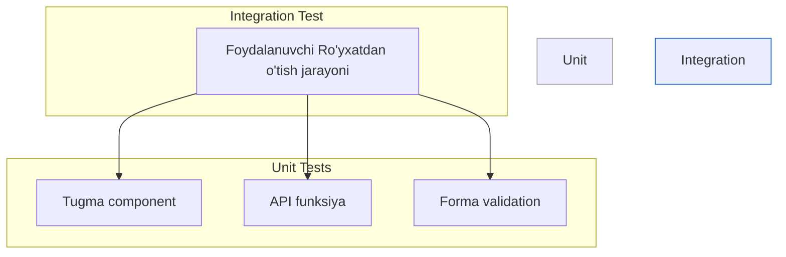

# Integration Testing

## Kirish

> [!IMPORTANT]
> **Nima uchun muhim?**  
> Unit testlar tizimning alohida qismlari (funksiyalar) qanday ishlashini kafolatlasa-da, bu qismlar bir-biriga ulanganda ham to'g'ri ishlashini kafolatlamaydi. Ko'pincha 100% unit test coverage'ga ega ilovalar aynan integratsiya nuqtalarida (masalan Frontend formadan chiqqan ma'lumotning holati bilan Backend so'rovi to'qnashganda) sinadi. Shuning uchun "Integration Test" (Integratsiya testi) eng muhim xavfsizlik yostig'idir.

> [!NOTE]
> **Real-hayot analogiyasi: "Avtomobil qismlarini yig'ish"**  
> **Unit Test:** Zavodda mashinaning g'ildiraklarini alohida aylantirib ko'rishdi - a'lo darajada. Rulni alohida burab ko'rishdi - muammosiz.  
> **Integration Test:** Endi g'ildirakni o'qqa kiydirib, rulni ulashdi. Rulni o'ngga burganda g'ildirak ham o'ngga burilyaptimi? Shuni tekshirish — integratsiya testidir. Agar rul chapga, g'ildirak o'ngga burilsa, alohida qismlar soz bo'lsa ham butun tizim xato hisoblanadi.

Integration testing - bu bir nechta komponentlarning yoki funksiyalarning birgalikda to'g'ri ishlashini tekshirish.



---

## 🟢 Junior (Asoslar va Tushunchalar)

Junior dasturchi Integration Test nega kerakligini tushunadi va komponentlararo testlarni yozishni boshlaydi.

### Unit va Integration Test farqi

| Xususiyat | Unit Test | Integration Test |
|-----------|-----------|------------------|
| Qamrov (Scope) | Bitta unit | Bir nechta unit |
| Bog'liqliklar | Mock / Stub | Real qismlar ulanishi |
| Tezlik | Juda tez (ms) | Sekinroq |

### Vue'da sodda Integration Test

Tasavvur qiling sizda Forma komponenti bor. Unda Validatsiya funksiyasi va Pinia store bor. Shular birga ishlashini ko'ramiz.

```javascript
import { mount } from '@vue/test-utils';
import { createPinia, setActivePinia } from 'pinia';
import { test, expect, beforeEach } from 'vitest';
import LoginForm from './LoginForm.vue';
import { useAuthStore } from './auth';

describe('LoginForm Integration Test', () => {
  beforeEach(() => {
    setActivePinia(createPinia());
  });

  test('Foydalanuvchi formani to\'ldirib yuborganda store yangilanadi', async () => {
    // 1. Komponentni "yaratamiz" (Mount)
    const wrapper = mount(LoginForm);
    const authStore = useAuthStore();

    // 2. DOM elementlarga qiymat kiritamiz
    await wrapper.find('input[type="email"]').setValue('test@example.com');
    await wrapper.find('input[type="password"]').setValue('123456');

    // 3. Tugmani bosamiz
    await wrapper.find('button[type="submit"]').trigger('click');

    // 4. Integratsiya to'g'ri ishlaganini tekshiramiz (Form -> Store)
    expect(authStore.isAuthenticated).toBe(true);
    expect(authStore.userEmail).toBe('test@example.com');
  });
});
```

---

## 🟡 Middle (Amaliyot va Detallar)

Middle dasturchi real API'larga qilinadigan so'rovlarni integratsiya testida qanday sinash kerakligini (MSW - Mock Service Worker) orqali boshqarishni yaxshi biladi. API yoki brauzer darajasidagi sinovlarni olib boradi.

### Mock Service Worker (MSW) orqali API testlash

Frontendda haqiqiy server o'rniga Tarmoq (Network) so'rovlarini ushlab oluvchi MSW ishlatiladi.

```javascript
import { describe, test, expect, beforeAll, afterAll } from 'vitest';
import { setupServer } from 'msw/node';
import { http, HttpResponse } from 'msw';
import { ApiClient } from '../api-client';

// 1. Soxta server tayyorlaymiz
const server = setupServer(
  http.get('https://api.example.com/users/:id', ({ params }) => {
    if (params.id === '1') {
      return HttpResponse.json({
        id: 1,
        name: 'John Doe',
        email: 'john@example.com'
      });
    }
    return new HttpResponse(null, { status: 404 });
  })
);

// 2. Serverni yoqib / o'chirish
beforeAll(() => server.listen());
afterAll(() => server.close());

describe('ApiClient (HTTP Integration)', () => {
  const apiClient = new ApiClient('https://api.example.com');

  test('mavjud user ma\'lumotlarini API orqali to\'g\'ri olib keladi', async () => {
    const user = await apiClient.getUser(1);
    
    // Funksiya to'g'ri so'rov qilib, to'g'ri javobni o'qiy oldimi?
    expect(user.name).toBe('John Doe');
  });

  test('yo\'q user uchun xatolik qaytaradi', async () => {
    await expect(apiClient.getUser(999)).rejects.toThrow('User not found');
  });
});
```

---

## 🔴 Senior (Arxitektura va Optimizatsiya)

Senior dasturchi katta tizimlarda (Backend Database bilan yoki Frontenddagi murakkab kesh holatlari) integratsiya testlarni mustahkam va xavfsiz (izolyatsiya qilingan) holda olib boradi. U Data Fixtures va Factory'lardan unumli foydalanadi.

### Test Isolation (Ma'lumotlar Izolyatsiyasi)
Katta loyihalarda bitta test ikkinchi testning natijasiga ta'sir qilmasligi kerak. (Shared state bo'lmasligi lozim).

```javascript
// XATO: Testlar bir-biriga bog'liq
describe('UserService', () => {
  test('create user', async () => {
    // DB ga yozdi
    await userService.create({ email: 'test@test.com' });
  });

  test('unique email', async () => {
    // Agar tepadagi test birinchi ishlasa, bu xato beradi!
    await expect(
      userService.create({ email: 'test@test.com' })
    ).rejects.toThrow();
  });
});

// TO'G'RI: Izolyatsiya qilingan testlar
describe('UserService', () => {
  beforeEach(async () => {
    // HAR BIR testdan oldin bazani tozalaymiz
    await cleanupDatabase();
  });

  test('create user', async () => {
    const user = await userService.create({ email: 'test@test.com' });
    expect(user.id).toBeDefined();
  });

  test('unique email', async () => {
    await userService.create({ email: 'test@test.com' });

    // Ushbu blok avvalgi testga ta'sir qilmaydi, chunki tozalangan edi.
    await expect(
      userService.create({ email: 'test@test.com' })
    ).rejects.toThrow('Email already exists');
  });
});
```

### Intervyu Savoli
**"Flaky integration testlar nima va ularni qanday oldini olasiz?"**
*Javob:*
Flaky test bu - vaqti-vaqti bilan pass va ba'zan fail bo'ladigan barqaror bo'lmagan test. Integration testlarda bunga ko'pincha:
1. **Network kutilmalari (Timing):** So'rov ketganidan so'ng darhol natijani tekshirish. Yechim: `setTimeout` o'rniga `waitFor()` (qidirilayotgan element paydo bo'lguncha kutish) ni ishlatish.
2. **Shared State (Umumiy holat):** Testdan so'ng bazani yoki storageni tozalab ketmaslik. Yechim: Doim `beforeEach` va `afterEach` da holatni nolga (reset) qaytarish.

---

## Eng Yaxshi Amaliyotlar (Best Practices)

1. **"Arrange, Act, Assert" (AAA) pattern**: Testni aniq uch qismga bo'ling: Ma'lumotlarni tayyorlang (Arrange), harakat qiling (Act) va natijani tekshiring (Assert).
2. **Haqiqiy DOM'dan foydalaning**: Frontend integratsiya testlarida asosan `jsdom` (yoki Vitest DOM) dan foydalanib, foydalanuvchilar aslida brauzerda ko'radigan narsalarni test qiling. Componentning ichki mantiqlarini to'g'ridan-to'g'ri emas, balki HTML tugmalarni bosib tekshiring (masalan: `wrapper.find('button').trigger('click')`).
3. **Flaky testlardan ehtiyot bo'ling**: Integratsiya testlari odatda sekinroq bo'ladi va asinxron jarayonlarga ko'p ulanadi. Kutishlarda (waits) qat'iy vaqt (masalan, `sleep(1000)`) emas, balki "element paydo bo'lguncha kutish" strategiyasidan foydalaning.

---

## Xulosa

Integration testlari loyihadagi qismlarning bir oila bo'lib to'g'ri ishlashini ta'minlaydi.

| Tushuncha | Ta'rifi | Qachon ishlatiladi? |
| --- | --- | --- |
| **Unit Test** | Faqat 1 ta funksiya o'zini tekshirish | Logika to'g'riligini bilish uchun |
| **Integration Test** | Bir nechta funksiya va Store birga ishlashi | UI dan ma'lumot Store yoki API'ga yetib borishini tekshirishda |
| **MSW (Mock Service Worker)** | API so'rovlarini ilib oluvchi uskun | Backend hali tayyor bo'lmaganda yoki test paytida internetga chiqmaslik uchun |
| **Data Fixture** | Testlar uchun tayyor ma'lumotlar | Barcha testlarda bir xil sifatli ma'lumotlardan nusxa olishda |
