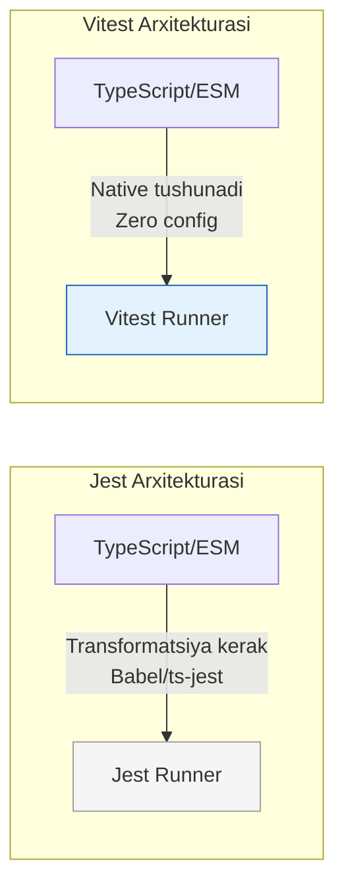

# Vitest

## Kirish

> [!IMPORTANT]
> **Nima uchun muhim?**  
> Uzoq yillar davomida JavaScript olamida "Jest" eng ommabop testlash freymvorki bo'lib keldi. Ammo Webpack o'rnini qanchalik tezlik bilan Vite egallayotgan bo'lsa, Jest o'rnini ham Vitest xuddi shunday tezlikda (hatto undan ham tezroq) egallamoqda. Agar siz React, Vue yoki Svelte da loyihani Vite orqali ko'targan bo'lsangiz, uni testlash uchun Vitest eng mukammal va "native" (chala sozlashlarsiz) ishlaydigan tanlovdir.

> [!NOTE]
> **Real-hayot analogiyasi: "Benzinli avtomobil vs Elektromobil"**  
> **Jest (Benzinli avto):** O'zini oqlagan, ishonchli, hamma usta uni qanday tuzatishni biladi. Ammo motori qizishi, moy almashtirishi kerak (Ko'p konfiguratsiyalar: Babel, TS-jest, Webpack).
> **Vitest (Elektromobil):** Yangi avlod, juda tez tezlanadi (Instant HMR), ortiqcha shovqin va ehtiyot qismlari yo'q. Faqat zaryadga (Vite) tiqib haydab ketish kerak.

Vitest - bu Vite-native unit test framework. U to'g'ridan-to'g'ri Vite ning arxitekturasida yashaydi, shuning uchun TypeScript ni hech qanday pre-processor'siz tushunadi.



---

## 🟢 Junior (Asoslar va Tushunchalar)

Junior dasturchi loyihaga Vitest'ni o'rnata olishi, oddiy `vitest.config.ts` yozishi va sodda hisob-kitob qilib testlashni bilishi kerak.

### O'rnatish va Sozlash

```bash
# O'rnatish
npm install -D vitest @vue/test-utils happy-dom
```

```typescript
// vitest.config.ts
import { defineConfig } from 'vitest/config'
import vue from '@vitejs/plugin-vue'

export default defineConfig({
  plugins: [vue()],
  test: {
    // Brauzer muhiti emulyatori (DOM uchun)
    environment: 'happy-dom',
    
    // Globalsni true qilsangiz import { test }... deb yozmaysiz, 
    // lekin false (default) qilish toza kod uchun maslahat beriladi
    globals: false 
  }
})
```

### Oddiy Test Yozish
Juniorlar bilishi kerak bo'lgan asosiy buyruqlar: `describe`, `test` (yoki `it`), va `expect`.

```typescript
import { describe, test, expect } from 'vitest'
import { sum } from './math'

describe('Math functions', () => {
  test('2 va 3 ning yig\'indisi 5 ga teng', () => {
    // toBe qat'iy tekshiradi (===)
    expect(sum(2, 3)).toBe(5)
  })
})
```

---

## 🟡 Middle (Amaliyot va Detallar)

Middle dasturchi murakkab komponentlarni (Component testing), Store larni (Pinia) va Composable (useFetch kabi) funksiyalarni Vitest va Vue Test Utils orqali to'liq sinovdan o'tkazishni biladi.

### Component Test (Vue Test Utils bilan)

Komponent ichidagi tugmani bosganda reaktiv holat o'zgaryaptimi? Shuni tekshiramiz:

```typescript
import { describe, test, expect, beforeEach } from 'vitest'
import { mount } from '@vue/test-utils'
import Counter from '@/components/Counter.vue'

describe('Counter.vue', () => {
  let wrapper

  // Har bir testdan oldin toza komponentni chizamiz
  beforeEach(() => {
    wrapper = mount(Counter, {
      props: { initialValue: 0 }
    })
  })

  test('increments count on button click', async () => {
    // Tugmani bosamiz (DOM reaksiyasini kutamiz shuning uchun async/await)
    await wrapper.find('[data-testid="increment"]').trigger('click')

    // Matn o'zgarganini tekshiramiz
    expect(wrapper.find('[data-testid="count"]').text()).toBe('1')
  })
})
```

### Composable va API Test
API dan ma'lumot olib keluvchi funksiyalarni test qilayotganda `vi.mock` qilinadi.

```typescript
import { describe, test, expect, vi } from 'vitest'
import { useFetch } from '@/composables/useFetch'
import { nextTick } from 'vue'

describe('useFetch', () => {
  test('fetches data successfully', async () => {
    // Tarmoq so'rovini qalbaki natijaga o'zgartiramiz
    global.fetch = vi.fn().mockResolvedValueOnce({
      ok: true,
      json: () => Promise.resolve({ data: 'test' })
    })

    const { data, isLoading } = useFetch('/api/test')

    // Boshida loading ketyapti
    expect(isLoading.value).toBe(true)

    // Vue yangilanishini kutamiz
    await nextTick()
    await vi.waitFor(() => !isLoading.value) // loading tugashini kutamiz

    // Natija
    expect(data.value).toEqual({ data: 'test' })
    expect(isLoading.value).toBe(false)
  })
})
```

---

## 🔴 Senior (Arxitektura va Optimizatsiya)

Senior dasturchi butun tizimni `Setup` (Tayyorgarlik) qilishni, Snapshot'lar yozishni va loyihaning `Coverage` ni CI/CD da boshqarishni biladi. Shuningdek u `vi.spyOn`, module mocking larni chuqur tushunadi.

### Global Setup va Teardown
Har bir test faylida qayta-qayta mock yozmaslik uchun global `tests/setup.ts` ishlatiladi.

```typescript
// tests/setup.ts
import { beforeAll, afterEach, vi } from 'vitest'
import { cleanup } from '@testing-library/vue'

beforeAll(() => {
  // Masalan localStorage ni butun loyiha uchun o'chirib, soxta yasaymiz
  const localStorageMock = {
    getItem: vi.fn(),
    setItem: vi.fn()
  }
  Object.defineProperty(window, 'localStorage', { value: localStorageMock })
})

afterEach(() => {
  cleanup() // DOM ni tozalash
  vi.clearAllMocks() // chaqirilgan mocklar xotirasini nolga tushirish
})
```

### Snapshot Testing
"Bu komponentning HTML strukturasi qotirilgan, kechagina dizayn yaxshi edi, bugun kimdir div ni o'chirib yuboribdi!" degan muammolarni oldini olish uchun HTML ning nusxasi olinib bazaga (faylga) saqlanadi.

```typescript
import { test, expect } from 'vitest'
import { mount } from '@vue/test-utils'
import UserCard from '@/components/UserCard.vue'

test('matches snapshot', () => {
  const wrapper = mount(UserCard, {
    props: { user: { name: 'John' } }
  })

  // Birinchi marta ishlaganda __snapshots__ papkasi ochib, HTML ni yozib qo'yadi.
  // Keyingi safar kimdir UserCard kodini o'zgartirsa, eski snapshot ga to'g'ri 
  // kelmay qoladi va test YIQILADI (fail).
  expect(wrapper.html()).toMatchSnapshot()
})
```

### Intervyu Savoli
**"Vitest va Jest'ning ichki mexanizmida qanday farq bor?"**
*Javob:* 
Jest eski texnologiya bo'lib, unga `.ts` yoki yangi zamonaviy `.js` kod bersangiz avval uni Babel orqali o'zi tushunadigan CommonJS (`require()`) formatga transformatsiya (tarjima) qilib oladi. Bu katta loyihalarda ko'p vaqt va xotira oladi.
Vitest esa to'g'ridan-to'g'ri Vite arxitekturasini va ES Modules (`import/export`) ni Native (ona tilidek) tushunadi. U hech qanday transformatsiyasiz kodni darhol o'qiydi, shu sababli Vitest xuddi HMR (Vite dev server) ishlagandek millisekundlarda ishlaydi.

---

## Eng Yaxshi Amaliyotlar (Best Practices)

1. **Global Configuration'ni o'chirib qo'ying**: Agar test fayllarida `import { describe, it, expect } from 'vitest'` yozishga erinmasangiz, Vite configuration'ida `globals: true` qilishni tavsiya etmaymiz. Explicit (aniq) import doim osonroq tushuniladi va global ob'ektlarni ifloslantirmaydi.
2. **Setup fayllarni ajrating**: Barcha API mock'lari, global component (Vue'da masalan Router, Pinia) o'rnatishlarini har bir test ichida yozish o'rniga, markaziy `tests/setup.ts` faylini yarating va uni config orqali ulang (`setupFiles: ['./tests/setup.ts']`).
3. **In-source testing**: Kichik utils (yordamchi) fayllar yoki helper funksiyalari uchun Vitest'ning ajoyib imkoniyati bor - kodning o'zida yozib ketiladigan "in-source" testlar. Bunda alohida `.test.ts` fayl yaratishga hojat qolmaydi, to'g'ridan to'g'ri `.js` faylning eng tagiga testlarni yozib ketasiz.

---

## Xulosa

Vitest bu o'lik Jest'ning o'rniga kelgan yangi qirol. 

| Xususiyat | Qachon ishlatiladi | Ma'nosi |
| --- | --- | --- |
| **Vite Native** | Vite bilan yig'ilgan loyihalarda | To'g'ridan-to'g'ri integratsiya |
| **vi.mock()** | Butun modulni to'xtatganda | Masalan API chaqiruvlari, Axios |
| **vi.spyOn()** | Real obyektni kuzatganda | `console.log` ishlaganini sanash uchun |
| **flushPromises()** | Vue test utils'da API kutilganda | Backenddan javob kelgunicha Test ni to'xtatib turish |
| **Snapshot** | HTML struktura qat'iy saqlanishi kerak bo'lganda | Component renderini muzlatish |
