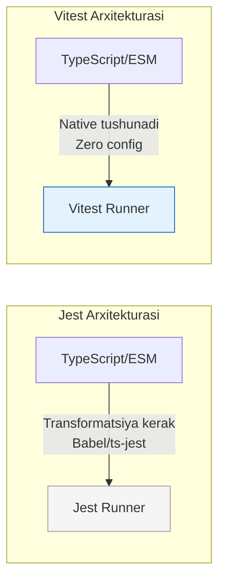

# Vitest

## Kirish

> [!IMPORTANT]
> **Nima uchun muhim?**  
> Uzoq yillar davomida JavaScript olamida "Jest" eng ommabop testlash freymvorki bo'lib keldi. Ammo Webpack o'rnini qanchalik tezlik bilan Vite egallayotgan bo'lsa, Jest o'rnini ham Vitest xuddi shunday tezlikda (hatto undan ham tezroq) egallamoqda. Agar siz React, Vue yoki Svelte da loyihani Vite orqali ko'targan bo'lsangiz, uni testlash uchun Vitest eng mukammal va "native" (chala sozlashlarsiz) ishlaydigan tanlovdir.

> [!NOTE]
> **Real-hayot analogiyasi: "Benzinli avtomobil vs Elektromobil"**  
> **Jest (Benzinli avto):** O'zini oqlagan, ishonchli, hamma usta uni qanday tuzatishni biladi. Ammo motori qizishi, moy almashtirishi kerak (Ko'p konfiguratsiyalar: Babel, TS-jest, Webpack).
> **Vitest (Elektromobil):** Yangi avlod, juda tez tezlanadi (Instant HMR), ortiqcha shovqin va ehtiyot qismlari yo'q. Faqat zaryadga (Vite) tiqib haydab ketish kerak.

Vitest - bu Vite-native unit test framework. Tez, zamonaviy, va Vite ecosystem bilan mukammal integratsiyalangan. Jest-compatible API bilan ishlash oson.

## Vitest Nima?

Vitest Vite tomonidan qo'llab-quvvatlanadigan next-generation test runner. Vite'ning tezkor dev server'i va HMR (Hot Module Replacement) imkoniyatlaridan foydalanadi.



### Jest vs Vitest

| Feature | Jest | Vitest |
|---------|------|--------|
| Speed | Yaxshi | Juda tez |
| ESM Support | Configuration kerak | Native |
| TypeScript | Transform kerak | Native |
| Vite Integration | Yo'q | Native |
| API | Standard | Jest-compatible |
| Watch Mode | Good | Instant |
| Configuration | Complex | Minimal |

## O'rnatish va Sozlash

### Basic Setup

```bash
# Install
npm install -D vitest

# With Vue
npm install -D vitest @vue/test-utils happy-dom

# With React
npm install -D vitest @testing-library/react jsdom
```

### Configuration

```typescript
// vitest.config.ts
import { defineConfig } from 'vitest/config'
import vue from '@vitejs/plugin-vue'

export default defineConfig({
  plugins: [vue()],
  test: {
    // Test environment
    environment: 'happy-dom', // or 'jsdom', 'node'

    // Global setup
    globals: true,
    setupFiles: ['./tests/setup.ts'],

    // Coverage
    coverage: {
      provider: 'v8', // or 'istanbul'
      reporter: ['text', 'json', 'html'],
      exclude: [
        'node_modules/',
        'tests/',
        '**/*.d.ts',
        '**/*.config.*',
        '**/index.ts'
      ],
      thresholds: {
        lines: 80,
        branches: 80,
        functions: 80,
        statements: 80
      }
    },

    // Include patterns
    include: ['**/*.{test,spec}.{js,ts,jsx,tsx}'],

    // Exclude patterns
    exclude: ['node_modules', 'dist', 'e2e'],

    // Reporters
    reporters: ['verbose'],

    // Timeout
    testTimeout: 10000,

    // Watch mode
    watch: true,

    // Threads
    threads: true
  },

  resolve: {
    alias: {
      '@': '/src'
    }
  }
})
```

### Global Setup File

```typescript
// tests/setup.ts
import { beforeAll, afterAll, afterEach, vi } from 'vitest'
import { cleanup } from '@testing-library/vue'

// Mock global objects
beforeAll(() => {
  // Mock localStorage
  const localStorageMock = {
    getItem: vi.fn(),
    setItem: vi.fn(),
    removeItem: vi.fn(),
    clear: vi.fn()
  }
  Object.defineProperty(window, 'localStorage', {
    value: localStorageMock
  })

  // Mock matchMedia
  Object.defineProperty(window, 'matchMedia', {
    value: vi.fn().mockImplementation(query => ({
      matches: false,
      media: query,
      onchange: null,
      addListener: vi.fn(),
      removeListener: vi.fn()
    }))
  })
})

// Cleanup after each test
afterEach(() => {
  cleanup()
  vi.clearAllMocks()
})

// Restore after all tests
afterAll(() => {
  vi.restoreAllMocks()
})
```

## Test Syntax

### Basic Tests

```typescript
import { describe, it, test, expect, vi } from 'vitest'

// Basic test
test('1 + 1 = 2', () => {
  expect(1 + 1).toBe(2)
})

// Grouped tests
describe('Calculator', () => {
  it('adds two numbers', () => {
    expect(add(2, 3)).toBe(5)
  })

  it('subtracts two numbers', () => {
    expect(subtract(5, 3)).toBe(2)
  })
})

// Nested describes
describe('User', () => {
  describe('when logged in', () => {
    it('shows dashboard', () => {
      // ...
    })
  })

  describe('when logged out', () => {
    it('shows login page', () => {
      // ...
    })
  })
})
```

### Matchers

```typescript
import { expect, test } from 'vitest'

test('matchers', () => {
  // Equality
  expect(2 + 2).toBe(4)
  expect({ name: 'John' }).toEqual({ name: 'John' })
  expect([1, 2, 3]).toStrictEqual([1, 2, 3])

  // Truthiness
  expect(true).toBeTruthy()
  expect(false).toBeFalsy()
  expect(null).toBeNull()
  expect(undefined).toBeUndefined()
  expect('value').toBeDefined()

  // Numbers
  expect(4).toBeGreaterThan(3)
  expect(4).toBeGreaterThanOrEqual(4)
  expect(4).toBeLessThan(5)
  expect(0.1 + 0.2).toBeCloseTo(0.3)

  // Strings
  expect('Hello World').toContain('World')
  expect('Hello World').toMatch(/World/)

  // Arrays
  expect([1, 2, 3]).toContain(2)
  expect([1, 2, 3]).toHaveLength(3)
  expect(['apple', 'banana']).toContainEqual('apple')

  // Objects
  expect({ name: 'John', age: 30 }).toHaveProperty('name')
  expect({ name: 'John', age: 30 }).toHaveProperty('name', 'John')
  expect({ a: 1, b: 2 }).toMatchObject({ a: 1 })

  // Exceptions
  expect(() => { throw new Error('Oops') }).toThrow()
  expect(() => { throw new Error('Oops') }).toThrow('Oops')
  expect(() => { throw new Error('Oops') }).toThrow(Error)

  // Negation
  expect(1).not.toBe(2)
  expect([1, 2]).not.toContain(3)
})
```

### Async Tests

```typescript
import { expect, test, vi } from 'vitest'

// Async/await
test('async function', async () => {
  const result = await fetchData()
  expect(result).toBe('data')
})

// Promises
test('promise resolves', () => {
  return expect(fetchData()).resolves.toBe('data')
})

test('promise rejects', () => {
  return expect(failingFetch()).rejects.toThrow('Error')
})

// Callbacks
test('callback style', (done) => {
  fetchWithCallback((error, data) => {
    expect(error).toBeNull()
    expect(data).toBe('result')
    done()
  })
})

// Timers
test('debounce function', async () => {
  vi.useFakeTimers()

  const callback = vi.fn()
  const debounced = debounce(callback, 1000)

  debounced()
  debounced()
  debounced()

  expect(callback).not.toHaveBeenCalled()

  await vi.advanceTimersByTimeAsync(1000)

  expect(callback).toHaveBeenCalledTimes(1)

  vi.useRealTimers()
})
```

### Hooks

```typescript
import { describe, beforeAll, afterAll, beforeEach, afterEach, it } from 'vitest'

describe('Database tests', () => {
  let db: Database

  // Run once before all tests
  beforeAll(async () => {
    db = await Database.connect()
  })

  // Run once after all tests
  afterAll(async () => {
    await db.disconnect()
  })

  // Run before each test
  beforeEach(async () => {
    await db.clear()
    await db.seed()
  })

  // Run after each test
  afterEach(async () => {
    await db.rollback()
  })

  it('inserts data', async () => {
    await db.insert({ name: 'Test' })
    const result = await db.findAll()
    expect(result).toHaveLength(1)
  })
})
```

## Mocking

### Function Mocking

```typescript
import { vi, describe, it, expect, beforeEach, afterEach } from 'vitest'

describe('Mocking functions', () => {
  // Basic mock function
  it('basic mock', () => {
    const mock = vi.fn()

    mock('arg1', 'arg2')

    expect(mock).toHaveBeenCalled()
    expect(mock).toHaveBeenCalledWith('arg1', 'arg2')
    expect(mock).toHaveBeenCalledTimes(1)
  })

  // Mock implementation
  it('mock with implementation', () => {
    const mock = vi.fn((x: number) => x * 2)

    expect(mock(5)).toBe(10)
    expect(mock).toHaveBeenCalledWith(5)
  })

  // Mock return values
  it('mock return values', () => {
    const mock = vi.fn()
      .mockReturnValue('default')
      .mockReturnValueOnce('first')
      .mockReturnValueOnce('second')

    expect(mock()).toBe('first')
    expect(mock()).toBe('second')
    expect(mock()).toBe('default')
  })

  // Mock async functions
  it('mock async', async () => {
    const mock = vi.fn()
      .mockResolvedValue('success')
      .mockResolvedValueOnce('first success')

    expect(await mock()).toBe('first success')
    expect(await mock()).toBe('success')
  })

  // Mock rejected promise
  it('mock rejected', async () => {
    const mock = vi.fn().mockRejectedValue(new Error('Failed'))

    await expect(mock()).rejects.toThrow('Failed')
  })
})
```

### Spying

```typescript
import { vi, describe, it, expect, afterEach } from 'vitest'

const calculator = {
  add(a: number, b: number) {
    return a + b
  },
  multiply(a: number, b: number) {
    return a * b
  }
}

describe('Spying', () => {
  afterEach(() => {
    vi.restoreAllMocks()
  })

  it('spy on method', () => {
    const spy = vi.spyOn(calculator, 'add')

    const result = calculator.add(2, 3)

    expect(result).toBe(5) // Real function called
    expect(spy).toHaveBeenCalledWith(2, 3)
  })

  it('spy and mock implementation', () => {
    const spy = vi.spyOn(calculator, 'add').mockReturnValue(100)

    const result = calculator.add(2, 3)

    expect(result).toBe(100) // Mocked value
    expect(spy).toHaveBeenCalledWith(2, 3)
  })

  it('spy on console', () => {
    const consoleSpy = vi.spyOn(console, 'log')

    console.log('test message')

    expect(consoleSpy).toHaveBeenCalledWith('test message')
  })
})
```

### Module Mocking

```typescript
import { vi, describe, it, expect, beforeEach } from 'vitest'

// Mock entire module
vi.mock('./api', () => ({
  fetchUsers: vi.fn(() => Promise.resolve([{ id: 1, name: 'User' }])),
  createUser: vi.fn()
}))

// Mock with factory
vi.mock('./config', () => ({
  default: {
    apiUrl: 'http://test-api.com',
    timeout: 1000
  }
}))

// Partial mock
vi.mock('./utils', async () => {
  const actual = await vi.importActual('./utils')
  return {
    ...actual,
    formatDate: vi.fn(() => '2024-01-01')
  }
})

describe('Module mocking', () => {
  beforeEach(() => {
    vi.clearAllMocks()
  })

  it('uses mocked module', async () => {
    const { fetchUsers } = await import('./api')

    const users = await fetchUsers()

    expect(users).toEqual([{ id: 1, name: 'User' }])
  })
})

// Auto-mock module
vi.mock('./heavy-module')

// Unmock in specific test
describe('with real module', () => {
  beforeEach(() => {
    vi.unmock('./heavy-module')
  })

  it('uses real implementation', async () => {
    const module = await vi.importActual('./heavy-module')
    // Real module
  })
})
```

### Timer Mocking

```typescript
import { vi, describe, it, expect, beforeEach, afterEach } from 'vitest'

describe('Timer mocking', () => {
  beforeEach(() => {
    vi.useFakeTimers()
  })

  afterEach(() => {
    vi.useRealTimers()
  })

  it('setTimeout', async () => {
    const callback = vi.fn()

    setTimeout(callback, 1000)

    expect(callback).not.toHaveBeenCalled()

    await vi.advanceTimersByTimeAsync(1000)

    expect(callback).toHaveBeenCalledTimes(1)
  })

  it('setInterval', async () => {
    const callback = vi.fn()

    setInterval(callback, 1000)

    await vi.advanceTimersByTimeAsync(3000)

    expect(callback).toHaveBeenCalledTimes(3)
  })

  it('run all timers', async () => {
    const callback = vi.fn()

    setTimeout(callback, 1000)
    setTimeout(callback, 2000)
    setTimeout(callback, 3000)

    await vi.runAllTimersAsync()

    expect(callback).toHaveBeenCalledTimes(3)
  })

  it('mock Date', () => {
    const mockDate = new Date('2024-06-15T10:00:00')
    vi.setSystemTime(mockDate)

    expect(new Date().toISOString()).toBe('2024-06-15T10:00:00.000Z')
    expect(Date.now()).toBe(mockDate.getTime())
  })
})
```

## Vue Component Testing

### Setup

```typescript
// tests/setup.ts
import { config } from '@vue/test-utils'
import { createPinia, setActivePinia } from 'pinia'

// Global plugins
config.global.plugins = [createPinia()]

// Global stubs
config.global.stubs = {
  RouterLink: true,
  RouterView: true
}

// Global mocks
config.global.mocks = {
  $t: (msg: string) => msg, // i18n mock
  $route: { params: {}, query: {} }
}
```

### Component Testing

```typescript
import { describe, it, expect, beforeEach } from 'vitest'
import { mount, VueWrapper } from '@vue/test-utils'
import { createPinia, setActivePinia } from 'pinia'
import Counter from '@/components/Counter.vue'

describe('Counter.vue', () => {
  let wrapper: VueWrapper

  beforeEach(() => {
    setActivePinia(createPinia())
    wrapper = mount(Counter, {
      props: {
        initialValue: 0
      }
    })
  })

  it('renders initial value', () => {
    expect(wrapper.find('[data-testid="count"]').text()).toBe('0')
  })

  it('increments count on button click', async () => {
    await wrapper.find('[data-testid="increment"]').trigger('click')

    expect(wrapper.find('[data-testid="count"]').text()).toBe('1')
  })

  it('decrements count on button click', async () => {
    await wrapper.find('[data-testid="decrement"]').trigger('click')

    expect(wrapper.find('[data-testid="count"]').text()).toBe('-1')
  })

  it('emits change event', async () => {
    await wrapper.find('[data-testid="increment"]').trigger('click')

    expect(wrapper.emitted('change')).toBeTruthy()
    expect(wrapper.emitted('change')![0]).toEqual([1])
  })
})
```

### Complex Component Testing

```typescript
import { describe, it, expect, beforeEach, vi } from 'vitest'
import { mount, flushPromises } from '@vue/test-utils'
import { createTestingPinia } from '@pinia/testing'
import UserProfile from '@/components/UserProfile.vue'
import { useUserStore } from '@/stores/user'

// Mock API
vi.mock('@/api/user', () => ({
  fetchUser: vi.fn(() => Promise.resolve({
    id: 1,
    name: 'John Doe',
    email: 'john@example.com'
  }))
}))

describe('UserProfile.vue', () => {
  const mountComponent = (options = {}) => {
    return mount(UserProfile, {
      global: {
        plugins: [
          createTestingPinia({
            createSpy: vi.fn,
            initialState: {
              user: { currentUser: null }
            }
          })
        ]
      },
      props: {
        userId: 1
      },
      ...options
    })
  }

  it('shows loading state initially', () => {
    const wrapper = mountComponent()

    expect(wrapper.find('[data-testid="loading"]').exists()).toBe(true)
  })

  it('displays user data after load', async () => {
    const wrapper = mountComponent()

    await flushPromises()

    expect(wrapper.find('[data-testid="loading"]').exists()).toBe(false)
    expect(wrapper.find('[data-testid="user-name"]').text()).toBe('John Doe')
    expect(wrapper.find('[data-testid="user-email"]').text()).toBe('john@example.com')
  })

  it('shows error on API failure', async () => {
    const { fetchUser } = await import('@/api/user')
    vi.mocked(fetchUser).mockRejectedValueOnce(new Error('API Error'))

    const wrapper = mountComponent()

    await flushPromises()

    expect(wrapper.find('[data-testid="error"]').text()).toContain('API Error')
  })

  it('updates store when user is loaded', async () => {
    const wrapper = mountComponent()

    await flushPromises()

    const store = useUserStore()
    expect(store.setCurrentUser).toHaveBeenCalledWith({
      id: 1,
      name: 'John Doe',
      email: 'john@example.com'
    })
  })
})
```

### Form Testing

```typescript
import { describe, it, expect, beforeEach, vi } from 'vitest'
import { mount, flushPromises } from '@vue/test-utils'
import LoginForm from '@/components/LoginForm.vue'

describe('LoginForm.vue', () => {
  const mountForm = () => {
    return mount(LoginForm)
  }

  it('validates required fields', async () => {
    const wrapper = mountForm()

    await wrapper.find('form').trigger('submit')

    expect(wrapper.find('[data-testid="email-error"]').text())
      .toBe('Email is required')
    expect(wrapper.find('[data-testid="password-error"]').text())
      .toBe('Password is required')
  })

  it('validates email format', async () => {
    const wrapper = mountForm()

    await wrapper.find('[data-testid="email"]').setValue('invalid')
    await wrapper.find('form').trigger('submit')

    expect(wrapper.find('[data-testid="email-error"]').text())
      .toBe('Invalid email format')
  })

  it('submits form with valid data', async () => {
    const wrapper = mountForm()

    await wrapper.find('[data-testid="email"]').setValue('test@example.com')
    await wrapper.find('[data-testid="password"]').setValue('password123')
    await wrapper.find('form').trigger('submit')

    expect(wrapper.emitted('submit')).toBeTruthy()
    expect(wrapper.emitted('submit')![0]).toEqual([{
      email: 'test@example.com',
      password: 'password123'
    }])
  })

  it('shows loading state during submission', async () => {
    const wrapper = mountForm()

    // Mock async submission
    wrapper.vm.isSubmitting = true
    await wrapper.vm.$nextTick()

    expect(wrapper.find('[data-testid="submit-button"]').attributes('disabled'))
      .toBeDefined()
    expect(wrapper.find('[data-testid="loading-spinner"]').exists()).toBe(true)
  })

  it('shows server error', async () => {
    const wrapper = mountForm()

    // Simulate server error
    await wrapper.setProps({ serverError: 'Invalid credentials' })

    expect(wrapper.find('[data-testid="server-error"]').text())
      .toBe('Invalid credentials')
  })
})
```

## Pinia Store Testing

```typescript
import { describe, it, expect, beforeEach, vi } from 'vitest'
import { setActivePinia, createPinia } from 'pinia'
import { useCartStore } from '@/stores/cart'
import { useProductStore } from '@/stores/product'

// Mock API
vi.mock('@/api/cart', () => ({
  saveCart: vi.fn(),
  loadCart: vi.fn(() => Promise.resolve({ items: [] }))
}))

describe('Cart Store', () => {
  beforeEach(() => {
    setActivePinia(createPinia())
    vi.clearAllMocks()
  })

  describe('actions', () => {
    it('adds item to cart', () => {
      const store = useCartStore()
      const product = { id: 1, name: 'Test Product', price: 100 }

      store.addItem(product)

      expect(store.items).toHaveLength(1)
      expect(store.items[0].product).toEqual(product)
      expect(store.items[0].quantity).toBe(1)
    })

    it('increases quantity for existing item', () => {
      const store = useCartStore()
      const product = { id: 1, name: 'Test', price: 100 }

      store.addItem(product)
      store.addItem(product)

      expect(store.items).toHaveLength(1)
      expect(store.items[0].quantity).toBe(2)
    })

    it('removes item from cart', () => {
      const store = useCartStore()
      store.addItem({ id: 1, name: 'Test', price: 100 })

      store.removeItem(1)

      expect(store.items).toHaveLength(0)
    })

    it('clears all items', () => {
      const store = useCartStore()
      store.addItem({ id: 1, name: 'Test 1', price: 100 })
      store.addItem({ id: 2, name: 'Test 2', price: 200 })

      store.clearCart()

      expect(store.items).toHaveLength(0)
    })
  })

  describe('getters', () => {
    it('calculates total correctly', () => {
      const store = useCartStore()
      store.addItem({ id: 1, name: 'A', price: 100 })
      store.addItem({ id: 1, name: 'A', price: 100 }) // quantity 2
      store.addItem({ id: 2, name: 'B', price: 50 })

      expect(store.total).toBe(250) // 100*2 + 50
    })

    it('calculates item count', () => {
      const store = useCartStore()
      store.addItem({ id: 1, name: 'A', price: 100 })
      store.addItem({ id: 1, name: 'A', price: 100 })
      store.addItem({ id: 2, name: 'B', price: 50 })

      expect(store.itemCount).toBe(3) // 2 + 1
    })

    it('returns empty state correctly', () => {
      const store = useCartStore()

      expect(store.isEmpty).toBe(true)

      store.addItem({ id: 1, name: 'Test', price: 100 })

      expect(store.isEmpty).toBe(false)
    })
  })

  describe('async actions', () => {
    it('loads cart from API', async () => {
      const { loadCart } = await import('@/api/cart')
      vi.mocked(loadCart).mockResolvedValueOnce({
        items: [
          { product: { id: 1, name: 'Saved', price: 100 }, quantity: 2 }
        ]
      })

      const store = useCartStore()
      await store.loadFromServer()

      expect(store.items).toHaveLength(1)
      expect(store.items[0].quantity).toBe(2)
    })

    it('saves cart to API', async () => {
      const { saveCart } = await import('@/api/cart')

      const store = useCartStore()
      store.addItem({ id: 1, name: 'Test', price: 100 })

      await store.saveToServer()

      expect(saveCart).toHaveBeenCalledWith({
        items: expect.arrayContaining([
          expect.objectContaining({ quantity: 1 })
        ])
      })
    })
  })
})
```

## Composables Testing

```typescript
import { describe, it, expect, beforeEach, vi } from 'vitest'
import { ref, nextTick } from 'vue'
import { useDebounce } from '@/composables/useDebounce'
import { useFetch } from '@/composables/useFetch'

describe('useDebounce', () => {
  beforeEach(() => {
    vi.useFakeTimers()
  })

  afterEach(() => {
    vi.useRealTimers()
  })

  it('debounces value updates', async () => {
    const source = ref('initial')
    const debounced = useDebounce(source, 300)

    expect(debounced.value).toBe('initial')

    source.value = 'updated'
    expect(debounced.value).toBe('initial') // Not yet updated

    await vi.advanceTimersByTimeAsync(300)

    expect(debounced.value).toBe('updated')
  })

  it('cancels pending updates', async () => {
    const source = ref('a')
    const debounced = useDebounce(source, 300)

    source.value = 'b'
    await vi.advanceTimersByTimeAsync(100)

    source.value = 'c'
    await vi.advanceTimersByTimeAsync(100)

    source.value = 'd'
    await vi.advanceTimersByTimeAsync(300)

    expect(debounced.value).toBe('d') // Only final value
  })
})

describe('useFetch', () => {
  beforeEach(() => {
    vi.clearAllMocks()
  })

  it('fetches data successfully', async () => {
    global.fetch = vi.fn().mockResolvedValueOnce({
      ok: true,
      json: () => Promise.resolve({ data: 'test' })
    })

    const { data, error, isLoading } = useFetch('/api/test')

    expect(isLoading.value).toBe(true)

    await nextTick()
    await vi.waitFor(() => !isLoading.value)

    expect(data.value).toEqual({ data: 'test' })
    expect(error.value).toBeNull()
    expect(isLoading.value).toBe(false)
  })

  it('handles fetch error', async () => {
    global.fetch = vi.fn().mockRejectedValueOnce(new Error('Network error'))

    const { data, error, isLoading } = useFetch('/api/test')

    await nextTick()
    await vi.waitFor(() => !isLoading.value)

    expect(data.value).toBeNull()
    expect(error.value).toBe('Network error')
  })

  it('refetches when URL changes', async () => {
    global.fetch = vi.fn()
      .mockResolvedValueOnce({
        ok: true,
        json: () => Promise.resolve({ id: 1 })
      })
      .mockResolvedValueOnce({
        ok: true,
        json: () => Promise.resolve({ id: 2 })
      })

    const url = ref('/api/users/1')
    const { data } = useFetch(url)

    await vi.waitFor(() => data.value !== null)
    expect(data.value).toEqual({ id: 1 })

    url.value = '/api/users/2'

    await vi.waitFor(() => data.value?.id === 2)
    expect(data.value).toEqual({ id: 2 })
  })
})
```

## Snapshot Testing

```typescript
import { describe, it, expect } from 'vitest'
import { mount } from '@vue/test-utils'
import UserCard from '@/components/UserCard.vue'

describe('Snapshot Testing', () => {
  it('matches snapshot', () => {
    const wrapper = mount(UserCard, {
      props: {
        user: {
          name: 'John Doe',
          email: 'john@example.com',
          avatar: 'https://example.com/avatar.jpg'
        }
      }
    })

    expect(wrapper.html()).toMatchSnapshot()
  })

  it('matches inline snapshot', () => {
    const wrapper = mount(UserCard, {
      props: {
        user: { name: 'Jane', email: 'jane@example.com' }
      }
    })

    expect(wrapper.find('[data-testid="user-name"]').text())
      .toMatchInlineSnapshot(`"Jane"`)
  })

  // Object snapshot
  it('serializes object correctly', () => {
    const result = transformUserData({
      firstName: 'John',
      lastName: 'Doe'
    })

    expect(result).toMatchSnapshot()
  })
})
```

## Coverage Configuration

```typescript
// vitest.config.ts
export default defineConfig({
  test: {
    coverage: {
      provider: 'v8',
      reporter: ['text', 'json', 'html', 'lcov'],
      reportsDirectory: './coverage',

      include: ['src/**/*.{ts,vue}'],
      exclude: [
        'src/**/*.d.ts',
        'src/**/*.spec.ts',
        'src/**/*.test.ts',
        'src/main.ts',
        'src/types/**'
      ],

      // Thresholds
      thresholds: {
        lines: 80,
        functions: 80,
        branches: 80,
        statements: 80
      },

      // Per-file thresholds
      perFile: true,

      // All files (including untested)
      all: true
    }
  }
})
```

## Best Practices

### 1. Test Organization

```typescript
// Feature-based structure
src/
├── features/
│   └── auth/
│       ├── components/
│       │   ├── LoginForm.vue
│       │   └── __tests__/
│       │       └── LoginForm.spec.ts
│       ├── composables/
│       │   ├── useAuth.ts
│       │   └── __tests__/
│       │       └── useAuth.spec.ts
│       └── stores/
│           ├── auth.ts
│           └── __tests__/
│               └── auth.spec.ts
```

### 2. Test Naming

```typescript
// Descriptive test names
describe('ShoppingCart', () => {
  describe('addItem', () => {
    it('yangi item qo\'shganda items array\'ga qo\'shiladi', () => {})
    it('mavjud item qo\'shganda quantity oshadi', () => {})
    it('stock 0 bo\'lsa xato qaytaradi', () => {})
  })

  describe('checkout', () => {
    it('cart bo\'sh bo\'lsa xato qaytaradi', () => {})
    it('to\'lov muvaffaqiyatli bo\'lsa order yaratiladi', () => {})
  })
})
```

### 3. Test Isolation

```typescript
// Each test should be independent
describe('UserService', () => {
  let userService: UserService
  let mockApi: MockApi

  beforeEach(() => {
    // Fresh instances for each test
    mockApi = createMockApi()
    userService = new UserService(mockApi)
  })

  afterEach(() => {
    vi.clearAllMocks()
  })
})
```

## Interview Savollari

### 1. Vitest Jest'dan nimasi bilan farq qiladi?

**Javob:**
- **Tezlik**: Vitest Vite'ning native ESM va HMR'dan foydalanadi, Jest transform qiladi
- **Configuration**: Vitest minimal config, Jest ko'p config
- **TypeScript**: Vitest native support, Jest ts-jest kerak
- **Watch mode**: Vitest instant, Jest sekinroq
- **API**: Compatible, lekin Vitest yangi features qo'shadi

### 2. vi.mock va vi.spyOn orasidagi farq?

**Javob:**
```typescript
// vi.mock - butun modulni mock qiladi
vi.mock('./api', () => ({
  fetchData: vi.fn()
}))

// vi.spyOn - mavjud object'ning methodini spy qiladi
const spy = vi.spyOn(console, 'log')
// Real function chaqiriladi, lekin track qilinadi
```

### 3. flushPromises nima qiladi?

**Javob:**
`flushPromises` barcha pending promise'larni resolve qiladi. Component async data yuklayotganda test kutish uchun ishlatiladi:

```typescript
const wrapper = mount(AsyncComponent)
await flushPromises() // Barcha API calls tugashini kutadi
expect(wrapper.text()).toContain('Loaded data')
```

### 4. Snapshot testing qachon ishlatiladi?

**Javob:**
- Component HTML structure tekshirish
- Large object structure tekshirish
- Regression detection

Lekin: Snapshot'lar tez eskiradi, ko'p false positive. Specific assertions yaxshiroq.

### 5. Component testda store qanday mock qilinadi?

**Javob:**
```typescript
import { createTestingPinia } from '@pinia/testing'

mount(Component, {
  global: {
    plugins: [
      createTestingPinia({
        createSpy: vi.fn,
        initialState: {
          user: { name: 'Test' }
        }
      })
    ]
  }
})
```

## Eng Yaxshi Amaliyotlar (Best Practices)

1. **Global Configuration'ni o'chirib qo'ying**: Agar test fayllarida `import { describe, it, expect } from 'vitest'` yozishga erinmasangiz, Vite configuration'ida `globals: true` qilishni tavsiya etmaymiz. Explicit import doim osonroq tushuniladi va global namespace'ni ifloslantirmaydi.
2. **Setup fayllarni ajrating**: Barcha API mock'lari, global component (Vue'da masalan Router, Pinia) o'rnatishlarini har bir test ichida yozish o'rniga, markaziy `tests/setup.ts` faylini yarating va uni config orqali ulang (`setupFiles: ['./tests/setup.ts']`).
3. **In-source testing**: Kichik utils fayllar yoki helper funksiyalari uchun Vitest'ning ajoyib imkoniyati bor - kodning o'zida yozib ketiladigan "in-source" testlar. Bunda alohida `.test.ts` fayl yaratishga hojat qolmaydi.

---

## Xulosa

Vitest:
- Tez, zamonaviy test runner
- Vite ecosystem bilan perfect integration
- Jest-compatible API
- Native TypeScript/ESM support
- Vue/React component testing

Keyingi bo'limda Cypress haqida o'rganamiz.
