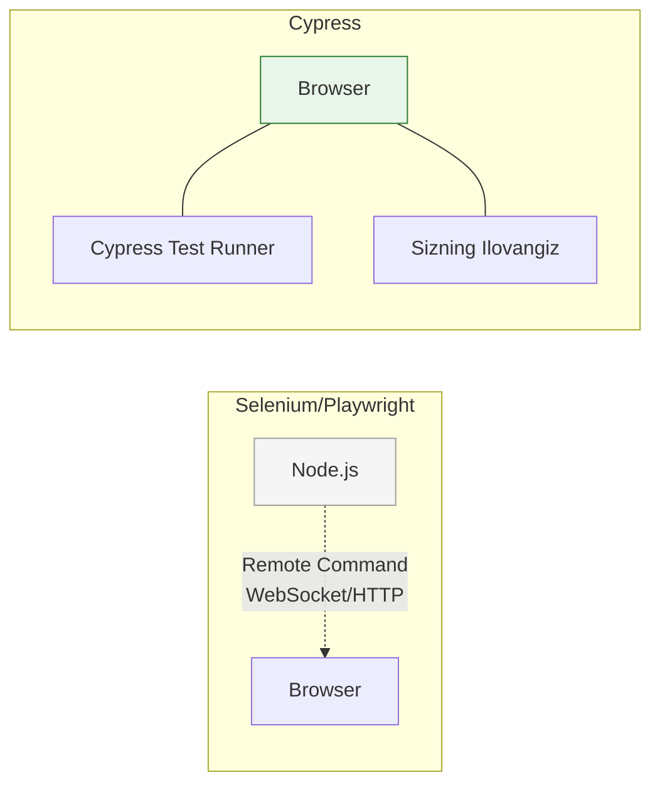

# Cypress

## Kirish

> [!IMPORTANT]
> **Nima uchun muhim?**  
> Dasturingiz o'sgach uni har gal o'zgarish bo'lganda qo'lda test qilib chiqish (Manual QA) juda ko'p vaqt va mablag' talab qiladi. Cypress o'zining "Time Travel" (vaqt bo'ylab sayohat) va "Avtomatik kutish" xususiyatlari orqali, qachonlardir juda murakkab bo'lgan E2E test yozishni xuddi jQuery kod yozishdek oson va qiziqarli qilib yubordi.

> [!NOTE]
> **Real-hayot analogiyasi: "Sirkdagi O'rgatilgan Ayiq vs Odam kiyimidagi Robot"**  
> **Selenium (Eski usul):** Robotni masofadan boshqarish. Buyruqlar network orqali boradi. U robot nima qilayotganini va atrofni qanchalik to'g'ri ko'rayotganini tushunmaydi (Network gecikmelari, sinishlar ko'p).
> **Cypress (Zamonaviy usul):** Bu sizning dasturingiz bilan bitta sirk (brauzer) ichida ishlaydigan ayiq. U qachon animatsiya tugashini, qachon ma'lumot kelishini darhol "his qiladi". Siz unga "Kutib tur!" deyishingiz shart emas, u o'zi vaziyatga qarab ish tutadi.

Cypress - bu zamonaviy E2E testing framework. Real browser'da test yozish, debug qilish va visual testing uchun eng yaxshi toollardan biri.

## Cypress Nima?

Cypress JavaScript-da yozilgan all-in-one testing framework. E2E, component, va API testing uchun ishlatiladi. Real browser ichida ishlaydi va developer experience'ga katta e'tibor beradi.



### Cypress Xususiyatlari

| Feature | Tavsif |
|---------|--------|
| Time Travel | Har bir step'ni vizual ko'rish |
| Real-time Reloads | O'zgarishlar avtomatik |
| Automatic Waiting | Element kutish kerak emas |
| Spies, Stubs, Clocks | Built-in mocking |
| Network Traffic Control | Request/response intercept |
| Screenshots & Videos | Avtomatik capture |

### Cypress vs Playwright vs Selenium

| Feature | Cypress | Playwright | Selenium |
|---------|---------|------------|----------|
| Speed | Tez | Juda tez | Sekin |
| Browsers | Chrome, Firefox, Edge | All + Safari | All |
| API | Chaining | Async/await | Verbose |
| Debugging | Excellent | Good | Basic |
| Mobile | Emulation | Better emulation | Real devices |
| Learning Curve | Easy | Medium | Hard |

## O'rnatish va Sozlash

### Installation

```bash
# Install Cypress
npm install -D cypress

# Open Cypress
npx cypress open

# Run headless
npx cypress run
```

### Project Structure

```
cypress/
├── e2e/
│   ├── auth/
│   │   ├── login.cy.ts
│   │   └── register.cy.ts
│   └── checkout/
│       └── purchase.cy.ts
├── fixtures/
│   ├── users.json
│   └── products.json
├── support/
│   ├── commands.ts
│   ├── e2e.ts
│   └── component.ts
└── downloads/
```

### Configuration

```typescript
// cypress.config.ts
import { defineConfig } from 'cypress'

export default defineConfig({
  e2e: {
    baseUrl: 'http://localhost:3000',
    viewportWidth: 1280,
    viewportHeight: 720,
    video: true,
    screenshotOnRunFailure: true,

    // Timeouts
    defaultCommandTimeout: 10000,
    requestTimeout: 10000,
    responseTimeout: 30000,
    pageLoadTimeout: 60000,

    // Retries
    retries: {
      runMode: 2,
      openMode: 0
    },

    // Environment variables
    env: {
      apiUrl: 'http://localhost:3001/api',
      coverage: false
    },

    setupNodeEvents(on, config) {
      // Node events
      on('task', {
        log(message) {
          console.log(message)
          return null
        },
        async seedDatabase() {
          // Database seeding
          return null
        }
      })

      // Code coverage
      require('@cypress/code-coverage/task')(on, config)

      return config
    },

    specPattern: 'cypress/e2e/**/*.cy.{js,jsx,ts,tsx}'
  },

  component: {
    devServer: {
      framework: 'vue',
      bundler: 'vite'
    },
    specPattern: 'src/**/*.cy.{js,jsx,ts,tsx}'
  }
})
```

### TypeScript Support

```typescript
// cypress/support/index.d.ts
declare namespace Cypress {
  interface Chainable {
    /**
     * Custom command to login
     * @example cy.login('user@example.com', 'password')
     */
    login(email: string, password: string): Chainable<void>

    /**
     * Custom command to add item to cart
     */
    addToCart(productId: number): Chainable<void>

    /**
     * Get element by data-testid
     */
    getByTestId(testId: string): Chainable<JQuery<HTMLElement>>
  }
}
```

## Basic Syntax

### Writing Tests

```typescript
// cypress/e2e/home.cy.ts
describe('Home Page', () => {
  beforeEach(() => {
    cy.visit('/')
  })

  it('displays welcome message', () => {
    cy.get('h1').should('contain', 'Welcome')
  })

  it('navigates to products page', () => {
    cy.get('[data-testid="nav-products"]').click()
    cy.url().should('include', '/products')
  })

  it('searches for products', () => {
    cy.get('[data-testid="search-input"]').type('laptop')
    cy.get('[data-testid="search-button"]').click()

    cy.get('[data-testid="product-card"]').should('have.length.greaterThan', 0)
    cy.get('[data-testid="product-card"]').first().should('contain', 'laptop')
  })
})
```

### Selecting Elements

```typescript
describe('Selectors', () => {
  it('various selector methods', () => {
    // CSS selector
    cy.get('.btn-primary')
    cy.get('#submit-button')
    cy.get('[data-testid="submit"]')

    // Contains text
    cy.contains('Submit')
    cy.contains('button', 'Submit')

    // Within element
    cy.get('.form').within(() => {
      cy.get('input').type('value')
      cy.get('button').click()
    })

    // Find children
    cy.get('.parent').find('.child')
    cy.get('.list').children('li')

    // Siblings
    cy.get('.item').first()
    cy.get('.item').last()
    cy.get('.item').eq(2) // 3rd item
    cy.get('.item').next()
    cy.get('.item').prev()

    // Filter
    cy.get('.item').filter('.active')
    cy.get('.item').not('.disabled')

    // Parent
    cy.get('.child').parent()
    cy.get('.deep-child').parents('.container')
    cy.get('.child').closest('.wrapper')
  })
})
```

### Actions

```typescript
describe('Actions', () => {
  it('performs various actions', () => {
    // Click
    cy.get('button').click()
    cy.get('button').dblclick()
    cy.get('button').rightclick()
    cy.get('.item').click({ force: true }) // Hidden element

    // Type
    cy.get('input').type('Hello World')
    cy.get('input').type('Hello{enter}') // With special keys
    cy.get('input').type('{selectall}{backspace}') // Clear and type
    cy.get('input').clear()
    cy.get('input').clear().type('New value')

    // Special keys
    cy.get('body').type('{ctrl+a}')
    cy.get('input').type('{leftarrow}{rightarrow}')
    cy.get('input').type('{del}')

    // Select
    cy.get('select').select('Option 1')
    cy.get('select').select(['Option 1', 'Option 2']) // Multi-select

    // Checkbox/Radio
    cy.get('[type="checkbox"]').check()
    cy.get('[type="checkbox"]').uncheck()
    cy.get('[type="radio"]').check('value')

    // File upload
    cy.get('[type="file"]').selectFile('cypress/fixtures/file.pdf')
    cy.get('[type="file"]').selectFile([
      'cypress/fixtures/file1.pdf',
      'cypress/fixtures/file2.pdf'
    ])

    // Drag and drop
    cy.get('.draggable').trigger('dragstart')
    cy.get('.droppable').trigger('drop')

    // Scroll
    cy.get('.container').scrollTo('bottom')
    cy.get('.container').scrollTo(0, 500)
    cy.get('.element').scrollIntoView()

    // Focus/Blur
    cy.get('input').focus()
    cy.get('input').blur()

    // Hover (via trigger)
    cy.get('.hoverable').trigger('mouseover')
    cy.get('.hoverable').trigger('mouseenter')
  })
})
```

### Assertions

```typescript
describe('Assertions', () => {
  it('various assertions', () => {
    // Visibility
    cy.get('.element').should('be.visible')
    cy.get('.element').should('not.be.visible')
    cy.get('.element').should('exist')
    cy.get('.element').should('not.exist')

    // Text
    cy.get('h1').should('have.text', 'Exact text')
    cy.get('h1').should('contain', 'partial')
    cy.get('h1').should('include.text', 'partial')
    cy.get('h1').should('not.have.text', 'Wrong text')

    // Value
    cy.get('input').should('have.value', 'expected value')
    cy.get('input').should('be.empty')

    // Classes
    cy.get('button').should('have.class', 'active')
    cy.get('button').should('not.have.class', 'disabled')

    // Attributes
    cy.get('a').should('have.attr', 'href', '/path')
    cy.get('input').should('have.attr', 'disabled')
    cy.get('button').should('not.have.attr', 'disabled')

    // CSS
    cy.get('.element').should('have.css', 'color', 'rgb(255, 0, 0)')
    cy.get('.element').should('have.css', 'display', 'flex')

    // State
    cy.get('input').should('be.focused')
    cy.get('[type="checkbox"]').should('be.checked')
    cy.get('[type="checkbox"]').should('not.be.checked')
    cy.get('button').should('be.disabled')
    cy.get('button').should('be.enabled')

    // Length
    cy.get('.items').should('have.length', 5)
    cy.get('.items').should('have.length.greaterThan', 3)
    cy.get('.items').should('have.length.lessThan', 10)

    // URL
    cy.url().should('include', '/dashboard')
    cy.url().should('eq', 'http://localhost:3000/dashboard')
    cy.location('pathname').should('eq', '/dashboard')

    // Multiple assertions
    cy.get('button')
      .should('be.visible')
      .and('have.text', 'Submit')
      .and('not.be.disabled')

    // Custom assertion with callback
    cy.get('.price').should(($el) => {
      const price = parseFloat($el.text().replace('$', ''))
      expect(price).to.be.greaterThan(0)
    })
  })
})
```

## Network Requests

### Intercepting Requests

```typescript
describe('Network', () => {
  it('intercepts API calls', () => {
    // Stub response
    cy.intercept('GET', '/api/users', {
      statusCode: 200,
      body: [
        { id: 1, name: 'User 1' },
        { id: 2, name: 'User 2' }
      ]
    }).as('getUsers')

    cy.visit('/users')
    cy.wait('@getUsers')

    cy.get('[data-testid="user-card"]').should('have.length', 2)
  })

  it('intercepts with fixture', () => {
    cy.intercept('GET', '/api/products', { fixture: 'products.json' }).as('getProducts')

    cy.visit('/products')
    cy.wait('@getProducts')
  })

  it('delays response', () => {
    cy.intercept('GET', '/api/data', {
      delay: 2000,
      body: { data: 'test' }
    }).as('slowRequest')

    cy.visit('/dashboard')

    // Verify loading state
    cy.get('[data-testid="loading"]').should('be.visible')

    cy.wait('@slowRequest')

    cy.get('[data-testid="loading"]').should('not.exist')
  })

  it('simulates error', () => {
    cy.intercept('POST', '/api/submit', {
      statusCode: 500,
      body: { error: 'Internal Server Error' }
    }).as('submitError')

    cy.visit('/form')
    cy.get('[data-testid="submit"]').click()

    cy.wait('@submitError')
    cy.get('[data-testid="error-message"]').should('contain', 'Error')
  })

  it('modifies request', () => {
    cy.intercept('POST', '/api/orders', (req) => {
      // Modify request
      req.body.timestamp = Date.now()

      // Continue with modified request
      req.continue()
    }).as('createOrder')

    cy.get('[data-testid="place-order"]').click()
    cy.wait('@createOrder').its('request.body').should('have.property', 'timestamp')
  })

  it('spies on requests', () => {
    cy.intercept('GET', '/api/analytics/*').as('analytics')

    cy.visit('/dashboard')

    cy.wait('@analytics').then((interception) => {
      expect(interception.request.url).to.include('/api/analytics')
      expect(interception.response.statusCode).to.equal(200)
    })
  })

  it('waits for multiple requests', () => {
    cy.intercept('GET', '/api/users').as('getUsers')
    cy.intercept('GET', '/api/posts').as('getPosts')
    cy.intercept('GET', '/api/comments').as('getComments')

    cy.visit('/dashboard')

    cy.wait(['@getUsers', '@getPosts', '@getComments'])
  })
})
```

### Request Matching

```typescript
describe('Request Matching', () => {
  it('matches by URL pattern', () => {
    // Wildcard
    cy.intercept('GET', '/api/users/*')

    // Regex
    cy.intercept('GET', /\/api\/users\/\d+/)

    // Query params
    cy.intercept({
      method: 'GET',
      url: '/api/search',
      query: {
        q: 'test'
      }
    })

    // Headers
    cy.intercept({
      method: 'GET',
      url: '/api/data',
      headers: {
        authorization: /Bearer .+/
      }
    })
  })

  it('conditional response', () => {
    cy.intercept('GET', '/api/users/*', (req) => {
      const userId = req.url.split('/').pop()

      if (userId === '1') {
        req.reply({ id: 1, name: 'Admin' })
      } else {
        req.reply({ id: userId, name: 'User' })
      }
    })
  })
})
```

## Custom Commands

### Defining Commands

```typescript
// cypress/support/commands.ts
Cypress.Commands.add('login', (email: string, password: string) => {
  cy.session([email, password], () => {
    cy.visit('/login')
    cy.get('[data-testid="email"]').type(email)
    cy.get('[data-testid="password"]').type(password)
    cy.get('[data-testid="submit"]').click()
    cy.url().should('include', '/dashboard')
  })
})

Cypress.Commands.add('getByTestId', (testId: string) => {
  return cy.get(`[data-testid="${testId}"]`)
})

Cypress.Commands.add('addToCart', (productId: number) => {
  cy.intercept('POST', '/api/cart/items').as('addToCart')

  cy.visit(`/products/${productId}`)
  cy.getByTestId('add-to-cart').click()

  cy.wait('@addToCart')
  cy.getByTestId('cart-count').should('not.have.text', '0')
})

// API helper command
Cypress.Commands.add('apiLogin', (email: string, password: string) => {
  cy.request('POST', '/api/auth/login', { email, password })
    .then((response) => {
      window.localStorage.setItem('token', response.body.token)
    })
})

// Chainable command
Cypress.Commands.add('selectDropdown', { prevSubject: 'element' },
  (subject, value: string) => {
    cy.wrap(subject).click()
    cy.wrap(subject).parent().find('.dropdown-item').contains(value).click()
  }
)
```

### Using Commands

```typescript
describe('Custom Commands', () => {
  it('uses login command', () => {
    cy.login('user@example.com', 'password')
    cy.visit('/dashboard')
    cy.getByTestId('welcome-message').should('contain', 'Welcome')
  })

  it('uses API login for faster tests', () => {
    cy.apiLogin('user@example.com', 'password')
    cy.visit('/dashboard')
    // Already logged in via API
  })

  it('uses chained command', () => {
    cy.getByTestId('country-select').selectDropdown('United States')
  })
})
```

## Fixtures

### Using Fixtures

```json
// cypress/fixtures/users.json
{
  "admin": {
    "email": "admin@example.com",
    "password": "admin123",
    "role": "admin"
  },
  "customer": {
    "email": "customer@example.com",
    "password": "customer123",
    "role": "customer"
  }
}
```

```typescript
describe('Fixtures', () => {
  it('loads fixture', () => {
    cy.fixture('users.json').then((users) => {
      cy.login(users.admin.email, users.admin.password)
    })
  })

  it('uses fixture alias', () => {
    cy.fixture('users.json').as('users')

    cy.get('@users').then((users) => {
      expect(users.admin.role).to.equal('admin')
    })
  })

  it('uses fixture in intercept', () => {
    cy.intercept('GET', '/api/products', { fixture: 'products.json' })
  })

  // Load in beforeEach
  beforeEach(function () {
    cy.fixture('users.json').as('users')
  })

  it('accesses fixture via this', function () {
    cy.login(this.users.admin.email, this.users.admin.password)
  })
})
```

## Component Testing

### Vue Component Testing

```typescript
// src/components/Button.cy.ts
import Button from './Button.vue'

describe('Button Component', () => {
  it('renders with label', () => {
    cy.mount(Button, {
      props: {
        label: 'Click Me'
      }
    })

    cy.get('button').should('have.text', 'Click Me')
  })

  it('emits click event', () => {
    const onClickSpy = cy.spy().as('onClickSpy')

    cy.mount(Button, {
      props: {
        label: 'Submit',
        onClick: onClickSpy
      }
    })

    cy.get('button').click()
    cy.get('@onClickSpy').should('have.been.called')
  })

  it('shows loading state', () => {
    cy.mount(Button, {
      props: {
        label: 'Submit',
        loading: true
      }
    })

    cy.get('button').should('be.disabled')
    cy.get('[data-testid="spinner"]').should('be.visible')
  })

  it('applies variant class', () => {
    cy.mount(Button, {
      props: {
        label: 'Primary',
        variant: 'primary'
      }
    })

    cy.get('button').should('have.class', 'btn-primary')
  })
})
```

### Complex Component Testing

```typescript
// src/components/TodoList.cy.ts
import TodoList from './TodoList.vue'
import { createPinia } from 'pinia'

describe('TodoList Component', () => {
  beforeEach(() => {
    cy.mount(TodoList, {
      global: {
        plugins: [createPinia()]
      }
    })
  })

  it('adds new todo', () => {
    cy.get('[data-testid="todo-input"]').type('New Task{enter}')

    cy.get('[data-testid="todo-item"]').should('have.length', 1)
    cy.get('[data-testid="todo-item"]').first().should('contain', 'New Task')
  })

  it('completes todo', () => {
    cy.get('[data-testid="todo-input"]').type('Task 1{enter}')
    cy.get('[data-testid="todo-checkbox"]').click()

    cy.get('[data-testid="todo-item"]').should('have.class', 'completed')
  })

  it('deletes todo', () => {
    cy.get('[data-testid="todo-input"]').type('Task to delete{enter}')
    cy.get('[data-testid="todo-delete"]').click()

    cy.get('[data-testid="todo-item"]').should('not.exist')
  })

  it('filters todos', () => {
    // Add todos
    cy.get('[data-testid="todo-input"]').type('Task 1{enter}')
    cy.get('[data-testid="todo-input"]').type('Task 2{enter}')

    // Complete first
    cy.get('[data-testid="todo-checkbox"]').first().click()

    // Filter active
    cy.get('[data-testid="filter-active"]').click()
    cy.get('[data-testid="todo-item"]').should('have.length', 1)

    // Filter completed
    cy.get('[data-testid="filter-completed"]').click()
    cy.get('[data-testid="todo-item"]').should('have.length', 1)

    // Show all
    cy.get('[data-testid="filter-all"]').click()
    cy.get('[data-testid="todo-item"]').should('have.length', 2)
  })
})
```

## Real-World Test Scenarios

### Full Checkout Flow

```typescript
describe('Checkout Flow', () => {
  beforeEach(() => {
    cy.login('customer@example.com', 'password')
    cy.intercept('POST', '/api/orders').as('createOrder')
    cy.intercept('POST', '/api/payments').as('processPayment')
  })

  it('completes checkout successfully', () => {
    // Add items to cart
    cy.visit('/products')
    cy.getByTestId('product-1').click()
    cy.getByTestId('add-to-cart').click()
    cy.getByTestId('cart-notification').should('be.visible')

    // Go to cart
    cy.getByTestId('cart-icon').click()
    cy.url().should('include', '/cart')
    cy.getByTestId('cart-item').should('have.length', 1)

    // Proceed to checkout
    cy.getByTestId('checkout-button').click()
    cy.url().should('include', '/checkout')

    // Fill shipping
    cy.getByTestId('shipping-address').type('123 Main St')
    cy.getByTestId('shipping-city').type('New York')
    cy.getByTestId('shipping-zip').type('10001')
    cy.getByTestId('shipping-country').select('United States')

    // Fill payment
    cy.getByTestId('card-number').type('4242424242424242')
    cy.getByTestId('card-expiry').type('1225')
    cy.getByTestId('card-cvc').type('123')

    // Place order
    cy.getByTestId('place-order').click()

    // Wait for API calls
    cy.wait('@processPayment')
    cy.wait('@createOrder')

    // Verify success
    cy.url().should('include', '/order-confirmation')
    cy.getByTestId('order-number').should('exist')
    cy.getByTestId('success-message').should('contain', 'Thank you')
  })

  it('shows error for declined card', () => {
    cy.intercept('POST', '/api/payments', {
      statusCode: 400,
      body: { error: 'Card declined' }
    }).as('declinedPayment')

    // Add item and go to checkout
    cy.addToCart(1)
    cy.visit('/checkout')

    // Fill payment with "bad" card
    cy.getByTestId('card-number').type('4000000000000002')
    cy.getByTestId('card-expiry').type('1225')
    cy.getByTestId('card-cvc').type('123')

    cy.getByTestId('place-order').click()

    cy.wait('@declinedPayment')
    cy.getByTestId('payment-error').should('contain', 'Card declined')
    cy.url().should('include', '/checkout') // Still on checkout
  })

  it('validates required fields', () => {
    cy.addToCart(1)
    cy.visit('/checkout')

    // Try to submit without filling
    cy.getByTestId('place-order').click()

    // Verify validation errors
    cy.getByTestId('shipping-address-error').should('be.visible')
    cy.getByTestId('card-number-error').should('be.visible')
  })

  it('applies coupon code', () => {
    cy.intercept('POST', '/api/coupons/validate', {
      statusCode: 200,
      body: { valid: true, discount: 20, type: 'percentage' }
    }).as('validateCoupon')

    cy.addToCart(1)
    cy.visit('/cart')

    // Get original total
    cy.getByTestId('cart-total').invoke('text').then((originalTotal) => {
      const original = parseFloat(originalTotal.replace('$', ''))

      // Apply coupon
      cy.getByTestId('coupon-input').type('SAVE20')
      cy.getByTestId('apply-coupon').click()

      cy.wait('@validateCoupon')

      // Verify discount
      cy.getByTestId('discount-amount').should('contain', '20%')
      cy.getByTestId('cart-total').should(($total) => {
        const newTotal = parseFloat($total.text().replace('$', ''))
        expect(newTotal).to.equal(original * 0.8)
      })
    })
  })
})
```

### Authentication Tests

```typescript
describe('Authentication', () => {
  describe('Login', () => {
    beforeEach(() => {
      cy.visit('/login')
    })

    it('logs in successfully', () => {
      cy.intercept('POST', '/api/auth/login').as('login')

      cy.getByTestId('email').type('user@example.com')
      cy.getByTestId('password').type('password123')
      cy.getByTestId('login-button').click()

      cy.wait('@login')
      cy.url().should('include', '/dashboard')
      cy.getByTestId('user-menu').should('contain', 'user@example.com')
    })

    it('shows error for invalid credentials', () => {
      cy.intercept('POST', '/api/auth/login', {
        statusCode: 401,
        body: { error: 'Invalid credentials' }
      }).as('loginFail')

      cy.getByTestId('email').type('wrong@example.com')
      cy.getByTestId('password').type('wrongpassword')
      cy.getByTestId('login-button').click()

      cy.wait('@loginFail')
      cy.getByTestId('error-message').should('contain', 'Invalid credentials')
      cy.url().should('include', '/login')
    })

    it('redirects to requested page after login', () => {
      cy.visit('/dashboard')
      cy.url().should('include', '/login')
      cy.url().should('include', 'redirect=/dashboard')

      cy.getByTestId('email').type('user@example.com')
      cy.getByTestId('password').type('password123')
      cy.getByTestId('login-button').click()

      cy.url().should('include', '/dashboard')
    })

    it('remembers user with remember me', () => {
      cy.getByTestId('email').type('user@example.com')
      cy.getByTestId('password').type('password123')
      cy.getByTestId('remember-me').check()
      cy.getByTestId('login-button').click()

      // Clear session storage, keep local storage
      cy.clearCookies()
      cy.reload()

      // Should still be logged in
      cy.url().should('include', '/dashboard')
    })
  })

  describe('Logout', () => {
    beforeEach(() => {
      cy.login('user@example.com', 'password123')
      cy.visit('/dashboard')
    })

    it('logs out and clears session', () => {
      cy.getByTestId('user-menu').click()
      cy.getByTestId('logout').click()

      cy.url().should('include', '/login')

      // Try accessing protected route
      cy.visit('/dashboard')
      cy.url().should('include', '/login')
    })
  })

  describe('Registration', () => {
    it('registers new user', () => {
      cy.intercept('POST', '/api/auth/register').as('register')

      cy.visit('/register')

      cy.getByTestId('name').type('New User')
      cy.getByTestId('email').type(`newuser${Date.now()}@example.com`)
      cy.getByTestId('password').type('SecurePass123!')
      cy.getByTestId('confirm-password').type('SecurePass123!')
      cy.getByTestId('terms').check()
      cy.getByTestId('register-button').click()

      cy.wait('@register')
      cy.url().should('include', '/verify-email')
    })

    it('validates password requirements', () => {
      cy.visit('/register')

      cy.getByTestId('password').type('weak')
      cy.getByTestId('password').blur()

      cy.getByTestId('password-error')
        .should('contain', 'at least 8 characters')
    })
  })
})
```

## Visual Testing

```typescript
describe('Visual Testing', () => {
  it('takes screenshot', () => {
    cy.visit('/dashboard')
    cy.screenshot('dashboard')
  })

  it('takes element screenshot', () => {
    cy.visit('/dashboard')
    cy.getByTestId('stats-card').screenshot('stats-card')
  })

  it('takes full page screenshot', () => {
    cy.visit('/products')
    cy.screenshot('products-page', { capture: 'fullPage' })
  })

  // With Percy or Applitools
  it('visual regression with Percy', () => {
    cy.visit('/dashboard')
    cy.percySnapshot('Dashboard')

    cy.getByTestId('theme-toggle').click()
    cy.percySnapshot('Dashboard Dark Mode')
  })
})
```

## Best Practices

### 1. Data-TestID Usage

```typescript
// Always use data-testid for test selectors
// Component
<button data-testid="submit-button">Submit</button>

// Test
cy.getByTestId('submit-button').click()

// NOT
cy.get('.btn-primary').click() // Brittle
cy.get('#submit').click() // Depends on ID
cy.contains('Submit').click() // Text might change
```

### 2. API Shortcuts

```typescript
// Instead of UI login for every test
beforeEach(() => {
  // Slow - goes through UI
  cy.visit('/login')
  cy.get('[data-testid="email"]').type('user@example.com')
  cy.get('[data-testid="password"]').type('password')
  cy.get('[data-testid="submit"]').click()
})

// Fast - direct API call
beforeEach(() => {
  cy.request('POST', '/api/auth/login', {
    email: 'user@example.com',
    password: 'password'
  }).then((resp) => {
    window.localStorage.setItem('token', resp.body.token)
  })
})
```

### 3. Waiting Strategies

```typescript
// BAD - arbitrary wait
cy.wait(3000)

// GOOD - wait for specific element
cy.getByTestId('loaded-content').should('be.visible')

// GOOD - wait for network request
cy.intercept('GET', '/api/data').as('getData')
cy.visit('/dashboard')
cy.wait('@getData')

// GOOD - wait for URL change
cy.url().should('include', '/dashboard')
```

### 4. Test Isolation

```typescript
// Clean state between tests
beforeEach(() => {
  cy.request('POST', '/api/test/reset-db')
  cy.clearCookies()
  cy.clearLocalStorage()
})

// Or use Cypress sessions
Cypress.Commands.add('login', (email, password) => {
  cy.session([email, password], () => {
    // Login logic
  })
})
```

## Interview Savollari

### 1. Cypress boshqa E2E tool'lardan nimasi bilan farq qiladi?

**Javob:**
- **Architecture**: Cypress browser ichida ishlaydi, Selenium tashqarida
- **Automatic waiting**: Element kutish avtomatik
- **Time travel**: Har step'ni vizual ko'rish mumkin
- **Real-time reload**: Test o'zgarganda avtomatik qayta ishlaydi
- **Network control**: Request/response to'liq boshqarish
- **Debugging**: DevTools integration

### 2. cy.wait() nima uchun ishlatiladi va qachon ishlatmaslik kerak?

**Javob:**
```typescript
// GOOD - wait for alias (network request)
cy.intercept('GET', '/api/users').as('getUsers')
cy.visit('/users')
cy.wait('@getUsers') // Network tugashini kutish

// BAD - arbitrary time wait
cy.wait(3000) // Nima kutayotgani noaniq

// GOOD - assertion bilan kutish
cy.getByTestId('content').should('be.visible')
```

### 3. Cypress'da session qanday boshqariladi?

**Javob:**
```typescript
// cy.session - login holatini saqlash
Cypress.Commands.add('login', (email, password) => {
  cy.session([email, password], () => {
    cy.request('POST', '/api/login', { email, password })
      .then((resp) => {
        localStorage.setItem('token', resp.body.token)
      })
  }, {
    validate() {
      cy.request('/api/me').its('status').should('eq', 200)
    }
  })
})
```

### 4. Network request'larni qanday stub qilish mumkin?

**Javob:**
```typescript
cy.intercept('GET', '/api/users', {
  statusCode: 200,
  body: [{ id: 1, name: 'User' }],
  delay: 100
}).as('getUsers')

// Fixture bilan
cy.intercept('GET', '/api/products', { fixture: 'products.json' })

// Dynamic response
cy.intercept('GET', '/api/user/*', (req) => {
  const id = req.url.split('/').pop()
  req.reply({ id, name: `User ${id}` })
})
```

### 5. Flaky testlarni qanday oldini olish mumkin?

**Javob:**
1. Arbitrary `cy.wait(time)` ishlatmaslik
2. Network request'larni alias bilan kutish
3. Proper assertions ishlatish (`should('be.visible')`)
4. Test isolation - har test o'z state'ida
5. Retries - CI da retry qilish
6. Data-testid selectors - CSS class'larga bog'liq bo'lmaslik

## Eng Yaxshi Amaliyotlar (Best Practices)

1. **Wait(ms) ishlatmang**: Hech qachon `cy.wait(3000)` kabi qattiq vaqt belgilamang. Uning o'rniga Tarmoq so'rovlarini ushlab olib (intercept), o'sha so'rovning yakunlanishini kuting (`cy.wait('@getUsers')`).
2. **`data-testid` ishlating**: Elementlarni CSS class (`.btn-primary`) yoki id orqali topmang. Dizaynerlar CSSni tez-tez o'zgartirib turadi va testlaringiz doim qulaydi. Test uchun ataylab `data-testid="submit-button"` attributlarini ishlating.
3. **Session'dan foydalaning**: Har bir sahifani test qilishda avval foydalanuvchini UI orqali login qildirish juda ko'p vaqt oladi. `cy.session()` orqali login holatini barcha testlar uchun bitta martada saqlab oling.

---

## Xulosa

Cypress:
- Developer-friendly E2E testing
- Real browser'da test
- Automatic waiting, time travel
- Built-in network mocking
- Component testing support

Keyingi bo'limda Playwright haqida o'rganamiz.
