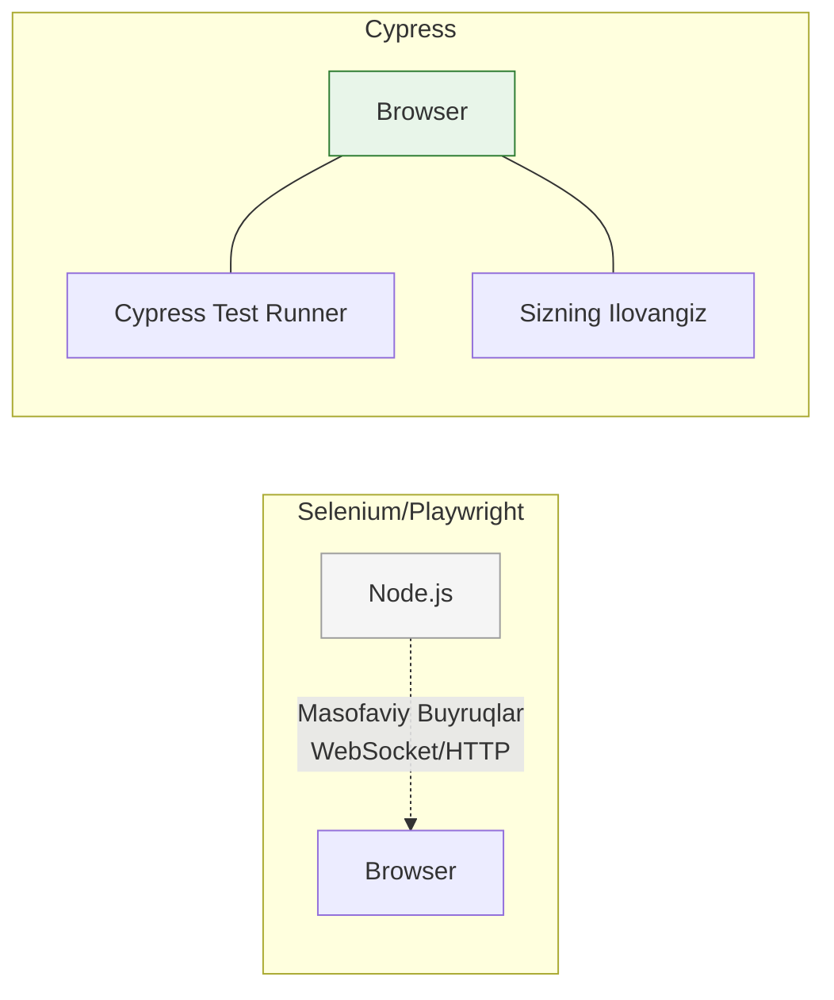

# Cypress

## Kirish

> [!IMPORTANT]
> **Nima uchun muhim?**  
> Dasturingiz o'sgach uni har gal o'zgarish bo'lganda qo'lda test qilib chiqish (Manual QA) juda ko'p vaqt va mablag' talab qiladi. Cypress o'zining "Time Travel" (vaqt bo'ylab sayohat) va "Avtomatik kutish" xususiyatlari orqali, qachonlardir juda murakkab bo'lgan E2E test yozishni xuddi jQuery kod yozishdek oson va qiziqarli qilib yubordi.

> [!NOTE]
> **Real-hayot analogiyasi: "Sirkdagi O'rgatilgan Ayiq vs Odam kiyimidagi Robot"**  
> **Selenium (Eski usul):** Robotni masofadan boshqarish. Buyruqlar network orqali boradi. U robot nima qilayotganini va atrofni qanchalik to'g'ri ko'rayotganini tushunmaydi (Network gecikmelari, sinishlar ko'p).
> **Cypress (Zamonaviy usul):** Bu sizning dasturingiz bilan bitta sirk (brauzer) ichida ishlaydigan ayiq. U qachon animatsiya tugashini, qachon ma'lumot kelishini darhol "his qiladi". Siz unga "Kutib tur!" deyishingiz shart emas, u o'zi vaziyatga qarab ish tutadi.

Cypress - bu zamonaviy E2E testing framework. U brauzerni ichidan turib, to'g'ridan to'g'ri ilovangiz bilan bitta context'da ishlaydi.



---

## 🟢 Junior (Asoslar va Tushunchalar)

Junior dasturchi Cypress-ni o'rnata olishi, oddiy sahifaga kirish, inputga yozish va tugmani bosib natijani tekshirishni bilishi kerak.

### Cypress-ni ishga tushirish

```bash
# Cypress o'rnatish
npm install -D cypress

# Cypress oynasini ochish
npx cypress open
```

### Oddiy Test Yozish
Cypress buyruqlari odatda zanjirdek ulanib ketadi (`cy.get().type().should()`). 

```typescript
// cypress/e2e/login.cy.ts
describe('Login Sahifasi', () => {
  it('Foydalanuvchi tizimga muvaffaqiyatli kira oladi', () => {
    // 1. Saytni ochamiz
    cy.visit('/login')

    // 2. Email kiritamiz
    cy.get('[data-testid="email-input"]')
      .type('admin@example.com')

    // 3. Parol kiritamiz
    cy.get('[data-testid="password-input"]')
      .type('supermaxfiy123')

    // 4. Tugmani bosamiz
    cy.get('[data-testid="submit-btn"]')
      .click()

    // 5. Natijani tekshiramiz (URL o'zgarganmi?)
    cy.url().should('include', '/dashboard')
    
    // Yoki ekranda muvaffaqiyatli matn chiqqanmi?
    cy.contains('Xush kelibsiz').should('be.visible')
  })
})
```

---

## 🟡 Middle (Amaliyot va Detallar)

Middle dasturchi har bir test o'rtasida takrorlanuvchi kodlarni qisqartirishni (Custom Commands), tarmoq so'rovlarini aldab (Mocking) ishlashni biladi.

### Tarmoq so'rovlarini kutish va Mock qilish (cy.intercept)
UI interfeys testlanayotganda haqiqiy serverdan javob kutish sekinlashuvga olib keladi. Qolaversa bazada doim ham to'g'ri test ma'lumotlari bo'lmasligi mumkin. Shuning uchun Backend API ni soxtalashtiramiz.

```typescript
describe('Foydalanuvchilar Ro\'yxati', () => {
  it('Serverdan ma\'lumot yuklanmaguncha kuting va mock oling', () => {
    
    // /api/users manziliga boradigan so'rovni ilib olib, unga soxta javob (stub) o'rnatamiz
    cy.intercept('GET', '/api/users', {
      statusCode: 200,
      body: [
        { id: 1, name: 'Ali' },
        { id: 2, name: 'Vali' }
      ],
      delay: 1000 // Aytaylik server 1 soniya o'ylandi
    }).as('getUsers') // Bunga laqab beramiz (alias)

    cy.visit('/users')
    
    // "Yuklanmoqda..." xabari chiqqanini tekshiramiz
    cy.get('[data-testid="loading"]').should('be.visible')

    // Yuqoridagi @getUsers tugashini (1 soniya) aniq kutamiz
    cy.wait('@getUsers')

    // Endi ro'yxatda 2 ta element chiqqanini aniq bilamiz
    cy.get('[data-testid="user-row"]').should('have.length', 2)
  })
})
```
> **Diqqat!** `cy.wait(3000)` kabi raqamli kutish o'rniga, har doim tarmog'ning `cy.wait('@alias')` javobi kutilishi eng zo'r amaliyotdir (Best Practice).

### Maxsus Buyruqlar (Custom Commands)
Har doim login qilish kodini 4 qator qilib yozmaslik uchun "Custom Command" yaratiladi.

```typescript
// cypress/support/commands.ts faylida
Cypress.Commands.add('login', (email, password) => {
  cy.visit('/login')
  cy.get('[data-testid="email"]').type(email)
  cy.get('[data-testid="password"]').type(password)
  cy.get('[data-testid="submit"]').click()
})

// E2E faylda ishlatilishi:
it('Profilni tekshirish', () => {
  cy.login('admin@test.com', '123') // 1 qator kod bilan login qildik!
  cy.visit('/profile')
})
```

---

## 🔴 Senior (Arxitektura va Optimizatsiya)

Senior dasturchi Cypress testlarni mustaqil (isolated) saqlashni, testlarni CI/CD orqali uzluksiz integratsiya qilishni va ma'lumotlarni o'rnatish uchun Data Seeding strategiyalarini belgilaydi.

### Sessiyalarni Boshqarish (cy.session)
Testlar tez ishlashi kerak. Agar loyihada 50 ta E2E test bo'lsa va har biri `cy.login()` ishlatsa, 50 marta brauzer login sahifasini ochishi va tokenni saqlashi kerak bo'ladi. `cy.session` bir marta auth qilib olib, tokenni (cookies) barcha testlar uchun Xesh qilib xotirada ushlab turadi.

```typescript
Cypress.Commands.add('fastLogin', (email, password) => {
  // session() - agar bu email parol avval ishlatilgan bo'lsa 
  // ichidagi login jarayonini o'tkazib yuboradi, va to'g'ridan to'g'ri tokenni yozib qo'yadi.
  cy.session([email, password], () => {
    
    // Yana bir optimizatsiya: UI orqali kirmasdan to'g'ridan-to'g'ri 
    // API ga POST request yuborib auth qilamiz (tezroq ishlashi uchun)
    cy.request('POST', '/api/auth/login', { email, password })
      .then((response) => {
        // Tokkeni brauzer xotirasiga yozamiz
        window.localStorage.setItem('token', response.body.token)
      })
      
  })
})
```

### Intervyu Savoli
**"Cypress boshqa E2E tool'lardan (masalan Selenium-dan) arxitektura jihatdan nimasi bilan farq qiladi?"**
*Javob:* 
Selenium va Playwright kabi toollar brauzerning tashqarisida ishlaydi (Node.js orqali) va brauzerga tarmoq (Remote WebDriver/CDP) orqali buyruq yuboradi. Cypress esa brauzerning ichida, ilovangiz aylanayotgan aynan o'sha Event Loop da birga yashaydi. Bu degani Cypress UI'dagi har qanday o'zgarishni va Network request'ni sinxron holatda seza oladi. Shuning uchun unda "Kutish" (`wait`) deyarli kerak bo'lmaydi. Kamchiligi - u iFramelar bilan yoki 2 xil domen (masalan o-auth login) bilan ishlashda biroz qiynaladi.

---

## Eng Yaxshi Amaliyotlar (Best Practices)

1. **`cy.wait(ms)` ishlatmang**: Hech qachon `cy.wait(3000)` kabi qattiq vaqt belgilamang. Uning o'rniga Tarmoq so'rovlarini ushlab olib (intercept), o'sha so'rovning yakunlanishini kuting (`cy.wait('@getUsers')`).
2. **`data-testid` ishlating**: Elementlarni CSS class (`.btn-primary`) yoki id orqali topmang. Dizaynerlar CSSni tez-tez o'zgartirib turadi va testlaringiz doim qulaydi. Test uchun ataylab `data-testid="submit-button"` attributlarini ishlating.
3. **Session'dan foydalaning**: Har bir sahifani test qilishda avval foydalanuvchini UI orqali login qildirish juda ko'p vaqt oladi. `cy.session()` orqali login holatini barcha testlar uchun bitta martada saqlab oling va sekin UI ni emas to'g'ridan-to'g'ri Backend API loginini ishlating (`cy.request()`).

---

## Xulosa

Cypress - zamonaviy Frontend dasturchilar uchun test yozishni og'riqsizlantiruvchi, "Visual" (ko'z bilan ko'rib) ishlash imkonini beruvchi zo'r quroldir.

| Xususiyat | Tavsif | Foydasi |
| --- | --- | --- |
| **Time Travel** | Har bir qadamni vizual qayta ko'rish | Xatoni (Bugni) oson topish (Debugging) |
| **cy.intercept** | Backend so'rovlarini aldash yoki to'sish | Tarmoqni nazorat qilib tezroq testlash |
| **data-testid** | Cypressga xos maxsus izlovchi marker | Dizayn/CSS o'zgarganda test qulamasligi |
| **cy.session** | Foydalanuvchi holatini ushlab turish | Har bir testda qayta-qayta login qilib yotmaslik |
