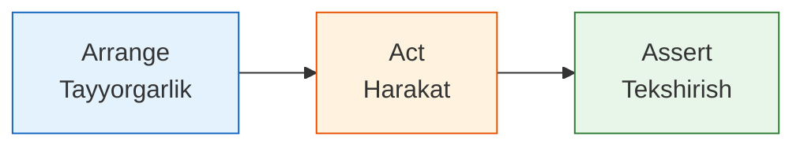

# Testing Patterns

## Kirish

> [!IMPORTANT]
> **Nima uchun muhim?**  
> Testlarni yozish qiyin emas, ammo "yaxshi tushuniladigan" va "oson xizmat ko'rsatiladigan" (maintainable) testlarni yozish katta tajriba talab qiladi. Dasturchilar o'nlab yillar davomida to'plagan eng yaxshi yondashuvlarni (Pattern'larni) o'rganish orqali, siz 10 qatorli "tushunib bo'lmaydigan" test o'rniga, o'z-o'zini tushuntiradigan professional kod yozishni o'rganasiz.

> [!NOTE]
> **Real-hayot analogiyasi: "Pishiriq tayyorlash" (AAA Pattern)**  
> **Arrange (Tayyorlash):** Unni o'lchash, tuxumni chaqish, idishlarni tayyorlash.
> **Act (Harakat):** Masalliqlarni pechda 200 gradusda 30 daqiqa pishirish.
> **Assert (Tekshirish):** Pishiriqni pichoq bilan kesib ko'rish (ichiga pishganmi yo'qmi) va ta'mini tatib ko'rish. Agar siz bu ketma-ketlikni buzsangiz (avval pishirib, keyin tuxum qo'shsangiz), tort o'xshamaydi. Testlarda ham xuddi shunday qat'iy tartib bor.

Testing patterns - bu takrorlanadigan test muammolarini hal qilish uchun ishlatiladigan yondashuvlar va best practice'lar. 



---

## 🟢 Junior (Asoslar va Tushunchalar)

Junior dasturchi "Arrange-Act-Assert" (AAA) va "Given-When-Then" (GWT) patternlarini bilishi, o'qilishi oson kod yoza olishi kerak.

### Arrange-Act-Assert (AAA)
Bu barcha testlarning "Oltin Qoidasi"dir. Har bir testni mantiqan 3 qismga bo'lish shart.

```typescript
import { test, expect } from 'vitest'

test('Xarid savati narxni chegirma bilan hisoblaydi', async () => {
  // 1. ARRANGE (Tayyorgarlik) - Kerakli narsalarni yasash
  const cart = new ShoppingCart()
  cart.addItem({ name: 'Laptop', price: 1000 })
  const coupon = { code: 'SAVE20', discount: 20 }

  // 2. ACT (Harakat) - Test qilinayotgan tugmani bosish / funksiyani ishga tushirish
  const result = await cart.checkout(coupon)

  // 3. ASSERT (Tekshirish) - Kutilgan natijani solishtirish
  expect(result.subtotal).toBe(1000)
  expect(result.total).toBe(800) // 20% chegirma
})
```
*Junior xatosi:* Ba'zida yangi o'rganuvchilar bitta test ichida 3 marta Action, va 5 marta Assert yozib tashlashadi. Yodingizda tuting: **Bitta test = Bitta G'oya (Concept)**.

### Given-When-Then (GWT)
Bu xuddi BDD (Behavior-Driven Development) kabi bo'lib, xuddi ingliz tilida "Qachonki shunday bo'lsa, bunday qilish kerak" deb yozgandek bo'ladi.

```typescript
describe('Login Tizimi', () => {
  describe('Given (Berilgan): Noto\'g\'ri parol va email', () => {
    const invalidData = { email: 'wrong@mail', pass: '123' }

    describe('When (Qachonki): Foydalanuvchi "Kirish"ni bossa', () => {
      let result;
      beforeEach(async () => {
         result = await authService.login(invalidData);
      })

      it('Then (Unda): Tizim xato qaytarishi kerak', () => {
        expect(result.success).toBe(false)
        expect(result.error).toBe('Invalid credentials')
      })
    })
  })
})
```

---

## 🟡 Middle (Amaliyot va Detallar)

Middle dasturchi kodlarning har xil "Test Double"lari: Dummy, Stub, Mock, Spy'larni bir-biridan ajrata olishi va Parameterized Testlar yozishni bilishi kerak.

### Test Doubles (O'rinbosarlar) farqlari

1. **Dummy:** Hech narsa qilmaydi. U faqat TypeScript yoki boshqa Types xato bermasligi uchun funksiyaga ulanadi. (Masalan ichi bo'sh funksiya).
2. **Stub:** Har doim bir xil qotirilgan (hardcoded) javob qaytaradi.
3. **Spy:** Funksiyaning qachon va qanday parametrlar bilan chaqirilganini (konsolga yozilganini) kuzatib turadigan josus.
4. **Mock:** Ham kuzatadi, ham soxta javob (stub) qaytaradi. Boshqariladigan qo'g'irchoq.

### Stub va Mock farqi:
```typescript
// STUB misoli (Bu javob berishini bilamiz):
class StubUserRepository {
  async findById(id) {
    // API ga murojaat qilib o'tirmasdan, doim tayyor javob beramiz
    return { id: 1, name: 'Tayyor Odam' } 
  }
}

// MOCK va SPY misoli (qachon, qanday chaqirilganini sanaymiz):
test('Email jonatilganda, SendGrid api si chaqiriladimi?', async () => {
  const emailService = {
    // vi.fn() orqali qo'g'irchoq yasaymiz
    send: vi.fn().mockResolvedValue({ status: 'ok' }) 
  }

  const notification = new NotificationService(emailService)
  await notification.sendWelcome('ali@mail.com')

  // Aynan 1 marta va aynan shu paramter bilan ishlaganmi? (Spying)
  expect(emailService.send).toHaveBeenCalledTimes(1)
  expect(emailService.send).toHaveBeenCalledWith({ to: 'ali@mail.com' })
})
```

### Parameterized Tests (Ko'p parametrli testlar)
Bir xil logikani 10 ta har xil parametr bilan test qilishingiz kerak bo'lsa (Masalan 10 xil noto'g'ri email formatlari), 10 marta AAA ko'chirish o'rniga "Data-Driven" usul qo'llaniladi.

```typescript
// Vitest dagi test.each syntax'si
describe('Email tekshiruvi', () => {
  test.each([
    ['admin@example.com', true], // To'g'ri
    ['user.name@domain.org', true], // To'g'ri
    ['invalid', false], // Noto'g'ri
    ['@nodomain.com', false], // Noto'g'ri
    ['spaces in@email.com', false] // Noto'g'ri
  ])('validateEmail(%s) = %s javob qaytarishi kerak', (email, expectedResult) => {
    
    // 5 marta shu funksiya turli ma'lumot bilan avtomatik yurgiziladi
    expect(validateEmail(email)).toBe(expectedResult) 
    
  })
})
```

---

## 🔴 Senior (Arxitektura va Optimizatsiya)

Senior dasturchi kod strukturasini **Object Mother** va **Builder** kabi arxitektura patternlari yordamida izolyatsiya qiladi va ma'lumotlar bazasi (DB) testlarida tranzaksiyalarni to'g'ri bekor qilishni biladi.

### Builder Pattern
10 qatorlik foydalanuvchi ob'ektini yuzlab testlarda qo'lda yasab chiqish katta xato. Buning o'rniga "Zavod" yasaladi:

```typescript
// UserBuilder.ts - Testlar uchun doim kerak bo'ladigan toza ob'ektlar yasab beruvchi pattern
class UserBuilder {
  private user = {
    id: 1, name: 'Default', email: 'def@mail.com', role: 'user', isActive: true
  }

  // Chain methods
  asAdmin() { this.user.role = 'admin'; return this; }
  inactive() { this.user.isActive = false; return this; }
  withEmail(email: string) { this.user.email = email; return this; }
  
  build() { return { ...this.user }; }
}

// Qanchalik o'qish osonligini qarang:
test('Admin admin-panelga kira oladi', () => {
  const adminUser = new UserBuilder().asAdmin().build()
  const inactiveUser = new UserBuilder().inactive().withEmail('block@test.com').build()
  
  expect(authService.canEnter(adminUser)).toBe(true)
  expect(authService.canEnter(inactiveUser)).toBe(false)
})
```

### Database Isolation (Bazani izolyatsiya qilish)
Testlar ishlayotganda u asl ma'lumotlar bazasini o'zgartirmasligi (yoki kiritgan informatsiyasini boshqa testda xalaqit qilmasligi uchun o'chirib tashlashi) kerak.

```typescript
// Vitest Setup
describe('Database bilan ishlovchi test', () => {
  let transaction;

  beforeEach(async () => {
    // Test boshlanishidan oldin TRANZAKSIYA ochamiz (masalan PostgreSQL da)
    transaction = await db.beginTransaction()
  })

  afterEach(async () => {
    // Test tugagach, nima qilgan bo'lsa hammasini ORQAGA QAYTARAMIZ (Rollback).
    // Shunda keyingi test uchun baza yana toza bo'lib qoladi.
    await transaction.rollback()
  })

  test('user qo\'shiladi', async () => {
    await userRepo.create({ name: 'Ali' }, { transaction })
    // Asserting...
  })
})
```

### Intervyu Savoli
**"Stub va Mock ning farqi nimada? Qachon qaysi birini ishlatamiz?"**
*Javob:* 
Ikkisi ham "Test Double" (O'rinbosar). 
**Stub** - bu "state-based" (holatga qaratilgan) test. Biz undan ma'lum bir oldindan kelishilgan natijani (masalan JSON ob'ektni) qaytarishni so'raymiz. Maqsad o'sha natija bilan bizning sistemamiz ishlashini bilish.
**Mock** - bu "interaction-based" (aloqaga qaratilgan) test. U Stub funksiyasini bajara olishi bilan birga, biz undan "Sen qachon chaqirilding? Qaysi ma'lumot (parametr) bilan chaqirilding? Necha marta chaqirilding?" deb so'ray olamiz. Odatda Email jo'natish, 3-tomon API'lariga so'rov tashlash kabi hollarda asosan Mock/Spy ishlatiladi.

---

## Eng Yaxshi Amaliyotlar (Best Practices)

1. **Bitta Assert (G'oya) Qoidasi**: Har bir test imkon qadar faqat "Bitta Narsani" tekshirishi kerak. Bitta test ichida ham qidiruvni, ham savatni, ham to'lovni test qilish uning nima maqsadda yozilganini xiralashtiradi. Agar bitta funksiya turli natijalar bersa, uni turli testlarda tekshiring.
2. **Qismlarni vizual ajratib qo'ying**: AAA patternini ishlatganda, kodingiz o'qilishini osonlashtirish uchun qismlar orasida 1 qator bo'sh joy qoldiring yoki `// Arrange`, `// Act`, `// Assert` kommentlarini ishlatib keting.
3. **Sehrli raqamlarni yo'qoting**: Testdagi "5" yoki "100" qayerdan kelganligini bilish qiyin bo'lishi mumkin. O'zgaruvchilarga mantiqiy nomlar bering (masalan: `const DISCOUNT_PERCENTAGE = 20;`).

---

## Xulosa

Testing patterns sizning testingiz mo'rt yoki ko'chaga chiqishga tayyor mustahkam zirh ekanligini belgilab beradi.

| Yondashuv | Maqsadi |
| --- | --- |
| **AAA (Arrange-Act-Assert)** | Test qismlarini tartibli, qoidalarga mos bo'lishi |
| **Test Doubles** | Kod boshqa tashqi tizimlarga bog'lanib qolishining oldini olish (Mock, Stub) |
| **Builder / Factory** | Murakkab test datalarini generatsiya qilib berish |
| **Parameterized Tests** | Ko'p ssenariylarni bir qolipda, Data-driven usulda tekshirish |
| **Database Isolation** | Tranzaksiyalar (Rollback) orqali testlarni toza holatda ushlash |
