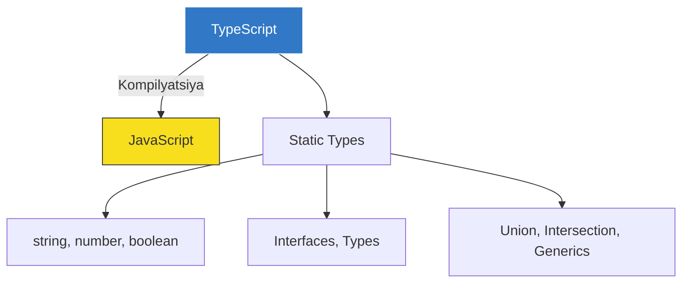

# TypeScript Asoslari: Types va Interfaces

## Kirish

> [!IMPORTANT]
> **Nima uchun muhim?**  
> TypeScript JavaScript'ga tiplar (types) qo'shadi. Bu xuddi qoidalari qat'iy yozilgan shartnomaga o'xshaydi: qanday ma'lumot kiritish kerakligi oldindan aytiladi. Shunda siz kod ishlamasdan oldin (yozish jarayonidayoq) xatolarni ko'rasiz, ilovangiz buzilmaydi.

> [!NOTE]
> **Real-hayot analogiyasi: "Pochtachi va Posilka"**  
> **JavaScript:** Pochtachi (Funksiya) har qanday posilkani olib ketaveradi. Agar siz unga televizor qutisini ichida suv yuborsangiz, yo'lda u suv oqib ketib hamma narsani buzadi (Runtime Error).
> **TypeScript:** Pochtachi oldida tekshiruvchi (Compiler) turibdi. U qutining ustiga yozilgan yorliqqa (Type) qaraydi: "Bu qutida faqat televizor bo'lishi kerak!". Ichini ochib tekshiradi va agar suv bo'lsa, qutini pochtachiga bermaydi (Compile-time Error).

TypeScript JavaScript'ning barcha primitive tiplarini qo'llab-quvvatlaydi va qo'shimcha kuchli tip tizimini taqdim etadi.



---

## 🟢 Junior (Asoslar va Tushunchalar)

Junior dasturchi sodda ma'lumotlar turlarini, massivlarni (Arrays) aniqlashni, va ob'ektlarning qoliplari (Interfaces) qanday ishlashini bilishi kerak.

### Primitive Types
Oddiy o'zgaruvchilarga qanday qilib tiplar beriladi? 

```typescript
// Oddiy tiplar (Primitives)
let name: string = "Ali";
let age: number = 25;
let isStudent: boolean = true;

// Ko'p hollarda TS o'zi topib oladi (Type Inference)
let city = "Toshkent"; // TS "city" ni o'zi 'string' deb qabul qiladi
```

JavaScript'dan farqli o'laroq, endi siz `age` o'zgaruvchisiga so'z ishlata olmaysiz: `age = "yigirma besh"; // Xato!`.

### any, unknown, void
Agar siz tipini bilmasangiz nima qilasiz?
- `any`: Barcha qoidalarni o'chirib, ob'ektni xuddi yovvoyi JS kabi o'z holiga qo'yadi. (Sira tavsiya etilmaydi!)
- `unknown`: Xuddi `any` ga o'xshaydi, lekin uni ishlatishdan oldin bu nima ekanini `if` bilan tekshirishga majbur qiladi. Bu ancha xavfsizroq.
- `void`: Funksiya o'zidan hech narsa qaytarmasligini (return yo'q) bildiradi.

```typescript
function printMessage(msg: string): void {
  console.log(msg); // Bu funksiya hech narsa qaytarmaydi
}
```

### Arrays (Massivlar) va Tuples
Massivlarda qanday tiplarni saqlash mumkinligini aytib o'tamiz:

```typescript
let scores: number[] = [90, 85, 100];
let students: string[] = ["Hasan", "Husan"];

// Agar massiv aralash bo'lsa (Tuple - aniq uzunlik va tartibga ega massiv)
let userStats: [string, number, boolean] = ["Ali", 20, true];
```

---

## 🟡 Middle (Amaliyot va Detallar)

Middle dasturchi Interface va Type'larning farqini to'liq anglaydi, ob'ektlar bilan ishlaganda murakkab tiplarni qo'llay oladi va Union (`|`) / Intersection (`&`) qanday ishlashini biladi.

### Interface vs Type
Ob'ektlarning qolipini ikki xil yo'l bilan yozish mumkin:

```typescript
// 1. Interface bilan yozish (Ob'ektlar uchun ko'proq tavsiya qilinadi)
interface User {
  id: number;
  name: string;
  email?: string; // ? belgisi bu maydonni ixtiyoriy (optional) qiladi
}

// 2. Type bilan yozish (Ko'proq aralash/birlashgan tiplar uchun)
type Status = "pending" | "success" | "error"; // Faqat shu 3 ta so'z bo'lishi mumkin!

let requestStatus: Status = "success"; // OK
// requestStatus = "failed"; // XATO! "failed" Status ro'yxatida yo'q
```

**Qaysi birini qachon ishlatamiz?**
Umumiy qoida shuki, **ob'ektlar va klasslar** ning shaklini belgilash uchun `interface` ishlating. Agar siz oddiy turlarni, qatorlarni (string) yoki aralash narsalarni tip demoqchi bo'lsangiz `type` ishlating. 

### Union (|) va Intersection (&) Types
Ba'zida bitta funksiya xilma-xil ma'lumotlarni qabul qila olishi kerak:

```typescript
// Union (YOKI) - Ikki xil tipdan birortasi kela oladi
function formatID(id: string | number) {
  if (typeof id === "string") {
    return id.toUpperCase();
  }
  return id.toString(); // Agar string bo'lmasa, demak number
}

// Intersection (VA) - Ikkita tipni bittaga birlashtirish
interface Employee {
  salary: number;
}
interface Manager {
  department: string;
}

// Type yordamida ikkalasini bitta "SuperManager"ga aylantiramiz
type SuperManager = Employee & Manager;

const boss: SuperManager = {
  salary: 5000,
  department: "IT"
}
```

---

## 🔴 Senior (Arxitektura va Optimizatsiya)

Senior dasturchi tip arxitekturasini ishonchli (Type-safe) va moslashuvchan qiladi. U API'lardan kelgan unknown tipdagi javoblarni to'g'ri qayta ishlashni (Type Guarding), va qattiq o'zgartirib bo'lmaydigan (Immutability) strukturani qura oladi.

### Type Guards (Tip Soqchilari)
Qachonki bizga noma'lum `unknown` turidagi ob'ekt kelsa, u haqiqatan ham biz izlayotgan ob'ekt ekanini xavfsiz tekshirib olishimiz kerak. Bu Custom Type Guard (o'zimiz yasagan tip himoyasi) deyiladi:

```typescript
interface Car { wheels: 4; drive: () => void }
interface Boat { propellers: 2; float: () => void }

// Bu funksiya rost (true) qaytarsa, TypeScript "ha bu Car ekan" deb tushunadi.
// 'vehicle is Car' yozuvi — shuni tasdiqlovchi mo'jizaviy imzo.
function isCar(vehicle: any): vehicle is Car {
  return (vehicle as Car).wheels !== undefined;
}

function startEngine(vehicle: Car | Boat) {
  if (isCar(vehicle)) {
    // isCar rost qaytarsa, vehicle faqatgina Car ekani ma'lum, shuning uchun 'drive' xato bermaydi
    vehicle.drive(); 
  } else {
    // Agar Car bo'lmasa, u albatta Boat. TypeScript buni ham tushundi.
    vehicle.float();
  }
}
```

### Discriminated Unions (Farqlovchi birlashmalar)
Ayniqsa Redux reducer'lar yoki State Management'da juda ko'p qo'llaniladigan super-pattern:

```typescript
// Hamma state'larning umumiy qismi (tag) bor
interface LoadingState { status: 'loading' }
interface SuccessState { status: 'success'; data: string[] }
interface ErrorState { status: 'error'; message: string }

type AppState = LoadingState | SuccessState | ErrorState;

function renderUI(state: AppState) {
  switch (state.status) {
    case 'loading':
      return "Loading...";
    case 'success':
      // TypeScript state'ning successligini bilsa, "state.data" borligini ham aniq biladi
      return `Loaded ${state.data.length} items`; 
    case 'error':
      return `Failed: ${state.message}`; // Xuddi shunday
  }
}
```

### Readonly va 'as const'
Ko'pincha biz o'zgarmas datalar bilan ishlaymiz va tasodifan kodning qayeridadir qiymat o'zgarib ketishidan qo'rqamiz:

```typescript
const systemConfig = {
  host: 'localhost',
  port: 8080
} as const;

// as const barcha fieldlarni "readonly" ga aylantiradi va tiplarni aniq Literal qilib qo'yadi.
// systemConfig.port = 9000; // XATO! O'zgartirish mumkin emas.
```

### Intervyu Savoli
**"any va unknown tiplarining arxitekturaviy farqi nimada va nima uchun any'dan qochish kerak?"**
*Javob:* 
`any` TypeScript kompilyatorini umuman o'chirib qo'yadi, siz u orqali qanday ob'ekt yoki qanday funksiya chaqirsangiz ham TS "indamaydi" va hamma zarba runtime (ishlash vaqti) ga o'tib dastur qulaydi.
`unknown` esa "Men nima kelganini bilmayman, o'zing ishlatishdan oldin tekshir" deydi. Siz uni tekshirmaguningizcha (`typeof`, `instanceof` yoki Type Guard orqali) ichiga kira olmaysiz va kod yoza olmaysiz. Shuning uchun har doim `any` o'rniga `unknown` ishlatish xavfsiz kod garovidir.

---

## Eng Yaxshi Amaliyotlar (Best Practices)

1. **`any` ni ishlatavermang**: `any` yozdingizmi, TypeScript'ni o'chirib qo'ydingiz degani. Uning o'rniga nima kelishi noma'lum bo'lsa, `unknown` ishlating va Type Guard'lar bilan tekshirib keyin ishlating.
2. **Inference (Avtomatik tip topish)**: Hamma narsaga tip yozish shart emas. `let count = 0` yozganingizda TS uning son ekanini o'zi tushunadi (`let count: number = 0` deyish shart emas). O'zingizni kodga ko'mib yubormang.
3. **Type Alias vs Interface**: Umumiy qoida - obyektlar tuzilishini tasvirlash uchun har doim `interface` ishlating. Boshqa barcha holatlarda (masalan string yoki number'larni birlashtirish) `type` ishlating.
4. **Striktlikni saqlang**: TypeScript config faylida `strict: true` rejimini yoqing. Bu sizni ko'pgina yashirin xatolardan himoya qiladi (masalan, `null` ob'ektlardan field o'qish xatolari).

---

## Xulosa

| Xususiyat | Vazifasi | Qachon ishlatiladi |
| --- | --- | --- |
| **Primitives** | Son, yozuv kabi oddiy qadriyatlarni himoyalash | Deyarli barcha joyda (Inference bilan) |
| **Interfaces** | Ob'ekt shaklini aniqlash va qolip chizish | API'dan keladigan datalarda, obyektlarda |
| **Union ( \| )** | Ikkita tipdan birortasi bo'lishi mumkinligi | 2 xil natija (masalan number YOKI string) qaytganda |
| **Type Guards** | Noma'lum narsaning turini aniqlab olish (`is`) | API'dan xato yoki muvaffaqiyatli ma'lumot kelganda uni ajratish uchun |
| **Readonly** | O'zgaruvchining maydonlarini muzlatish | Konfiguratsiya yoki holat (State) larni ishonchli qilishda |

Keyingi bo'limda Generics'ni chuqur o'rganamiz.
