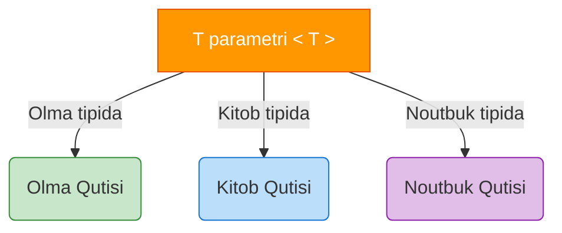

# TypeScript Generics

## Mundarija

1. [Generics Nima?](#generics-nima)
2. [Generic Functions](#generic-functions)
3. [Generic Interfaces](#generic-interfaces)
4. [Generic Classes](#generic-classes)
5. [Generic Constraints](#generic-constraints)
6. [Multiple Type Parameters](#multiple-type-parameters)
7. [Default Type Parameters](#default-type-parameters)
8. [Advanced Generic Patterns](#advanced-generic-patterns)
9. [Real-world Cases](#real-world-cases)
10. [Interview Savollari](#interview-savollari)
11. [Common Mistakes](#common-mistakes)

---

## Generics Nima?

> [!IMPORTANT]
> **Nima uchun muhim?**  
> Dasturlashning eng yomon odati — bir xil kodni qayta-qayta yozishdir (DRY prinsipining buzilishi). Lekin TypeScript'da qat'iy tiplar bo'lgani uchun bitta kod qismi har xil tiplar (masalan, string, number, obyektlar) uchun takrorlanishiga to'g'ri kelib qolishi mumkin. Shunday paytda dasturchilar `any` tipini qo'yib qutulishadi. Lekin `any` bu TS ga tupurishdir. Generics aynan shuning oldini olish uchun yordamga keladi: Bitta logikani har qanday tip bilan (tipni yo'qotmagan holda) ishlatish.

> [!NOTE]
> **Real-hayot analogiyasi: "Quti (Konteyner)"**  
> Oddiy quti tasavvur qiling (unda "Meva" saqlanadi deb yozilgan). U faqat olma yoki apelsin saqlay oladi, kitob soga tiqolmaysiz (Qat'iy Tip). 
> "Sehrli" quti (any) bo'lsa, ichiga nima sosangiz shuni qabul qiladi, lekin ichida nima borligini ko'rmaguningizcha bilmaysiz (Tip xavfsizligi yo'q). 
> **Generic quti:** Bu ustiga yorliq (label) yopishtiriladigan universal qutidir. Siz unga olma solishdan oldin `<Olma>` degan yorliqni yopishtirasiz. Endi qutining ichida nima borligi oldindan kafolatlangan va u faqat olmalarni qabul qiladi. Kitob solmoqchi bo'lsangiz, uni `<Kitob>` degan yangi yorliq bilan boshqa qutiga solasiz.

Generics - bu **tiplarni parametr sifatida qabul qilish** imkoniyati. Bu kod qayta ishlatilishini oshiradi va tip xavfsizligini saqlaydi.



### Muammo: Tip Xavfsizliksiz Qayta Ishlatish

```javascript
// JavaScript - hech qanday tip xavfsizligi yo'q
function identity(value) {
  return value;
}

const result = identity("hello"); // result tipi noma'lum
result.toUpperCase(); // Ishlaydi, lekin IDE yordami yo'q
```

```typescript
// TypeScript - any bilan (yomon)
function identity(value: any): any {
  return value;
}

const result = identity("hello"); // result: any - tip yo'qoldi!
result.toUpperCase(); // Ishlaydi, lekin xato bo'lsa runtime'da
result.nonExistent(); // TypeScript xato bermaydi!
```

### Yechim: Generics

```typescript
// TypeScript - generics bilan (yaxshi)
function identity<T>(value: T): T {
  return value;
}

// Tip saqlanadi
const str = identity("hello");     // str: string
const num = identity(42);          // num: number
const obj = identity({ x: 1 });    // obj: { x: number }

str.toUpperCase(); // OK - TypeScript biladi bu string
num.toFixed(2);    // OK - TypeScript biladi bu number
```

### Generics Anatomiyasi

```typescript
function identity<T>(value: T): T {
  return value;
}
//              ^     ^      ^
//              |     |      |
//              |     |      +-- Return type (T qaytadi)
//              |     +-- Parameter type (T tipli qiymat oladi)
//              +-- Type parameter declaration (T nom)
```

---

## Generic Functions

### Basic Generic Function

```typescript
// Bitta type parameter
function first<T>(arr: T[]): T | undefined {
  return arr[0];
}

const firstNumber = first([1, 2, 3]);     // number | undefined
const firstString = first(["a", "b"]);    // string | undefined

// Explicit type argument
const firstAny = first<number | string>([1, "a", 2]); // number | string | undefined
```

### Arrow Function Generics

```typescript
// Standard arrow function
const identity = <T>(value: T): T => value;

// JSX/TSX fayllarida (React)
// <T> ni <T,> yoki <T extends unknown> deb yozish kerak
const identity = <T,>(value: T): T => value;
const identity = <T extends unknown>(value: T): T => value;
```

### Multiple Operations

```typescript
// Array bilan ishlash
function map<T, U>(arr: T[], fn: (item: T) => U): U[] {
  return arr.map(fn);
}

const numbers = [1, 2, 3];
const doubled = map(numbers, n => n * 2);        // number[]
const strings = map(numbers, n => String(n));    // string[]

// Filter
function filter<T>(arr: T[], predicate: (item: T) => boolean): T[] {
  return arr.filter(predicate);
}

const evens = filter([1, 2, 3, 4], n => n % 2 === 0); // number[]

// Reduce
function reduce<T, U>(
  arr: T[],
  reducer: (acc: U, item: T) => U,
  initial: U
): U {
  return arr.reduce(reducer, initial);
}

const sum = reduce([1, 2, 3], (acc, n) => acc + n, 0); // number
```

### Generic va Overloads

```typescript
// Overload + generic
function wrap<T>(value: T): T[];
function wrap<T>(value: T, count: number): T[];
function wrap<T>(value: T, count: number = 1): T[] {
  return Array(count).fill(value);
}

const single = wrap("hello");      // string[]
const multiple = wrap("hi", 3);    // string[]
```

---

## Generic Interfaces

### Basic Generic Interface

```typescript
// Generic container
interface Container<T> {
  value: T;
  getValue(): T;
  setValue(value: T): void;
}

const numberContainer: Container<number> = {
  value: 42,
  getValue() {
    return this.value;
  },
  setValue(value) {
    this.value = value;
  }
};

// Generic response
interface ApiResponse<T> {
  data: T;
  status: number;
  message: string;
  timestamp: Date;
}

interface User {
  id: number;
  name: string;
}

type UserResponse = ApiResponse<User>;
type UsersResponse = ApiResponse<User[]>;
```

### Generic Method in Interface

```typescript
interface Repository<T> {
  find(id: string): Promise<T | null>;
  findAll(): Promise<T[]>;
  save(entity: T): Promise<T>;
  delete(id: string): Promise<boolean>;

  // Generic method inside generic interface
  findBy<K extends keyof T>(key: K, value: T[K]): Promise<T[]>;
}

interface User {
  id: string;
  name: string;
  email: string;
}

class UserRepository implements Repository<User> {
  private users: Map<string, User> = new Map();

  async find(id: string): Promise<User | null> {
    return this.users.get(id) || null;
  }

  async findAll(): Promise<User[]> {
    return Array.from(this.users.values());
  }

  async save(user: User): Promise<User> {
    this.users.set(user.id, user);
    return user;
  }

  async delete(id: string): Promise<boolean> {
    return this.users.delete(id);
  }

  async findBy<K extends keyof User>(key: K, value: User[K]): Promise<User[]> {
    return Array.from(this.users.values()).filter(user => user[key] === value);
  }
}

// Usage
const repo = new UserRepository();
const johns = await repo.findBy("name", "John"); // Type-safe!
```

### Callable Generic Interface

```typescript
// Function interface
interface Mapper<T, U> {
  (value: T): U;
}

const toString: Mapper<number, string> = (n) => String(n);
const toNumber: Mapper<string, number> = (s) => Number(s);

// Constructor interface
interface Constructor<T> {
  new (...args: any[]): T;
}

function create<T>(Ctor: Constructor<T>, ...args: any[]): T {
  return new Ctor(...args);
}

class Person {
  constructor(public name: string) {}
}

const person = create(Person, "John"); // Person
```

---

## Generic Classes

### Basic Generic Class

```typescript
class Stack<T> {
  private items: T[] = [];

  push(item: T): void {
    this.items.push(item);
  }

  pop(): T | undefined {
    return this.items.pop();
  }

  peek(): T | undefined {
    return this.items[this.items.length - 1];
  }

  isEmpty(): boolean {
    return this.items.length === 0;
  }

  size(): number {
    return this.items.length;
  }
}

// Usage
const numberStack = new Stack<number>();
numberStack.push(1);
numberStack.push(2);
const top = numberStack.peek(); // number | undefined

const stringStack = new Stack<string>();
stringStack.push("hello");
```

### Generic Class with Multiple Parameters

```typescript
class KeyValuePair<K, V> {
  constructor(
    public key: K,
    public value: V
  ) {}

  swap(): KeyValuePair<V, K> {
    return new KeyValuePair(this.value, this.key);
  }
}

const pair = new KeyValuePair("name", 42);
// pair: KeyValuePair<string, number>

const swapped = pair.swap();
// swapped: KeyValuePair<number, string>
```

### Static Members va Generics

```typescript
class Container<T> {
  // Static members generic'ni ko'rmaydi
  static count = 0;

  // Instance members generic'ni ko'radi
  constructor(public value: T) {
    Container.count++;
  }

  // Static generic method (alohida generic)
  static create<U>(value: U): Container<U> {
    return new Container(value);
  }
}

const container = Container.create("hello"); // Container<string>
```

### Generic Class Inheritance

```typescript
// Base generic class
abstract class Repository<T, ID> {
  protected items: Map<ID, T> = new Map();

  abstract findById(id: ID): T | undefined;
  abstract save(item: T): void;

  findAll(): T[] {
    return Array.from(this.items.values());
  }
}

// Concrete implementation
interface User {
  id: string;
  name: string;
}

class UserRepository extends Repository<User, string> {
  findById(id: string): User | undefined {
    return this.items.get(id);
  }

  save(user: User): void {
    this.items.set(user.id, user);
  }

  // Additional methods
  findByName(name: string): User[] {
    return this.findAll().filter(u => u.name === name);
  }
}
```

---

## Generic Constraints

### `extends` bilan Constraint

```typescript
// Constraint: T must have length property
function getLength<T extends { length: number }>(value: T): number {
  return value.length;
}

getLength("hello");        // OK - string has length
getLength([1, 2, 3]);      // OK - array has length
getLength({ length: 10 }); // OK - object has length
// getLength(123);         // ERROR - number has no length

// Constraint with interface
interface Identifiable {
  id: string | number;
}

function findById<T extends Identifiable>(items: T[], id: T["id"]): T | undefined {
  return items.find(item => item.id === id);
}

const users = [
  { id: 1, name: "John" },
  { id: 2, name: "Jane" }
];

const user = findById(users, 1); // { id: number; name: string } | undefined
```

### `keyof` Constraint

```typescript
// K must be a key of T
function getProperty<T, K extends keyof T>(obj: T, key: K): T[K] {
  return obj[key];
}

const user = { name: "John", age: 25 };

const name = getProperty(user, "name"); // string
const age = getProperty(user, "age");   // number
// getProperty(user, "email");          // ERROR: "email" is not keyof user

// More complex example
function pick<T, K extends keyof T>(obj: T, keys: K[]): Pick<T, K> {
  const result = {} as Pick<T, K>;
  keys.forEach(key => {
    result[key] = obj[key];
  });
  return result;
}

const picked = pick(user, ["name"]); // { name: string }
```

### Multiple Constraints

```typescript
// T must extend both interfaces
interface Printable {
  print(): void;
}

interface Saveable {
  save(): void;
}

function process<T extends Printable & Saveable>(item: T): void {
  item.print();
  item.save();
}

class Document implements Printable, Saveable {
  print() { console.log("Printing..."); }
  save() { console.log("Saving..."); }
}

process(new Document()); // OK
```

### Constructor Constraint

```typescript
// T must be constructable
interface Constructor<T = {}> {
  new (...args: any[]): T;
}

function createInstance<T>(Ctor: Constructor<T>): T {
  return new Ctor();
}

class MyClass {
  value = 42;
}

const instance = createInstance(MyClass); // MyClass
console.log(instance.value); // 42
```

---

## Multiple Type Parameters

### Two Type Parameters

```typescript
// Map function
function map<T, U>(arr: T[], transform: (item: T) => U): U[] {
  return arr.map(transform);
}

const numbers = [1, 2, 3];
const strings = map(numbers, n => `Number: ${n}`); // string[]

// Zip function
function zip<T, U>(arr1: T[], arr2: U[]): [T, U][] {
  const length = Math.min(arr1.length, arr2.length);
  const result: [T, U][] = [];

  for (let i = 0; i < length; i++) {
    result.push([arr1[i], arr2[i]]);
  }

  return result;
}

const zipped = zip([1, 2, 3], ["a", "b", "c"]); // [number, string][]
```

### Three or More Type Parameters

```typescript
// Triple
function triple<A, B, C>(a: A, b: B, c: C): [A, B, C] {
  return [a, b, c];
}

// HTTP client
interface HttpClient {
  request<TBody, TResponse, TError = Error>(
    method: string,
    url: string,
    body?: TBody
  ): Promise<TResponse>;
}

// Object merge
function merge<A, B, C>(a: A, b: B, c: C): A & B & C {
  return { ...a, ...b, ...c };
}

const merged = merge(
  { x: 1 },
  { y: "hello" },
  { z: true }
); // { x: number; y: string; z: boolean }
```

### Dependent Type Parameters

```typescript
// K depends on T
function pluck<T, K extends keyof T>(objects: T[], key: K): T[K][] {
  return objects.map(obj => obj[key]);
}

const users = [
  { name: "John", age: 25 },
  { name: "Jane", age: 30 }
];

const names = pluck(users, "name"); // string[]
const ages = pluck(users, "age");   // number[]

// More complex dependency
function createLookup<T, K extends keyof T>(
  items: T[],
  key: K
): Map<T[K], T> {
  const map = new Map<T[K], T>();
  items.forEach(item => {
    map.set(item[key], item);
  });
  return map;
}

const userLookup = createLookup(users, "name"); // Map<string, User>
```

---

## Default Type Parameters

### Basic Defaults

```typescript
// Default type parameter
interface Container<T = string> {
  value: T;
}

const stringContainer: Container = { value: "hello" }; // T = string
const numberContainer: Container<number> = { value: 42 };

// Function with default
function createArray<T = number>(length: number, value: T): T[] {
  return Array(length).fill(value);
}

const numbers = createArray(3, 0);           // number[] (inferred)
const strings = createArray<string>(3, "a"); // string[]

// Multiple defaults
interface ApiResponse<T = unknown, E = Error> {
  data?: T;
  error?: E;
}
```

### Defaults with Constraints

```typescript
// Default must satisfy constraint
interface Identifiable {
  id: string | number;
}

interface DefaultEntity {
  id: string;
  createdAt: Date;
}

function find<T extends Identifiable = DefaultEntity>(
  items: T[],
  id: T["id"]
): T | undefined {
  return items.find(item => item.id === id);
}
```

### Order Rules

```typescript
// Required parameters FIRST, then optional (with defaults)

// YOMON - xato tartib
// interface Bad<T = string, U> { }  // ERROR

// YAXSHI - to'g'ri tartib
interface Good<U, T = string> {
  first: U;
  second: T;
}

// Practical example
interface Repository<
  Entity extends { id: ID },
  ID = string,
  Filter = Partial<Entity>
> {
  find(id: ID): Entity | null;
  findAll(filter?: Filter): Entity[];
}
```

---

## Advanced Generic Patterns

### Conditional Types with Generics

```typescript
// Extract array element type
type ArrayElement<T> = T extends (infer E)[] ? E : never;

type NumArray = ArrayElement<number[]>; // number
type StrArray = ArrayElement<string[]>; // string
type NotArray = ArrayElement<number>;   // never

// Function return type
type ReturnOf<T> = T extends (...args: any[]) => infer R ? R : never;

function greet() { return "hello"; }
type GreetReturn = ReturnOf<typeof greet>; // string

// Unwrap Promise
type Awaited<T> = T extends Promise<infer U> ? U : T;

type PromiseString = Awaited<Promise<string>>; // string
type JustNumber = Awaited<number>;             // number
```

### Mapped Types with Generics

```typescript
// Make all properties optional
type Partial<T> = {
  [K in keyof T]?: T[K];
};

// Make all properties required
type Required<T> = {
  [K in keyof T]-?: T[K];
};

// Make all properties readonly
type Readonly<T> = {
  readonly [K in keyof T]: T[K];
};

// Pick specific keys
type Pick<T, K extends keyof T> = {
  [P in K]: T[P];
};

// Custom: make specific keys optional
type PartialBy<T, K extends keyof T> = Omit<T, K> & Partial<Pick<T, K>>;

interface User {
  id: string;
  name: string;
  email: string;
}

type UserWithOptionalEmail = PartialBy<User, "email">;
// { id: string; name: string; email?: string }
```

### Generic Factory Pattern

```typescript
// Factory function
function createFactory<T>(
  creator: () => T
): () => T {
  let cache: T | null = null;

  return () => {
    if (cache === null) {
      cache = creator();
    }
    return cache;
  };
}

interface Config {
  apiUrl: string;
  timeout: number;
}

const getConfig = createFactory<Config>(() => ({
  apiUrl: "https://api.example.com",
  timeout: 5000
}));

const config1 = getConfig();
const config2 = getConfig(); // Same instance
```

### Builder Pattern with Generics

```typescript
class QueryBuilder<T> {
  private query: {
    select?: (keyof T)[];
    where?: Partial<T>;
    orderBy?: keyof T;
    limit?: number;
  } = {};

  select<K extends keyof T>(...fields: K[]): QueryBuilder<Pick<T, K>> {
    this.query.select = fields as any;
    return this as any;
  }

  where(conditions: Partial<T>): this {
    this.query.where = { ...this.query.where, ...conditions };
    return this;
  }

  orderBy(field: keyof T): this {
    this.query.orderBy = field;
    return this;
  }

  limit(count: number): this {
    this.query.limit = count;
    return this;
  }

  build(): string {
    // Generate SQL or query object
    return JSON.stringify(this.query);
  }
}

interface User {
  id: number;
  name: string;
  email: string;
  age: number;
}

const query = new QueryBuilder<User>()
  .select("id", "name")
  .where({ age: 25 })
  .orderBy("name")
  .limit(10)
  .build();
```

---

## Real-world Cases

### Case 1: Type-Safe Event Emitter

```typescript
// Event map definition
interface EventMap {
  userLogin: { userId: string; timestamp: number };
  userLogout: { userId: string };
  pageView: { path: string; duration: number };
  error: { code: number; message: string };
}

// Type-safe event emitter
class TypedEventEmitter<T extends Record<string, unknown>> {
  private listeners: {
    [K in keyof T]?: Array<(payload: T[K]) => void>;
  } = {};

  on<K extends keyof T>(event: K, listener: (payload: T[K]) => void): () => void {
    if (!this.listeners[event]) {
      this.listeners[event] = [];
    }
    this.listeners[event]!.push(listener);

    // Return unsubscribe function
    return () => {
      const arr = this.listeners[event];
      if (arr) {
        const idx = arr.indexOf(listener);
        if (idx > -1) arr.splice(idx, 1);
      }
    };
  }

  emit<K extends keyof T>(event: K, payload: T[K]): void {
    this.listeners[event]?.forEach(fn => fn(payload));
  }

  once<K extends keyof T>(event: K, listener: (payload: T[K]) => void): void {
    const unsubscribe = this.on(event, (payload) => {
      unsubscribe();
      listener(payload);
    });
  }
}

// Usage
const emitter = new TypedEventEmitter<EventMap>();

// Type-safe listeners
emitter.on("userLogin", ({ userId, timestamp }) => {
  console.log(`User ${userId} logged in at ${timestamp}`);
});

// Type-safe emit
emitter.emit("userLogin", {
  userId: "123",
  timestamp: Date.now()
});

// Type error
// emitter.emit("userLogin", { userId: "123" }); // ERROR: missing timestamp
```

### Case 2: Generic API Client

```typescript
// API configuration
interface ApiConfig {
  baseUrl: string;
  headers?: Record<string, string>;
  timeout?: number;
}

// Request options
interface RequestOptions {
  headers?: Record<string, string>;
  params?: Record<string, string | number>;
}

// API response wrapper
interface ApiResponse<T> {
  data: T;
  status: number;
  headers: Headers;
}

// Generic API client
class ApiClient {
  constructor(private config: ApiConfig) {}

  private async request<TResponse>(
    method: string,
    endpoint: string,
    body?: unknown,
    options?: RequestOptions
  ): Promise<ApiResponse<TResponse>> {
    const url = new URL(endpoint, this.config.baseUrl);

    if (options?.params) {
      Object.entries(options.params).forEach(([key, value]) => {
        url.searchParams.set(key, String(value));
      });
    }

    const response = await fetch(url.toString(), {
      method,
      headers: {
        "Content-Type": "application/json",
        ...this.config.headers,
        ...options?.headers
      },
      body: body ? JSON.stringify(body) : undefined
    });

    const data = await response.json();

    return {
      data: data as TResponse,
      status: response.status,
      headers: response.headers
    };
  }

  get<TResponse>(endpoint: string, options?: RequestOptions) {
    return this.request<TResponse>("GET", endpoint, undefined, options);
  }

  post<TBody, TResponse>(endpoint: string, body: TBody, options?: RequestOptions) {
    return this.request<TResponse>("POST", endpoint, body, options);
  }

  put<TBody, TResponse>(endpoint: string, body: TBody, options?: RequestOptions) {
    return this.request<TResponse>("PUT", endpoint, body, options);
  }

  delete<TResponse>(endpoint: string, options?: RequestOptions) {
    return this.request<TResponse>("DELETE", endpoint, undefined, options);
  }
}

// Usage
interface User {
  id: number;
  name: string;
  email: string;
}

interface CreateUserDto {
  name: string;
  email: string;
}

const api = new ApiClient({
  baseUrl: "https://api.example.com",
  headers: { "Authorization": "Bearer token" }
});

// Type-safe API calls
const users = await api.get<User[]>("/users");
const user = await api.post<CreateUserDto, User>("/users", {
  name: "John",
  email: "john@example.com"
});
```

### Case 3: Generic State Management

```typescript
// State slice definition
interface StateSlice<T> {
  state: T;
  getState(): T;
  setState(partial: Partial<T> | ((state: T) => Partial<T>)): void;
  subscribe(listener: (state: T) => void): () => void;
}

// Create store function
function createStore<T extends object>(initialState: T): StateSlice<T> {
  let state = initialState;
  const listeners = new Set<(state: T) => void>();

  return {
    state,

    getState() {
      return state;
    },

    setState(partial) {
      const nextState = typeof partial === "function"
        ? partial(state)
        : partial;

      state = { ...state, ...nextState };
      listeners.forEach(listener => listener(state));
    },

    subscribe(listener) {
      listeners.add(listener);
      return () => listeners.delete(listener);
    }
  };
}

// Selector helper
function createSelector<T, R>(
  store: StateSlice<T>,
  selector: (state: T) => R
): () => R {
  return () => selector(store.getState());
}

// Usage
interface AppState {
  user: { name: string; email: string } | null;
  theme: "light" | "dark";
  notifications: string[];
}

const store = createStore<AppState>({
  user: null,
  theme: "light",
  notifications: []
});

// Type-safe state updates
store.setState({ theme: "dark" });
store.setState(state => ({
  notifications: [...state.notifications, "New message"]
}));

// Type-safe selectors
const getUser = createSelector(store, state => state.user);
const getTheme = createSelector(store, state => state.theme);
```

---

## Interview Savollari

### 1. Generic constraints (`extends`) nima va qachon ishlatiladi?

**Javob:**

```typescript
// Generic constraint - type parameter'ga talab qo'yish

// 1. Property constraint
function getLength<T extends { length: number }>(value: T): number {
  return value.length;
}

// T har qanday tip bo'lishi mumkin, LEKIN length: number property'ga ega bo'lishi SHART

getLength("hello");      // OK - string has length
getLength([1, 2, 3]);    // OK - array has length
getLength({ length: 5 }); // OK
// getLength(123);       // ERROR - number has no length

// 2. keyof constraint
function getProperty<T, K extends keyof T>(obj: T, key: K): T[K] {
  return obj[key];
}
// K faqat T'ning mavjud kalitlari bo'lishi mumkin

// 3. Interface constraint
interface Printable {
  print(): void;
}

function printAll<T extends Printable>(items: T[]): void {
  items.forEach(item => item.print());
}
// T Printable interface'ni implement qilishi kerak

// Qachon ishlatiladi?
// - Generic'dan aniq behavior kutilganda
// - Type-safe property access uchun
// - API contract'larni majburlash uchun
```

### 2. `infer` keyword nima va qanday ishlaydi?

**Javob:**

```typescript
// infer - conditional type ichida yangi type variable yaratish

// 1. Function return type ni olish
type ReturnType<T> = T extends (...args: any[]) => infer R ? R : never;

function greet(): string { return "hello"; }
type GreetReturn = ReturnType<typeof greet>; // string

// 2. Array element type ni olish
type ArrayElement<T> = T extends (infer E)[] ? E : never;

type NumEl = ArrayElement<number[]>; // number

// 3. Promise unwrap
type Awaited<T> = T extends Promise<infer U> ? Awaited<U> : T;

type A = Awaited<Promise<string>>;           // string
type B = Awaited<Promise<Promise<number>>>;  // number (recursive)

// 4. Function parameters
type Parameters<T> = T extends (...args: infer P) => any ? P : never;

function add(a: number, b: number): number { return a + b; }
type AddParams = Parameters<typeof add>; // [number, number]

// 5. Constructor instance type
type InstanceType<T> = T extends new (...args: any[]) => infer R ? R : never;

class MyClass { x = 10; }
type MyInstance = InstanceType<typeof MyClass>; // MyClass
```

### 3. Generic va function overloads o'rtasidagi farq nima?

**Javob:**

```typescript
// OVERLOADS - har xil input/output kombinatsiyalari uchun
function format(value: string): string;
function format(value: number): string;
function format(value: Date): string;
function format(value: string | number | Date): string {
  if (typeof value === "string") return value.trim();
  if (typeof value === "number") return value.toFixed(2);
  return value.toISOString();
}

// GENERIC - bir xil logika, har xil tiplar uchun
function identity<T>(value: T): T {
  return value;
}

// QACHON QAYSI?

// Overloads ishlating agar:
// 1. Input tip'ga qarab return tip o'zgarsa
function createElement(tag: "div"): HTMLDivElement;
function createElement(tag: "input"): HTMLInputElement;
function createElement(tag: string): HTMLElement;

// 2. Har xil parameter kombinatsiyalari bo'lsa
function request(url: string): Promise<Response>;
function request(url: string, method: string): Promise<Response>;
function request(url: string, method: string, body: object): Promise<Response>;

// Generic ishlating agar:
// 1. Tip o'zgarmas qolsa (identity, wrap, etc.)
function wrap<T>(value: T): T[] {
  return [value];
}

// 2. Container/collection bilan ishlasangiz
class Stack<T> {
  push(item: T): void { /* ... */ }
  pop(): T | undefined { /* ... */ }
}

// 3. Type relationship kerak bo'lsa
function pluck<T, K extends keyof T>(items: T[], key: K): T[K][] {
  return items.map(item => item[key]);
}
```

### 4. Covariance va Contravariance nima?

**Javob:**

```typescript
// Variance - tip inheritance bilan generic'lar qanday ishlashi

interface Animal {
  name: string;
}

interface Dog extends Animal {
  breed: string;
}

// COVARIANCE (out position) - subtype relationship saqlanadi
// Return type, readonly properties
type Covariant<T> = () => T;

let animalGetter: Covariant<Animal>;
let dogGetter: Covariant<Dog>;

animalGetter = dogGetter; // OK - Dog is subtype of Animal
// dogGetter = animalGetter; // ERROR

// CONTRAVARIANCE (in position) - subtype relationship teskari
// Function parameters
type Contravariant<T> = (value: T) => void;

let animalHandler: Contravariant<Animal>;
let dogHandler: Contravariant<Dog>;

dogHandler = animalHandler; // OK - can handle any Animal including Dog
// animalHandler = dogHandler; // ERROR - dogHandler expects Dog, not just any Animal

// INVARIANCE - ikkalasi ham emas
// Mutable properties, read-write
interface Box<T> {
  value: T;
}

let animalBox: Box<Animal>;
let dogBox: Box<Dog>;

// animalBox = dogBox; // ERROR
// dogBox = animalBox; // ERROR

// Practical example
function trainDogs(dogs: readonly Dog[]): void {
  // Dogs can be read (covariant)
}

const animals: readonly Animal[] = [{ name: "Cat" }];
const dogs: readonly Dog[] = [{ name: "Rex", breed: "German Shepherd" }];

// trainDogs(animals); // ERROR - not all animals are dogs
trainDogs(dogs);       // OK
```

### 5. Generic class vs generic interface vs generic type alias farqlari?

**Javob:**

```typescript
// GENERIC INTERFACE
interface Container<T> {
  value: T;
  getValue(): T;
}
// - Declaration merging mumkin
// - Extends mumkin
// - implements bilan class'da ishlatiladi

// GENERIC TYPE ALIAS
type Container<T> = {
  value: T;
  getValue(): T;
};
// - Union/intersection mumkin
// - Primitives uchun ishlatiladi
// - Declaration merging yo'q

// GENERIC CLASS
class Container<T> {
  constructor(public value: T) {}
  getValue(): T { return this.value; }
}
// - State saqlaydi
// - Methods with implementation
// - Inheritance (extends)
// - Static members generic'ni ko'rmaydi

// Static members caveat
class Bad<T> {
  // static defaultValue: T; // ERROR!
  // T instance-specific, static esa class-level
}

// QACHON QAYSI?

// Interface - API shape'lar, contracts
interface Repository<T> {
  find(id: string): T | null;
  save(entity: T): void;
}

// Type - Union, intersection, utility types
type Result<T, E = Error> =
  | { ok: true; value: T }
  | { ok: false; error: E };

// Class - Implementation with state
class Stack<T> {
  private items: T[] = [];
  push(item: T): void { this.items.push(item); }
  pop(): T | undefined { return this.items.pop(); }
}
```

---

## Common Mistakes

### 1. Type Parameter'ni Keraksiz Ishlatish

```typescript
// YOMON - T faqat bir joyda ishlatilgan
function bad<T>(value: T): string {
  return String(value);
}

// YAXSHI - generic kerak emas
function good(value: unknown): string {
  return String(value);
}

// YOMON - T constraint bilan almashtirilishi mumkin
function bad<T extends { length: number }>(value: T): number {
  return value.length;
}

// YAXSHI - aniq interface
function good(value: { length: number }): number {
  return value.length;
}

// YAXSHI - T bir necha joyda ishlatilganda
function identity<T>(value: T): T {
  return value; // T input va output'da
}
```

### 2. Constraint'siz `keyof` Ishlatish

```typescript
// YOMON - K constraint'siz
function getProperty<T, K>(obj: T, key: K): T[K] {
  // ERROR: Type 'K' cannot be used to index type 'T'
  return obj[key];
}

// YAXSHI - K constrained to keyof T
function getProperty<T, K extends keyof T>(obj: T, key: K): T[K] {
  return obj[key]; // OK
}
```

### 3. Generic'ni `any` bilan Almashtirib Qo'yish

```typescript
// YOMON - any bilan tip yo'qoladi
function process(items: any[]): any[] {
  return items.map(item => item);
}

const nums = process([1, 2, 3]); // any[]
nums[0].toFixed(); // No autocomplete, no error checking

// YAXSHI - generic bilan tip saqlanadi
function process<T>(items: T[]): T[] {
  return items.map(item => item);
}

const nums = process([1, 2, 3]); // number[]
nums[0].toFixed(); // Autocomplete works!
```

### 4. Noto'g'ri Default Type

```typescript
// YOMON - default constraint'ni qanoatlantirmaydi
// interface Bad<T extends string = number> { } // ERROR

// YAXSHI - default constraint'ga mos
interface Good<T extends string = "default"> {
  value: T;
}

// YOMON - required parameter keyin default
// interface Bad<T = string, U> { } // ERROR

// YAXSHI - to'g'ri tartib
interface Good<U, T = string> {
  first: U;
  second: T;
}
```

### 5. Over-constraining

```typescript
// YOMON - haddan tashqari constraint
function processUser<T extends {
  id: number;
  name: string;
  email: string;
  createdAt: Date;
  updatedAt: Date;
}>(user: T): void {
  console.log(user.name);
}

// Endi faqat to'liq User bilan ishlaydi

// YAXSHI - minimal constraint
function processUser<T extends { name: string }>(user: T): void {
  console.log(user.name);
}

// Endi har qanday name'li object bilan ishlaydi
processUser({ name: "John" }); // OK
processUser({ name: "Jane", age: 25 }); // OK
```

### 6. Type Inference'ga Ishonmaslik

```typescript
// YOMON - keraksiz explicit types
const nums = identity<number>(42); // number aniq
const strs = map<string, number>(["1", "2"], s => Number(s)); // aniq

// YAXSHI - inference'ga ishonish
const nums = identity(42);                    // number inferred
const strs = map(["1", "2"], s => Number(s)); // inferred

// Lekin ba'zan explicit kerak
const emptyArr = [] as number[];              // Explicit needed
const parsed = JSON.parse(text) as User;      // Explicit needed
```

---

## Eng Yaxshi Amaliyotlar (Best Practices)

1. **Ma'noli nom bering**: Odatda genericlar bitta harf bilan yoziladi (`T`, `U`, `V`), lekin ko'proq joylarda ularning qanday tur ekanligini ifodalash uchun `TData`, `TResponse`, yoki `TError` deb yozish tavsiya etiladi.
2. **Haddan tashqari Generic qilmang**: Ba'zida juda murakkab, uch-to'rt qavatli genericlar kodning o'qilishini shunday qiyinlashtiradiki, TS ning foydasidan zarari ko'proqqa aylanadi. Agar oddiy Union (`type Input = string | number`) yetarli bo'lsa, Generic dan qoching.
3. **Avtomatik tip topish (Inference)**: TypeScript ajoyib aqlli tizim. `identity<number>(42)` yozish o'rniga, shunchaki `identity(42)` yozing, TS o'zi nima ekanini bilib oladi. Faqat u tushuna olmagan qiyin vaziyatlardagina tiplarni qo'lda bering (`<>`).

---

## Xulosa

Generics TypeScript'ning eng kuchli xususiyatlaridan biri. Ular:

1. **Kod qayta ishlatilishini oshiradi** - bir funksiya/class har xil tiplar bilan ishlaydi
2. **Tip xavfsizligini saqlaydi** - `any` dan farqli tip ma'lumoti yo'qolmaydi
3. **IDE tajribasini yaxshilaydi** - autocomplete, refactoring ishlaydi
4. **API'larni type-safe qiladi** - compile-time'da xatolarni ushlaydi

Asosiy qoidalar:
- Constraint'lar bilan minimal talab qo'ying
- Type inference'ga ishoning
- `any` o'rniga generic ishlating
- Faqat kerak joyda generic ishlating

Keyingi bo'limda Utility Types'ni chuqur o'rganamiz.
