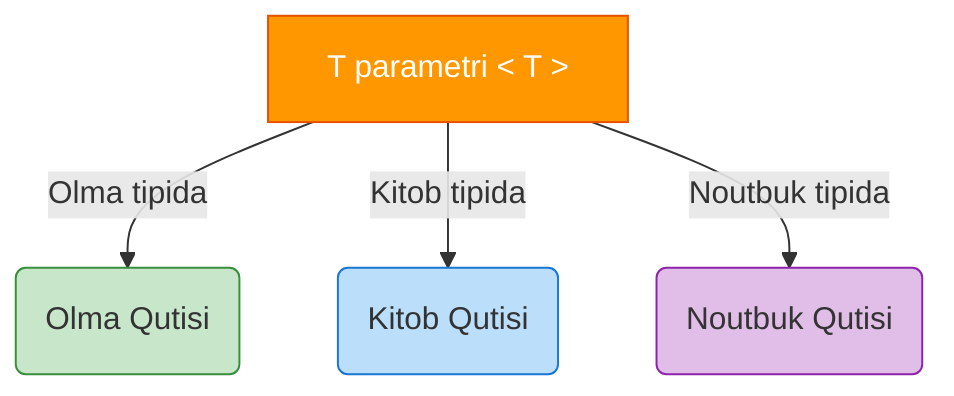

# TypeScript Generics

## Kirish

> [!IMPORTANT]
> **Nima uchun muhim?**  
> Dasturlashning eng yomon odati — bir xil kodni qayta-qayta yozishdir (DRY prinsipining buzilishi). Lekin TypeScript'da qat'iy tiplar bo'lgani uchun bitta kod qismi har xil tiplar (masalan, string, number, obyektlar) uchun takrorlanishiga to'g'ri kelib qolishi mumkin. Shunday paytda dasturchilar `any` tipini qo'yib qutulishadi. Lekin `any` bu TS ga tupurishdir. Generics aynan shuning oldini olish uchun yordamga keladi: Bitta logikani har qanday tip bilan (tipni yo'qotmagan holda) ishlatish.

> [!NOTE]
> **Real-hayot analogiyasi: "Quti (Konteyner)"**  
> Oddiy quti tasavvur qiling (unda "Meva" saqlanadi deb yozilgan). U faqat olma yoki apelsin saqlay oladi, kitob soga tiqolmaysiz (Qat'iy Tip). 
> "Sehrli" quti (any) bo'lsa, ichiga nima sosangiz shuni qabul qiladi, lekin ichida nima borligini ko'rmaguningizcha bilmaysiz (Tip xavfsizligi yo'q). 
> **Generic quti:** Bu ustiga yorliq (label) yopishtiriladigan universal qutidir. Siz unga olma solishdan oldin `<Olma>` degan yorliqni yopishtirasiz. Endi qutining ichida nima borligi oldindan kafolatlangan va u faqat olmalarni qabul qiladi. Kitob solmoqchi bo'lsangiz, uni `<Kitob>` degan yangi yorliq bilan boshqa qutiga solasiz.

Generics - bu **tiplarni parametr sifatida qabul qilish** imkoniyati. U kodni qayta ishlatilishini keskin oshiradi.



---

## 🟢 Junior (Asoslar va Tushunchalar)

Junior dasturchi Funksiyalarni, va ayniqsa Type va Interface larni qanday qilib Generic qilishni (quti yasashni) bilishi kerak.

### Generic Funksiyalar
Oddiy funksiya o'zgaruvchilarni parametr qilib oladi `(x)`. Generic funksiya esa ham Tiplarni `<T>`, ham o'zgaruvchilarni qabul qiladi:

```typescript
// YOMON (any orqali, xavfsizlik yo'qoladi)
function returnAny(value: any): any {
  return value; 
}
const text = returnAny("salom"); 
// text.toUpperCase() ishlaydi lekin IDE kodni tushunmayapti.

// YAXSHI (Generic orqali)
// 1. <T> deymiz. Bu shunchaki "T" degan sirli tip keladi demoq. 
// 2. value: T deymiz. Ya'ni argument o'sha sirli tipda.
// 3. : T qilib qaytaradi.
function returnGeneric<T>(value: T): T {
  return value;
}

// Buni ishlatish
const str = returnGeneric<string>("salom"); // <string> degan yorliq yopishtirdik
const num = returnGeneric<number>(100);

// TypeScript juda aqlli, tipni o'zi topa oladi:
const auto = returnGeneric(true); // <boolean> deb yozmasa ham topadi!
```

### Generic Interface va Types
Ob'ektlarni ham har xil strukturalar qabul qiladigan qilib yozish mumkin:

```typescript
interface APIResponse<T> {
  status: number;
  message: string;
  data: T; // Ma'lumot qanaqa ko'rinishda kelishi nomalum, uni siz berasiz
}

interface User { name: string; age: number; }
interface Product { id: number; title: string; }

// Bitta APIResponse endi ikki xil javobni to'g'ri qayta ishlayapti
let userRes: APIResponse<User> = {
  status: 200, message: "OK", data: { name: "Ali", age: 20 }
};

let prodRes: APIResponse<Product[]> = {
  status: 200, message: "OK", data: [{ id: 1, title: "Phone" }]
};
```

---

## 🟡 Middle (Amaliyot va Detallar)

Middle dasturchi Generics bilan Cheklovlar (Constraints `extends`) ishlatishni va bir nechta Generic parametrlarni ketma-ket qo'llashni biladi.

### Generic Cheklovlar (Constraints)
Siz qutingizga xohlagan narsa tashlanishiga ruxsat bermoqchi emassiz, masalan "Faqat nomi bor narsalargina tushishi mumkin". Buni TypeScript da `extends` deyiladi.

```typescript
// T nima bo'lsa ham uning ichida "length: number" xususiyati bo'lishi SHART
function logLength<T extends { length: number }>(item: T) {
  console.log(item.length);
}

logLength("Salom"); // Stringlarda length bor, OK
logLength([1, 2, 3]); // Arraylarda length bor, OK
logLength({ id: 1, length: 50 }); // Obyektda length ni qo'shdik, OK
// logLength(100); // XATO! Sonlarda length yo'q. 
```

### `keyof` operatori bilan birga ishlash
Aynan bitta ob'ekt va uning faqat mavjud kalitini olish kerak bo'lganda, `K extends keyof T` strukturasi eng kuchli quroldir:

```typescript
// T bu ob'ekt. K bu ob'ektdagi mavjud kalitlar
function getProperty<T, K extends keyof T>(obj: T, key: K) {
  return obj[key];
}

const user = { name: "Ali", age: 30 };

const userName = getProperty(user, "name"); // OK
// const email = getProperty(user, "email"); // XATO! user da email degan kalit yo'q
```

### Default Types (Standart Tip berish)
Agar dasturchi qutiga hech qanday yorliq yopishtirmasa, standart bo'yicha u nima bo'ladi?
```typescript
// Agar T berilmasa, uni string deb qabul qil!
interface Container<T = string> {
  value: T;
}

const box1: Container = { value: "Hello" }; // T = string bo'lib ketadi
const box2: Container<number> = { value: 100 }; // Bu yerda number
```

---

## 🔴 Senior (Arxitektura va Optimizatsiya)

Senior dasturchi Advanced Generic Patterns, xususan **Conditional Types**, **Inference (infer)** va murakkab Type-safe tizimlarni (Masalan, Event Emitter yoki Store Management) yoza oladi.

### Conditional Types (Shartli Tiplar) va `infer`
TypeScript Typescript ichida if/else ishlata oladigan darajada kuchli!

```typescript
// Agar T massiv bo'lsa (infer Item orqali massiv ichini top) o'shani qaytar, aks holda o'zini qaytar
type UnwrapArray<T> = T extends Array<infer Item> ? Item : T;

type A = UnwrapArray<string[]>; // A ning tipi "string"
type B = UnwrapArray<number>; // B ning tipi "number", chunki massiv emas
```

### Type-Safe Event Emitter (Real Loyiha)
Loyihalardagi xatolar asosan noto'g'ri event yoki ma'lumotlar ulanib qolishidan chiqadi. Buni butunlay yo'q qilish mumkin:

```typescript
// Bizning tizimda qanday eventlar bor va ular nima yuboradi?
interface MyEvents {
  login: { userId: string, time: number };
  logout: { userId: string };
}

class TypedEventEmitter<T> {
  private listeners: Record<string, Function[]> = {};

  // K faqat T ning kalitlari bo'la oladi ("login" yoki "logout")
  // Payload faqat o'sha kalitga tegishli qiymat bo'la oladi
  on<K extends keyof T>(event: K, listener: (payload: T[K]) => void) {
    if (!this.listeners[event as string]) this.listeners[event as string] = [];
    this.listeners[event as string].push(listener);
  }

  emit<K extends keyof T>(event: K, payload: T[K]) {
    this.listeners[event as string]?.forEach(fn => fn(payload));
  }
}

const myEmitter = new TypedEventEmitter<MyEvents>();

// Typ-safe: Noto'g'ri event nomi yozsangiz ham, parametrni xato ishlatsangiz ham qizaradi.
myEmitter.emit("login", { userId: "user-123", time: Date.now() }); // OK
// myEmitter.emit("logout", { userId: "user-123", time: 10 }); // XATO! logout time qabul qilmaydi
```

### Intervyu Savoli
**"Covariance va Contravariance nima degani va u Generics da qanday ahamiyatga ega?"**
*Javob:* 
TypeScript strukturaviy tiplashdan (structural typing) foydalanadi. Ota va Bola klasslari orasidagi munosabatda bu juda muhim.
**Covariance (Out position):** Siz ko'proq xususiyati bor ob'ektni (Bola - masalan Dog), kamroq xususiyati bor ob'ekt o'rniga (Ota - masalan Animal) ishlata olasiz, lekin teskarisini emas. 
**Contravariance (In position):** Bu asosan funksiya parametrlarida ishlaydi va yuqoridagiga teskari. Ya'ni "Faqat Itlarni davolovchi" shifokorga, "Har qanday hayvonni davolovchi" shifokorni o'rinbosar qilsangiz bo'ladi (chunki u itni ham davolay oladi), lekin teskarisi emas. TypeScript'da "strictFunctionTypes" yoniq bo'lsa, funksiya parametrlari aynan Contravariant bo'ladi.

---

## Eng Yaxshi Amaliyotlar (Best Practices)

1. **Ma'noli nom bering**: Odatda genericlar bitta harf bilan yoziladi (`T`, `U`, `V`), lekin ko'proq joylarda ularning qanday tur ekanligini ifodalash uchun `TData`, `TResponse`, yoki `TError` deb yozish tavsiya etiladi.
2. **Haddan tashqari Generic qilmang**: Ba'zida juda murakkab, uch-to'rt qavatli genericlar kodning o'qilishini shunday qiyinlashtiradiki, TS ning foydasidan zarari ko'proqqa aylanadi. Agar oddiy Union (`type Input = string | number`) yetarli bo'lsa, Generic dan qoching.
3. **Avtomatik tip topish (Inference)**: TypeScript ajoyib aqlli tizim. `identity<number>(42)` yozish o'rniga, shunchaki `identity(42)` yozing, TS o'zi nima ekanini bilib oladi. Faqat u tushuna olmagan qiyin vaziyatlardagina tiplarni qo'lda bering (`<>`).

---

## Xulosa

| Generics Yondashuvi | Qachon ishlatiladi | Foydasi |
| --- | --- | --- |
| **Generic Funksiyalar** | Bir xil amal har xil turdagi datalar bilan qilinayotganda | 10 ta funksiya o'rniga bitta yozasiz, Tiplarni saqlab qolasiz |
| **Generic Interfaces** | Ob'ekt ichidagi ba'zi maydonlar turli xil bo'lishi kerak bo'lganda (API Responses) | Dynamic datalarni to'g'ri tiplash |
| **Generic Constraints (extends)** | G'alati (keraksiz) tiplar kirib kelishini to'sish uchun | API'ingizni xavfsiz qilish |
| **Conditional Types & infer** | Boshqa tipga asoslanib yangi tip yaratish kerak bo'lganda | Meta-programming, Utility Types larni yasash |

Keyingi bo'limda Utility Types'ni chuqur o'rganamiz.
