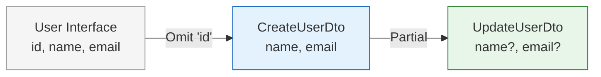

# TypeScript Utility Types

## Kirish

> [!IMPORTANT]
> **Nima uchun muhim?**  
> Agar siz TypeScript'da DRY (Don't Repeat Yourself) qoidasiga amal qilmoqchi bo'lsangiz, Utility Types bu sizning eng yaqin do'stingizdir. Bitta Interface'ni (masalan `User`) yozib olib, qolgan joylarda (User yaratish, o'chirish, tahrirlash) xuddi shu tiplarni bittadan ko'chirib yozish o'rniga, uning shaklini tayyor "pichoqlar" yordamida kesib, bo'lib, o'zgartirib ishlatasiz.

> [!NOTE]
> **Real-hayot analogiyasi: "Shveytsariya pichog'i"**  
> Faraz qiling sizda katta pishloq (Katta Interface) bor. 
> **`Pick`**: Pishloqning faqat eng shirin qismini tanlab qirqib olish.
> **`Omit`**: Pishloqning ustidagi qattiq po'stlog'ini (keraksiz qismni) kesib tashlab, qolganini olish.
> **`Partial`**: Pishloqni shunday maydalashki, siz barcha bo'laklarini yeyishga majbur emassiz, xohlasangiz bitta bo'lak oling, xohlasangiz hammasini.

TypeScript'da utility types - bu **mavjud tiplarni transformatsiya qilish** uchun tayyor "toollar". Ular generic asosida qurilgan bo'lib, yangi tiplar yaratishda vaqt tejaydi.



---

## 🟢 Junior (Asoslar va Tushunchalar)

Junior dasturchi eng ko'p ishlatiladigan kundalik asboblarni (`Partial`, `Pick`, `Omit`, `Record`) qachon va qanday ishlashini bilishi kerak.

### 1. `Partial` va `Required` (Qisman va Majburiy)
Obyektni o'zgartirayotganingizda (Edit form), siz barcha ma'lumotni kiritmaysiz, faqat o'zgarganini yuborasiz:

```typescript
interface User {
  id: number;
  name: string;
  email: string;
}

// Barcha propertylar optional (?) bo'ladi
type UpdateUserDto = Partial<User>;
// Endi u shunday ko'rinadi: { id?: number; name?: string; email?: string }

// Teskarisi ham bor, barchasini majburiy qilish:
type StrictUser = Required<UpdateUserDto>; 
```

### 2. `Pick` va `Omit` (Tanlash va Tashlab ketish)
Bitta modelni olib, uni ikkiga bo'lish:

```typescript
interface Product {
  id: string;
  name: string;
  price: number;
  description: string;
  createdAt: Date;
}

// OMIT: Mahsulot qo'shayotganda ID va Sana serverdan keladi, o'zimiz bermaymiz
type CreateProduct = Omit<Product, "id" | "createdAt">;
// Natija: { name: string; price: number; description: string }

// PICK: Mahsulotni ro'yxatda ko'rsatishda (faqat ism va narx yetarli)
type ProductCard = Pick<Product, "name" | "price">;
// Natija: { name: string; price: number }
```

### 3. `Record` (Lug'at)
Alohida o'zgaruvchan kalitlarga ega bo'lgan ob'ektlar yasash uchun (`any` ishlata ko'rmang!):

```typescript
// Kaliti qanaqadir yozuv (string), qiymati esa raqam (number)
type UserAges = Record<string, number>;

const ages: UserAges = {
  Ali: 25,
  Vali: 30
};
```

---

## 🟡 Middle (Amaliyot va Detallar)

Middle dasturchi ma'lumotlarni manipulatsiya qilishda Union (`|`) lar bilan ishlashni va Funksiya parametrlarini o'zgartirishni biladi.

### Union Types bilan ishlash (Exclude, Extract, NonNullable)

```typescript
type Status = "pending" | "approved" | "rejected" | "deleted";

// 1. Exclude (Chiqarib tashlash): Faqat faol statuslar kerak
type ActiveStatus = Exclude<Status, "deleted" | "rejected">; 
// Natija: "pending" | "approved"

// 2. Extract (Ajratib olish): Ikkita Union'da bir xil borini olish
type AdminStatus = "approved" | "banned";
type CommonStatus = Extract<Status, AdminStatus>; 
// Natija: "approved"

// 3. NonNullable: API dan kelgan bo'sh qiymatlarni tozalash
type UserEmail = string | null | undefined;
type ValidEmail = NonNullable<UserEmail>; 
// Natija: string
```

### Funksiya Tiplari (Parameters, ReturnType)
Ba'zan sizga kimdir yozgan funksiya keladi va siz o'sha funksiya nima qaytarishini tutib olib, unga Tip bermoqchisiz:

```typescript
function calculateDiscount(price: number, percent: number): { finalPrice: number, saved: number } {
  const saved = (price * percent) / 100;
  return { finalPrice: price - saved, saved };
}

// Funksiya nima qaytarishini to'g'ridan-to'g'ri o'g'irlash:
type DiscountResult = ReturnType<typeof calculateDiscount>;
// Natija: { finalPrice: number, saved: number }

// Funksiya qanday parametrlar qabul qilishini bilish:
type DiscountArgs = Parameters<typeof calculateDiscount>;
// Natija: [price: number, percent: number] (Tuple shaklida)
```

---

## 🔴 Senior (Arxitektura va Optimizatsiya)

Senior dasturchi faqatgina tayyor Utility'lar bilan cheklanib qolmaydi, u o'zi Custom Utility'lar (DeepPartial, Readonly, Conditional tiplar) yoza oladi.

### String Manipulation Types (TS 4.1+)
Matnlarni tiplar orqali boshqarish tizimi:

```typescript
type Roles = "admin" | "user" | "guest";

// Barchasini katta harfga o'tkazish
type UpperRoles = Uppercase<Roles>; // "ADMIN" | "USER" | "GUEST"

// Template Literal yordamida dinamik Action yaratish (Redux/Vuex kabi)
type Actions = `set${Capitalize<Roles>}`; 
// "setAdmin" | "setUser" | "setGuest"
```

### Chuqurlashtirilgan Custom Utilities (DeepPartial, DeepReadonly)
Standart `Partial<T>` va `Readonly<T>` faqat bitta qavat (Shallow) ishlaydi. Agar ichma-ich ob'ektlar bo'lsa, senior ularni Rekursiya orqali aylanib chiqadigan utility yozadi.

```typescript
// 1. Obyektning eng ichkari qavatlarigacha Readonly qilish
type DeepReadonly<T> = {
  readonly [K in keyof T]: T[K] extends object
    ? DeepReadonly<T[K]> // Agar obyekt bo'lsa, o'ziga qaytadan kiradi
    : T[K]; // Obyekt bo'lmasa, oddiy tiplab qoladi
};

interface AppConfig {
  db: { host: string; port: number };
}

const config: DeepReadonly<AppConfig> = {
  db: { host: 'localhost', port: 5432 }
};

// config.db.port = 3000; // XATO! Ichki qavat ham Readonly himoyasida.

// 2. Aniq bir maydonlarni ixtiyoriy (Optional) qilish (Juda ko'p kerak bo'ladi)
type PartialBy<T, K extends keyof T> = Omit<T, K> & Partial<Pick<T, K>>;

interface User {
  id: number;
  name: string;
  email: string;
}

// Userdagi faqat "email" maydonini optional qilamiz:
type UserOptionalEmail = PartialBy<User, "email">; 
// Natija: { id: number; name: string; email?: string }
```

### Intervyu Savoli
**"Omit bilan Exclude ning asosiy farqi nimada?"**
*Javob:* 
Juda ko'p Juniorlar shu joyda chalkashadi. O'xshash bo'lgani bilan ishlash tartibi har xil.
`Omit` - **Obyektlar** (Interface va Record) bilan ishlash uchun. U Obyektdan sizga kerakmas kalitni sug'urib tashlaydi. `type A = Omit<{a: 1, b: 2}, 'a'>`.
`Exclude` - **Union Tiplar** (`|` bilan bo'lingan) bilan ishlash uchun. U string yoki number to'plamidan qaysidir qiymatni chiqarib tashlaydi. `type B = Exclude<'a' | 'b', 'a'>`.

---

## Eng Yaxshi Amaliyotlar (Best Practices)

1. **`Omit` dan ko'ra `Pick` afzalroq**: Odatda obyektdan 10 ta xususiyatni chiqarib tashlashdan ko'ra (`Omit`), o'zingizga kerakli 2 ta xususiyatni olganingiz (`Pick`) ancha xavfsizroq. Chunki original Interface'ga ertaga yangi maydon qo'shilsa, `Omit` ishlatgan joyingizga u ham qo'shilib qoladi va siz kutmagan muammolarni keltirib chiqaradi.
2. **`any` o'rniga `Record` ishlating**: Agar obyektning kalitlari noma'lum (masalan, ID larga bog'langan obyekt bo'lsa), `{[key: string]: any}` yozish o'rniga `Record<string, User>` yozing.
3. **Zanjir (Chain) qilmang**: Utility Types'ni ketma-ket 3-4 marta chaqirmang (`Partial<Readonly<Pick<User, 'id'>>>`). Uning o'rniga Type Alias yordamida bosqichma-bosqich o'qilishi oson ko'rinishga keltiring.

---

## Xulosa

| Utility Type | Vazifasi | Qachon ishlatamiz |
| --- | --- | --- |
| **Partial / Required** | Barcha kalitlarni Optional yoki Majburiy qilish | Edit formalarida yoki Defaults berishda |
| **Pick / Omit** | Ob'ektdan kerakli/keraksiz kalitlarni yig'ishtirish | DTO lar, API response larni tozalashda |
| **Record** | Kalit-qiymat ko'rinishidagi qolip yaratish | Dictionary, Hash-map ma'lumotlarda |
| **Exclude / Extract** | Union (`a\|b\|c`) dan filtrlash | Holatlarni (Status) chegaralashda |
| **ReturnType** | Funksiyaning qanday javob qaytarishini "o'g'irlash" | Uchinchi tomon kutubxonasidan (3rd party) tip olishda |

Keyingi bo'limda Strict Mode'ni chuqur o'rganamiz.
