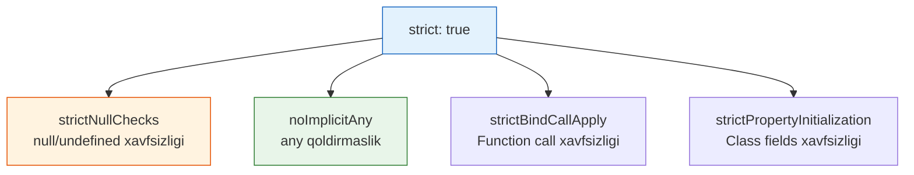

# TypeScript Strict Mode

## Kirish

> [!IMPORTANT]
> **Nima uchun muhim?**  
> TypeScript'ni "strict mode" (qat'iy rejim) siz ishlatish xuddi mashinani xavfsizlik kamarini taqmasdan haydashga o'xshaydi. Ko'pchilik loyihaga TS ni qo'shib qo'yib, o'zicha "Bizda tip xavfsizligi bor" deb maqtanadi. Aslida esa "strict: false" da TypeScript ko'plab `null`, `undefined` va `any` degan bombadek xatolarga ko'z yumadi. Qat'iy rejim esa TypeScript'dan uning 100% quvvatini olish imkonini beradi.

> [!NOTE]
> **Real-hayot analogiyasi: "Aeroport Xavfsizlik Xizmati"**  
> **Strict: false (Oddiy Tekshiruv):** Xodim yo'lovchilarga shunchaki uzoqdan qarab o'tkazib yuboradi. Agar ochiqchasiga qurol ko'tarib yurganini ko'rmasa, sumkani tekshirmaydi.
> **Strict: true (Qat'iy Tekshiruv):** Har bir sumka rentgendan o'tadi, har bir odam metallodektor bilan tekshiriladi. "Noma'lum" (any) yukli odamlar darhol to'xtatiladi. Boshida bu zerikarli va qattiqqo'l tuyuladi, lekin reys (Dastur) qulashidan saqlaydi.

TypeScript'da strict mode - bu **maksimal tip xavfsizligini ta'minlaydigan** sozlamalar to'plami. U ko'plab potensial xatolarni compile-time'da ushlaydi.



---

## 🟢 Junior (Asoslar va Tushunchalar)

Junior dasturchi `tsconfig.json` faylida `"strict": true` qilish nimani anglatishini va ikkita eng katta dushman: `Implicit Any` va `Null/Undefined` bilan qanday kurashishni bilishi kerak.

### 1. `noImplicitAny` (Kutilmagan Any ga yo'q deymiz)
Agar tip yozishni esdan chiqarsangiz, TS avvalambor uni jimgina `any` deb qabul qiladi. Strict mode buni taqiqlaydi.

```typescript
// Xato (strict: true holatida)
function add(a, b) { 
  // TS aytadi: a va b qanaqa tipligini bilmadim, uImplicitAny bo'lib qoldi!
  return a + b;
}

// To'g'ri (Aniq tip ko'rsatilgan)
function add(a: number, b: number) {
  return a + b;
}
```

### 2. `strictNullChecks` (Null lardan himoya)
JS da eng ko'p uchraydigan xato bu "Cannot read property of undefined/null". Ushbu qoida uni oldini oladi.

```typescript
let username: string = "Ali";
// username = null; // XATO! "Ali" degan string qutisiga null sololmaysiz.

// Agar null bo'lishi ehtimoli bo'lsa, aniq ko'rsatish kerak:
let optionalName: string | null = null; // Bu mumkin.

function printName(name: string | null) {
  // console.log(name.toUpperCase()); // XATO! name null bo'lib qolishichi?
  
  // Yechim: Tekshiruv (Type guard) yozish
  if (name !== null) {
    console.log(name.toUpperCase()); // Endi TS xotirjam
  }
}
```

---

## 🟡 Middle (Amaliyot va Detallar)

Middle dasturchi klasslar ichida Propertylarni to'g'ri initsializatsiya qilishni (`strictPropertyInitialization`) va `this` ning tipini nazorat qilishni biladi.

### 1. `strictPropertyInitialization`
Class yaratganingizda, undagi ma'lumotlar boshlang'ich qiymatga (yoki constructorda) ega bo'lishini talab qiladi.

```typescript
class UserProfile {
  // name: string; // XATO! Boshlang'ich qiymat berilmadi.

  // Yechim 1: O'zi boshlang'ich qiymatga ega
  role: string = "guest";

  // Yechim 2: Constructorda qiymat oladi
  email: string;
  constructor(email: string) {
    this.email = email;
  }

  // Yechim 3: Haqiqatan ham Optional (bo'sh) bo'lishi mumkin
  avatar?: string;
}
```

### 2. `noImplicitThis`
JS da `this` qayerdan chaqirilayotganiga qarab o'zgaradi. TS buni nazorat qilishni xohlaydi.

```typescript
document.getElementById("btn")?.addEventListener("click", function () {
  // console.log(this.id); // XATO! Bu yerdagi this tugmami yoki Window mi aniq emas.
});

// YECHIM: This tipini funksiyaning birinchi argumentiga (fiktiv) yozib qo'yamiz.
document.getElementById("btn")?.addEventListener("click", function (this: HTMLElement) {
  console.log(this.id); // OK.
});
```

---

## 🔴 Senior (Arxitektura va Optimizatsiya)

Senior dasturchi Strict Modening yanada chuqur va yangi qoidalarini, masalan Contravariance va `unknown` tipdagi Catch blocklarini to'g'ri boshqaradi.

### 1. `strictFunctionTypes`
Bu qoida funksiya parametrlari qanday meros o'tishi (Contravariance) ustidan nazorat.

```typescript
interface Animal { name: string; }
interface Dog extends Animal { breed: string; }

let handleAnimal = (a: Animal) => console.log(a.name);
let handleDog = (d: Dog) => console.log(d.breed);

// Odatda Bola klass Ota o'rniga yura oladi, lekin funksiya parametrlarida teskarisi (Contravariance) ishlaydi:
handleDog = handleAnimal; // OK! (Chunki Animal'ni tushunadigan funksiya Dog'ni ham tushunadi)
// handleAnimal = handleDog; // XATO strictFunctionTypes: true bo'lsa!
// Chunki "Men faqat Itni tushunaman" degan funksiyaga Mushuk (Animal) yuborib yuborsangiz dastur qulaydi.
```

### 2. `useUnknownInCatchVariables` (TS 4.4+)
JS da xatolar har xil (Error object, string, number) bo'lishi mumkin. Ilgari `catch(err)` da `err` doim `any` bo'lardi, endi u `unknown` bo'lishi talab qilinadi.

```typescript
try {
  throw new Error("Xato!");
} catch (error) { // error tipi unknown
  // console.log(error.message); // XATO! TS: "Bu Error obyekti ekanini qayerdan bilaman?"

  // To'g'ri yondashuv:
  if (error instanceof Error) {
    console.log(error.message);
  } else {
    console.log("Kutilmagan xato: ", String(error));
  }
}
```

### Intervyu Savoli
**"Eski katta JavaScript loyihani TypeScript ga o'tkazmoqdamiz. Strict mode'ni qanday yoqishni maslahat berasiz?"**
*Javob:*
Birinchi navbatda `strict: true` ni darhol yoqish yomon g'oya, bu minglab xatolarga sabab bo'lib jamoani to'xtatib qo'yadi. Bosqichma-bosqich migratsiya qilish kerak:
1. Eng avvalo `allowJs: true` qilib JS fayllarni ishlashga ruxsat beramiz.
2. Fayllarni bittadan `.ts` ga o'zgartiramiz, bu jarayonda TS oddiy xatolarni ko'rsatadi.
3. Keyin `noImplicitAny: true` ni alohida yoqamiz, chunki any eng ko'p tarqalgan xato. Hamma funksiyalarga aniq tiplar berib chiqiladi.
4. Va eng oxirida (juda katta jarayon) `strictNullChecks: true` yoqiladi va barcha null checklar yozib chiqiladi. Oxirida `strict: true` e'lon qilinadi.

---

## Eng Yaxshi Amaliyotlar (Best Practices)

1. **Yangi loyihalarda HAR DOIM yoqing**: Yangi proyekt boshlayotgan bo'lsangiz `tsconfig.json` da darhol `"strict": true` yoqilganligiga ishonch hosil qiling. Buni loyiha o'rtasida yoqish minglab xatolarni keltirib chiqarishi va jamoani tushkunlikka tushirishi mumkin.
2. **Eski loyihani ko'chirish (Migration)**: Katta JS loyihani TS ga o'tkazayotganda boshida "strict" ni o'chiring. Lekin tiplarni to'g'rilab bo'lgach, sekin-asta har bir maxsus qoidani bittadan yoqib chiqing (masalan, avval `noImplicitAny: true`, kod to'g'rilangach keyin `strictNullChecks: true`).
3. **`!` bilan aldamang**: Qat'iy rejimda bazan siz `user.name` string ekaniga amin bo'lsangiz ham TS xato berishi mumkin (chunki u unday emas deb o'ylaydi). Bunday vaziyatlarda non-null assertion (`user!.name`) ishlatish ko'p hollarda dangasalikdir. Yaxshisi to'g'ri `if(user)` tekshiruvini yozing.

---

## Xulosa

| Flag Nomi | Vazifasi | Asosiy Foydasi |
| --- | --- | --- |
| **`noImplicitAny`** | Yozilmagan tiplarni jimgina any bo'lib ketishini to'sadi | Kod to'liq tiplanishini kafolatlaydi |
| **`strictNullChecks`** | Null va Undefined ni qat'iy tekshiradi | UI qotib qolishi ("cannot read property") ni yo'qotadi |
| **`strictPropertyInitialization`** | Klass propertilariga boshlang'ich qiymat so'raydi | Yaratilgan obyekt xavfsizligini ta'minlaydi |
| **`useUnknownInCatchVariables`** | catch ichidagi error'larni qat'iy tekshirishga majburlaydi | Noma'lum Error turlari dasturni buzmasligini ta'minlaydi |

Keyingi bo'limda Type Guards'ni chuqur o'rganamiz.
