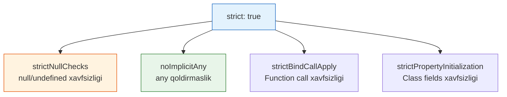

# TypeScript Strict Mode

## Mundarija

1. [Strict Mode Nima?](#strict-mode-nima)
2. [Strict Flag'lar](#strict-flaglar)
3. [strictNullChecks](#strictnullchecks)
4. [noImplicitAny](#noimplicitany)
5. [strictFunctionTypes](#strictfunctiontypes)
6. [strictBindCallApply](#strictbindcallapply)
7. [strictPropertyInitialization](#strictpropertyinitialization)
8. [noImplicitThis](#noimplicitthis)
9. [useUnknownInCatchVariables](#useunknownincatchvariables)
10. [Additional Strict Checks](#additional-strict-checks)
11. [Migration Strategy](#migration-strategy)
12. [Real-world Cases](#real-world-cases)
13. [Interview Savollari](#interview-savollari)
14. [Common Mistakes](#common-mistakes)

---

## Strict Mode Nima?

> [!IMPORTANT]
> **Nima uchun muhim?**  
> TypeScript'ni "strict mode" (qat'iy rejim) siz ishlatish xuddi mashinani xavfsizlik kamarini taqmasdan haydashga o'xshaydi. Ko'pchilik loyihaga TS ni qo'shib qo'yib, o'zicha "Bizda tip xavfsizligi bor" deb maqtanadi. Aslida esa "strict: false" da TypeScript ko'plab `null`, `undefined` va `any` degan bombadek xatolarga ko'z yumadi. Qat'iy rejim esa TypeScript'dan uning 100% quvvatini olish imkonini beradi.

> [!NOTE]
> **Real-hayot analogiyasi: "Aeroport Xavfsizlik Xizmati"**  
> **Strict: false (Oddiy Tekshiruv):** Xodim yo'lovchilarga shunchaki uzoqdan qarab o'tkazib yuboradi. Agar ochiqchasiga qurol ko'tarib yurganini ko'rmasa, sumkani tekshirmaydi.
> **Strict: true (Qat'iy Tekshiruv):** Har bir sumka rentgendan o'tadi, har bir odam metallodektor bilan tekshiriladi. "Noma'lum" (any) yukli odamlar darhol to'xtatiladi. Boshida bu zerikarli va qattiqqo'l tuyuladi, lekin reys (Dastur) qulashidan saqlaydi.

TypeScript'da strict mode - bu **maksimal tip xavfsizligini ta'minlaydigan** sozlamalar to'plami. U ko'plab potensial xatolarni compile-time'da ushlaydi.



### Strict Mode'siz vs Strict Mode Bilan

```typescript
// tsconfig.json - strict: false (default)
{
  "compilerOptions": {
    "strict": false
  }
}
```

```typescript
// Strict mode'siz - ko'p xatolar o'tib ketadi
function greet(name) {
  // name: any (implicit)
  return "Hello, " + name.toUpperCase();
}

greet(null); // Runtime error, lekin compile-time'da xato yo'q!
```

```typescript
// tsconfig.json - strict: true (tavsiya etiladi)
{
  "compilerOptions": {
    "strict": true
  }
}
```

```typescript
// Strict mode bilan - xatolar compile-time'da
function greet(name) {
  // ERROR: Parameter 'name' implicitly has an 'any' type
  return "Hello, " + name.toUpperCase();
}

function greet(name: string | null) {
  // ERROR: 'name' is possibly 'null'
  return "Hello, " + name.toUpperCase();
}

// TO'G'RI YECHIM
function greet(name: string | null): string {
  if (name === null) {
    return "Hello, Guest!";
  }
  return "Hello, " + name.toUpperCase();
}
```

---

## Strict Flag'lar

`"strict": true` quyidagi flag'larni yoqadi:

```json
{
  "compilerOptions": {
    "strict": true
    // Quyidagilar avtomatik yoqiladi:
    // "strictNullChecks": true,
    // "noImplicitAny": true,
    // "strictFunctionTypes": true,
    // "strictBindCallApply": true,
    // "strictPropertyInitialization": true,
    // "noImplicitThis": true,
    // "useUnknownInCatchVariables": true,
    // "alwaysStrict": true
  }
}
```

### Flag'lar Ierarxiyasi

```
┌─────────────────────────────────────────────────────────────┐
│  strict: true                                                │
│  ├── strictNullChecks: true                                 │
│  ├── noImplicitAny: true                                    │
│  ├── strictFunctionTypes: true                              │
│  ├── strictBindCallApply: true                              │
│  ├── strictPropertyInitialization: true                     │
│  ├── noImplicitThis: true                                   │
│  ├── useUnknownInCatchVariables: true                       │
│  └── alwaysStrict: true                                     │
└─────────────────────────────────────────────────────────────┘
```

Individual override mumkin:

```json
{
  "compilerOptions": {
    "strict": true,
    // Bitta flag'ni o'chirish
    "strictPropertyInitialization": false
  }
}
```

---

## strictNullChecks

**Eng muhim flag.** `null` va `undefined` ni alohida tiplar sifatida ko'radi.

### strictNullChecks: false (default)

```typescript
// null va undefined har qanday tipga assign bo'ladi
let name: string = "John";
name = null;      // OK
name = undefined; // OK

function getLength(str: string): number {
  return str.length; // Potensial runtime error!
}

getLength(null); // OK at compile-time, crash at runtime
```

### strictNullChecks: true (tavsiya)

```typescript
let name: string = "John";
// name = null;      // ERROR: Type 'null' is not assignable to type 'string'
// name = undefined; // ERROR

// null bo'lishi mumkin bo'lsa, aniq belgilash kerak
let maybeName: string | null = "John";
maybeName = null; // OK

function getLength(str: string): number {
  return str.length; // Safe - str never null
}

// getLength(null); // ERROR: Argument of type 'null' is not assignable

// Null check qilish kerak
function getLength2(str: string | null): number {
  if (str === null) {
    return 0;
  }
  return str.length; // Safe - TypeScript knows str is string here
}
```

### Optional Properties va strictNullChecks

```typescript
interface User {
  name: string;
  email?: string; // string | undefined
}

function sendEmail(user: User): void {
  // user.email.toLowerCase(); // ERROR: Object is possibly 'undefined'

  // Option 1: if check
  if (user.email) {
    user.email.toLowerCase(); // OK
  }

  // Option 2: optional chaining
  user.email?.toLowerCase(); // OK, returns undefined if email is undefined

  // Option 3: nullish coalescing
  const email = user.email ?? "default@example.com";
  email.toLowerCase(); // OK

  // Option 4: non-null assertion (ehtiyot bo'ling!)
  user.email!.toLowerCase(); // OK, but can crash if email is undefined
}
```

### Array Methods va strictNullChecks

```typescript
const numbers = [1, 2, 3, 4, 5];

// find() qaytarishi mumkin bo'lgan undefined
const found = numbers.find(n => n > 10);
// found: number | undefined

// found.toFixed(2); // ERROR: Object is possibly 'undefined'

if (found !== undefined) {
  found.toFixed(2); // OK
}

// filter() bilan narrowing
const filtered = numbers.filter((n): n is number => n !== undefined);
// filtered: number[]
```

---

## noImplicitAny

Tip aniqlanmagan o'zgaruvchilarga avtomatik `any` berishni taqiqlaydi.

### noImplicitAny: false

```typescript
// Xato yo'q, lekin xavfli
function add(a, b) {
  // a: any, b: any (implicit)
  return a + b;
}

add(1, 2);        // 3
add("1", 2);      // "12" - kutilmagan!
add({}, []);      // "[object Object]" - noto'g'ri!
```

### noImplicitAny: true (tavsiya)

```typescript
// ERROR: Parameter 'a' implicitly has an 'any' type
function add(a, b) {
  return a + b;
}

// TO'G'RI
function add(a: number, b: number): number {
  return a + b;
}

// Agar haqiqatan any kerak bo'lsa
function processUnknown(data: unknown): void {
  // unknown ishlatish xavfsizroq
}

// Yoki explicit any (tavsiya etilmaydi)
function legacy(data: any): any {
  return data;
}
```

### Index Signatures va noImplicitAny

```typescript
const obj = { a: 1, b: 2, c: 3 };

// noImplicitAny: true
for (const key in obj) {
  // ERROR: Element implicitly has an 'any' type because expression
  // of type 'string' can't be used to index type '{ a: number; ... }'
  console.log(obj[key]);
}

// YECHIM 1: keyof assertion
for (const key in obj) {
  console.log(obj[key as keyof typeof obj]);
}

// YECHIM 2: Object.entries
for (const [key, value] of Object.entries(obj)) {
  console.log(value); // value: number
}

// YECHIM 3: Index signature qo'shish
const obj2: { [key: string]: number } = { a: 1, b: 2, c: 3 };
for (const key in obj2) {
  console.log(obj2[key]); // OK
}
```

---

## strictFunctionTypes

Funksiya parametrlari uchun **contravariance** ni tekshiradi.

### strictFunctionTypes: false

```typescript
interface Animal {
  name: string;
}

interface Dog extends Animal {
  breed: string;
}

let animalHandler: (animal: Animal) => void;
let dogHandler: (dog: Dog) => void = (dog) => {
  console.log(dog.breed);
};

// Bu XATO, lekin strictFunctionTypes: false da ruxsat beriladi
animalHandler = dogHandler; // OK (but wrong!)

// Muammo:
const cat: Animal = { name: "Whiskers" };
animalHandler(cat); // Runtime error! cat.breed is undefined
```

### strictFunctionTypes: true (tavsiya)

```typescript
interface Animal {
  name: string;
}

interface Dog extends Animal {
  breed: string;
}

let animalHandler: (animal: Animal) => void;
let dogHandler: (dog: Dog) => void = (dog) => {
  console.log(dog.breed);
};

// ERROR: Type '(dog: Dog) => void' is not assignable to type '(animal: Animal) => void'.
// Types of parameters 'dog' and 'animal' are incompatible.
animalHandler = dogHandler;

// TO'G'RI: teskari yo'nalishda ishlaydi (contravariance)
dogHandler = animalHandler; // OK - animalHandler any Animal bilan ishlaydi, shu jumladan Dog
```

### Method vs Function Syntax

```typescript
// DIQQAT: Method syntax bilan bivariant (kamroq strict)
interface Handlers {
  // Method syntax - bivariant
  handle(animal: Animal): void;
}

// Function property syntax - contravariant (strict)
interface Handlers2 {
  handle: (animal: Animal) => void;
}

// Recommendation: function property syntax ishlatish
```

---

## strictBindCallApply

`bind`, `call`, `apply` metodlarini tip-safe qiladi.

### strictBindCallApply: false

```typescript
function greet(name: string, age: number): string {
  return `Hello, ${name}! You are ${age} years old.`;
}

// Xato argumentlar bilan ham ishlaydi
const result = greet.call(null, "John", "twenty"); // OK (but wrong!)
const bound = greet.bind(null, 42);                 // OK (but wrong!)
```

### strictBindCallApply: true (tavsiya)

```typescript
function greet(name: string, age: number): string {
  return `Hello, ${name}! You are ${age} years old.`;
}

// ERROR: Argument of type 'string' is not assignable to parameter of type 'number'
const result = greet.call(null, "John", "twenty");

// ERROR: Argument of type 'number' is not assignable to parameter of type 'string'
const bound = greet.bind(null, 42);

// TO'G'RI
const result2 = greet.call(null, "John", 25);        // OK
const bound2 = greet.bind(null, "John");             // OK
const greeting = bound2(25);                          // "Hello, John! You are 25 years old."
```

### apply bilan

```typescript
function sum(...numbers: number[]): number {
  return numbers.reduce((a, b) => a + b, 0);
}

// strictBindCallApply: true
sum.apply(null, [1, 2, 3]);        // OK
sum.apply(null, [1, "2", 3]);      // ERROR: Type 'string' is not assignable to type 'number'
sum.apply(null, "not an array");  // ERROR: Argument of type 'string' is not assignable
```

---

## strictPropertyInitialization

Class property'lari constructor'da yoki declaration'da initialize qilinishini talab qiladi.

### strictPropertyInitialization: false

```typescript
class User {
  name: string;  // undefined bo'lishi mumkin, lekin xato yo'q
  email: string;

  constructor() {
    this.name = "John";
    // email initialize qilinmadi - potensial bug!
  }

  sendEmail(): void {
    // this.email undefined bo'lishi mumkin
    console.log(this.email.toLowerCase()); // Runtime error!
  }
}
```

### strictPropertyInitialization: true (tavsiya)

```typescript
class User {
  name: string;  // ERROR: Property 'name' has no initializer
  email: string; // ERROR: Property 'email' has no initializer

  constructor() {
    // Hech narsa initialize qilinmagan
  }
}

// YECHIM 1: Constructor'da initialize qilish
class User1 {
  name: string;
  email: string;

  constructor(name: string, email: string) {
    this.name = name;
    this.email = email;
  }
}

// YECHIM 2: Declaration'da initialize qilish
class User2 {
  name: string = "";
  email: string = "";
}

// YECHIM 3: Optional property
class User3 {
  name: string;
  email?: string; // undefined bo'lishi mumkin

  constructor(name: string) {
    this.name = name;
  }
}

// YECHIM 4: Definite assignment assertion (ehtiyot!)
class User4 {
  name!: string; // "!" - TypeScript'ga "bu keyin initialize bo'ladi" deydi
  email!: string;

  init(name: string, email: string): void {
    this.name = name;
    this.email = email;
  }
}
```

### Lazy Initialization Pattern

```typescript
class Database {
  // Lazy initialization bilan
  private _connection?: Connection;

  get connection(): Connection {
    if (!this._connection) {
      this._connection = this.createConnection();
    }
    return this._connection;
  }

  private createConnection(): Connection {
    // ...
    return new Connection();
  }
}

// Yoki definite assignment assertion bilan
class Database2 {
  private connection!: Connection;

  async init(): Promise<void> {
    this.connection = await createConnection();
  }

  query(sql: string): Promise<Result> {
    return this.connection.query(sql);
  }
}
```

---

## noImplicitThis

`this` ning tipi aniq bo'lmagan joylarda xato beradi.

### noImplicitThis: false

```typescript
const calculator = {
  value: 0,
  add: function(n: number) {
    // this: any (implicit)
    this.value += n;
    this.nonExistent(); // Xato yo'q, lekin runtime error
    return this;
  }
};
```

### noImplicitThis: true (tavsiya)

```typescript
const calculator = {
  value: 0,
  add: function(n: number) {
    // ERROR: 'this' implicitly has type 'any' because it does not have a type annotation
    this.value += n;
    return this;
  }
};

// YECHIM 1: this parameter qo'shish
const calculator2 = {
  value: 0,
  add: function(this: { value: number; add: (n: number) => typeof calculator2 }, n: number) {
    this.value += n; // OK
    return this;
  }
};

// YECHIM 2: Arrow function (this ni lexically oladi)
class Calculator {
  value = 0;

  add = (n: number): this => {
    this.value += n;
    return this;
  };
}

// YECHIM 3: Method bilan class
class Calculator2 {
  value = 0;

  add(n: number): this {
    this.value += n;
    return this;
  }
}
```

### Event Handlers bilan

```typescript
// YOMON: this tipi noaniq
document.addEventListener("click", function(event) {
  // ERROR: 'this' implicitly has type 'any'
  console.log(this.tagName);
});

// YAXSHI 1: this parameter
document.addEventListener("click", function(this: HTMLElement, event: MouseEvent) {
  console.log(this.tagName); // OK
});

// YAXSHI 2: Arrow function (this yo'q)
document.addEventListener("click", (event: MouseEvent) => {
  const target = event.currentTarget as HTMLElement;
  console.log(target.tagName);
});
```

---

## useUnknownInCatchVariables

Catch block'dagi error'ni `unknown` qiladi (`any` o'rniga).

### useUnknownInCatchVariables: false

```typescript
try {
  throw "not an error object";
} catch (error) {
  // error: any
  console.log(error.message); // undefined, lekin xato yo'q
  error.anything();           // xato yo'q, lekin runtime error
}
```

### useUnknownInCatchVariables: true (tavsiya)

```typescript
try {
  throw "not an error object";
} catch (error) {
  // error: unknown
  // console.log(error.message); // ERROR: Object is of type 'unknown'

  // Type check kerak
  if (error instanceof Error) {
    console.log(error.message); // OK
    console.log(error.stack);   // OK
  } else if (typeof error === "string") {
    console.log(error);         // OK
  } else {
    console.log("Unknown error:", error);
  }
}

// Helper function
function isError(error: unknown): error is Error {
  return error instanceof Error;
}

function getErrorMessage(error: unknown): string {
  if (isError(error)) {
    return error.message;
  }
  if (typeof error === "string") {
    return error;
  }
  return "Unknown error";
}
```

---

## Additional Strict Checks

Bu flag'lar `strict` ga kirmaydi, lekin tavsiya etiladi:

### noUncheckedIndexedAccess

Array va object index access'da `undefined` ni qo'shadi.

```json
{
  "compilerOptions": {
    "noUncheckedIndexedAccess": true
  }
}
```

```typescript
const arr = [1, 2, 3];
const first = arr[0];
// first: number | undefined (noUncheckedIndexedAccess: true)
// first: number (noUncheckedIndexedAccess: false)

// first.toFixed(2); // ERROR: Object is possibly 'undefined'

if (first !== undefined) {
  first.toFixed(2); // OK
}

// Object bilan
const obj: Record<string, number> = { a: 1 };
const value = obj["a"];
// value: number | undefined
```

### noImplicitReturns

Barcha code path'larda return bo'lishini talab qiladi.

```typescript
// noImplicitReturns: true
function getValue(condition: boolean): string {
  if (condition) {
    return "yes";
  }
  // ERROR: Not all code paths return a value
}

// TO'G'RI
function getValue2(condition: boolean): string {
  if (condition) {
    return "yes";
  }
  return "no";
}
```

### noFallthroughCasesInSwitch

Switch case'larida break/return bo'lishini talab qiladi.

```typescript
// noFallthroughCasesInSwitch: true
function process(status: "a" | "b" | "c"): void {
  switch (status) {
    case "a":
      console.log("A");
      // ERROR: Fallthrough case in switch
    case "b":
      console.log("B");
      break;
    case "c":
      console.log("C");
      break;
  }
}

// TO'G'RI
function process2(status: "a" | "b" | "c"): void {
  switch (status) {
    case "a":
      console.log("A");
      break; // yoki return
    case "b":
      console.log("B");
      break;
    case "c":
      console.log("C");
      break;
  }
}
```

### exactOptionalPropertyTypes

Optional property'ga `undefined` explicit assign qilishni taqiqlaydi.

```typescript
// exactOptionalPropertyTypes: true
interface User {
  name: string;
  email?: string;
}

const user: User = {
  name: "John",
  email: undefined // ERROR: Type 'undefined' is not assignable
};

// TO'G'RI: property'ni umuman qo'shmaslik
const user2: User = {
  name: "John"
  // email yo'q - bu OK
};

// Agar undefined kerak bo'lsa
interface User2 {
  name: string;
  email?: string | undefined;
}
```

---

## Migration Strategy

### 1. Bosqichma-bosqich Yoqish

```json
// Bosqich 1: Eng muhim flag'lar
{
  "compilerOptions": {
    "strict": false,
    "strictNullChecks": true,
    "noImplicitAny": true
  }
}

// Bosqich 2: Funksiya flag'lari
{
  "compilerOptions": {
    "strict": false,
    "strictNullChecks": true,
    "noImplicitAny": true,
    "strictFunctionTypes": true,
    "strictBindCallApply": true
  }
}

// Bosqich 3: Class flag'lari
{
  "compilerOptions": {
    "strict": false,
    "strictNullChecks": true,
    "noImplicitAny": true,
    "strictFunctionTypes": true,
    "strictBindCallApply": true,
    "strictPropertyInitialization": true,
    "noImplicitThis": true
  }
}

// Final: Full strict
{
  "compilerOptions": {
    "strict": true
  }
}
```

### 2. File-by-File Migration

```typescript
// @ts-strict - fayl boshida strict mode yoqish (TypeScript 5.0+)
// yoki
// @ts-nocheck - vaqtincha tekshiruvni o'chirish

// tsconfig.json da exclude ishlatish
{
  "compilerOptions": {
    "strict": true
  },
  "exclude": [
    "src/legacy/**/*"  // Eski kod uchun vaqtincha
  ]
}
```

### 3. `any` ni Bosqichma-bosqich O'chirish

```typescript
// Migration helper types
type TODO = any; // Keyinchalik to'g'rilash kerak bo'lgan joylar

interface LegacyApiResponse {
  data: TODO; // To'g'ri tip kerak
  meta: TODO;
}

// Keyinchalik:
interface ApiResponse<T> {
  data: T;
  meta: {
    total: number;
    page: number;
  };
}
```

### 4. Xato Hisoblagich

```bash
# TypeScript xatolarini sanash
npx tsc --noEmit 2>&1 | grep "error TS" | wc -l

# Kategoriya bo'yicha
npx tsc --noEmit 2>&1 | grep "error TS" | sort | uniq -c | sort -rn
```

---

## Real-world Cases

### Case 1: API Response Handling

```typescript
// strict: true bilan xavfsiz API handling

interface ApiResponse<T> {
  success: boolean;
  data: T | null;
  error: string | null;
}

// Type guard
function isSuccess<T>(response: ApiResponse<T>): response is ApiResponse<T> & { data: T; error: null } {
  return response.success && response.data !== null;
}

async function fetchUser(id: number): Promise<User> {
  const response = await fetch(`/api/users/${id}`);
  const result: ApiResponse<User> = await response.json();

  if (!isSuccess(result)) {
    throw new Error(result.error ?? "Unknown error");
  }

  // result.data is guaranteed to be User here
  return result.data;
}

// Optional chaining va nullish coalescing bilan
async function fetchUserSafe(id: number): Promise<User | null> {
  try {
    const response = await fetch(`/api/users/${id}`);
    const result: ApiResponse<User> = await response.json();

    return result.data ?? null;
  } catch {
    return null;
  }
}
```

### Case 2: Form Validation

```typescript
// strict: true bilan form validation

interface FormField<T> {
  value: T;
  error: string | null;
  touched: boolean;
}

interface LoginForm {
  email: FormField<string>;
  password: FormField<string>;
  rememberMe: FormField<boolean>;
}

// Validation functions with strict types
type ValidationResult = { valid: true } | { valid: false; error: string };

function validateEmail(email: string): ValidationResult {
  const emailRegex = /^[^\s@]+@[^\s@]+\.[^\s@]+$/;
  if (!email) {
    return { valid: false, error: "Email is required" };
  }
  if (!emailRegex.test(email)) {
    return { valid: false, error: "Invalid email format" };
  }
  return { valid: true };
}

function validatePassword(password: string): ValidationResult {
  if (!password) {
    return { valid: false, error: "Password is required" };
  }
  if (password.length < 8) {
    return { valid: false, error: "Password must be at least 8 characters" };
  }
  return { valid: true };
}

// Type-safe form validation
function validateForm(form: LoginForm): ValidationResult[] {
  const results: ValidationResult[] = [];

  results.push(validateEmail(form.email.value));
  results.push(validatePassword(form.password.value));

  return results;
}

function isFormValid(results: ValidationResult[]): boolean {
  return results.every((r): r is { valid: true } => r.valid);
}
```

### Case 3: State Management

```typescript
// strict: true bilan state management

interface AppState {
  user: User | null;
  posts: Post[];
  loading: boolean;
  error: string | null;
}

type Action =
  | { type: "SET_USER"; payload: User }
  | { type: "CLEAR_USER" }
  | { type: "SET_POSTS"; payload: Post[] }
  | { type: "SET_LOADING"; payload: boolean }
  | { type: "SET_ERROR"; payload: string };

function reducer(state: AppState, action: Action): AppState {
  switch (action.type) {
    case "SET_USER":
      return { ...state, user: action.payload, error: null };

    case "CLEAR_USER":
      return { ...state, user: null };

    case "SET_POSTS":
      return { ...state, posts: action.payload, loading: false };

    case "SET_LOADING":
      return { ...state, loading: action.payload };

    case "SET_ERROR":
      return { ...state, error: action.payload, loading: false };

    default:
      // Exhaustive check
      const _exhaustive: never = action;
      return state;
  }
}

// Selectors with null handling
function selectUserName(state: AppState): string {
  return state.user?.name ?? "Guest";
}

function selectUserEmail(state: AppState): string | null {
  return state.user?.email ?? null;
}
```

---

## Interview Savollari

### 1. `strictNullChecks` nima qiladi va nima uchun muhim?

**Javob:**

```typescript
// strictNullChecks: false - null va undefined har joyga o'tadi
let name: string = null;      // OK, but dangerous
let age: number = undefined;  // OK, but dangerous

function getLength(str: string): number {
  return str.length; // str null bo'lsa crash!
}

getLength(null); // No error, but runtime crash

// strictNullChecks: true - null/undefined alohida tiplar
let name: string = null;      // ERROR
let maybeName: string | null = null; // OK

function getLength(str: string | null): number {
  if (str === null) {
    return 0; // Handle null case
  }
  return str.length; // Safe - str is string here
}

// NIMA UCHUN MUHIM?
// 1. Runtime errorlarni compile-time'da ushlaydi
// 2. TypeScript'ning asosiy qiymati - bu flag'da
// 3. Optional chaining (?.) va nullish coalescing (??) bilan yaxshi ishlaydi
// 4. IDE autocomplete va refactoring yaxshilanadi
```

### 2. `noImplicitAny` va `strictFunctionTypes` farqi nima?

**Javob:**

```typescript
// noImplicitAny: parametr/o'zgaruvchi tipi aniq bo'lishi kerak
function bad(a, b) {       // ERROR: implicit any
  return a + b;
}

function good(a: number, b: number): number {
  return a + b;
}

// strictFunctionTypes: funksiya parametrlari uchun contravariance
interface Animal { name: string; }
interface Dog extends Animal { breed: string; }

// strictFunctionTypes: false - bivariant (xavfli)
let animalHandler: (a: Animal) => void;
let dogHandler: (d: Dog) => void = (d) => console.log(d.breed);
animalHandler = dogHandler; // OK, but wrong!

// strictFunctionTypes: true - contravariant (xavfsiz)
animalHandler = dogHandler; // ERROR: Dog is narrower than Animal

// TO'G'RI yo'nalish
dogHandler = animalHandler; // OK: Animal handler can handle Dog

// QISQACHA:
// noImplicitAny: "Tipi nima?" savoliga javob bering
// strictFunctionTypes: "Bu funksiyani bu joyda ishlatish mumkinmi?" tekshiradi
```

### 3. `strictPropertyInitialization` qanday muammolarni hal qiladi?

**Javob:**

```typescript
// MUAMMO: Initialize qilinmagan property
class User {
  name: string;
  email: string;

  constructor() {
    this.name = "John";
    // email unutildi!
  }

  sendEmail(): void {
    console.log(this.email.toLowerCase()); // CRASH!
  }
}

// strictPropertyInitialization: true YECHIMLAR

// 1. Constructor'da initialize
class User1 {
  name: string;
  email: string;

  constructor(name: string, email: string) {
    this.name = name;
    this.email = email;
  }
}

// 2. Default value
class User2 {
  name: string = "";
  email: string = "";
}

// 3. Optional property
class User3 {
  name: string;
  email?: string;

  constructor(name: string) {
    this.name = name;
  }

  sendEmail(): void {
    if (this.email) {
      console.log(this.email.toLowerCase());
    }
  }
}

// 4. Definite assignment assertion (ehtiyot!)
class User4 {
  name!: string; // TypeScript'ga "keyin initialize bo'ladi" deydi
  email!: string;

  async init(): Promise<void> {
    const data = await fetchUserData();
    this.name = data.name;
    this.email = data.email;
  }
}
```

### 4. `useUnknownInCatchVariables` nima uchun kerak?

**Javob:**

```typescript
// JavaScript'da throw har narsani tashlashi mumkin
throw new Error("message");  // Error
throw "just a string";       // string
throw 42;                    // number
throw { custom: "error" };   // object
throw null;                  // null

// useUnknownInCatchVariables: false
try {
  // ...
} catch (error) {
  // error: any - xavfli!
  console.log(error.message); // undefined bo'lishi mumkin
  error.anything();           // crash!
}

// useUnknownInCatchVariables: true
try {
  // ...
} catch (error) {
  // error: unknown - xavfsiz

  // Type check kerak
  if (error instanceof Error) {
    console.log(error.message);
    console.log(error.stack);
  } else if (typeof error === "string") {
    console.log(error);
  } else {
    console.log("Unknown error:", String(error));
  }
}

// Best practice: helper function
function getErrorMessage(error: unknown): string {
  if (error instanceof Error) return error.message;
  if (typeof error === "string") return error;
  return "Unknown error";
}

try {
  // ...
} catch (error) {
  console.log(getErrorMessage(error));
}
```

### 5. Strict mode'ga migration qilish strategiyasi qanday?

**Javob:**

```typescript
// 1. BOSQICHMA-BOSQICH YOQISH

// Birinchi bosqich: eng muhim
{
  "compilerOptions": {
    "strictNullChecks": true,  // Eng muhim
    "noImplicitAny": true      // Ikkinchi muhim
  }
}

// Ikkinchi bosqich: funksiyalar
{
  "strictFunctionTypes": true,
  "strictBindCallApply": true
}

// Uchinchi bosqich: classlar
{
  "strictPropertyInitialization": true,
  "noImplicitThis": true
}

// 2. FILE-BY-FILE MIGRATION

// Legacy fayllarni exclude
{
  "exclude": ["src/legacy/**/*"]
}

// Yoki @ts-nocheck
// @ts-nocheck
function legacyCode() { ... }

// 3. XATOLARNI TRACKING
// $ npx tsc --noEmit 2>&1 | grep "error TS" | wc -l

// 4. VAQTINCHALIK WORKAROUNDS
type TODO = any; // Keyinchalik to'g'rilash uchun marker

interface Legacy {
  data: TODO;
}

// 5. TEST COVERAGE
// Har strict flag yoqilganda testlar yordamida verify qilish
```

---

## Common Mistakes

### 1. Non-null Assertion (`!`) ni Suiiste'mol Qilish

```typescript
// YOMON: har joyda ! ishlatish
function getUser(id: number): User | null {
  return users.get(id) ?? null;
}

const user = getUser(1)!; // Xavfli!
console.log(user.name);   // null bo'lsa crash!

// YAXSHI: proper null check
const user = getUser(1);
if (user) {
  console.log(user.name);
}

// Yoki optional chaining
console.log(user?.name);
```

### 2. `as` Type Assertion'ni Noto'g'ri Ishlatish

```typescript
// YOMON: xavfli assertion
const data = JSON.parse(response) as User;
console.log(data.name); // data User emasligini kim biladi?

// YAXSHI: validation bilan
function isUser(data: unknown): data is User {
  return (
    typeof data === "object" &&
    data !== null &&
    "name" in data &&
    typeof (data as User).name === "string"
  );
}

const data = JSON.parse(response);
if (isUser(data)) {
  console.log(data.name); // Safe
}

// Yoki validation library (zod, yup, etc.)
import { z } from "zod";

const UserSchema = z.object({
  name: z.string(),
  email: z.string().email()
});

const data = UserSchema.parse(JSON.parse(response));
```

### 3. Definite Assignment (`!:`) ni Haddan Tashqari Ishlatish

```typescript
// YOMON: barcha class property'larda !:
class User {
  name!: string;
  email!: string;
  age!: number;
  // Hech biri constructor'da emas...
}

const user = new User();
console.log(user.name.toUpperCase()); // CRASH!

// YAXSHI: to'g'ri initialization
class User {
  constructor(
    public name: string,
    public email: string,
    public age: number
  ) {}
}

// Yoki builder pattern
class UserBuilder {
  private user: Partial<User> = {};

  setName(name: string): this {
    this.user.name = name;
    return this;
  }

  build(): User {
    if (!this.user.name) throw new Error("Name required");
    // ... validation
    return this.user as User;
  }
}
```

### 4. Optional Property vs Nullable Confusion

```typescript
// Bu ikki narsa FARQLI

interface User1 {
  email?: string; // Property yo'q BO'LISHI mumkin
}

interface User2 {
  email: string | null; // Property BOR, lekin qiymati null
}

// exactOptionalPropertyTypes: true bilan
const user1: User1 = { email: undefined }; // ERROR!
const user1b: User1 = {}; // OK - email yo'q

const user2: User2 = { email: null }; // OK
// const user2b: User2 = {}; // ERROR - email kerak
```

### 5. Index Signature'da undefined Unutish

```typescript
// noUncheckedIndexedAccess: false
const obj: Record<string, number> = { a: 1 };
const value = obj["b"]; // value: number (but actually undefined!)
console.log(value.toFixed()); // CRASH!

// noUncheckedIndexedAccess: true (tavsiya)
const value = obj["b"]; // value: number | undefined
// console.log(value.toFixed()); // ERROR

if (value !== undefined) {
  console.log(value.toFixed()); // OK
}
```

## Eng Yaxshi Amaliyotlar (Best Practices)

1. **Yangi loyihalarda HAR DOIM yoqing**: Yangi proyekt boshlayotgan bo'lsangiz `tsconfig.json` da darhol `"strict": true` yoqilganligiga ishonch hosil qiling. Buni loyiha o'rtasida yoqish minglab xatolarni keltirib chiqarishi va jamoani tushkunlikka tushirishi mumkin.
2. **Eski loyihani ko'chirish (Migration)**: Katta JS loyihani TS ga o'tkazayotganda boshida "strict" ni o'chiring. Lekin tiplarni to'g'rilab bo'lgach, sekin-asta har bir maxsus qoidani bittadan yoqib chiqing (masalan, avval `noImplicitAny: true`, kod to'g'rilangach keyin `strictNullChecks: true`).
3. **`!` bilan aldamang**: Qat'iy rejimda bazan siz `user.name` string ekaniga amin bo'lsangiz ham TS xato berishi mumkin (chunki u unday emas deb o'ylaydi). Bunday vaziyatlarda non-null assertion (`user!.name`) ishlatish ko'p hollarda dangasalikdir. Yaxshisi to'g'ri `if(user)` tekshiruvini yozing.

---

## Xulosa

Strict mode TypeScript'ning asosiy qiymati. U:

1. **Runtime xatolarni compile-time'da ushlaydi**
2. **Kod sifatini oshiradi**
3. **Refactoring'ni xavfsiz qiladi**
4. **IDE tajribasini yaxshilaydi**

Asosiy flag'lar:
- `strictNullChecks` - null/undefined xavfsizligi
- `noImplicitAny` - aniq tiplar
- `strictFunctionTypes` - funksiya xavfsizligi
- `strictPropertyInitialization` - class xavfsizligi

**Tavsiya:** Yangi loyihalarda `"strict": true` dan boshlang. Eski loyihalarda bosqichma-bosqich migration qiling.

Keyingi bo'limda Type Guards'ni chuqur o'rganamiz.
