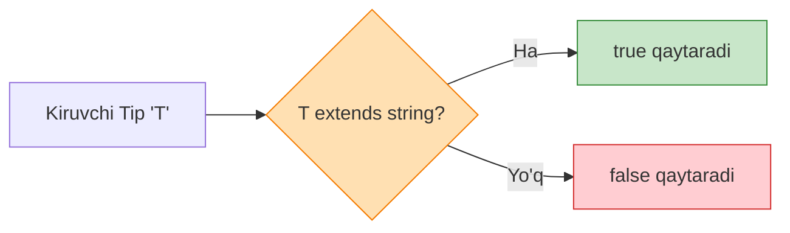

# TypeScript Advanced Patterns

## Kirish

> [!IMPORTANT]
> **Nima uchun muhim?**  
> Dasturingiz qanchalik murakkablashgani sari, tiplar ham bir-biriga bog'liq bo'la boshlaydi. "Agar A tip kelsa B qaytsin, C kelsa D qaytsin" degan dinamik mantiqni yozish zarurati tug'iladi. Advanced Patterns (Conditional Types, Mapped Types, Template Literals) sizga faqatgina kod darajasida emas, balki **tip darajasida (Type-Level)** dasturlash imkonini beradi. Ular kutubxona (Library) yozuvchilar uchun eng asosiy quroldir.

> [!NOTE]
> **Real-hayot analogiyasi: "Aqlli Zavod"**  
> Oddiy zavod har doim bitta ishni qiladi: metall kirsa quvur yasaydi. 
> "Aqlli Zavod" (Advanced Patterns) esa:
> - Agar metall kirsa -> Quvur yasa (Conditional Type).
> - Har bir kirgan materialni yaltiratib chiqar (Mapped Type).
> - Kirgan material ustiga "Super" degan yozuv qo'shib chiqar (Template Literal Type).

Advanced Patterns bu tiplar ustida arifmetik va mantiqiy amallar bajarish mexanizmlaridir.



---

## 🟢 Junior (Asoslar va Tushunchalar)

Junior dasturchi TypeScript'da Mapped Types (Xaritalangan Tiplar) va Conditional Types'ning eng sodda formalarini tushunishi kerak.

### 1. Conditional Types (Shartli Tiplar)
Bu xuddi oddiy `if-else` (yoki ternary operator `? :`) kabi ishlaydi, faqat qiymatlar o'rniga Tiplar ishlatiladi.

```typescript
// T extends U ? X : Y
// "Agar T U'dan kengaysa (unga mos tushsa), X qaytsin, aks holda Y"

type IsString<T> = T extends string ? true : false;

type A = IsString<string>;  // true
type B = IsString<number>;  // false
type C = IsString<"hello">; // true (literal ham string)
```

### 2. Mapped Types (Xaritalangan Tiplar)
Sizda tayyor Interface bor, lekin uning barcha maydonlarini `optional` (?) yoki `readonly` qilishingiz kerak. Buning uchun uni boshqatdan yozib chiqmaysiz.

```typescript
interface User {
  name: string;
  age: number;
}

// Barcha maydonlarni aylanib chiqib, readonly qilib qo'yamiz
type ReadonlyUser = {
  readonly [K in keyof User]: User[K];
};

// Endi ReadonlyUser quyidagiga aylanadi:
// {
//   readonly name: string;
//   readonly age: number;
// }
```

---

## 🟡 Middle (Amaliyot va Detallar)

Middle dasturchi Template Literal Types va Infer orqali murakkabroq amaliyotlar bajarishni biladi.

### 1. Template Literal Types
Tiplarni matn (string) kabi birlashtirish imkonini beradi.

```typescript
type Color = "red" | "blue";
type Size = "sm" | "lg";

// Ikkita union type ni birlashtirib, barcha mumkin bo'lgan kombinatsiyalarni yaratamiz
type ClassName = `${Color}-${Size}`;
// Natija: "red-sm" | "red-lg" | "blue-sm" | "blue-lg"

// Real hayotda event handlerlar uchun ishlatish
type EventName = "click" | "focus";
type Handler = `on${Capitalize<EventName>}`; 
// Natija: "onClick" | "onFocus"
```

### 2. `infer` Kalit So'zi
Conditional type ichida kelayotgan noma'lum tipning ichidan kerakli qismini "sug'urib olish" (extract) uchun ishlatiladi.

```typescript
// Agar T funksiya bo'lsa, uning javob qaytarish tipini R deb atab ol va shuni qaytar
type GetReturnType<T> = T extends (...args: any[]) => infer R ? R : never;

function greet() {
  return "Assalomu alaykum!";
}

// typeof greet bu funksiya. GetReturnType uning ichidan string ni olib beradi
type Result = GetReturnType<typeof greet>; // string
```

---

## 🔴 Senior (Arxitektura va Optimizatsiya)

Senior dasturchi yirik kutubxonalar uchun Recursive (O'ziga reference qiluvchi) tiplar va murakkab Type-Level dasturlashni amalga oshiradi.

### 1. Recursive Types (Rekursiv Tiplar)
Ba'zan ma'lumotlar chuqur va cheksiz darajada joylashgan bo'lishi mumkin (masalan JSON ob'ekt yoki Papkalar tizimi).

```typescript
// Har bir xossa o'zining ichida yana o'sha tipni chaqiradi
type JSONValue =
  | string
  | number
  | boolean
  | null
  | JSONValue[]
  | { [key: string]: JSONValue };

const data: JSONValue = {
  name: "Ali",
  age: 30,
  skills: ["TS", "Vue"],
  address: {
    city: "Tashkent",
    nestedData: { /* ... */ }
  }
};
```
Rekursiv tiplarda **Infinite Recursion (Cheksiz halqa)** bo'lib qolmasligi uchun Base Case (to'xtash sharti) muhim hisoblanadi.

### 2. Deep Partial va Deep Readonly
O'rnatilgan `Partial<T>` faqat 1-darajali maydonlarni ixtiyoriy qiladi. Ichma-ich joylashgan ob'ektlarni ixtiyoriy qilish uchun Rekursiya yordamga keladi.

```typescript
type DeepPartial<T> = T extends object
  ? { [K in keyof T]?: DeepPartial<T[K]> }
  : T;

interface User {
  info: {
    name: string;
    age: number;
  }
}

// Oddiy Partial da info? bo'ladi, lekin ichidagi name baribir required.
// DeepPartial da esa name? va age? ga aylanadi.
```

### Intervyu Savoli
**"Covariance va Contravariance nima degani va TypeScript da ular qanday farq qiladi?"**
*Javob:*
- **Covariance (Kovariatsiya):** Sub-tipni Super-tip o'rnida ishlata olish (Out position). Masalan, funksiya `Animal` qaytarishi kutilsa, siz unga `Dog` qaytaruvchi funksiyani bera olasiz (chunki Dog bu Animal).
- **Contravariance (Kontravariatsiya):** Parametrlar pozitsiyasida (In position) yo'nalish teskarisiga aylanadi. Agar funksiya `Dog` ni parametr sifatida kutayotgan bo'lsa, siz unga umuman `Animal` qabul qiluvchi funksiyani tayinlay olasiz (chunki Animal qabul qiladigan narsa, bemalol Dog ni ham qabul qila oladi). Ammo `Animal` kutayotgan joyga `Dog` qabul qiluvchini berolmaysiz. `strictFunctionTypes: true` bo'lganda TypeScript funksiya parametrlari uchun xavfsiz Contravariance'ni yoqadi.

---

## Eng Yaxshi Amaliyotlar (Best Practices)

1. **"Too Clever" (Haddan tashqari aqlli) kod yozmang**: Advanced tiplar bilan shug'ullanganda, qator-qator `infer` va shartli tiplar yozib yuborish oson. Ammo 1 oy o'tgach, bu tip nima ish qilishini hatto o'zingiz ham tushunmay qolasiz. Jamoa bilan ishlayotganda soddalik qoidasini unutmang.
2. **Kutubxona vs Biznes Logika**: Murakkab tiplarni faqat umumiy kutubxonalar (UI-kit, API helperlar) da ishlating. Kundalik biznes logika uchun bunday murakkablik ortiqcha hisoblanadi.
3. **Commentlar muhim**: Har bir murakkab shartli yoki rekursiv tip nima ish qilishini tushuntirib, bitta TSDoc (`/** ... */`) yozib keting. Test uchun misollar (`type Test = ... // kutilgan natija`) yozib qo'yish juda foydali.

---

## Xulosa

| Pattern | Nima qiladi? | Asosiy maqsadi |
| --- | --- | --- |
| **Conditional Types** | `T extends U ? X : Y` | Tipga qarab xulosa chiqarish |
| **Mapped Types** | `[K in keyof T]` | Mavjud ob'ektdan yangi ob'ekt interfeysi yasash |
| **Template Literal Types** | <code>\`${TypeA}-${TypeB}\`</code> | Matnlarni tiplar darajasida qo'shish, o'zgartirish |
| **`infer`** | `... infer R ...` | Tip ichidan kerakli bo'lagini yulib olish |
| **Recursive Types** | `type A = ... A ...` | Cheksiz ichma-ich ketgan tuzilmalarni tasvirlash |

Keyingi bo'limda Vue + TypeScript integratsiyasini o'rganamiz.
