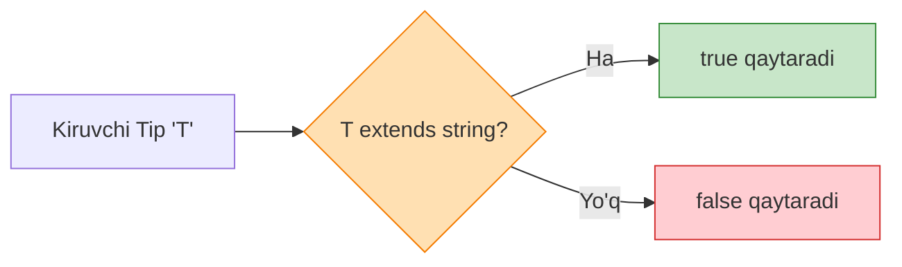

# TypeScript Advanced Patterns

## Mundarija

1. [Conditional Types](#conditional-types)
2. [Mapped Types](#mapped-types)
3. [Template Literal Types](#template-literal-types)
4. [Recursive Types](#recursive-types)
5. [Variance](#variance)
6. [Type-Level Programming](#type-level-programming)
7. [Design Patterns](#design-patterns)
8. [Real-world Cases](#real-world-cases)
9. [Interview Savollari](#interview-savollari)
10. [Common Mistakes](#common-mistakes)

---

## Conditional Types

> [!IMPORTANT]
> **Nima uchun muhim?**  
> Dasturingiz qanchalik murakkablashgani sari, tiplar ham bir-biriga bog'liq bo'la boshlaydi. "Agar A tip kelsa B qaytsin, C kelsa D qaytsin" degan dinamik mantiqni yozish zarurati tug'iladi. Advanced Patterns (Conditional Types, Mapped Types, Template Literals) sizga faqatgina kod darajasida emas, balki **tip darajasida (Type-Level)** dasturlash imkonini beradi. Ular kutubxona (Library) yozuvchilar uchun eng asosiy quroldir.

> [!NOTE]
> **Real-hayot analogiyasi: "Aqlli Zavod"**  
> Oddiy zavod har doim bitta ishni qiladi: metall kirsa quvur yasaydi. 
> "Aqlli Zavod" (Advanced Patterns) esa:
> - Agar metall kirsa -> Quvur yasa (Conditional Type).
> - Har bir kirgan materialni yaltiratib chiqar (Mapped Type).
> - Kirgan material ustiga "Super" degan yozuv qo'shib chiqar (Template Literal Type).

Conditional types - bu **tiplar uchun if-else** logikasi.



### Asosiy Sintaksis

```typescript
// T extends U ? X : Y
// "Agar T U'dan extends qilsa, X qaytsin, aks holda Y"

type IsString<T> = T extends string ? true : false;

type A = IsString<string>;  // true
type B = IsString<number>;  // false
type C = IsString<"hello">; // true (literal ham string)
```

### Distributive Conditional Types

Union type bilan conditional type'lar **distributive** ishlaydi:

```typescript
type ToArray<T> = T extends unknown ? T[] : never;

// Union har element uchun alohida bajariladi
type Result = ToArray<string | number>;
// = ToArray<string> | ToArray<number>
// = string[] | number[]

// Non-distributive (tuple bilan)
type ToArrayNonDistributive<T> = [T] extends [unknown] ? T[] : never;

type Result2 = ToArrayNonDistributive<string | number>;
// = (string | number)[]
```

### `infer` Keyword

`infer` - conditional type ichida yangi type variable yaratish:

```typescript
// Function return type
type ReturnType<T> = T extends (...args: any[]) => infer R ? R : never;

// Array element type
type ElementType<T> = T extends (infer E)[] ? E : never;

// Promise unwrap
type Awaited<T> = T extends Promise<infer U> ? Awaited<U> : T;

// First parameter
type FirstParam<T> = T extends (first: infer F, ...rest: any[]) => any ? F : never;

// Ko'p infer
type ParseFunction<T> = T extends (a: infer A, b: infer B) => infer R
  ? { params: [A, B]; return: R }
  : never;

type Parsed = ParseFunction<(x: string, y: number) => boolean>;
// { params: [string, number]; return: boolean }
```

### Built-in Conditional Types

```typescript
// Exclude - T'dan U'ni olib tashlash
type Exclude<T, U> = T extends U ? never : T;

type A = Exclude<"a" | "b" | "c", "a">; // "b" | "c"

// Extract - T'dan U'ni ajratib olish
type Extract<T, U> = T extends U ? T : never;

type B = Extract<"a" | "b" | "c", "a" | "d">; // "a"

// NonNullable - null va undefined'ni olib tashlash
type NonNullable<T> = T extends null | undefined ? never : T;

// Parameters - function parametrlarini olish
type Parameters<T extends (...args: any) => any> =
  T extends (...args: infer P) => any ? P : never;

// ReturnType - function return tipini olish
type ReturnType<T extends (...args: any) => any> =
  T extends (...args: any) => infer R ? R : any;
```

### Conditional Types Patterns

```typescript
// Type filtering
type FilterByType<T, U> = T extends U ? T : never;

interface User {
  name: string;
  age: number;
  email: string;
  isActive: boolean;
}

type StringKeys = FilterByType<keyof User, string>; // Barcha keylar string

// Property filtering
type StringProperties<T> = {
  [K in keyof T as T[K] extends string ? K : never]: T[K];
};

type UserStrings = StringProperties<User>;
// { name: string; email: string }

// Flatten arrays
type Flatten<T> = T extends (infer E)[]
  ? Flatten<E>  // Recursive
  : T;

type Nested = number[][][];
type Flat = Flatten<Nested>; // number
```

---

## Mapped Types

Mapped types - mavjud tipdan **yangi tip yaratish**.

### Asosiy Sintaksis

```typescript
// { [K in keyof T]: ... }

type Readonly<T> = {
  readonly [K in keyof T]: T[K];
};

type Partial<T> = {
  [K in keyof T]?: T[K];
};

type Required<T> = {
  [K in keyof T]-?: T[K];
};

type Mutable<T> = {
  -readonly [K in keyof T]: T[K];
};
```

### Key Remapping (`as`)

```typescript
// Getter methods
type Getters<T> = {
  [K in keyof T as `get${Capitalize<string & K>}`]: () => T[K];
};

interface Person {
  name: string;
  age: number;
}

type PersonGetters = Getters<Person>;
// { getName: () => string; getAge: () => number }

// Setter methods
type Setters<T> = {
  [K in keyof T as `set${Capitalize<string & K>}`]: (value: T[K]) => void;
};

// Filter keys
type RemoveReadonly<T> = {
  [K in keyof T as K extends "id" ? never : K]: T[K];
};

interface User {
  id: number;
  name: string;
  email: string;
}

type EditableUser = RemoveReadonly<User>;
// { name: string; email: string }
```

### Value Transformation

```typescript
// Nullable properties
type Nullable<T> = {
  [K in keyof T]: T[K] | null;
};

// Promise wrap
type Async<T> = {
  [K in keyof T]: Promise<T[K]>;
};

// Array wrap
type Arrays<T> = {
  [K in keyof T]: T[K][];
};

// Method extraction
type Methods<T> = {
  [K in keyof T as T[K] extends Function ? K : never]: T[K];
};

interface Service {
  name: string;
  start(): void;
  stop(): void;
  status: string;
}

type ServiceMethods = Methods<Service>;
// { start: () => void; stop: () => void }
```

### Advanced Mapped Types

```typescript
// Deep readonly
type DeepReadonly<T> = {
  readonly [K in keyof T]: T[K] extends object
    ? T[K] extends Function
      ? T[K]
      : DeepReadonly<T[K]>
    : T[K];
};

// Deep partial
type DeepPartial<T> = {
  [K in keyof T]?: T[K] extends object
    ? DeepPartial<T[K]>
    : T[K];
};

// Paths extraction
type Paths<T, Prefix extends string = ""> = T extends object
  ? {
      [K in keyof T & string]: T[K] extends object
        ? Paths<T[K], `${Prefix}${K}.`>
        : `${Prefix}${K}`;
    }[keyof T & string]
  : never;

interface Config {
  database: {
    host: string;
    port: number;
  };
  cache: {
    enabled: boolean;
  };
}

type ConfigPaths = Paths<Config>;
// "database.host" | "database.port" | "cache.enabled"
```

---

## Template Literal Types

Template literal types - **string manipulyatsiya** tiplar darajasida.

### Asosiy Sintaksis

```typescript
type Hello = `Hello, ${string}`;
// "Hello, " dan boshlanadigan barcha stringlar

type Point = `${number},${number}`;
// "1,2", "3.5,4.5" kabi

const p: Point = "10,20"; // OK
// const p2: Point = "a,b"; // ERROR
```

### String Manipulation Types

```typescript
// Built-in manipulation types
type Upper = Uppercase<"hello">;    // "HELLO"
type Lower = Lowercase<"HELLO">;    // "hello"
type Cap = Capitalize<"hello">;     // "Hello"
type Uncap = Uncapitalize<"Hello">; // "hello"

// Combined
type ScreamingSnake<S extends string> =
  Uppercase<S extends `${infer A}${infer B}` ? `${A}_${ScreamingSnake<B>}` : S>;
```

### Event Handler Types

```typescript
type EventName = "click" | "focus" | "blur";
type Handler = `on${Capitalize<EventName>}`;
// "onClick" | "onFocus" | "onBlur"

// Type-safe event handlers
type EventHandlers<Events extends string> = {
  [E in Events as `on${Capitalize<E>}`]: (event: Event) => void;
};

type ClickBlurHandlers = EventHandlers<"click" | "blur">;
// { onClick: (event: Event) => void; onBlur: (event: Event) => void }
```

### CSS Unit Types

```typescript
type CSSUnit = "px" | "em" | "rem" | "%" | "vh" | "vw";
type CSSLength = `${number}${CSSUnit}`;

const width: CSSLength = "100px"; // OK
const height: CSSLength = "50%";  // OK
// const bad: CSSLength = "100";  // ERROR

// Color types
type HexColor = `#${string}`;
type RGBColor = `rgb(${number}, ${number}, ${number})`;
type RGBAColor = `rgba(${number}, ${number}, ${number}, ${number})`;

type Color = HexColor | RGBColor | RGBAColor;
```

### Route Types

```typescript
// API route extraction
type ExtractParams<Route extends string> =
  Route extends `${string}:${infer Param}/${infer Rest}`
    ? Param | ExtractParams<Rest>
    : Route extends `${string}:${infer Param}`
      ? Param
      : never;

type Params = ExtractParams<"/users/:id/posts/:postId">;
// "id" | "postId"

// Type-safe route params
type RouteParams<Route extends string> = {
  [K in ExtractParams<Route>]: string;
};

type UserPostParams = RouteParams<"/users/:id/posts/:postId">;
// { id: string; postId: string }
```

---

## Recursive Types

Recursive types - **o'ziga reference qiluvchi** tiplar.

### Asosiy Recursive Types

```typescript
// Linked list
type LinkedList<T> = {
  value: T;
  next: LinkedList<T> | null;
};

const list: LinkedList<number> = {
  value: 1,
  next: {
    value: 2,
    next: {
      value: 3,
      next: null
    }
  }
};

// Tree
type TreeNode<T> = {
  value: T;
  children: TreeNode<T>[];
};

// JSON type
type JSONValue =
  | string
  | number
  | boolean
  | null
  | JSONValue[]
  | { [key: string]: JSONValue };
```

### Deep Types

```typescript
// Deep readonly (recursive)
type DeepReadonly<T> = T extends Function
  ? T
  : T extends object
    ? { readonly [K in keyof T]: DeepReadonly<T[K]> }
    : T;

// Deep partial (recursive)
type DeepPartial<T> = T extends object
  ? { [K in keyof T]?: DeepPartial<T[K]> }
  : T;

// Deep required (recursive)
type DeepRequired<T> = T extends object
  ? { [K in keyof T]-?: DeepRequired<T[K]> }
  : T;
```

### Flatten Types

```typescript
// Flatten nested arrays
type Flatten<T> = T extends (infer U)[]
  ? Flatten<U>
  : T;

type A = Flatten<number[][][]>; // number

// Flatten to tuple
type FlattenTuple<T extends any[]> = T extends [infer Head, ...infer Tail]
  ? Head extends any[]
    ? [...FlattenTuple<Head>, ...FlattenTuple<Tail>]
    : [Head, ...FlattenTuple<Tail>]
  : [];

type B = FlattenTuple<[1, [2, 3], [[4, 5]]]>;
// [1, 2, 3, 4, 5]
```

### Path Types

```typescript
// Get nested property type
type Get<T, Path extends string> =
  Path extends `${infer Key}.${infer Rest}`
    ? Key extends keyof T
      ? Get<T[Key], Rest>
      : never
    : Path extends keyof T
      ? T[Path]
      : never;

interface Config {
  database: {
    connection: {
      host: string;
      port: number;
    };
  };
}

type Host = Get<Config, "database.connection.host">; // string
type Port = Get<Config, "database.connection.port">; // number
```

---

## Variance

Variance - generic tiplar qanday "inheritance" qilishini aniqlaydi.

### Covariance (out position)

```typescript
// Return type va readonly properties - covariant
// Subtype -> Supertype assignment ishlaydi

interface Animal {
  name: string;
}

interface Dog extends Animal {
  breed: string;
}

type Getter<T> = () => T;

let getAnimal: Getter<Animal>;
let getDog: Getter<Dog>;

// Dog is subtype of Animal
// Getter<Dog> is subtype of Getter<Animal>
getAnimal = getDog; // OK - covariant
// getDog = getAnimal; // ERROR - Dog expected, Animal qaytishi mumkin
```

### Contravariance (in position)

```typescript
// Function parameters - contravariant
// Supertype -> Subtype assignment ishlaydi (teskari!)

type Setter<T> = (value: T) => void;

let setAnimal: Setter<Animal>;
let setDog: Setter<Dog>;

// Setter<Animal> is subtype of Setter<Dog>
setDog = setAnimal; // OK - contravariant
// setAnimal = setDog; // ERROR - setDog Dog kutadi, Animal berish xavfli
```

### Invariance

```typescript
// Read-write properties - invariant
// Hech qaysi yo'nalishda assignment ishlamaydi

interface Box<T> {
  value: T;
}

let animalBox: Box<Animal>;
let dogBox: Box<Dog>;

// animalBox = dogBox; // ERROR
// dogBox = animalBox; // ERROR

// Sabab: Box ikkalasi ham read va write qiladi
// Read: covariant (Dog -> Animal OK)
// Write: contravariant (Animal -> Dog kerak)
// Ikkalasi birga = invariant
```

### Variance in Practice

```typescript
// Strict function types bilan
interface EventHandler<T> {
  // Method syntax - bivariant (eski davr uchun)
  handle(event: T): void;
}

interface EventHandler2<T> {
  // Function property - strict variance
  handle: (event: T) => void;
}

// strictFunctionTypes: true bilan function property'lar contravariant
```

---

## Type-Level Programming

TypeScript tiplar darajasida **programming** qilish imkoniyati beradi.

### Tuple Manipulation

```typescript
// First element
type First<T extends any[]> = T extends [infer F, ...any[]] ? F : never;

// Last element
type Last<T extends any[]> = T extends [...any[], infer L] ? L : never;

// Tail (first'siz)
type Tail<T extends any[]> = T extends [any, ...infer Rest] ? Rest : [];

// Push
type Push<T extends any[], V> = [...T, V];

// Unshift
type Unshift<T extends any[], V> = [V, ...T];

// Reverse
type Reverse<T extends any[]> = T extends [infer F, ...infer Rest]
  ? [...Reverse<Rest>, F]
  : [];

// Usage
type A = First<[1, 2, 3]>;    // 1
type B = Last<[1, 2, 3]>;     // 3
type C = Tail<[1, 2, 3]>;     // [2, 3]
type D = Push<[1, 2], 3>;     // [1, 2, 3]
type E = Reverse<[1, 2, 3]>;  // [3, 2, 1]
```

### String Manipulation

```typescript
// Split string
type Split<S extends string, D extends string> =
  S extends `${infer Head}${D}${infer Tail}`
    ? [Head, ...Split<Tail, D>]
    : [S];

type Words = Split<"hello world foo", " ">; // ["hello", "world", "foo"]

// Join array
type Join<T extends string[], D extends string> =
  T extends [infer F extends string]
    ? F
    : T extends [infer F extends string, ...infer Rest extends string[]]
      ? `${F}${D}${Join<Rest, D>}`
      : "";

type Joined = Join<["a", "b", "c"], "-">; // "a-b-c"

// Replace
type Replace<S extends string, From extends string, To extends string> =
  S extends `${infer Before}${From}${infer After}`
    ? `${Before}${To}${After}`
    : S;

type Replaced = Replace<"hello world", "world", "TypeScript">;
// "hello TypeScript"
```

### Arithmetic (Limited)

```typescript
// Length of tuple = number
type Length<T extends any[]> = T["length"];

// Build tuple of length N
type BuildTuple<N extends number, T extends any[] = []> =
  T["length"] extends N
    ? T
    : BuildTuple<N, [...T, any]>;

// Add (using tuples)
type Add<A extends number, B extends number> =
  Length<[...BuildTuple<A>, ...BuildTuple<B>]>;

// Subtract
type Subtract<A extends number, B extends number> =
  BuildTuple<A> extends [...BuildTuple<B>, ...infer Rest]
    ? Length<Rest>
    : never;

// Usage (kichik sonlar uchun)
type Sum = Add<3, 4>;       // 7
type Diff = Subtract<5, 2>; // 3
```

### Type-Level Validation

```typescript
// Non-empty array
type NonEmptyArray<T> = [T, ...T[]];

function processItems<T>(items: NonEmptyArray<T>): T {
  return items[0]; // Garantiya bilan birinchi element bor
}

processItems([1, 2, 3]); // OK
// processItems([]); // ERROR: Source has 0 element(s) but target requires 1

// Exact object type
type Exact<T, U extends T> = T & {
  [K in Exclude<keyof U, keyof T>]: never;
};

// String length validation (limited)
type ValidateLength<S extends string, Min extends number, Max extends number> =
  Split<S, "">["length"] extends number
    ? Split<S, "">["length"] extends Min | Max
      ? S
      : never
    : never;
```

---

## Design Patterns

### Builder Pattern

```typescript
// Type-safe builder
interface UserBuilder {
  name?: string;
  email?: string;
  age?: number;
}

interface CompleteUserBuilder extends UserBuilder {
  name: string;
  email: string;
  age: number;
}

class UserBuilderImpl {
  private data: Partial<CompleteUserBuilder> = {};

  setName<T extends this>(this: T, name: string): T & { data: { name: string } } {
    this.data.name = name;
    return this as any;
  }

  setEmail<T extends this>(this: T, email: string): T & { data: { email: string } } {
    this.data.email = email;
    return this as any;
  }

  setAge<T extends this>(this: T, age: number): T & { data: { age: number } } {
    this.data.age = age;
    return this as any;
  }

  build(this: { data: CompleteUserBuilder }): User {
    return {
      name: this.data.name,
      email: this.data.email,
      age: this.data.age
    };
  }
}

// Usage
const user = new UserBuilderImpl()
  .setName("John")
  .setEmail("john@example.com")
  .setAge(25)
  .build(); // User

// Incomplete builder - build() yo'q
const incomplete = new UserBuilderImpl()
  .setName("John");
// incomplete.build(); // ERROR - email va age kerak
```

### Result Pattern

```typescript
// Rust-like Result type
type Result<T, E> =
  | { ok: true; value: T }
  | { ok: false; error: E };

// Helper functions
function Ok<T>(value: T): Result<T, never> {
  return { ok: true, value };
}

function Err<E>(error: E): Result<never, E> {
  return { ok: false, error };
}

// Usage
function divide(a: number, b: number): Result<number, string> {
  if (b === 0) {
    return Err("Division by zero");
  }
  return Ok(a / b);
}

const result = divide(10, 2);
if (result.ok) {
  console.log(result.value); // 5
} else {
  console.log(result.error);
}

// Chain operations
function map<T, U, E>(result: Result<T, E>, fn: (value: T) => U): Result<U, E> {
  if (result.ok) {
    return Ok(fn(result.value));
  }
  return result;
}

function flatMap<T, U, E>(
  result: Result<T, E>,
  fn: (value: T) => Result<U, E>
): Result<U, E> {
  if (result.ok) {
    return fn(result.value);
  }
  return result;
}
```

### Option Pattern

```typescript
// Haskell-like Option/Maybe type
type Option<T> = { some: true; value: T } | { some: false };

function Some<T>(value: T): Option<T> {
  return { some: true, value };
}

function None<T>(): Option<T> {
  return { some: false };
}

// Usage
function find<T>(arr: T[], predicate: (item: T) => boolean): Option<T> {
  for (const item of arr) {
    if (predicate(item)) {
      return Some(item);
    }
  }
  return None();
}

const users = [{ id: 1, name: "John" }, { id: 2, name: "Jane" }];
const found = find(users, u => u.id === 1);

if (found.some) {
  console.log(found.value.name); // Type-safe access
}
```

### Branded Types

```typescript
// Nominal typing simulation
declare const brand: unique symbol;

type Brand<T, B> = T & { [brand]: B };

type UserId = Brand<string, "UserId">;
type ProductId = Brand<string, "ProductId">;

// Factory functions
function createUserId(id: string): UserId {
  return id as UserId;
}

function createProductId(id: string): ProductId {
  return id as ProductId;
}

// Usage
function getUser(id: UserId): User {
  // ...
}

function getProduct(id: ProductId): Product {
  // ...
}

const userId = createUserId("user-123");
const productId = createProductId("product-456");

getUser(userId);     // OK
// getUser(productId); // ERROR: ProductId is not assignable to UserId
```

---

## Real-world Cases

### Case 1: Type-Safe Event Emitter

```typescript
// Event map type
type EventMap = Record<string, unknown>;

// Type-safe emitter
class TypedEmitter<Events extends EventMap> {
  private listeners: {
    [K in keyof Events]?: Array<(payload: Events[K]) => void>;
  } = {};

  on<K extends keyof Events>(
    event: K,
    listener: (payload: Events[K]) => void
  ): () => void {
    const listeners = this.listeners[event] ?? [];
    listeners.push(listener);
    this.listeners[event] = listeners;

    return () => {
      const idx = listeners.indexOf(listener);
      if (idx > -1) listeners.splice(idx, 1);
    };
  }

  emit<K extends keyof Events>(event: K, payload: Events[K]): void {
    this.listeners[event]?.forEach(fn => fn(payload));
  }

  once<K extends keyof Events>(
    event: K,
    listener: (payload: Events[K]) => void
  ): void {
    const unsubscribe = this.on(event, (payload) => {
      unsubscribe();
      listener(payload);
    });
  }
}

// Usage
interface AppEvents {
  login: { userId: string; timestamp: number };
  logout: { userId: string };
  error: { code: number; message: string };
}

const emitter = new TypedEmitter<AppEvents>();

emitter.on("login", ({ userId, timestamp }) => {
  console.log(`User ${userId} logged in at ${timestamp}`);
});

emitter.emit("login", { userId: "123", timestamp: Date.now() });

// Type error
// emitter.emit("login", { userId: "123" }); // ERROR: missing timestamp
```

### Case 2: Type-Safe Query Builder

```typescript
// Table schema
interface User {
  id: number;
  name: string;
  email: string;
  age: number;
  createdAt: Date;
}

// Query builder with fluent API
class QueryBuilder<T, Selected = T> {
  private query: {
    select?: (keyof T)[];
    where?: Partial<T>;
    orderBy?: keyof T;
    limit?: number;
  } = {};

  select<K extends keyof T>(...fields: K[]): QueryBuilder<T, Pick<T, K>> {
    this.query.select = fields;
    return this as any;
  }

  where(conditions: Partial<T>): this {
    this.query.where = { ...this.query.where, ...conditions };
    return this;
  }

  orderBy(field: keyof T, direction: "asc" | "desc" = "asc"): this {
    this.query.orderBy = field;
    return this;
  }

  limit(count: number): this {
    this.query.limit = count;
    return this;
  }

  async execute(): Promise<Selected[]> {
    // Execute query and return typed results
    console.log("Query:", JSON.stringify(this.query));
    return [] as Selected[];
  }
}

// Factory function
function from<T>(table: string): QueryBuilder<T> {
  return new QueryBuilder<T>();
}

// Usage
const users = await from<User>("users")
  .select("id", "name", "email")
  .where({ age: 25 })
  .orderBy("createdAt", "desc")
  .limit(10)
  .execute();

// users: { id: number; name: string; email: string }[]
```

### Case 3: Type-Safe API Client

```typescript
// API endpoint definitions
interface ApiEndpoints {
  "GET /users": {
    response: User[];
    query: { page?: number; limit?: number };
  };
  "GET /users/:id": {
    response: User;
    params: { id: string };
  };
  "POST /users": {
    response: User;
    body: Omit<User, "id" | "createdAt">;
  };
  "PUT /users/:id": {
    response: User;
    params: { id: string };
    body: Partial<Omit<User, "id" | "createdAt">>;
  };
  "DELETE /users/:id": {
    response: { success: boolean };
    params: { id: string };
  };
}

// Extract method and path
type ParseRoute<Route extends string> =
  Route extends `${infer Method} ${infer Path}` ? { method: Method; path: Path } : never;

// Type-safe client
class ApiClient {
  constructor(private baseUrl: string) {}

  async request<Route extends keyof ApiEndpoints>(
    route: Route,
    options?: {
      params?: "params" extends keyof ApiEndpoints[Route] ? ApiEndpoints[Route]["params"] : never;
      query?: "query" extends keyof ApiEndpoints[Route] ? ApiEndpoints[Route]["query"] : never;
      body?: "body" extends keyof ApiEndpoints[Route] ? ApiEndpoints[Route]["body"] : never;
    }
  ): Promise<ApiEndpoints[Route]["response"]> {
    const [method, path] = (route as string).split(" ");

    let url = `${this.baseUrl}${path}`;

    // Replace path params
    if (options?.params) {
      for (const [key, value] of Object.entries(options.params)) {
        url = url.replace(`:${key}`, value as string);
      }
    }

    const response = await fetch(url, {
      method,
      headers: { "Content-Type": "application/json" },
      body: options?.body ? JSON.stringify(options.body) : undefined
    });

    return response.json();
  }
}

// Usage
const api = new ApiClient("https://api.example.com");

// Type-safe calls
const users = await api.request("GET /users", {
  query: { page: 1, limit: 10 }
});
// users: User[]

const user = await api.request("GET /users/:id", {
  params: { id: "123" }
});
// user: User

const newUser = await api.request("POST /users", {
  body: { name: "John", email: "john@example.com", age: 25 }
});
// newUser: User
```

---

## Interview Savollari

### 1. Conditional types va `infer` keyword qanday ishlaydi?

**Javob:**

```typescript
// Conditional type = tiplar uchun if-else
// Sintaksis: T extends U ? X : Y

// infer = conditional type ichida yangi type variable yaratish

// 1. Return type extraction
type ReturnType<T> = T extends (...args: any[]) => infer R ? R : never;
//                                               ^^^^^
//                                               R bu yerda yaratiladi

function greet(): string { return "hello"; }
type R = ReturnType<typeof greet>; // string

// 2. Array element extraction
type ArrayElement<T> = T extends (infer E)[] ? E : never;

type E = ArrayElement<number[]>; // number

// 3. Promise unwrap (recursive)
type Awaited<T> = T extends Promise<infer U> ? Awaited<U> : T;

type A = Awaited<Promise<Promise<string>>>; // string

// 4. Multiple infer
type ParseFunction<T> = T extends (a: infer A, b: infer B) => infer R
  ? { args: [A, B]; return: R }
  : never;

type P = ParseFunction<(x: string, y: number) => boolean>;
// { args: [string, number]; return: boolean }

// 5. Distributive behavior
type ToArray<T> = T extends any ? T[] : never;
type D = ToArray<string | number>; // string[] | number[]
```

### 2. Mapped types va key remapping (`as`) qanday ishlaydi?

**Javob:**

```typescript
// Mapped type = mavjud tipdan yangi tip yaratish
// Sintaksis: { [K in keyof T]: NewType }

// Basic mapped type
type Readonly<T> = {
  readonly [K in keyof T]: T[K];
};

// Key remapping with `as` (TS 4.1+)
type Getters<T> = {
  [K in keyof T as `get${Capitalize<string & K>}`]: () => T[K];
  //             ^^^^^^^^^^^^^^^^^^^^^^^^^^^^^^
  //             Key remapping
};

interface User {
  name: string;
  age: number;
}

type UserGetters = Getters<User>;
// { getName: () => string; getAge: () => number }

// Filtering with never
type OnlyStrings<T> = {
  [K in keyof T as T[K] extends string ? K : never]: T[K];
};

type StringProps = OnlyStrings<User>;
// { name: string } - age filtered out

// Modifiers: +/- readonly, +/- optional
type Mutable<T> = {
  -readonly [K in keyof T]: T[K];  // Remove readonly
};

type Required<T> = {
  [K in keyof T]-?: T[K];  // Remove optional
};
```

### 3. Template literal types nima va qanday ishlatiladi?

**Javob:**

```typescript
// Template literal types = string manipulation at type level

// Basic
type Greeting = `Hello, ${string}`;
const g: Greeting = "Hello, World"; // OK

// Union expansion
type Color = "red" | "blue";
type Size = "sm" | "lg";
type ClassName = `${Color}-${Size}`;
// "red-sm" | "red-lg" | "blue-sm" | "blue-lg"

// Built-in manipulators
type Upper = Uppercase<"hello">;   // "HELLO"
type Lower = Lowercase<"HELLO">;   // "hello"
type Cap = Capitalize<"hello">;    // "Hello"

// Pattern extraction with infer
type ExtractParams<T> = T extends `${string}:${infer P}/${infer Rest}`
  ? P | ExtractParams<Rest>
  : T extends `${string}:${infer P}`
    ? P
    : never;

type Params = ExtractParams<"/users/:id/posts/:postId">;
// "id" | "postId"

// Event handlers
type EventName = "click" | "focus";
type Handler = `on${Capitalize<EventName>}`;
// "onClick" | "onFocus"
```

### 4. Variance (covariance, contravariance) nima?

**Javob:**

```typescript
// Variance = generic tiplar inheritance bilan qanday ishlashi

interface Animal { name: string; }
interface Dog extends Animal { breed: string; }

// COVARIANCE (out position) - return types, readonly
// Subtype -> Supertype assignment OK

type Getter<T> = () => T;

let getAnimal: Getter<Animal>;
let getDog: Getter<Dog>;

getAnimal = getDog; // OK - Dog is subtype of Animal
// getDog = getAnimal; // ERROR

// CONTRAVARIANCE (in position) - parameters
// Supertype -> Subtype assignment OK (teskari!)

type Setter<T> = (value: T) => void;

let setAnimal: Setter<Animal>;
let setDog: Setter<Dog>;

setDog = setAnimal; // OK - Animal handler can handle Dog
// setAnimal = setDog; // ERROR - setDog expects Dog specifically

// INVARIANCE - both read and write
// Neither direction works

interface Box<T> {
  value: T; // read + write
}

let animalBox: Box<Animal>;
let dogBox: Box<Dog>;

// animalBox = dogBox; // ERROR
// dogBox = animalBox; // ERROR

// PRACTICAL: strictFunctionTypes: true enforces correct variance
```

### 5. Recursive types va type-level programming misollar?

**Javob:**

```typescript
// Recursive types = o'ziga reference qiluvchi tiplar

// 1. JSON type
type JSONValue =
  | string
  | number
  | boolean
  | null
  | JSONValue[]
  | { [key: string]: JSONValue };

// 2. Deep readonly
type DeepReadonly<T> = T extends object
  ? { readonly [K in keyof T]: DeepReadonly<T[K]> }
  : T;

// 3. Flatten array type
type Flatten<T> = T extends (infer U)[]
  ? Flatten<U>
  : T;

type A = Flatten<number[][][]>; // number

// TYPE-LEVEL PROGRAMMING

// 4. Tuple manipulation
type First<T extends any[]> = T extends [infer F, ...any[]] ? F : never;
type Last<T extends any[]> = T extends [...any[], infer L] ? L : never;
type Reverse<T extends any[]> = T extends [infer F, ...infer R]
  ? [...Reverse<R>, F]
  : [];

// 5. String manipulation
type Split<S extends string, D extends string> =
  S extends `${infer H}${D}${infer T}`
    ? [H, ...Split<T, D>]
    : [S];

type Words = Split<"a-b-c", "-">; // ["a", "b", "c"]

// 6. Arithmetic (limited)
type Length<T extends any[]> = T["length"];
type BuildTuple<N extends number, T extends any[] = []> =
  T["length"] extends N ? T : BuildTuple<N, [...T, any]>;
type Add<A extends number, B extends number> =
  Length<[...BuildTuple<A>, ...BuildTuple<B>]>;

type Sum = Add<3, 4>; // 7
```

---

## Common Mistakes

### 1. Infinite Recursion

```typescript
// YOMON: cheksiz recursion
type Bad<T> = T extends string ? Bad<T> : never;
// ERROR: Type instantiation is excessively deep

// YAXSHI: base case bilan
type Good<T> = T extends string
  ? string
  : T extends object
    ? { [K in keyof T]: Good<T[K]> }
    : T;
```

### 2. Distributive Behavior'ni Tushunmaslik

```typescript
// Union bilan conditional type distributive
type ToArray<T> = T extends unknown ? T[] : never;

type A = ToArray<string | number>;
// = string[] | number[] (HAR BIR element uchun)

// Agar (string | number)[] kerak bo'lsa
type ToArrayNonDist<T> = [T] extends [unknown] ? T[] : never;

type B = ToArrayNonDist<string | number>;
// = (string | number)[]
```

### 3. `infer` Scope'ni Noto'g'ri Tushunish

```typescript
// YOMON: infer faqat true branch'da mavjud
type Bad<T> = T extends (infer U)[] ? string : U;
// ERROR: Cannot find name 'U' in false branch

// YAXSHI: infer faqat true branch'da ishlatish
type Good<T> = T extends (infer U)[] ? U : never;
```

### 4. Template Literal Union Explosion

```typescript
// YOMON: juda ko'p kombinatsiya
type Char = "a" | "b" | "c" | "d" | "e" | "f" | "g" | "h" | "i" | "j";
type TwoChars = `${Char}${Char}`; // 100 kombinatsiya
type ThreeChars = `${Char}${Char}${Char}`; // 1000 kombinatsiya - SLOW!

// YAXSHI: cheklangan union
type Direction = "up" | "down" | "left" | "right";
type Handler = `on${Capitalize<Direction>}`; // 4 kombinatsiya
```

### 5. Mapped Type'da Index Signature

```typescript
// YOMON: index signature bilan noto'g'ri behavior
interface Original {
  [key: string]: number;
  specific: number;
}

type Mapped = {
  [K in keyof Original]: string;
};
// { [key: string]: string; specific: string } - index signature ham map bo'ldi

// YAXSHI: aniq keylar uchun
type Keys = "a" | "b" | "c";
type Mapped2 = {
  [K in Keys]: string;
};
```

## Eng Yaxshi Amaliyotlar (Best Practices)

1. **"Too Clever" (Haddan tashqari aqlli) kod yozmang**: Advanced tiplar bilan shug'ullanganda, qator-qator `infer` va shartli tiplar yozib yuborish oson. Ammo 1 oy o'tgach, bu tip nima ish qilishini hatto o'zingiz ham tushunmay qolasiz. Jamoa bilan ishlayotganda soddalik qoidasini unutmang.
2. **Kutubxona vs Biznes Logika**: Murakkab tiplarni faqat umumiy kutubxonalar (UI-kit, API helperlar) da ishlating. Kundalik biznes logika uchun bunday murakkablik ortiqcha hisoblanadi.
3. **Commentlar muhim**: Har bir murakkab shartli yoki rekursiv tip nima ish qilishini tushuntirib, bitta TSDoc (`/** ... */`) yozib keting. Test uchun misollar (`type Test = ... // kutilgan natija`) yozib qo'yish juda foydali.

---

## Xulosa

TypeScript'ning advanced patterns'lari kuchli type-level programming imkoniyatlarini beradi:

1. **Conditional Types** - tiplar uchun if-else logikasi
2. **Mapped Types** - mavjud tiplarni transformatsiya qilish
3. **Template Literal Types** - string manipulyatsiya tip darajasida
4. **Recursive Types** - murakkab data structure'lar uchun
5. **Type-Level Programming** - tuple/string manipulyatsiya, arithmetic

Asosiy qoidalar:
- Recursive types'da base case muhim
- Distributive behavior'ni tushunib ishlating
- Template literal union'larni cheklang
- Variance'ni to'g'ri qo'llang

Keyingi bo'limda Vue + TypeScript integratsiyasini o'rganamiz.
