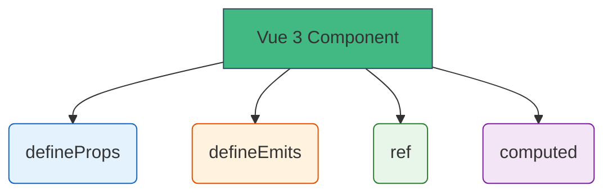

# Vue + TypeScript

## Kirish

> [!IMPORTANT]
> **Nima uchun muhim?**  
> Vue 2 da TypeScript bilan ishlash judayam azob edi (Class-based components, Decoratorlar). Vue 3 (Composition API va `<script setup>`) esa boshidan TypeScript bilan a'lo darajada ishlashga moslab yozilgan. Vue dasturchisi sifatida bugungi kunda TS bilmaslik katta kompaniyalarga ishga kirishingizda juda jiddiy to'siq bo'ladi.

> [!NOTE]
> **Real-hayot analogiyasi: "Restoran Oshxonasi"**  
> **Vue 2 (TS siz):** Oshpazga istalgan narsani (string, number, array) "Buyurtma" (Prop) qilib berib yuborish mumkin edi, ovqat pishmagunicha u yaroqsiz mahsulot ekanini bilmasdi.
> **Vue 3 (TS bilan):** Oshpazning oldida qattiq nazoratchi (TS) turadi. Siz menyuda faqat "2 ta butun tuxum" (number tipidagi, qat'iy Prop) kiritishingiz mumkin, agar "2 litr tuxum" desangiz, nazoratchi buyurtmani oshxonaga o'tkazmaydi (Compile xato beradi).

TypeScript Vue komponentlari ichidagi Reaktivlik, Props, Emits va Global Holat (Pinia) bilan to'g'ridan to'g'ri bog'lana oladi.



---

## 🟢 Junior (Asoslar va Tushunchalar)

Junior dasturchi komponent ichida eng ko'p ishlatiladigan `ref`, `computed` hamda Props va Emitlarga tip yozishni bilishi kerak.

### 1. `ref` va `computed` da tiplar
Aksariyat holatlarda TypeScript avtomatik tipni topadi (Inference). Ammo massiv yoki aniq bir tip bo'lganda `<T>` dan foydalanamiz.

```vue
<script setup lang="ts">
import { ref, computed } from 'vue'

// O'zi topadi: count bu number
const count = ref(0) 

// Lekin massiv boshida bo'sh bo'lsa, ichi nima ekanligini aytish kerak!
interface User {
  id: number;
  name: string;
}
const users = ref<User[]>([]) // Agar <User[]> yozmasangiz, always empty array (never[]) deb o'ylaydi.

// Computed o'zi nima return bo'lishidan topadi
const userCount = computed(() => users.value.length)
</script>
```

### 2. `defineProps` (Ota komponentdan keluvchi ma'lumotlar)
Vue 3 da biz Prop lar turlarini to'g'ridan to'g'ri Interface sifatida yozamiz. Type-based declaration deyiladi.

```vue
<script setup lang="ts">
// Vue o'zi bu TS kodni tushunib, to'g'ri runtime tekshiruvlariga aylantiradi
interface Props {
  title: string
  isActive?: boolean // Ixtiyoriy
}

// withDefaults yordamida default (boshlang'ich) qiymat berish mumkin
const props = withDefaults(defineProps<Props>(), {
  isActive: false // agar ota component isActive bermasa false bo'ladi
})
</script>
```

### 3. `defineEmits` (Ota komponentga habar berish)
Emitlarda qanday nomdagi hodisa ketishi va qanaqa parametrlar olib ketishini aniq yozamiz.

```vue
<script setup lang="ts">
// Ota komponentga 2 xil hodisa ketishi mumkin
const emit = defineEmits<{
  (e: 'update', value: string): void
  (e: 'delete', id: number): void
}>()

function sendUpdate() {
  emit('update', 'Yangi matn'); 
  // emit('delete', "1") // XATO! id number bo'lishi kerak
}
</script>
```

---

## 🟡 Middle (Amaliyot va Detallar)

Middle dasturchi murakkab DOM elementlari (Template Refs), voqealar (Events) va Composables (Custom Hooks) bilan qanday type-safe ishlashni biladi.

### 1. Template Refs (DOM elementlarni ushlash)
DOM elementni JS da ushlash uchun `ref` ishlatamiz. Uning tipi qanday HTML element ekanligiga qarab yoziladi.

```vue
<script setup lang="ts">
import { ref, onMounted } from 'vue'

// HTMLElement yoki uning bolalari (HTMLInputElement, HTMLDivElement).
// Boshida null, chunki DOM hali render bo'lmagan
const inputRef = ref<HTMLInputElement | null>(null)

onMounted(() => {
  // .value null bo'lishi mumkinligi uchun optional chaining (?.) ishlating
  inputRef.value?.focus()
})
</script>

<template>
  <input ref="inputRef" />
</template>
```

### 2. Event Handlers (DOM voqealari)
DOM dan keladigan voqealar turi ko'p (`MouseEvent`, `KeyboardEvent`, `Event`). Ularning target (kimdan keldi) tipini o'zgartirish (Type Assertion) kerak bo'ladi.

```vue
<script setup lang="ts">
// e: any ishlatish YOMON
function handleInput(e: Event) {
  // TypeScript e.target doim input ekanligini bilmaydi
  const target = e.target as HTMLInputElement
  console.log(target.value) // as qilingani uchun value bor!
}

function handleClick(e: MouseEvent) {
  console.log("X va Y koordinatalari:", e.clientX, e.clientY)
}
</script>

<template>
  <input @input="handleInput" />
  <button @click="handleClick">Bosish</button>
</template>
```

### 3. Composables (Takroriy mantlar)
Vue ning eng katta yutug'i Composable lardir. Ulardan qiymat qaytarganda to'g'ri `Ref<T>` yoki `ComputedRef<T>` tiplaridan foydalanish muhim.

```typescript
import { ref, onMounted, onUnmounted, type Ref } from 'vue'

// E'tibor bering, funksiya x va y qaytaradi (ikkalasi ham number tipli reaktiv o'zgaruvchilar)
export function useMousePosition(): { x: Ref<number>; y: Ref<number> } {
  const x = ref(0)
  const y = ref(0)

  function update(e: MouseEvent) {
    x.value = e.pageX
    y.value = e.pageY
  }

  onMounted(() => window.addEventListener('mousemove', update))
  onUnmounted(() => window.removeEventListener('mousemove', update))

  return { x, y }
}
```

---

## 🔴 Senior (Arxitektura va Optimizatsiya)

Senior dasturchi yirik State Management (Pinia), Global Routing, Provider/Inject arxitekturasi va Generic Component larni yarata oladi.

### 1. Pinia Stores
Pinia TypeScript uchun maxsus yaratilgan. Unda tipni topish juda kuchli, lekin Setup Syntax ishlatsangiz yanada qulay va aniq.

```typescript
import { defineStore } from 'pinia'
import { ref, computed } from 'vue'

export interface User { id: number; name: string; role: 'admin' | 'user' }

export const useUserStore = defineStore('user', () => {
  // State
  const currentUser = ref<User | null>(null)

  // Getters
  const isAdmin = computed(() => currentUser.value?.role === 'admin')

  // Actions
  async function fetchUser(id: number): Promise<void> {
    const res = await fetch(`/api/user/${id}`)
    currentUser.value = await res.json()
  }

  return { currentUser, isAdmin, fetchUser }
})
```

### 2. Provide / Inject (Dependency Injection)
Agar komponentlar zanjiri juda uzun bo'lsa `Provide/Inject` ishlatamiz. TS buni string kalit so'z bilan tushuna olmaydi, unga `InjectionKey` kerak.

```typescript
// injection-keys.ts
import type { InjectionKey, Ref } from 'vue'

// 1-qadam: Symbol yaratamiz va unga InjectionKey orqali qanday qiymat tashilishini aytamiz
export const themeKey: InjectionKey<Ref<'light' | 'dark'>> = Symbol('themeKey')

// App.vue (Provide)
provide(themeKey, ref('dark'))

// ChildComponent.vue (Inject)
// Endi TS inject qilingan narsa aniq Ref<'light'|'dark'> ekanini biladi!
const currentTheme = inject(themeKey) 
```

### 3. Generic Components (Vue 3.3+)
Siz shunday Table qilib yozdingizki, u har xil tipli ma'lumot qabul qila oladi (Users, Posts).

```vue
<!-- GenericList.vue -->
<!-- Bu yerda qoidasi: keladigan massiv har bir elementi albatta "id" ga ega bo'lishi shart -->
<script setup lang="ts" generic="T extends { id: number }">
defineProps<{
  items: T[]
}>()

const emit = defineEmits<{
  select: [item: T]
}>()
</script>

<template>
  <ul>
    <!-- Vue avtomatik tarzda T ni bilib oladi va tashqariga (slot ga) shu tipda chiqaradi -->
    <li v-for="item in items" :key="item.id" @click="emit('select', item)">
      <slot :item="item"></slot>
    </li>
  </ul>
</template>
```

### Intervyu Savoli
**"`ref` va `reactive` ning TypeScript nuqtai nazaridan asosiy farqlari nima va siz qaysi birini ko'proq tavsiya qilasiz?"**
*Javob:*
Vue hamjamiyatida (va ayniqsa TypeScript bilan) `ref` tavsiya qilinadi.
Sababi, `reactive` ob'ektini destructuring qilsangiz (masalan `const { name, age } = user`) uning reaktivligi uzilib qoladi (ularda pointer saqlanmaydi) va TS tiplari to'g'ri ishlamasligi mumkin. Shuningdek API dan javob kelsa `user = reactive(data)` deb bera olmaysiz (reaktiv ob'ekt to'liq yangilansa reference yo'qoladi). `ref` da esa har doim `.value` ishlatasiz: aniq, destructure qilish ehtiyoji yo'q, xavfsiz va tiplar doim 100% to'g'ri bog'lanadi.

---

## Eng Yaxshi Amaliyotlar (Best Practices)

1. **Interfeyslarni ajrating (Types fayllari)**: Katta loyihalarda barcha tiplarni har bir `.vue` fayli ichida yozavermang. Ularni alohida `types/user.ts` kabi fayllarga ajratib, kerakli joyda import qiling (`import type { User } from '@/types/user'`).
2. **`Ref` emas, Type Argument `ref<T>` ishlating**: O'zgaruvchini tipini yozganda `const count: Ref<number> = ref(0)` yozish uzoq. Vue type inference dan foydalaning va shunchaki `const count = ref<number>(0)` ishlating.
3. **Reactive o'rniga Ref ishlatishga intiling**: TS bilan ishlaganda `reactive` ning tiplari va reaktivligi buzilib qolish ehtimoli (masalan, destructuring qilinganda) ko'p. `ref` esa `value` xossasi orqali har doim xavfsiz o'qiladi va tipini yaxshi saqlaydi.

---

## Xulosa

Vue 3 va TypeScript mukammal juftlik bo'lib, quyidagi qulayliklarni beradi:

| Vue Konsepsiyasi | TypeScript dagi Usuli | Asosiy Foydasi |
| --- | --- | --- |
| **Data (Reactivity)** | `ref<T>()` yoki `computed<T>()` | To'g'ri o'zgaruvchi tiplarini ushlash |
| **Props** | `defineProps<Interface>()` | Ota komponent beradigan ma'lumot xavfsizligi |
| **Emits (Events)** | `defineEmits<{ (e: 'name'): void }>()` | Event nomini va argumentini noto'g'ri yozib qo'ymaslik |
| **DOM Refs** | `ref<HTMLInputElement | null>(null)` | DOM property larini (value, focus) xatosiz topish |
| **Provide / Inject** | `InjectionKey<T>` | Chuqur komponentlarda ham tipni saqlab qolish |
| **Global State** | `defineStore` (Pinia Setup) | Barcha state/getters ga to'g'ridan-to'g'ri TS ko'magi |

Bu TypeScript bo'limining oxiri. Barcha mavzularni o'rganib, amalda qo'llang!
