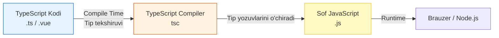

# TypeScript - To'liq Qo'llanma

## Mundarija

1. [Asoslar (Types, Interfaces)](./01-basics.md)
2. [Generics](./02-generics.md)
3. [Utility Types](./03-utility-types.md)
4. [Strict Mode](./04-strict-mode.md)
5. [Type Guards](./05-type-guards.md)
6. [Advanced Patterns](./06-advanced-patterns.md)
7. [Vue + TypeScript](./07-vue-typescript.md)

---

## TypeScript Nima?

> [!IMPORTANT]
> **Nima uchun muhim?**  
> JavaScript juda erkin til. Unda xato qilsangiz ham ishlab ketaveradi, to qachonki xaridor saytga kirib tugmani bosib saytni qulatib qo'ymagunicha. Katta jamoalarda kimdir yozgan funksiyaga yana kimdir nima ma'lumot jo'natishni bilmay soatlab vaqt yo'qotadi. TypeScript shunchaki "Tiplar qatlami" ni taqdim etadi va kodingiz noto'g'ri ishlashi mumkin bo'lgan holatlarni siz kod yozayotganingizdayoq tagiga qizil chizib ko'rsatadi. Bugungi kunda Front-End bo'yicha har qanday jiddiy loyiha faqat TypeScript da yozilmoqda.

> [!NOTE]
> **Real-hayot analogiyasi: "Yo'l harakati qoidalari"**  
> **JavaScript (Qoidasiz yo'l):** Har kim xohlagan tomonga yuradi, tezlik chegarasi yo'q. Erkinlik bor, lekin avariya bo'lish ehtimoli (Runtime Error) juda yuqori.
> **TypeScript (Qoidali yo'l):** Chiziqlar, svetoforlar, va tezlikni o'lchovchi radarlar bor. Qoidalarga amal qilishingiz shart (Compile xatosi). Boshida qiyin va cheklovchi tuyulishi mumkin, lekin hamma mashinalar (Funksiyalar, Komponentlar) bir-biri bilan ishonchli va xavfsiz harakatlanadi.

TypeScript - bu Microsoft tomonidan yaratilgan **statik tipli** JavaScript superset'i. U JavaScript'ga tip annotatsiyalari, interfeyslar, generics va boshqa kuchli xususiyatlarni qo'shadi.



### Asosiy Afzalliklar

| Xususiyat | JavaScript | TypeScript |
|-----------|------------|------------|
| Tip xavfsizligi | Yo'q (runtime xatolari) | Bor (compile-time tekshiruv) |
| IDE qo'llab-quvvatlash | Cheklangan | Mukammal (autocomplete, refactoring) |
| Katta loyihalar | Qiyin boshqarish | Oson boshqarish |
| Dokumentatsiya | Alohida yozish kerak | Tiplar o'zi dokumentatsiya |
| Refactoring | Xavfli | Xavfsiz |

---

## Nima Uchun TypeScript?

### 1. Compile-Time Xatoliklarni Ushlash

```javascript
// JavaScript - xato faqat runtime'da
function add(a, b) {
  return a + b;
}
add("5", 3); // "53" - kutilmagan natija
```

```typescript
// TypeScript - xato compile-time'da
function add(a: number, b: number): number {
  return a + b;
}
add("5", 3); // ERROR: Argument of type 'string' is not assignable to parameter of type 'number'
```

### 2. Intellisense va Autocomplete

TypeScript IDE'ga to'liq ma'lumot beradi:

```typescript
interface User {
  id: number;
  name: string;
  email: string;
  createdAt: Date;
}

function getUser(id: number): User {
  // ...
}

const user = getUser(1);
user. // IDE user.id, user.name, user.email, user.createdAt ni ko'rsatadi
```

### 3. Katta Jamoalar Uchun

- Tiplar **shartnoma** vazifasini bajaradi
- Yangi dasturchi kodga tezroq tushunadi
- Refactoring xavfsiz
- API o'zgarishlari darhol ko'rinadi

---

## TypeScript Arxitekturasi

```
┌─────────────────────────────────────────────────────────────┐
│                    TypeScript Source (.ts)                   │
└─────────────────────────────────────────────────────────────┘
                              │
                              ▼
┌─────────────────────────────────────────────────────────────┐
│                    TypeScript Compiler (tsc)                 │
│  ┌─────────────┐  ┌─────────────┐  ┌─────────────────────┐  │
│  │   Parser    │──▶│  Type      │──▶│  Code Generator    │  │
│  │             │  │  Checker   │  │  (Emitter)          │  │
│  └─────────────┘  └─────────────┘  └─────────────────────┘  │
└─────────────────────────────────────────────────────────────┘
                              │
                              ▼
┌─────────────────────────────────────────────────────────────┐
│                    JavaScript Output (.js)                   │
└─────────────────────────────────────────────────────────────┘
```

### Compilation Jarayoni

1. **Parsing** - TypeScript kodi AST (Abstract Syntax Tree) ga aylanadi
2. **Type Checking** - Tiplar tekshiriladi, xatolar aniqlanadi
3. **Emission** - JavaScript kodi generatsiya qilinadi

---

## O'rnatish va Sozlash

### Global O'rnatish

```bash
npm install -g typescript
tsc --version
```

### Loyihaga O'rnatish

```bash
npm init -y
npm install --save-dev typescript
npx tsc --init
```

### tsconfig.json Asosiy Sozlamalari

```json
{
  "compilerOptions": {
    // Target JavaScript versiyasi
    "target": "ES2022",

    // Module tizimi
    "module": "ESNext",
    "moduleResolution": "bundler",

    // Strict mode (tavsiya etiladi)
    "strict": true,
    "noImplicitAny": true,
    "strictNullChecks": true,

    // Output
    "outDir": "./dist",
    "rootDir": "./src",

    // Source maps (debugging uchun)
    "sourceMap": true,

    // Declaration files
    "declaration": true,

    // Import/Export
    "esModuleInterop": true,
    "allowSyntheticDefaultImports": true,

    // Path aliases
    "baseUrl": ".",
    "paths": {
      "@/*": ["src/*"],
      "@components/*": ["src/components/*"]
    }
  },
  "include": ["src/**/*"],
  "exclude": ["node_modules", "dist"]
}
```

---

## TypeScript vs JavaScript: Amaliy Taqqoslash

### Case 1: API Response Handling

```javascript
// JavaScript - hech qanday tip xavfsizligi yo'q
async function fetchUser(id) {
  const response = await fetch(`/api/users/${id}`);
  const user = await response.json();

  // user.nmae - typo, lekin xato ko'rinmaydi
  console.log(user.nmae); // undefined, xato yo'q
}
```

```typescript
// TypeScript - to'liq tip xavfsizligi
interface User {
  id: number;
  name: string;
  email: string;
}

interface ApiResponse<T> {
  data: T;
  status: number;
  message: string;
}

async function fetchUser(id: number): Promise<User> {
  const response = await fetch(`/api/users/${id}`);
  const result: ApiResponse<User> = await response.json();

  // result.data.nmae - ERROR: Property 'nmae' does not exist
  console.log(result.data.name); // OK

  return result.data;
}
```

### Case 2: Event Handling

```javascript
// JavaScript
function handleClick(event) {
  console.log(event.trget.value); // typo, undefined
}
```

```typescript
// TypeScript
function handleClick(event: MouseEvent): void {
  const target = event.target as HTMLButtonElement;
  console.log(target.textContent); // type-safe
}

// Input uchun
function handleInput(event: Event): void {
  const target = event.target as HTMLInputElement;
  console.log(target.value); // type-safe
}
```

---

## TypeScript Learning Path

```
┌─────────────────────────────────────────────────────────────┐
│  BEGINNER                                                    │
│  ├── Primitive Types (string, number, boolean)              │
│  ├── Arrays & Tuples                                        │
│  ├── Objects & Interfaces                                   │
│  └── Functions                                              │
├─────────────────────────────────────────────────────────────┤
│  INTERMEDIATE                                                │
│  ├── Union & Intersection Types                             │
│  ├── Type Aliases                                           │
│  ├── Generics                                               │
│  └── Utility Types                                          │
├─────────────────────────────────────────────────────────────┤
│  ADVANCED                                                    │
│  ├── Conditional Types                                       │
│  ├── Mapped Types                                           │
│  ├── Template Literal Types                                 │
│  ├── Type Guards & Narrowing                                │
│  └── Declaration Files (.d.ts)                              │
├─────────────────────────────────────────────────────────────┤
│  EXPERT                                                      │
│  ├── Infer Keyword                                          │
│  ├── Recursive Types                                        │
│  ├── Variance (Covariance/Contravariance)                   │
│  └── Type-Level Programming                                 │
└─────────────────────────────────────────────────────────────┘
```

---

## Real-World TypeScript Patterns

### Domain-Driven Design

```typescript
// Value Objects
type Email = string & { readonly brand: unique symbol };
type UserId = number & { readonly brand: unique symbol };

function createEmail(value: string): Email {
  if (!value.includes("@")) {
    throw new Error("Invalid email");
  }
  return value as Email;
}

function createUserId(value: number): UserId {
  if (value <= 0) {
    throw new Error("Invalid user ID");
  }
  return value as UserId;
}

// Endi email va userId aralashtirish mumkin emas
function sendEmail(to: Email, userId: UserId): void {
  // ...
}

const email = createEmail("user@example.com");
const userId = createUserId(123);

sendEmail(email, userId); // OK
sendEmail(userId, email); // ERROR: type mismatch
```

### Result Pattern (Error Handling)

```typescript
type Result<T, E = Error> =
  | { success: true; data: T }
  | { success: false; error: E };

async function fetchUser(id: number): Promise<Result<User>> {
  try {
    const response = await fetch(`/api/users/${id}`);

    if (!response.ok) {
      return {
        success: false,
        error: new Error(`HTTP ${response.status}`)
      };
    }

    const user = await response.json();
    return { success: true, data: user };
  } catch (error) {
    return {
      success: false,
      error: error instanceof Error ? error : new Error(String(error))
    };
  }
}

// Ishlatish
const result = await fetchUser(1);

if (result.success) {
  console.log(result.data.name); // type-safe
} else {
  console.error(result.error.message); // type-safe
}
```

---

## TypeScript Eng Yaxshi Amaliyotlar (Best Practices)

### 1. Strict Mode Yoqing

```json
{
  "compilerOptions": {
    "strict": true
  }
}
```

### 2. `any` dan Qoching

```typescript
// YOMON
function process(data: any): any {
  return data.something;
}

// YAXSHI
function process<T extends { something: unknown }>(data: T): T["something"] {
  return data.something;
}
```

### 3. Narrow Types (Aniqroq Tiplar)

```typescript
// YOMON
function getStatus(): string {
  return "pending";
}

// YAXSHI
type Status = "pending" | "approved" | "rejected";

function getStatus(): Status {
  return "pending";
}
```

### 4. Immutability

```typescript
// YOMON
interface User {
  name: string;
  roles: string[];
}

// YAXSHI
interface User {
  readonly name: string;
  readonly roles: readonly string[];
}

// Yoki Readonly utility type
type ImmutableUser = Readonly<User>;
```

### 5. Discriminated Unions

```typescript
// YOMON
interface Shape {
  kind: string;
  radius?: number;
  width?: number;
  height?: number;
}

// YAXSHI
interface Circle {
  kind: "circle";
  radius: number;
}

interface Rectangle {
  kind: "rectangle";
  width: number;
  height: number;
}

type Shape = Circle | Rectangle;

function getArea(shape: Shape): number {
  switch (shape.kind) {
    case "circle":
      return Math.PI * shape.radius ** 2;
    case "rectangle":
      return shape.width * shape.height;
  }
}
```

---

## Xulosa

TypeScript zamonaviy JavaScript loyihalarining standart vositasiga aylangan. U:

- **Xatolarni erta ushlaydi** - runtime o'rniga compile-time
- **IDE tajribasini yaxshilaydi** - mukammal autocomplete va refactoring
- **Dokumentatsiya vazifasini bajaradi** - tiplar o'zi kod hujjati
- **Katta loyihalarni boshqarishni osonlashtiradi** - shartnomalar va abstraksiyalar

Keyingi bo'limlarda TypeScript'ning har bir jihatini chuqur o'rganamiz.
