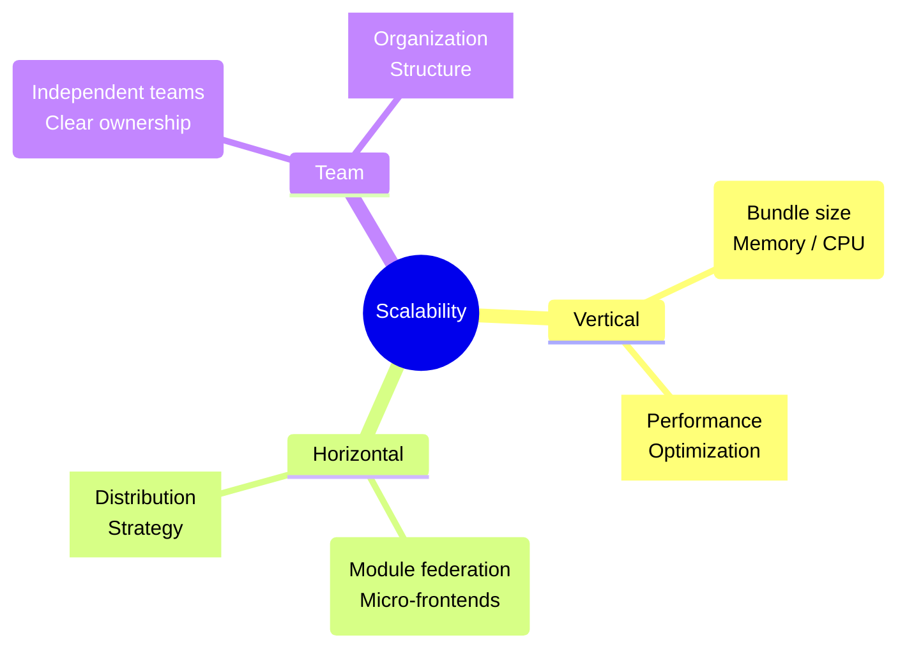

# Scalability - Loyihani Kengaytirish Strategiyalari

## Kirish

> [!IMPORTANT]
> **Nima uchun muhim?**  
> Boshida har qanday loyiha chiroyli va tartibli bo'ladi. Ammo oylar (yillar) o'tgach, funksiyalar va talablar ko'payganda, agar boshlang'ich arxitektura to'g'ri qurilmagan bo'lsa, kod ustida ishlash dahshatga aylanadi. Bitta joyni o'zgartirsangiz 5 ta joy buziladi (Spaghetti code). Scalability (Kengayuvchanlik) - bu "loyihaga minglab fayllar va yangi dasturchilar qo'shilganida ham ishlash tezligi va kod sifati tushib ketmasligini ta'minlash" dir.

> [!NOTE]
> **Real-hayot analogiyasi: "Shahar qurilishi"**  
> Tasavvur qiling siz shahar quryapsiz. Boshida 100 ta odam yashaydi, bitta quduq va bitta yo'l hamma uchun yetarli (Small scale).
> Ammo 10 yil o'tib aholi 1 millionga yetdi. Agar siz boshidan keng ko'chalar tashlab ketmagan bo'lsangiz, kanalizatsiya trubalarini markazlashgan qilib qurmagan bo'lsangiz, endi uylarni buzib ko'cha kengaytirishga majbur bo'lasiz. Dasturlashda ham huddi shunday — loyiha arxitekturasi kelajakdagi o'sishga tayyor turishi (Scalable bo'lishi) kerak.



---

## 🟢 Junior (Asoslar va Tushunchalar)

Junior dasturchi loyiha strukturasini qanday qilib to'g'ri tashkil qilish (Folder Structure) va kichik-o'rta masshtabda qanday ishlashni tushunishi kerak.

### 1. Flat Structure (Yomon)
Barcha fayllarni faqat turiga qarab bitta papkaga yig'ish (Kengaytirish qiyin).

```javascript
// YOMON: Flat structure
// src/
//   components/
//     Button.vue
//     UserProfile.vue
//     ProductList.vue // Hammasi aralash!
//   views/
//   stores/
```

### 2. Feature-based Structure (Yaxshi)
Modullarni va funksionallikni guruhlash yordamida ajratish (High Cohesion).

```javascript
// YAXSHI: Feature-based modules
// src/
// ├── features/
// │   ├── auth/
// │   │   ├── components/  (Faqat auth ga tegishli)
// │   │   ├── composables/ (Faqat auth ga tegishli)
// │   │   └── api.js       
// │   │
// │   └── products/
// │       ├── components/
// │       └── stores/
// │
// └── shared/              (Umumiy narsalar)
//     ├── components/      (BaseButton, BaseInput)
//     └── utils/           
```

---

## 🟡 Middle (Amaliyot va Detallar)

Middle dasturchi API Layer (qavatlar) yaratish va Store'larni domainlarga qarab ajratishni amalga oshiradi.

### 1. API Layer Architecture
Barcha HTTP zaproslarni (fetch/axios) komponent ichida emas, alohida API qavatda yozish.

```javascript
// ========================================
// YOMON: Inline API calls (Komponent ichida)
// ========================================
const products = ref([])
async function fetchProducts() {
  const res = await axios.get('/api/products')
  products.value = res.data
}

// ========================================
// YAXSHI: Layered API architecture
// ========================================

// 1. API Service (Faqat API muloqoti)
// api/products.api.js
export const productsApi = {
  getAll: (params) => http.get('/products', { params }),
  getById: (id) => http.get(`/products/${id}`)
}

// 2. Composable (Logika)
// composables/useProducts.js
export function useProducts() {
  const products = ref([])
  const loading = ref(false)

  async function fetch() {
    loading.value = true
    const { data } = await productsApi.getAll()
    products.value = data
    loading.value = false
  }

  return { products, loading, fetch }
}
```

### 2. State Scaling Patterns (Pinia)
Store ni "bitta yirik fayl" qilib emas, vazifasiga qarab ajratish (Domain-driven stores).

```javascript
// YOMON: Bitta katta store. Hamma narsa shu yerda.
export const useMainStore = defineStore('main', { ... })

// YAXSHI: Domain bo'yicha ajratish
// stores/auth.store.js
export const useAuthStore = defineStore('auth', { ... })

// stores/cart.store.js
export const useCartStore = defineStore('cart', { ... })

// composables/useCheckout.js (Cross-store logic)
// Store larni biriktirib ishlatadigan alohida Hook/Composable
export function useCheckout() {
  const auth = useAuthStore()
  const cart = useCartStore()

  function processOrder() {
    if (auth.isLoggedIn) {
       // cart ni tozalash...
    }
  }
}
```

---

## 🔴 Senior (Arxitektura va Optimizatsiya)

Senior dasturchi yirik jamoalar uchun (Scale Teams) va arxitektura qoidalarini (Boundaries) o'rnatadi. 

### 1. Micro-frontends (MFE)
Loyiha juda kattalashib ketganda (10+ developer, 30+ daqiqalik build vaqti), butun bitta katta Monolith dasturni bir nechta mustaqil dasturlarga (Micro-frontends) ajratish strategiyasi. Buni odatda Webpack Module Federation yoki Vite yordamida qilinadi.

```text
Monolith → Module Federation

├── Shell App (Asosiy karkas: Routing, Navbar)
├── Auth MFE (Alohida jamoa, alohida portda ishlaydi)
├── Products MFE (Alohida jamoa)
└── Cart MFE (Alohida jamoa)
```
- **Foydasi:** Har bir jamoa mustaqil kod yozadi, mustaqil Deploy qiladi, build tezlashadi.
- **Zarari:** O'rnatish qiyin, state sharing (ma'lumot almashish) murakkab.

### 2. Architecture Fitness Functions
Arxitektura sekin-asta "chirib" ketmasligi uchun CI/CD jarayoniga qat'iy qoidalar kiritish.

```javascript
// eslint-plugin-boundaries yoki dependency-cruiser orqali:
// Qoida: "features" jildidagi biron papka boshqa biron "features" papkasini import qilmasligi shart.
// Agar auth papkasi products ni import qilsa -> Build xato beradi!
```

### Intervyu Savoli
**"Loyiha kattalashgan sari Vue.js komponentlari ham judayam kattalashib (1000+ qator kod) ketishining oldini qanday olasiz?"**
*Javob:*
Vue 3 da eng yaxshi usul - "Logical extraction via Composables". Komponent 1000 qatorga yetib bormasligi kerak. Agar jadval (DataTable) komponenti katta bo'lib ketsa, men Sorting logikasini alohida `useTableSort`, filtrlashni `useTableFilter`, paginatsiyani `useTablePagination` composable'lariga ajrataman. Komponent faylining o'zi faqat ushbu hooklarni birlashtiruvchi (orchestrator) va UI chiqaruvchi qatlamga aylanadi. Hamma biznes logika `.ts/js` fayllarda bo'ladi, ularni test qilish (Unit Test) ham osonlashadi.

---

## Eng Yaxshi Amaliyotlar (Best Practices)

1. **High Cohesion, Low Coupling:** Bir-biriga bog'liq bo'lgan ma'lumotlarni (UI, logika, API call) bitta modulda (Cohesion) ushlang va u boshqa modullarga juda ko'p bog'lanib qolishini (Coupling) oldini oling.
2. **Kengayuvchi Struktura:** Barcha komponentlarni bitta "components" jildida saqlamang. Feature-Sliced Design (FSD) yoki Module-based arxitektura orqali loyihani bo'laklarga ajrating.
3. **Yagona Haqiqat Manbai (Single Source of Truth):** Har bir modul ma'lumotni o'zidan olsa, synchronization muammosi kelib chiqadi. State Management orqali Global va Local statelarni to'g'ri rejalashtiring.
4. **ADR yozing:** Muhim arxitektura qarorlarini nega aynan shu tarzda qabul qilganingizni hujjatlashtiring (Architecture Decision Records). Yangi jamoa a'zolari "nega bunday qilingan" deb o'ylab qolishmasin.

---

## Xulosa

| Yondashuv | Kichik Loyiha (Junior) | O'rta Loyiha (Middle) | Katta Loyiha (Senior) |
| --- | --- | --- | --- |
| **Papkalar strukturasi** | Flat (turi bo'yicha) | Feature-based (vazifasiga ko'ra) | Monorepo / Micro-frontends |
| **API qatlami** | Komponent ichida | Alohida API xizmatlari | SDK, Gateway orqali |
| **State Management** | Global bitta store | Domain-driven stores | Shared State Contract |
| **Qoidalarni saqlash** | Og'zaki kelishuv | Linterlar (ESLint) | Architectural Fitness Functions |

Keyingi darslarda "Design Patterns" haqida to'xtalib o'tamiz.
