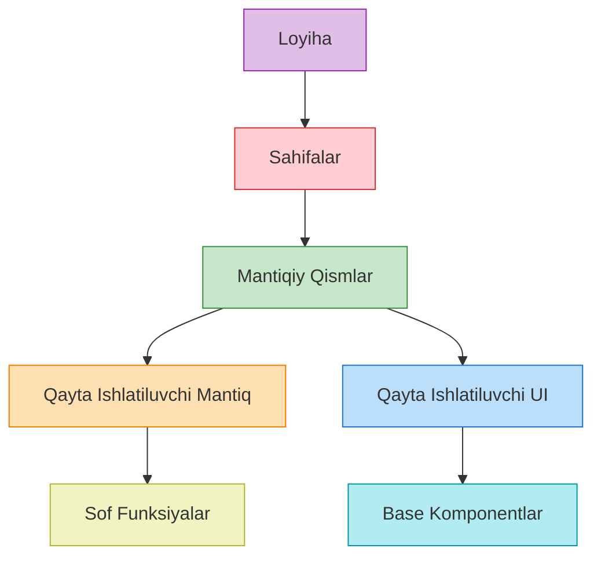

# Reusability - Kodni Qayta Ishlatish Prinsiplari

## Kirish

> [!IMPORTANT]
> **Nima uchun muhim?**  
> Dasturlashda eng qimmat resurs bu dasturchining vaqti hisoblanadi. Bir xil muammoni qayta-qayta yechish (kodni kopyalash) o'rniga, moslashuvchan, qayta ishlatiladigan (reusable) komponentlar yoki funksiyalar yaratish jamoa tezligini yuzlab martaga oshiradi. Ammo, noto'g'ri qilingan "qayta ishlatuvchanlik" (haddan tashqari erta qilingan abstraksiya) loyihaning o'zgarishiga katta to'siq bo'lishi mumkin. To'g'ri reusability chegaralarini bilish Senior darajasidagi muhandisning eng asosiy sifatlaridan biridir.

> [!NOTE]
> **Real-hayot analogiyasi: "Bino qurilishidagi g'ishtlar va tayyor xonalar"**  
> Agar siz faqat qum va sement (DRY qoidasiga to'liq amal qilmaslik) ishlatsangiz, uyni nol qavatdan boshlab qurasiz, bu juda uzoq davom etadi. Agar siz tayyor butun bir xonani ishlab chiqarsangiz (haddan tashqari abstraksiya), u faqat bitta turdagi uylarga mos tushadi, boshqa dizayndagi uyga sig'maydi. Lekin siz tayyor **g'ishtlar va bloklar** (to'g'ri reusability) ishlatsangiz, ulardan xohlagan shakldagi uy, saroy yoki devor qurishingiz mumkin!



---

## 🟢 Junior (Asoslar va Tushunchalar)

Junior dasturchi "Rule of Three" (Uch qoidasi) va eng oddiy Utility (yordamchi) funksiyalarni ajratishni tushunishi kerak.

### 1. The Rule of Three (Uch marta takrorlash qoidasi)
Dasturlashda "Erta abstraksiya qilmang" (Premature abstraction is the root of all evil) degan qoida bor. 

- **1-marta:** Shunchaki kodni yozing va ishlatib ko'ring.
- **2-marta:** Xuddi shu kod boshqa joyda kerak bo'lsa, Copy-Paste qilish mumkin (Bu hali fojia emas).
- **3-marta:** Endi shu kod uchunchi joyda ham kerak bo'ldi. STOP! Bu kodni alohida `utils` yoki `components` papkasiga olib chiqish (Refactoring) vaqti keldi.

### 2. Utility Functions (Sof Yordamchi Funksiyalar)
Vue'ga (yoki framework'ga) aloqasi bo'lmagan, faqat ma'lumot qabul qilib ma'lumot qaytaradigan funksiyalar (Pure Functions). Ularni `.vue` fayli ichida yozmang.

```javascript
// ========================================
// YOMON: Har bir .vue fayl ichida qayta-qayta yozilgan mantiq
// ========================================
const formattedPrice = new Intl.NumberFormat('uz-UZ', { style: 'currency', currency: 'UZS' }).format(price)

// ========================================
// YAXSHI: src/utils/formatters.js ga chiqarilgan reusable kod
// ========================================
export function formatCurrency(amount, currency = 'UZS') {
  return new Intl.NumberFormat('uz-UZ', {
    style: 'currency',
    currency
  }).format(amount)
}

// Komponentda ishlatilishi:
import { formatCurrency } from '@/utils/formatters'
const price = formatCurrency(15000)
```

---

## 🟡 Middle (Amaliyot va Detallar)

Middle dasturchi UI komponentlarni moslashuvchan (flexible) qilib yaratishni va mantiqni Composables'ga chiqarishni biladi.

### 1. Reusable UI Components
Yaxshi komponent ichida biznes logika bo'lmaydi (U API'ga so'rov yubormaydi, u faqat vizual ko'rsatadi). Komponent qanchalik sodda bo'lsa, u shunchalik reusable bo'ladi.

```vue
<!-- YOMON: Juda moslashuvchan bo'lmagan, qotib qolgan Button -->
<!-- Faqat bitta turdagi icon, faqat click handler -->
<template>
  <button class="bg-blue-500 rounded p-2" @click="saveData">
    <SaveIcon /> Saqlash
  </button>
</template>

<!-- YAXSHI: BaseButton.vue - Universal tugma -->
<template>
  <button 
    :class="['rounded p-2 flex gap-2 items-center', variantClasses[variant]]"
    :disabled="isLoading"
  >
    <span v-if="isLoading" class="spinner"></span>
    <slot name="leftIcon"></slot>
    <slot></slot> <!-- Asosiy matn uchun -->
    <slot name="rightIcon"></slot>
  </button>
</template>

<script setup>
defineProps({
  variant: { type: String, default: 'primary' },
  isLoading: { type: Boolean, default: false }
})

const variantClasses = {
  primary: 'bg-blue-500 text-white',
  danger: 'bg-red-500 text-white'
}
</script>
```

### 2. Composables (Qayta Ishlatiluvchi Mantiq)
Agar vizual oyna emas, faqat Mantiq (API chaqirish, o'zgaruvchilarni kuzatish) kerak bo'lsa Vue'da Composables ishlatiladi.

```javascript
// src/composables/usePagination.js
import { ref, computed } from 'vue'

export function usePagination(totalItems, itemsPerPage = 10) {
  const currentPage = ref(1)
  
  const totalPages = computed(() => Math.ceil(totalItems.value / itemsPerPage))
  
  function nextPage() {
    if (currentPage.value < totalPages.value) currentPage.value++
  }
  
  function prevPage() {
    if (currentPage.value > 1) currentPage.value--
  }

  return { currentPage, totalPages, nextPage, prevPage }
}

// Buni endi har qanday Table komponentida bemalol ishlatsa bo'ladi!
```

---

## 🔴 Senior (Arxitektura va Optimizatsiya)

Senior dasturchi Composition over Configuration prinsipini va komponentlarning "Kontrakt"larini boshqarishni biladi.

### 1. Composition over Configuration
Komponentga yuzlab Prop'lar berib uni "universal" qilishga urinish (Configuration) oxir-oqibat kodni tushunarsiz qilib yuboradi. Buning o'rniga "Slot"lar orqali komponentlarni biriktirish (Composition) ancha yaxshi.

```vue
<!-- YOMON: Configuration approach (Prop Drilling) -->
<DataTable
  :data="users"
  :columns="columns"
  :show-header="true"
  :sortable="true"
  :header-color="'blue'"
  :row-class="'hover:bg-gray-100'"
/>
<!-- Barcha mantiq DataTable ichida yashiringan, uni o'zgartirish qiyin. -->

<!-- YAXSHI: Composition approach -->
<DataTable :data="users">
  <template #header>
    <TableHeader color="blue">
      <TableSort @sort="handleSort" />
    </TableHeader>
  </template>

  <template #row="{ item }">
    <UserRow :user="item" class="hover:bg-gray-100" />
  </template>
</DataTable>
<!-- Moslashuvchan! Men ixtiyoriy UserRow o'rniga AdminRow ishlata olaman -->
```

### 2. Renderless Components
Faqat logika va state saqlaydigan, lekin o'zidan vizual interfeys chiqarmaydigan komponentlar. Hozirda bu pattern Composables paydo bo'lgach kam ishlatiladi, lekin UI Framework'larda hamon bor (Masalan: `<router-view>` ham renderless component).

### Intervyu Savoli
**"Siz loyihada 5 ta har xil joyda kerak bo'ladigan 'Qidiruv' (Search) funksiyasini qanday qilib Reusable qilasiz?"**
*Javob:*
Men uni Composables va UI ga ajrataman.
1. `useSearch.ts` composable yozaman. U qidiruv so'zi (query), loading state va natijalarni saqlaydi, hamda debounce mantiqini bajaradi (API ga so'rov jo'natish).
2. `BaseSearchInput.vue` vizual komponent yarataman. U faqat Input UI va uning event'lari bilan shug'ullanadi.
3. Loyihaning qaysi qismida kerak bo'lsa, men BaseSearchInput ni ko'rsataman va unga useSearch orqali olingan ma'lumotlar va metodlarni ulayman. Shunda UI o'zgarsa faqat bitta komponentni, logika o'zgarsa faqat bitta composable ni o'zgartiraman. Va bu mantiqni butunlay boshqa ko'rinishdagi (masalan, Select Dropdown) qidiruv komponentida ham mustaqil ishlatsam bo'ladi.

---

## Eng Yaxshi Amaliyotlar (Best Practices)

1. **Uchinchi marta takrorlangandagina (Rule of Three) abstraksiya qiling:** Kodni birinchi marta yozganda oddiy qilib yozing. Ikkinchi marta nusxalanganda ham mayli nusxalab turing. Ammo uchinchi marta huddi shu kod kerak bo'lganda, endi uni umumiy reusable funksiya yoki komponentga aylantiring. Erta qilingan abstraksiya har doim noto'g'ri bo'lib chiqadi.
2. **Kodni emas, Mantiqni (Logic) ulashing:** Vizual (UI) qismlar doim o'zgarib turadi, lekin orqadagi hisob-kitob (masalan, sanani formatlash, valyutani hisoblash, pagination mantiqi) kamdan-kam o'zgaradi. Shuning uchun Vue'da "Composables" (`usePagination()`), React'da "Custom Hooks" yordamida faqat mantiqni alohida ajratib oling.
3. **Konfiguratsiya o'rniga Kompozitsiya (Composition over Configuration):** Bitta komponentga yuzlab prop'lar qo'shib "super moslashuvchan" qilishga urinmang (masalan, `<Table showHeader="..." sortable="..." color="..." />`). Buning o'rniga komponentlarni bo'laklarga ajratib (Slots/Children) ishlating (`<Table><TableHeader /><TableBody /></Table>`).

---

## Xulosa

| Yondashuv turi | Qachon ishlatiladi | Xavflari / Kamchiligi |
| --- | --- | --- |
| **Copy-Paste (Kopyalash)** | Kod birinchi yoki ikkinchi marta kerak bo'lganda | Kod takrorlanadi, xato bo'lsa hamma joyda o'zgartirish kerak |
| **Composables / Hooks** | Faqat biznes mantiqi yoki state boshqaruvi kerak bo'lganda | Vizual interfeysni taqdim etmaydi |
| **UI Components (Slots)** | Bir xil strukturaga ega vizual oyna va mantiq kerak bo'lganda | "Prop Drilling" yuzaga kelishi mumkin |
| **NPM Packages / Micro-FE**| Bir nechta turli xil jamoalar va loyihalar o'rtasida ulashish uchun | Yangilash qiyin, versiyalarni boshqarish kerak (Versioning overhead) |

Dasturlashda eng muhim qoida "Abstraksiya yaxshi, lekin noto'g'ri abstraksiya takrorlanadigan koddan ko'ra yomonroqdir".
