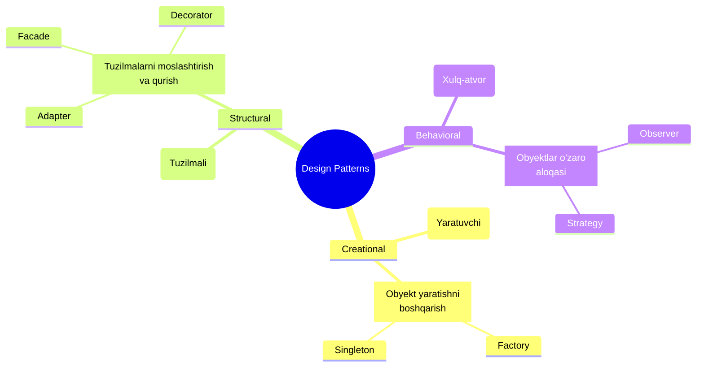

# Design Patterns - Frontend Design Pattern'lar

## Kirish

> [!IMPORTANT]
> **Nima uchun muhim?**  
> Dasturlashda ko'p muammolar aslida oldin kimdir tomonidan hal qilingan bo'ladi. Har safar g'ildirakni qaytadan kashf qilish o'rniga, Design Pattern'lar (Dasturlash andozalari) ni ishlatsangiz, kodingizni tushunish, kengaytirish va boshqa dasturchilar bilan ishlash keskin osonlashadi. Pattern'lar — bu muammoga nisbatan isbotlangan yechimlardir.

> [!NOTE]
> **Real-hayot analogiyasi: "Bino Qurish"**  
> Tasavvur qiling siz bino qurmoqchisiz.  
> 1. Har bir eshikni noldan o'lchab, o'zingiz yasamaysiz. Tayyor fabrikadan (Factory Pattern) o'lchamini berib buyurtma qilasiz.  
> 2. Agar uyga elektr kerak bo'lsa, uni to'g'ridan-to'g'ri simga ulamaysiz. Rozetkadan (Adapter Pattern) foydalanasiz.  
> 3. Yong'in chiqqanda signalizatsiya barcha xonalarga xabar yuborishi kerak bo'ladi (Observer Pattern).  
> Dasturlash ham aynan xuddi shunday qurilish qoidalariga bo'ysunadi.



---

## 🟢 Junior (Asoslar va Tushunchalar)

Junior dasturchi eng oddiy va ko'p ishlatiladigan andozalarni bilishi kerak. Masalan: Singleton va Factory patternlar.

### 1. Singleton Pattern (Yagona nusxa)
**Nima u?** Butun loyiha davomida faqat bitta marta yaratiladigan va hamma joydan chaqirsa bo'ladigan Obyekt yoki Klass.
**Qachon ishlatiladi?** Global State (Pinia/Vuex store'lar aslan Singleton), konfiguratsiyalar yoki faqat 1 ta ulanishni talab qiluvchi xizmatlarda (masalan Axios instancelari).

```javascript
// axios-client.js - Bu Singleton! Barcha joydan bitta instance ishlatiladi
import axios from 'axios'

const apiClient = axios.create({
  baseURL: 'https://api.example.com'
})

export default apiClient
```

### 2. Factory Pattern (Fabrika)
**Nima u?** Har safar bir xil ishni qilavermaslik uchun obyektlarni yasab beruvchi maxsus funksiya.
**Qachon ishlatiladi?** Turli xil xususiyatga ega lekin o'xshash obyektlar kerak bo'lganda (Masalan turli xil Notificationlar yaratishda).

```javascript
// factories/notification.factory.js
export function createNotification(type, message) {
  const types = {
    success: { icon: 'check', color: 'green', duration: 3000 },
    error: { icon: 'cross', color: 'red', duration: 5000 },
    info: { icon: 'info', color: 'blue', duration: 2000 }
  }

  return {
    id: Date.now(),
    message: message,
    ...types[type]
  }
}

// Boshqa faylda foydalanish
const notif = createNotification('success', 'To'lov muvaffaqiyatli!')
```

---

## 🟡 Middle (Amaliyot va Detallar)

Middle dasturchi yanada aqlli arxitekturalarni (Adapter, Facade) qurish orqali boshqa API'lar bilan bog'liqlikni qisqartiradi.

### 1. Adapter Pattern (Moslashtiruvchi)
**Nima u?** Bir-biriga tushmaydigan ikkita interfeysni ulaydigan "rozetka". Backend'dan kelgan boshqacha ma'lumotni Frontend tushunadigan formaga o'tkazib beradi.
**Qachon ishlatiladi?** Backend API yozilishi frontend'dan farq qilsa, yoki uchunchi tomon kutubxonalarini (Google Analytics, Mixpanel) birlashtirish kerak bo'lsa.

```javascript
// Backend bizga shunday beradi: { first_name: "Ali", last_name: "Valiyev", user_age: 20 }
// Bizning Frontend tushunadi: { name: "Ali Valiyev", age: 20 }

export function userAdapter(apiUser) {
  return {
    name: `${apiUser.first_name} ${apiUser.last_name}`,
    age: apiUser.user_age
  }
}

// Foydalanish
const response = await api.get('/user/1')
const formattedUser = userAdapter(response.data)
```

### 2. Facade Pattern (Fasad/Tashqi ko'rinish)
**Nima u?** Juda murakkab jarayonni (masalan, 5-6 ta faylga bog'liq mantiqni) bitta oddiy funksiyaga o'rab berish.
**Qachon ishlatiladi?** Boshqa komponentlar ichki jarayonlar qanday ishlashini bilishi shart bo'lmaganda (Masalan: Checkout yoki To'lov jarayoni).

```javascript
// facades/checkoutFacade.js
class CheckoutFacade {
  async process(cart, paymentDetails) {
    const validCart = await CartService.validate(cart)
    const totals = await CalcService.getTotals(validCart)
    const payment = await PaymentService.pay(paymentDetails, totals)
    return OrderService.create(validCart, payment)
  }
}

export const checkout = new CheckoutFacade()

// Komponent faqat bitta qator kod chaqiradi
checkout.process(myCart, myCard)
```

---

## 🔴 Senior (Arxitektura va Optimizatsiya)

Senior dasturchilar Behavior'larni (xulq-atvorlarni) va Data-flow'larni (ma'lumot oqimi) boshqarish uchun Strategy va Observer kabi murakkab patternlarni qo'llaydi.

### 1. Strategy Pattern (Strategiya)
**Nima u?** Agar kodingizda ko'p sonli `if...else` yoki `switch` operatorlari bir xil muammoning turli yo'llarini hal qilayotgan bo'lsa, ularni alohida "strategiya" obyektlariga bo'lib yuborish.
**Qachon ishlatiladi?** Filtrlar, Sortlash, Har xil narxlarni hisoblash, Yoki turli xil validatsiyalarda.

```javascript
// O'zgaruvchan qoidalarni bitta obyektga yig'amiz (Ochiq/Yopiq tamoyili)
const sortStrategies = {
  alphabetical: (a, b) => a.name.localeCompare(b.name),
  numeric: (a, b) => a.price - b.price,
  date: (a, b) => new Date(b.date) - new Date(a.date)
}

// Asosiy funksiya faqat qaysi "strategiya" kelganini biladi xolos
export function sortData(array, strategyName) {
  const strategy = sortStrategies[strategyName]
  return [...array].sort(strategy)
}

// Foydalanish:
sortData(products, 'numeric')
```

### 2. Observer Pattern (Kuzatuvchi / Pub-Sub)
**Nima u?** Biror joyda o'zgarish bo'lsa, o'sha o'zgarishga obuna bo'lgan (subscribe) boshqa joylarga xabar yuborish.
**Qachon ishlatiladi?** Vue'ning reaktivlik tizimi asosan Observer'ga qurilgan! Global event bus yozganda ham ushbu pattern ishlatiladi.

### Intervyu Savoli
**"Sizda 3 xil Analytics xizmati bor: Google Analytics, Mixpanel va Yandex Metrika. Tugma bosilganda 3 lasiga ham hodisa yuborish kerak, lekin ba'zi mijozlar faqat Google Analytics olgan. Bu muammoni arxitektura jihatdan qanday eng toza usulda yechasiz?"**
*Javob:*
Men bu yerda **Adapter** va **Facade** patternlarni birlashtiraman. Birinchi, har bir analytics xizmati uchun o'zining Adapterini yozaman (chunki ularning API'si har xil). Keyin bitta umumiy `AnalyticsFacade` yarataman. Barcha tugmalar qachon bosilganini Faqat shu Facade'ga yuboradi. Facade ichida esa array ro'yxatida faqat aktiv bo'lgan xizmatlar (Adapterlar) bo'ylab aylanib xabar yuboraman. Bu kodni UI komponentdan to'liq ajratib, Ochiq/Yopiq tamoyiliga (SOLID) amal qilishni ta'minlaydi.

---

## Eng Yaxshi Amaliyotlar (Best Practices)

1. **Keep it Simple, Stupid (KISS):** Design Pattern'ni ishlata olaman deb o'ylab topilgan joyda ishlatavermang. Agar muammoni 3 qator if-else bilan hal qilsa bo'lsa, abstrakt interfeyslar va Strategy qilib o'tirmang.
2. **Qoidalarga yopishib olmang:** Dasturlash qattiq dogmatik qonunlardan emas, ko'proq sharoitga qarab moslashishdan iborat. Pattern kodingizni tushunarli qilishiga ko'zingiz yetsagina uni qo'llang.
3. **Yagona javobgarlik (SRP):** Tanlagan pattern'ingiz har doim kodning yagona javobgarligini himoya qilishi kerak (Bitta klass/funksiya - bitta vazifa).

---

## Xulosa

| Pattern Nomi | Kategoriya | Eng oddiy ta'rifi | Kodda qayerda ko'ramiz? |
| --- | --- | --- | --- |
| **Singleton** | Creational | Faqat 1 ta yagona obyekt | Store (Pinia), Axios, Logger |
| **Factory** | Creational | Shartga ko'ra har xil obyekt yasovchi zavod | ErrorHander, Notification, Tooltips |
| **Adapter** | Structural | Noto'g'ri datani to'g'rilab beruvchi vilka | API Response formatter |
| **Facade** | Structural | Qiyin mantiqni o'rab turuvchi oddiy funksiya | Checkout flow, murakkab operatsiyalar |
| **Strategy** | Behavioral | if/else if o'rniga obyekt bilan boshqarish | Validation qoidalari, Hisob-kitoblar |
| **Observer** | Behavioral | Subscribing (Obuna bo'lish) tizimi | Vue reactivity, EventListeners |
