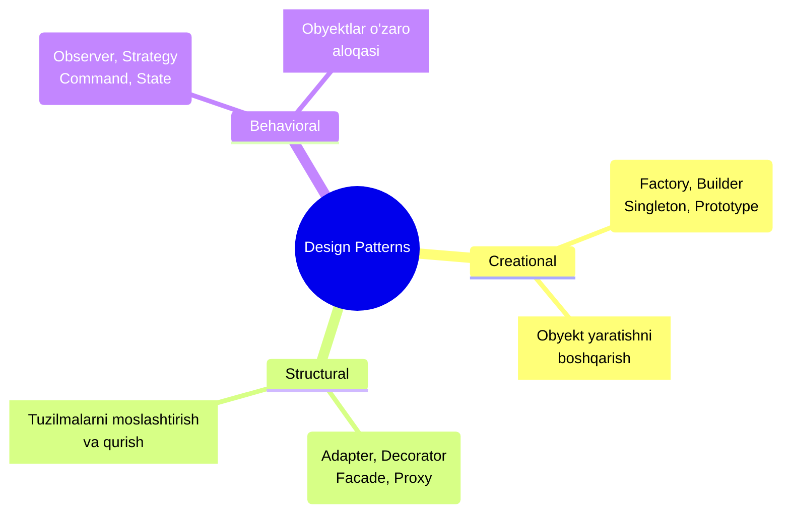

# Design Patterns - Frontend Design Pattern'lar

## Kirish

Design Patterns - bu dasturlashda tez-tez uchraydigan muammolarning sinab ko'rilgan yechimlari. Frontend development'da pattern'lar kodni tuzilgan, qayta ishlatiluvchi va maintainable qilishga yordam beradi. Bu bo'limda Vue.js va umumiy JavaScript kontekstida eng muhim pattern'larni ko'rib chiqamiz.

## Nazariy Asos

> [!IMPORTANT]
> **Nima uchun muhim?**  
> Dasturlashda ko'p muammolar aslida oldin kimdir tomonidan hal qilingan bo'ladi. Har safar g'ildirakni qaytadan kashf qilish o'rniga, Design Pattern'lar (Dasturlash andozalari) ni ishlatsangiz, kodingizni tushunish, kengaytirish va boshqa dasturchilar bilan ishlash keskin osonlashadi. Pattern'lar — bu muammoga nisbatan isbotlangan yechimlardir.

> [!NOTE]
> **Real-hayot analogiyasi: "Bino Qurish"**  
> Tasavvur qiling siz bino qurmoqchisiz.  
> 1. Har bir eshikni noldan o'lchab, o'zingiz yasamaysiz. Tayyor fabrikadan (Factory Pattern) o'lchamini berib buyurtma qilasiz.  
> 2. Agar uyga elektr kerak bo'lsa, uni to'g'ridan-to'g'ri simga ulamaysiz. Rozetkadan (Adapter Pattern) foydalanasiz.  
> 3. Yong'in chiqqanda signalizatsiya barcha xonalarga xabar yuborishi kerak bo'ladi (Observer Pattern).  
> Dasturlash ham aynan xuddi shunday qurilish qoidalariga bo'ysunadi.

### Pattern Categories



### Pattern Selection Guide

| Muammo | Pattern | Foydalanish |
|--------|---------|-------------|
| Object yaratishni abstrakt qilish | Factory | API responses, components |
| Global state | Singleton | Config, logger, store |
| Complex object build | Builder | Form, query |
| Interface moslashtirish | Adapter | 3rd party libraries |
| Funksionallik qo'shish | Decorator | HOC, middleware |
| Complex system'ni soddalashtirish | Facade | API client |
| Object'ni proxy qilish | Proxy | Reactivity, lazy loading |
| State changes'ni kuzatish | Observer | Event emitter, reactive |
| Algorithm'ni almashtirish | Strategy | Validation, formatting |
| Action'larni encapsulate qilish | Command | Undo/redo, action log |

## Code Misollari

### 1. Factory Pattern

```javascript
// ========================================
// FACTORY PATTERN
// Object yaratish logikasini markazlashtirish
// ========================================

// YOMON: Har joyda object yaratish
const user = {
  id: response.id,
  name: response.name,
  email: response.email,
  createdAt: new Date(response.created_at),
  role: response.role || 'user',
  avatar: response.avatar || '/default-avatar.png',
}

// YAXSHI: Factory function
// factories/user.factory.js

export function createUser(data) {
  return {
    id: data.id,
    name: data.name || 'Anonymous',
    email: data.email,
    createdAt: data.created_at ? new Date(data.created_at) : new Date(),
    role: data.role || 'user',
    avatar: data.avatar || generateDefaultAvatar(data.name),
    isActive: Boolean(data.is_active),

    // Computed properties
    get displayName() {
      return this.name || this.email.split('@')[0]
    },

    get initials() {
      return this.name
        .split(' ')
        .map(n => n[0])
        .slice(0, 2)
        .join('')
        .toUpperCase()
    },
  }
}

function generateDefaultAvatar(name) {
  return `https://api.dicebear.com/7.x/initials/svg?seed=${encodeURIComponent(name)}`
}

// ========================================
// ABSTRACT FACTORY - Turli tiplar uchun
// ========================================

// factories/notification.factory.js

const notificationTypes = {
  success: {
    icon: 'CheckCircleIcon',
    color: 'green',
    duration: 3000,
  },
  error: {
    icon: 'XCircleIcon',
    color: 'red',
    duration: 5000,
  },
  warning: {
    icon: 'ExclamationIcon',
    color: 'yellow',
    duration: 4000,
  },
  info: {
    icon: 'InformationCircleIcon',
    color: 'blue',
    duration: 3000,
  },
}

export function createNotification(type, message, options = {}) {
  const typeConfig = notificationTypes[type] || notificationTypes.info

  return {
    id: crypto.randomUUID(),
    type,
    message,
    title: options.title,
    icon: options.icon || typeConfig.icon,
    color: typeConfig.color,
    duration: options.duration ?? typeConfig.duration,
    dismissible: options.dismissible ?? true,
    action: options.action,
    createdAt: Date.now(),
  }
}

// Convenience factories
export const toast = {
  success: (message, options) => createNotification('success', message, options),
  error: (message, options) => createNotification('error', message, options),
  warning: (message, options) => createNotification('warning', message, options),
  info: (message, options) => createNotification('info', message, options),
}

// Foydalanish
import { toast } from '@/factories/notification.factory'

toast.success('Muvaffaqiyatli saqlandi!')
toast.error('Xatolik yuz berdi', { duration: 10000 })

// ========================================
// COMPONENT FACTORY
// ========================================

// factories/form-field.factory.js
import BaseInput from '@/components/base/BaseInput.vue'
import BaseSelect from '@/components/base/BaseSelect.vue'
import BaseCheckbox from '@/components/base/BaseCheckbox.vue'
import BaseDatePicker from '@/components/base/BaseDatePicker.vue'
import BaseFileUpload from '@/components/base/BaseFileUpload.vue'

const fieldComponents = {
  text: BaseInput,
  email: BaseInput,
  password: BaseInput,
  number: BaseInput,
  select: BaseSelect,
  checkbox: BaseCheckbox,
  date: BaseDatePicker,
  file: BaseFileUpload,
}

export function createFormField(config) {
  const component = fieldComponents[config.type] || BaseInput

  return {
    component,
    props: {
      type: config.type,
      name: config.name,
      label: config.label,
      placeholder: config.placeholder,
      required: config.required,
      disabled: config.disabled,
      options: config.options, // for select
      multiple: config.multiple,
      accept: config.accept, // for file
      ...config.props,
    },
    rules: config.rules || [],
  }
}

// Dynamic form generation
<template>
  <form @submit.prevent="handleSubmit">
    <component
      v-for="field in formFields"
      :key="field.props.name"
      :is="field.component"
      v-model="formData[field.props.name]"
      v-bind="field.props"
      :error="errors[field.props.name]"
    />
  </form>
</template>

<script setup>
const formConfig = [
  { type: 'text', name: 'name', label: 'Ism', required: true },
  { type: 'email', name: 'email', label: 'Email', required: true },
  { type: 'select', name: 'role', label: 'Rol', options: roles },
  { type: 'date', name: 'birthDate', label: 'Tug\'ilgan sana' },
]

const formFields = formConfig.map(createFormField)
</script>
```

### 2. Singleton Pattern

```javascript
// ========================================
// SINGLETON PATTERN
// Bitta instance, global access
// ========================================

// lib/logger.js
class Logger {
  static instance = null

  constructor() {
    if (Logger.instance) {
      return Logger.instance
    }

    this.logs = []
    this.level = import.meta.env.DEV ? 'debug' : 'warn'

    Logger.instance = this
  }

  static getInstance() {
    if (!Logger.instance) {
      Logger.instance = new Logger()
    }
    return Logger.instance
  }

  log(level, message, context = {}) {
    const logEntry = {
      timestamp: new Date().toISOString(),
      level,
      message,
      context,
    }

    this.logs.push(logEntry)

    if (this.shouldLog(level)) {
      console[level === 'error' ? 'error' : 'log'](
        `[${level.toUpperCase()}]`,
        message,
        context
      )
    }

    // Send to external service in production
    if (import.meta.env.PROD && level === 'error') {
      this.sendToErrorTracker(logEntry)
    }
  }

  shouldLog(level) {
    const levels = ['debug', 'info', 'warn', 'error']
    return levels.indexOf(level) >= levels.indexOf(this.level)
  }

  debug(message, context) { this.log('debug', message, context) }
  info(message, context) { this.log('info', message, context) }
  warn(message, context) { this.log('warn', message, context) }
  error(message, context) { this.log('error', message, context) }

  async sendToErrorTracker(logEntry) {
    // Sentry, LogRocket, etc.
  }
}

export const logger = Logger.getInstance()

// ========================================
// MODULE SINGLETON (Simpler)
// ========================================

// lib/api-client.js
import axios from 'axios'

// Module scope = singleton
const client = axios.create({
  baseURL: import.meta.env.VITE_API_URL,
  timeout: 10000,
})

// Private state
let authToken = null

// Setup interceptors once
client.interceptors.request.use((config) => {
  if (authToken) {
    config.headers.Authorization = `Bearer ${authToken}`
  }
  return config
})

client.interceptors.response.use(
  (response) => response,
  (error) => {
    if (error.response?.status === 401) {
      // Handle unauthorized
    }
    return Promise.reject(error)
  }
)

// Public API
export function setAuthToken(token) {
  authToken = token
}

export function clearAuthToken() {
  authToken = null
}

export default client

// ========================================
// PINIA STORE AS SINGLETON
// ========================================

// stores/app.store.js
import { defineStore } from 'pinia'

// Pinia store is automatically singleton
export const useAppStore = defineStore('app', {
  state: () => ({
    theme: 'light',
    locale: 'uz',
    sidebarOpen: true,
  }),

  actions: {
    toggleTheme() {
      this.theme = this.theme === 'light' ? 'dark' : 'light'
      document.documentElement.setAttribute('data-theme', this.theme)
    },

    setLocale(locale) {
      this.locale = locale
      // Update i18n
    },
  },

  persist: true, // pinia-plugin-persistedstate
})
```

### 3. Observer Pattern (Pub/Sub)

```javascript
// ========================================
// OBSERVER PATTERN
// Event-based communication
// ========================================

// lib/event-bus.js
class EventBus {
  constructor() {
    this.events = new Map()
  }

  on(event, callback) {
    if (!this.events.has(event)) {
      this.events.set(event, new Set())
    }
    this.events.get(event).add(callback)

    // Return unsubscribe function
    return () => this.off(event, callback)
  }

  once(event, callback) {
    const wrapper = (...args) => {
      this.off(event, wrapper)
      callback(...args)
    }
    return this.on(event, wrapper)
  }

  off(event, callback) {
    if (this.events.has(event)) {
      if (callback) {
        this.events.get(event).delete(callback)
      } else {
        this.events.delete(event)
      }
    }
  }

  emit(event, ...args) {
    if (this.events.has(event)) {
      this.events.get(event).forEach(callback => {
        try {
          callback(...args)
        } catch (error) {
          console.error(`Error in event handler for "${event}":`, error)
        }
      })
    }
  }

  // Debug helper
  getEventNames() {
    return Array.from(this.events.keys())
  }
}

export const eventBus = new EventBus()

// ========================================
// TYPED EVENT BUS (TypeScript)
// ========================================

// lib/typed-event-bus.ts
type EventMap = {
  'user:login': { userId: string; timestamp: number }
  'user:logout': void
  'cart:updated': { items: CartItem[]; total: number }
  'notification:show': { type: string; message: string }
}

class TypedEventBus<T extends Record<string, any>> {
  private events = new Map<keyof T, Set<Function>>()

  on<K extends keyof T>(
    event: K,
    callback: (payload: T[K]) => void
  ): () => void {
    if (!this.events.has(event)) {
      this.events.set(event, new Set())
    }
    this.events.get(event)!.add(callback)

    return () => this.off(event, callback)
  }

  emit<K extends keyof T>(event: K, payload: T[K]): void {
    this.events.get(event)?.forEach(cb => cb(payload))
  }

  off<K extends keyof T>(event: K, callback?: Function): void {
    if (callback) {
      this.events.get(event)?.delete(callback)
    } else {
      this.events.delete(event)
    }
  }
}

export const events = new TypedEventBus<EventMap>()

// Usage with full type safety
events.on('user:login', ({ userId, timestamp }) => {
  console.log(`User ${userId} logged in at ${timestamp}`)
})

events.emit('user:login', { userId: '123', timestamp: Date.now() })

// ========================================
// VUE COMPOSABLE WITH OBSERVER
// ========================================

// composables/useEventListener.js
import { onMounted, onUnmounted } from 'vue'
import { eventBus } from '@/lib/event-bus'

export function useEventListener(event, handler, options = {}) {
  const { immediate = false } = options

  let unsubscribe = null

  onMounted(() => {
    unsubscribe = eventBus.on(event, handler)
  })

  onUnmounted(() => {
    unsubscribe?.()
  })

  return {
    emit: (...args) => eventBus.emit(event, ...args),
  }
}

// Usage in component
<script setup>
import { useEventListener } from '@/composables/useEventListener'

// Auto cleanup on unmount
useEventListener('cart:updated', ({ items, total }) => {
  console.log('Cart updated:', items.length, 'items, total:', total)
})
</script>
```

### 4. Strategy Pattern

```javascript
// ========================================
// STRATEGY PATTERN
// Algorithm'ni runtime'da almashtirish
// ========================================

// strategies/validation.strategies.js

// Strategy interface (implicit in JS)
const validationStrategies = {
  required: {
    validate: (value) => {
      const valid = value !== null && value !== undefined && value !== ''
      return { valid, message: valid ? null : 'Bu maydon majburiy' }
    },
  },

  email: {
    validate: (value) => {
      if (!value) return { valid: true, message: null }
      const valid = /^[^\s@]+@[^\s@]+\.[^\s@]+$/.test(value)
      return { valid, message: valid ? null : 'Email formati xato' }
    },
  },

  minLength: (min) => ({
    validate: (value) => {
      if (!value) return { valid: true, message: null }
      const valid = value.length >= min
      return { valid, message: valid ? null : `Kamida ${min} ta belgi` }
    },
  }),

  maxLength: (max) => ({
    validate: (value) => {
      if (!value) return { valid: true, message: null }
      const valid = value.length <= max
      return { valid, message: valid ? null : `Ko'pi bilan ${max} ta belgi` }
    },
  }),

  pattern: (regex, message) => ({
    validate: (value) => {
      if (!value) return { valid: true, message: null }
      const valid = regex.test(value)
      return { valid, message: valid ? null : message }
    },
  }),

  custom: (validateFn, message) => ({
    validate: (value) => {
      const valid = validateFn(value)
      return { valid, message: valid ? null : message }
    },
  }),
}

// Validator using strategies
export function createValidator(rules) {
  return {
    validate(value) {
      for (const rule of rules) {
        const strategy = typeof rule === 'string'
          ? validationStrategies[rule]
          : rule

        const result = strategy.validate(value)
        if (!result.valid) {
          return result
        }
      }
      return { valid: true, message: null }
    },
  }
}

// Usage
const emailValidator = createValidator([
  validationStrategies.required,
  validationStrategies.email,
])

const passwordValidator = createValidator([
  validationStrategies.required,
  validationStrategies.minLength(8),
  validationStrategies.pattern(
    /^(?=.*[a-z])(?=.*[A-Z])(?=.*\d)/,
    'Parol katta, kichik harf va raqam bo\'lishi kerak'
  ),
])

// ========================================
// STRATEGY PATTERN - Pricing
// ========================================

// strategies/pricing.strategies.js

const pricingStrategies = {
  regular: {
    calculate: (price, quantity) => price * quantity,
    getLabel: () => 'Standart narx',
  },

  bulk: {
    calculate: (price, quantity) => {
      if (quantity >= 100) return price * quantity * 0.8 // 20% off
      if (quantity >= 50) return price * quantity * 0.9 // 10% off
      return price * quantity
    },
    getLabel: () => 'Ulgurji narx',
  },

  subscription: {
    calculate: (price, quantity, { months = 1 }) => {
      const monthlyPrice = price * quantity
      const discount = months >= 12 ? 0.2 : months >= 6 ? 0.1 : 0
      return monthlyPrice * months * (1 - discount)
    },
    getLabel: () => 'Obuna narxi',
  },

  promotional: {
    calculate: (price, quantity, { discount = 0 }) => {
      return price * quantity * (1 - discount)
    },
    getLabel: (options) => `${options.discount * 100}% chegirma`,
  },
}

export function calculatePrice(strategyName, price, quantity, options = {}) {
  const strategy = pricingStrategies[strategyName] || pricingStrategies.regular
  return {
    total: strategy.calculate(price, quantity, options),
    label: strategy.getLabel(options),
  }
}

// ========================================
// STRATEGY PATTERN - Sorting
// ========================================

// strategies/sorting.strategies.js

export const sortStrategies = {
  alphabetical: {
    key: 'name',
    compare: (a, b, key) => a[key].localeCompare(b[key]),
  },

  numeric: {
    compare: (a, b, key) => a[key] - b[key],
  },

  date: {
    compare: (a, b, key) => new Date(b[key]) - new Date(a[key]),
  },

  boolean: {
    compare: (a, b, key) => (b[key] ? 1 : 0) - (a[key] ? 1 : 0),
  },

  custom: (compareFn) => ({
    compare: compareFn,
  }),
}

export function sortArray(array, key, strategyName = 'alphabetical', direction = 'asc') {
  const strategy = sortStrategies[strategyName] || sortStrategies.alphabetical
  const modifier = direction === 'desc' ? -1 : 1

  return [...array].sort((a, b) => strategy.compare(a, b, key) * modifier)
}

// Usage
const users = [
  { name: 'Ali', age: 25, createdAt: '2024-01-15' },
  { name: 'Vali', age: 30, createdAt: '2024-02-20' },
]

const sortedByName = sortArray(users, 'name', 'alphabetical')
const sortedByAge = sortArray(users, 'age', 'numeric', 'desc')
const sortedByDate = sortArray(users, 'createdAt', 'date')
```

### 5. Adapter Pattern

```javascript
// ========================================
// ADAPTER PATTERN
// Interface'larni moslashtirish
// ========================================

// adapters/analytics.adapter.js

// Different analytics services with different APIs
class GoogleAnalyticsService {
  send(category, action, label, value) {
    window.gtag('event', action, {
      event_category: category,
      event_label: label,
      value: value,
    })
  }
}

class MixpanelService {
  track(eventName, properties) {
    window.mixpanel.track(eventName, properties)
  }

  identify(userId, traits) {
    window.mixpanel.identify(userId)
    window.mixpanel.people.set(traits)
  }
}

class AmplitudeService {
  logEvent(eventType, eventProperties) {
    window.amplitude.getInstance().logEvent(eventType, eventProperties)
  }
}

// Unified adapter
class AnalyticsAdapter {
  constructor(services = []) {
    this.services = services
  }

  // Unified interface
  track(eventName, properties = {}) {
    this.services.forEach(service => {
      if (service instanceof GoogleAnalyticsService) {
        service.send(
          properties.category || 'general',
          eventName,
          properties.label,
          properties.value
        )
      } else if (service instanceof MixpanelService) {
        service.track(eventName, properties)
      } else if (service instanceof AmplitudeService) {
        service.logEvent(eventName, properties)
      }
    })
  }

  identify(userId, traits = {}) {
    this.services.forEach(service => {
      if (service instanceof MixpanelService) {
        service.identify(userId, traits)
      }
      // Other services...
    })
  }
}

// Usage
const analytics = new AnalyticsAdapter([
  new GoogleAnalyticsService(),
  new MixpanelService(),
  new AmplitudeService(),
])

// Single API for all services
analytics.track('button_click', {
  category: 'engagement',
  label: 'signup_button',
})

// ========================================
// API RESPONSE ADAPTER
// ========================================

// adapters/api-response.adapter.js

// Backend returns snake_case, frontend uses camelCase
export function adaptUserResponse(apiUser) {
  return {
    id: apiUser.id,
    email: apiUser.email,
    firstName: apiUser.first_name,
    lastName: apiUser.last_name,
    fullName: `${apiUser.first_name} ${apiUser.last_name}`,
    avatar: apiUser.avatar_url,
    createdAt: new Date(apiUser.created_at),
    updatedAt: new Date(apiUser.updated_at),
    isActive: apiUser.is_active,
    role: apiUser.role?.name || 'user',
    permissions: apiUser.permissions?.map(p => p.name) || [],
  }
}

export function adaptUserRequest(user) {
  return {
    first_name: user.firstName,
    last_name: user.lastName,
    email: user.email,
    avatar_url: user.avatar,
    is_active: user.isActive,
  }
}

// Generic adapter factory
export function createAdapter(responseMapping, requestMapping) {
  return {
    fromApi(data) {
      return Object.entries(responseMapping).reduce((result, [key, mapper]) => {
        if (typeof mapper === 'string') {
          result[key] = data[mapper]
        } else if (typeof mapper === 'function') {
          result[key] = mapper(data)
        }
        return result
      }, {})
    },

    toApi(data) {
      return Object.entries(requestMapping).reduce((result, [key, mapper]) => {
        if (typeof mapper === 'string') {
          result[key] = data[mapper]
        } else if (typeof mapper === 'function') {
          result[key] = mapper(data)
        }
        return result
      }, {})
    },
  }
}

// Usage
const productAdapter = createAdapter(
  {
    id: 'id',
    name: 'product_name',
    price: (data) => data.price_cents / 100,
    category: (data) => data.category?.name,
    inStock: 'is_available',
  },
  {
    product_name: 'name',
    price_cents: (data) => data.price * 100,
    is_available: 'inStock',
  }
)
```

### 6. Decorator Pattern

```javascript
// ========================================
// DECORATOR PATTERN
// Mavjud functionality'ga qo'shimcha qo'shish
// ========================================

// decorators/logger.decorator.js

// Function decorator
export function withLogging(fn, label = fn.name) {
  return async function (...args) {
    console.log(`[${label}] Starting with args:`, args)
    const startTime = performance.now()

    try {
      const result = await fn.apply(this, args)
      const duration = (performance.now() - startTime).toFixed(2)
      console.log(`[${label}] Completed in ${duration}ms, result:`, result)
      return result
    } catch (error) {
      console.error(`[${label}] Failed:`, error)
      throw error
    }
  }
}

// Usage
const fetchUsers = withLogging(async () => {
  const response = await api.get('/users')
  return response.data
}, 'fetchUsers')

// ========================================
// CACHING DECORATOR
// ========================================

export function withCache(fn, options = {}) {
  const {
    ttl = 60000, // 1 minute default
    key = (...args) => JSON.stringify(args),
    storage = new Map(),
  } = options

  return async function (...args) {
    const cacheKey = key(...args)
    const cached = storage.get(cacheKey)

    if (cached && Date.now() < cached.expiresAt) {
      console.log('Cache hit:', cacheKey)
      return cached.value
    }

    const result = await fn.apply(this, args)

    storage.set(cacheKey, {
      value: result,
      expiresAt: Date.now() + ttl,
    })

    return result
  }
}

// Usage
const getUser = withCache(
  async (id) => {
    const response = await api.get(`/users/${id}`)
    return response.data
  },
  { ttl: 300000 } // 5 minutes
)

// ========================================
// RETRY DECORATOR
// ========================================

export function withRetry(fn, options = {}) {
  const {
    maxAttempts = 3,
    delay = 1000,
    backoff = 2,
    shouldRetry = (error) => true,
  } = options

  return async function (...args) {
    let lastError
    let currentDelay = delay

    for (let attempt = 1; attempt <= maxAttempts; attempt++) {
      try {
        return await fn.apply(this, args)
      } catch (error) {
        lastError = error

        if (attempt === maxAttempts || !shouldRetry(error)) {
          throw error
        }

        console.warn(`Attempt ${attempt} failed, retrying in ${currentDelay}ms`)
        await new Promise(resolve => setTimeout(resolve, currentDelay))
        currentDelay *= backoff
      }
    }

    throw lastError
  }
}

// ========================================
// COMPOSING DECORATORS
// ========================================

// Combine multiple decorators
export function compose(...decorators) {
  return function (fn) {
    return decorators.reduceRight(
      (decorated, decorator) => decorator(decorated),
      fn
    )
  }
}

// Usage - combining decorators
const fetchDataWithEnhancements = compose(
  withLogging,
  withCache,
  withRetry
)(async (endpoint) => {
  const response = await api.get(endpoint)
  return response.data
})

// ========================================
// VUE COMPOSABLE DECORATOR
// ========================================

// composables/withLoading.js
export function withLoading(asyncFn) {
  const loading = ref(false)
  const error = ref(null)

  const execute = async (...args) => {
    loading.value = true
    error.value = null

    try {
      return await asyncFn(...args)
    } catch (e) {
      error.value = e
      throw e
    } finally {
      loading.value = false
    }
  }

  return {
    execute,
    loading: readonly(loading),
    error: readonly(error),
  }
}

// Usage
const { execute: fetchProducts, loading, error } = withLoading(
  async (filters) => {
    const response = await productsApi.getAll(filters)
    return response.data
  }
)
```

### 7. Facade Pattern

```javascript
// ========================================
// FACADE PATTERN
// Complex system uchun simple interface
// ========================================

// facades/checkout.facade.js

// Complex subsystems
import { cartService } from '@/services/cart.service'
import { paymentService } from '@/services/payment.service'
import { orderService } from '@/services/order.service'
import { inventoryService } from '@/services/inventory.service'
import { notificationService } from '@/services/notification.service'
import { analyticsService } from '@/services/analytics.service'

// Facade - simple interface
class CheckoutFacade {
  async processCheckout(checkoutData) {
    const { cart, paymentDetails, shippingAddress } = checkoutData

    try {
      // Step 1: Validate cart
      const validatedCart = await this.validateCart(cart)

      // Step 2: Check inventory
      await this.checkInventory(validatedCart.items)

      // Step 3: Calculate totals
      const totals = await this.calculateTotals(validatedCart, shippingAddress)

      // Step 4: Process payment
      const payment = await this.processPayment(paymentDetails, totals.total)

      // Step 5: Create order
      const order = await this.createOrder(validatedCart, payment, shippingAddress)

      // Step 6: Post-checkout actions
      await this.handlePostCheckout(order)

      return { success: true, order }
    } catch (error) {
      await this.handleCheckoutError(error, cart)
      throw error
    }
  }

  async validateCart(cart) {
    const validation = await cartService.validate(cart)
    if (!validation.valid) {
      throw new CartValidationError(validation.errors)
    }
    return validation.cart
  }

  async checkInventory(items) {
    const availability = await inventoryService.checkAvailability(items)
    if (!availability.allAvailable) {
      throw new InventoryError(availability.unavailableItems)
    }
  }

  async calculateTotals(cart, shippingAddress) {
    const subtotal = cartService.calculateSubtotal(cart.items)
    const shipping = await cartService.calculateShipping(cart, shippingAddress)
    const tax = await cartService.calculateTax(subtotal, shippingAddress)

    return {
      subtotal,
      shipping,
      tax,
      total: subtotal + shipping + tax,
    }
  }

  async processPayment(paymentDetails, amount) {
    return paymentService.process({
      ...paymentDetails,
      amount,
    })
  }

  async createOrder(cart, payment, shippingAddress) {
    return orderService.create({
      items: cart.items,
      payment,
      shippingAddress,
    })
  }

  async handlePostCheckout(order) {
    // Run in parallel - non-blocking
    await Promise.allSettled([
      cartService.clear(),
      inventoryService.reserve(order.items),
      notificationService.sendOrderConfirmation(order),
      analyticsService.trackPurchase(order),
    ])
  }

  async handleCheckoutError(error, cart) {
    analyticsService.trackCheckoutError(error, cart)
    // Restore cart state if needed
  }
}

export const checkout = new CheckoutFacade()

// Simple usage
import { checkout } from '@/facades/checkout.facade'

async function handleCheckout() {
  try {
    const result = await checkout.processCheckout({
      cart: cartStore.cart,
      paymentDetails: paymentForm.values,
      shippingAddress: addressForm.values,
    })

    router.push(`/orders/${result.order.id}`)
  } catch (error) {
    // Handle specific errors
  }
}
```

### 8. Provider/Consumer Pattern (Vue)

```vue
<!-- ========================================
     PROVIDER/CONSUMER PATTERN
     Context-based state sharing
     ======================================== -->

<!-- providers/ThemeProvider.vue -->
<template>
  <slot />
</template>

<script setup>
import { provide, ref, readonly, watch } from 'vue'

const props = defineProps({
  defaultTheme: { type: String, default: 'light' },
  storageKey: { type: String, default: 'app-theme' },
})

const THEME_KEY = Symbol('theme')

// Initialize from storage
const savedTheme = localStorage.getItem(props.storageKey)
const theme = ref(savedTheme || props.defaultTheme)

const isDark = computed(() => theme.value === 'dark')

function setTheme(newTheme) {
  theme.value = newTheme
  localStorage.setItem(props.storageKey, newTheme)
  document.documentElement.setAttribute('data-theme', newTheme)
}

function toggleTheme() {
  setTheme(theme.value === 'light' ? 'dark' : 'light')
}

// Initialize DOM
onMounted(() => {
  document.documentElement.setAttribute('data-theme', theme.value)
})

// Watch system preference
const mediaQuery = window.matchMedia('(prefers-color-scheme: dark)')
mediaQuery.addEventListener('change', (e) => {
  if (!savedTheme) {
    setTheme(e.matches ? 'dark' : 'light')
  }
})

provide(THEME_KEY, {
  theme: readonly(theme),
  isDark,
  setTheme,
  toggleTheme,
})
</script>

<!-- composables/useTheme.js -->
<script>
import { inject } from 'vue'

const THEME_KEY = Symbol('theme')

export function useTheme() {
  const context = inject(THEME_KEY)

  if (!context) {
    throw new Error('useTheme must be used within ThemeProvider')
  }

  return context
}
</script>

<!-- Consumer component -->
<template>
  <button @click="toggleTheme">
    <SunIcon v-if="isDark" />
    <MoonIcon v-else />
    {{ isDark ? 'Light mode' : 'Dark mode' }}
  </button>
</template>

<script setup>
import { useTheme } from '@/composables/useTheme'

const { isDark, toggleTheme } = useTheme()
</script>

<!-- App.vue -->
<template>
  <ThemeProvider>
    <RouterView />
  </ThemeProvider>
</template>
```

## Real-World Case Study

### Case: Payment System Architecture

**Vaziyat:** E-commerce platformasida turli payment provider'larni qo'llab-quvvatlash kerak (Payme, Click, Uzcard, PayPal).

**Yechim - Pattern Combination:**

```
┌─────────────────────────────────────────────────────────────────┐
│                    PAYMENT ARCHITECTURE                          │
├─────────────────────────────────────────────────────────────────┤
│                                                                  │
│   ┌─────────────┐                                               │
│   │   Facade    │  checkout.processPayment()                    │
│   └──────┬──────┘                                               │
│          │                                                       │
│          ▼                                                       │
│   ┌─────────────┐                                               │
│   │   Factory   │  createPaymentProvider(type)                  │
│   └──────┬──────┘                                               │
│          │                                                       │
│          ├──────────────┬──────────────┬──────────────┐         │
│          ▼              ▼              ▼              ▼         │
│   ┌──────────┐   ┌──────────┐   ┌──────────┐   ┌──────────┐    │
│   │  Payme   │   │  Click   │   │  Uzcard  │   │  PayPal  │    │
│   │ Adapter  │   │ Adapter  │   │ Adapter  │   │ Adapter  │    │
│   └──────────┘   └──────────┘   └──────────┘   └──────────┘    │
│          │              │              │              │         │
│          └──────────────┴──────────────┴──────────────┘         │
│                         │                                        │
│                         ▼                                        │
│             ┌─────────────────────┐                             │
│             │  Strategy Pattern   │                             │
│             │  (Payment method)   │                             │
│             └─────────────────────┘                             │
│                         │                                        │
│                         ▼                                        │
│             ┌─────────────────────┐                             │
│             │  Observer Pattern   │                             │
│             │  (Payment events)   │                             │
│             └─────────────────────┘                             │
│                                                                  │
└─────────────────────────────────────────────────────────────────┘
```

## Interview Savollari

### 1. Junior-Middle Level
**Savol:** Factory pattern nima va qachon ishlatiladi?

**Javob:** Factory pattern - object yaratish logikasini abstrakt qilish pattern'i. Qachon ishlatiladi:
- Complex object yaratish kerak bo'lganda
- Object yaratish bir nechta joyda takrorlanganda
- Object type runtime'da aniqlanadigan bo'lsa
- Object yaratish logikasi o'zgarishi mumkin bo'lsa

### 2. Middle-Senior Level
**Savol:** Strategy va Factory pattern'larning farqi nima?

**Javob:**
```
FACTORY                          STRATEGY
├── Object yaratadi              ├── Behavior/algorithm tanlaydi
├── Creational pattern           ├── Behavioral pattern
├── Instance qaytaradi           ├── Method/function qaytaradi
└── "Nima yaratish"              └── "Qanday qilish"

Misol:
├── Factory: createPaymentForm('payme') → PaymeForm component
└── Strategy: paymentStrategies.payme.process() → processing logic
```

### 3. Senior Level
**Savol:** Decorator pattern'ni Vue.js'da qanday implement qilasiz?

**Javob:**
```javascript
// 1. Higher-Order Component
const withAuth = (Component) => ({
  setup(props, { slots }) {
    const auth = useAuth()
    if (!auth.isAuthenticated) return () => h(LoginPrompt)
    return () => h(Component, props, slots)
  },
})

// 2. Composable Decorator
const withLoading = (asyncFn) => {
  const loading = ref(false)
  const execute = async (...args) => {
    loading.value = true
    try { return await asyncFn(...args) }
    finally { loading.value = false }
  }
  return { execute, loading }
}

// 3. Function Decorator
const withCache = (fn, ttl) => {
  const cache = new Map()
  return (...args) => {
    const key = JSON.stringify(args)
    if (cache.has(key)) return cache.get(key)
    const result = fn(...args)
    cache.set(key, result)
    return result
  }
}
```

### 4. Senior/Lead Level
**Savol:** Micro-frontend arxitekturasida pattern'larni qanday qo'llaysiz?

**Javob:**
```
1. FACADE PATTERN
   ├── Shell app = facade for MFEs
   ├── Unified API for MFE communication
   └── Hide MFE complexity from each other

2. ADAPTER PATTERN
   ├── MFE-to-MFE communication adapter
   ├── Different framework components
   └── Event format standardization

3. OBSERVER PATTERN
   ├── Cross-MFE events
   ├── Shared state updates
   └── Lifecycle events

4. SINGLETON PATTERN
   ├── Shared configuration
   ├── Auth state
   └── Analytics instance
```

### 5. Architect Level
**Savol:** Design pattern'larni haddan tashqari ishlatish (over-engineering) qanday aniqlanadi?

**Javob:**
```
RED FLAGS:
├── Pattern adds more code than it removes
├── Single use case, no reuse expected
├── Abstraction without clear benefit
├── Team doesn't understand the pattern
├── Pattern solves imaginary future problem

WHEN TO USE:
├── 3+ similar implementations (Rule of Three)
├── Clear separation of concerns needed
├── Team familiar with pattern
├── Pattern simplifies, not complicates
├── Real flexibility requirement

ANTI-PATTERNS:
├── "Resume-Driven Development"
├── "Golden Hammer" (favorite pattern everywhere)
├── "Premature Abstraction"
└── "Astronaut Architecture"
```

## Senior vs Middle Farqi

| Aspekt | Middle | Senior |
|--------|--------|--------|
| **Pattern knowledge** | Common patterns | Deep understanding, trade-offs |
| **Application** | Copy from examples | Adapt to context |
| **Combination** | Single pattern | Multiple patterns together |
| **Decision** | Use when told | Decide when appropriate |
| **Anti-patterns** | May over-use | Knows when NOT to use |
| **Teaching** | Uses patterns | Explains why and when |

### Middle Developer
- Factory, Singleton, Observer pattern'larni biladi
- Pattern'larni qo'llaydi
- Examples'dan o'rganadi
- Single pattern per problem

### Senior Developer
- Barcha GoF patterns'ni chuqur tushunadi
- Pattern'larni kombinatsiya qiladi
- Custom pattern'lar yaratadi
- Trade-off'larni tushuntiradi
- Anti-pattern'larni taniydi
- Team'ga pattern tanlovini asoslaydi

---

## Eng Yaxshi Amaliyotlar (Best Practices)

1. **Keep it Simple, Stupid (KISS):** Design Pattern'ni ishlata olaman deb o'ylab topilgan joyda ishlatavermang. Agar muammoni 3 qator if-else bilan hal qilsa bo'lsa, abstrakt interfeyslar va Strategy qilib o'tirmang.
2. **Qoidalarga yopishib olmang:** Dasturlash qattiq dogmatik qonunlardan emas, ko'proq sharoitga qarab moslashishdan iborat. Pattern kodingizni tushunarli qilishiga ko'zingiz yetsagina uni qo'llang.
3. **Yagona javobgarlik (SRP):** Tanlagan pattern'ingiz har doim kodning yagona javobgarligini himoya qilishi kerak (Bitta klass/funksiya - bitta vazifa).

---

## Xulosa

Design Pattern'lar — muammoga duch kelganingizda uni "silliq" hal qilish uchun foydalanadigan retseptlar kitobidir. Ular kodning arxitekturasini chiroyli va o'qilishi oson qiladi.

> **Eslatma:** Pattern - bu tool, maqsad emas. Muammoni hal qilish muhim, pattern ishlatish emas. "When in doubt, leave it out."
