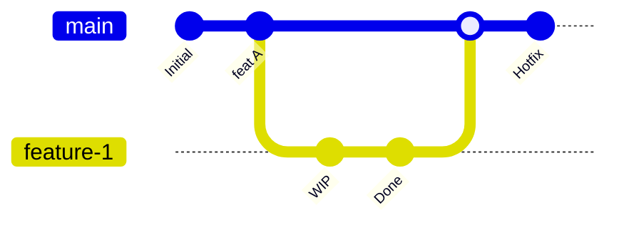

# Git Advanced (Murakkab Git)

## Kirish

> [!IMPORTANT]
> **Nima uchun muhim?**  
> Junior dasturchilar Git'ni shunchaki `add`, `commit`, `push` deb o'ylashadi. Lekin haqiqiy loyihada birdaniga 5 ta dasturchi bitta faylga o'zgartirish kiritganda, konfliktlar yuzaga kelganda yoki noto'g'ri yozilgan kodni production'dan tezkor qaytarib olish (Revert) kerak bo'lganda nima qilasiz? Senior mutaxassislar Git'ning "orqa fonida" nima ishlashini (Trees, Blobs, Hashes) va GitFlow, Rebase, Cherry-Pick kabi murakkab ssenariylarni to'liq nazorat qila oladigan muhandislar hisoblanadi.

> [!NOTE]
> **Real-hayot analogiyasi: "Zamon va Makon bo'ylab sayohat"**  
> Git — bu sizning kodingiz uchun yaratilgan "Vaqt Mashinasi".  
> **Commit:** Vaqtning aynan shu soniyasidagi kodingizning 3D "Surati" (Snapshot).  
> **Branch (Shox):** Asosiy hayot yo'lidan ajralib chiqqan Muqobil (Parallel) Koinot. Siz u koinotda hamma narsani buza olasiz, lekin asosiy koinot (Main branch) zararlanmaydi.  
> **Merge:** Koinotlarni qayta bitta qilib birlashtirish.



Git - bu taqsimlangan (distributed) versiyalarni boshqarish tizimi bo'lib, har bir dasturchining kompyuterida kodning to'liq tarixi saqlanadi. Bu bo'limda Git'ning ichki ishlash mexanizmlarini, professional strategiyalarini va murakkab vaziyatlarni hal qilishni o'rganamiz.

---

## 🟢 Junior (Asoslar va Tushunchalar)

### Git Qanday Ishlaydi?
Git kodingiz o'zgarishini 3 ta holatda (area) ushlab turadi:
1. **Working Directory (Ish stoli):** Hozir kodingiz kompyuterda turgan holat.
2. **Staging Area (Kutish zali):** Siz `git add` qilganingizda kodlar kutish zaliga tushadi. Ya'ni rasmga olinishga tayyor turadi.
3. **Repository (Ombor):** Siz `git commit` qilganingizda kutish zalidagi hamma fayllar 1 ta qilib "Surat"ga olinadi va omborga saqlanadi.

### Asosiy Buyruqlar (Tezkor takrorlash)
```bash
git clone <url>      # Loyihani ko'chirib olish
git status           # Fayllarning qaysi zonada turganligini ko'rish
git add .            # Hamma o'zgargan fayllarni "Staging"ga o'tkazish
git commit -m "Msg"  # Suratga olish va xabar yozish
git push origin main # Mahalliy (Local) kompyuterdan Github/Gitlab ga yuborish
git pull origin main # Github/Gitlab dan eng yangi o'zgarishlarni o'zimizga tortish
```

### Branch (Shoxlar) nima?
Asosiy hayot yo'li odatda `main` (yoki `master`) deb ataladi. U doim toza va ishlaydigan kod bo'lishi kerak. Yangi narsa (Feature) qo'shmoqchi bo'lsangiz `main` ni buzmaysiz, yangi parallel shox ochasiz:
```bash
git checkout -b feature/login-page  # Yangi parallel koinot yaratish va o'sha yoqqa o'tish
```

---

## 🟡 Middle (Amaliyot va Detallar)

### Conflict (Mojaro) larni hal qilish
Katta jamoalarda ko'pincha "Merge Conflict" yuz beradi. Bunga sabab siz va hamkasbingiz bitta faylning bitta qatorini har xil o'zgartirgansiz. Git buni avtomat birlashtira olmaydi.

**Conflict qanday ko'rinadi?**
```
<<<<<<< HEAD (Sizning kompyuteringizdagi versiya)
const name = 'Mening versiyam';
=======
const name = 'Hamkasbimning versiyasi';
>>>>>>> feature/his-branch (Kelayotgan versiya)
```

**Yechimi:** VS Code da konflikt faylga kirganingizda u sizga "Accept Current", "Accept Incoming", "Accept Both" tugmalarini chiqarib beradi. Keraklisini tanlaysiz (yoki qo'lda to'g'rilaysiz), keyin yana `git add .` va `git commit -m "conflict hal qilindi"` deysiz.

### Merge vs Rebase
Branchlarni birlashtirishning 2 ta asosiy yo'li bor.

**1. Merge (`git merge feature`)**
- Asosiy `main` branch va `feature` branch yig'ilib bitta yangi "Merge commit" yaratadi. 
- **Plyusi:** Tarix qanday bo'lsa shundayligicha (haqqoniy) saqlanadi.
- **Minusi:** GitHub da chiziqlar (Graf) juda chalkashib tarmoqlanib ketadi.

**2. Rebase (`git rebase main`)**
- Sizning `feature` dagi o'zgarishlaringizni go'yoki huddi hozirgina `main` ning eng oxiriga yozilgandek qilib ko'chirib olib o'tadi.
- **Plyusi:** Tarix to'ppa-to'g'ri chiziq bo'ladi (Linear history). Jamoaga tushunish juda oson.
- **Minusi:** Aslida nima qachon qilingani o'zgarib ketadi.
- *Oltin Qoida:* Hech qachon umumiy (Public) branchlarda Rebase ishlatmang! Faqat o'zingizni local branchda ishlating.

### Stash (Vaqtincha cho'ntak)
Siz qandaydir yangi kod yozyapsiz. Birdan boss kelib "Productionda xato chiqibdi, shuni tez to'g'irla" deb qoldi. Lekin sizning kodingiz chala, uni commit qilish mumkin emas. Shunda uni vaqtincha "cho'ntakka" solib qo'yasiz:
```bash
git stash             # Barcha chalalarni cho'ntakka solish
# ... endi bemalol main ga o'tib bug ni to'g'irlayverasiz ...
git stash pop         # Cho'ntakdan oxirgi ishingizni qaytarib olish
```

---

## 🔴 Senior (Arxitektura va Optimizatsiya)

### Git Internals (Ichkarida nima bor?)
Git aslida yashirin `.git` papkasi ichidagi Ma'lumotlar Bazasi (Key-Value database) hisoblanadi.
- **Blob:** Faylning ichidagi kod matni.
- **Tree:** Papaning tarkibi (qaysi fayl qaysi papkada).
- **Commit:** Shu Tree larga yozilgan muallif (author), vaqt va xabarni saqlovchi metadata. Obyektlar `SHA-1` xeshi (masalan `5dd01c1...`) orqali izlanadi.

### Cherry-Pick (Gilos terish)
Katta loyihalarda, bazida bitta parallel shoxdagi (Branchdagi) 100 ta commitdan faqatgina bitta eng muhimini olib kelish (Boshqa barcha commitlarni rad etish) talab qilinadi. Buni Cherry-Pick bilan qilamiz:
```bash
git cherry-pick <commit-hashi>
```

### Git Bisect (Xatoni qidiruvchi josus)
Loyihada bir nechta oy oldin nimadir xato (Bug) kiritib yuborilgan, va uni kim va qaysi commitda qilganini hech kim bilmaydi. Dastur minglab commitlardan iborat. Git Bisect (Binary Search algoritmida) sizga eng tez yo'l orqali o'sha xato chiqqan nuqtani topishga yordam beradi:
```bash
git bisect start          # Qidiruvni boshlash
git bisect bad            # Hozirgi kod xato
git bisect good v1.0.0    # Lekin 1.0.0 versiyada zo'r ishlardi

# Shunda Git o'rtadagi commitga o'tadi va sizdan so'raydi "Bunda ishlayaptimi?"
# Siz "git bisect good" yoki "bad" deb kiritasiz va u qisqartirib boraveradi.
```

### Intervyu Savollari (Qiyin daraja)
**1. Git rebase va merge farqi nima? Qachon qaysi birini ishlatish kerak?**
*Javob:* 
- **Merge** yangi "merge commit" yaratadi va ikkala branch tarixini xuddi daraxt shoxlari kabi saqlaydi. Jamoaviy (Public) branch'larda (masalan `develop` yoki `main`) har doim Merge ishlatiladi.
- **Rebase** commit'larni qayta yozadi (hashlar o'zgaradi) va tekis chiziqli (linear) tarix yaratadi. Uni faqat o'zingizning Local branch'ingizni `main` bilan tenglashtirib olishda ishlatsangiz bo'ladi. Hech qachon jamoa ishlatayotgan branchda Rebase qilinmaydi.

**2. Kodingizni xatosi bilan birga Production ga push qilib yubordingiz. Qanday ortga qaytarasiz?**
*Javob:*
- `git reset --hard` qilsa bo'ladi lekin u github dan o'chib ketmaydi va hamkasblarning kodi bilan konflikt qiladi (Juda yomon yo'l).
- To'g'ri yo'l bu `git revert <commit-hash>`. Bu xatoni o'chirib yubormaydi, balki o'sha commitni "Teskari qilib qo'yadigan" (Anti-commit) yangi commit qo'shadi. Natijada tarix buzilmaydi.

**3. `git reset` da `--soft`, `--mixed` va `--hard` ni nima farqi bor?**
*Javob:* 
- `--soft`: Commit orqaga qaytadi, lekin o'zgarishlar "Staging" (Kutish zali) da saqlanadi. (Faqat message ni o'zgartirish uchun qulay).
- `--mixed` (default): Commit qaytadi, Staging tozalanadi, lekin fayllaringiz "Working Directory" da o'zgartirilgan holicha qoladi.
- `--hard`: Hamma narsa (Commit ham, staging ham, kodingiz ham) to'liq o'chib avvalgi nuqtaga yetib boradi. Ehtiyot bo'lib ishlatish kerak!

---

## Eng Yaxshi Amaliyotlar (Best Practices)

1. **Commit xabarlari (Commit Messages):** Commit xabarlarini "Bug fixed" yoki "Updated" deb yozmang. Jamoaviy kelishuvga asoslangan (Conventional Commits) standartda yozing: `fix(auth): prevent memory leak on login` yoki `feat(cart): add checkout button`. Shunda kelajakda qilingan ishlar ro'yxati tushunarli o'qiladi.
2. **Kichik va Mantiqiy Commitlar:** Hech qachon 50 ta faylni 1 oylik ishdan keyin bitta commit ichiga qamrab olmang. Bir mantiqiy o'zgarish = Bir Commit (Atomik commitlar).
3. **Pull Request (PR) madaniyati:** Master (yoki Main) branch ga to'g'ridan to'g'ri push qilish — bu jinoyat. Har doim yangi shox (Branch) oching va o'zgarishlaringizni PR orqali boshqalarga tekshirish uchun (Code Review) bering.

---

## Xulosa

| Tushuncha | Nima u? | Foydasi / O'rni |
|-----------|---------|-----------------|
| **Branching Strategy** | Loyiha a'zolari kodni qanday tartibda birlashtirish qoidalari. | GitFlow (Murakkab enterprise), GitHub Flow (Tezkor PR asosida), Trunk-Based (Continuous Integration). |
| **Merge vs Rebase** | Koinotlarni birlashtirish usullari. Merge yangi commit ochadi, Rebase esa tarixni tekislaydi (lineer qiladi). | Ochiq manbali (Open Source) loyihalarda o'qilishi oson bo'lishi uchun ko'pincha Rebase + Squash ishlatiladi. |
| **Cherry-Pick** | Boshqa parallel shoxdan faqat BITTTA commitni uzib olish. | Hotfix yoki bitta spetsifik zo'r funksiyani ko'chirib olishda zo'r. |
| **Reflog** | Vaqt mashinasining Black Box'i (Qora qutisi). | Kodingizni butunlay xato (`--hard`) bilan o'chirib yuborsangiz ham, reflog orqali qayta tiklash mumkin. Gitda hamma narsa eslab qolinadi! |

Git - bu juda kuchli tool va uni professional darajada bilish har bir dasturchi uchun qon-qondir. Xatolardan qo'rqmang - Git'da deyarli hamma narsani reflog orqali qaytarish mumkin!
