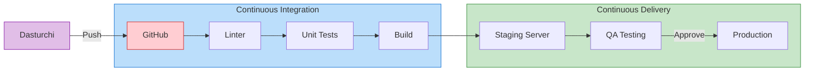

# CI/CD (Continuous Integration / Continuous Delivery)

## Kirish

> [!IMPORTANT]
> **Nima uchun muhim?**  
> Dasturni o'z kompyuteringizda ishga tushirish oson (`npm run dev`). Lekin dasturni serverga joylash (Deploy qilish) odatda quyidagi amallarni talab qiladi: Testlarni ishga tushirish, Build qilish, Eski serverni to'xtatish, Yangi fayllarni yuklash va Serverni qayta yozish. Agar har bir o'zgarishda bularni qo'lda qilsangiz kuniga 5 soat vaqtingiz ketadi va inson omili sabab xatoliklar (Masalan testni tekshirmasdan yuklab yuborish) yuzaga keladi. CI/CD (Continuous Integration / Continuous Delivery) — mana shu barcha azoblarni yechib, hamma narsani 100% Avtomatlashtiruvchi sehrli tayoqchadir.

> [!NOTE]
> **Real-hayot analogiyasi: "Avtomobil yig'ish zavodi (Konveyer)"**  
> Oddiy mexanik ustaxonasida 5 ta odam bitta mashinani noldan boshlab o'zlari yig'ishadi (Bu qo'lda Deploy qilish - Manual).  
> CI/CD esa bu — **Genri Ford kashf etgan Konveyer**. Siz faqat bitta detalni konveyerga qo'yasiz (Kodni GitHub ga push qilasiz). Qolgan hamma narsa: g'ildirak taqish (Build), tekshirish (Test), bo'yash (Linting) va tayyor avtomobilni salonga olib borish (Deploy) ishlari avtomatik konveyer lentalari (Pipelines) orqali yuz beradi.



CI/CD - bu zamonaviy dasturiy ta'minot ishlab chiqarishning asosiy amaliyotidir. Bu jarayon kod yozilgandan boshlab to foydalanuvchiga yetib borguncha bo'lgan ishlarni avtomatlashtiradi, xatolarni erta aniqlaydi va jarayonni xavfsiz qiladi.

---

## 🟢 Junior (Asoslar va Tushunchalar)

### CI/CD o'zi nima?
CI/CD aslida ikkita alohida jarayonning birlashmasi:
1. **CI (Continuous Integration - Uzluksiz Birlashtirish):** Bu jarayonda har safar yangi kod yozganingizda u umumiy kod bazasiga qo'shiladi va Avtomatik Linter (xatolarni tekshirish) hamda Unit Test lardan o'tadi. Natijada "Mening kompyuterimda ishlagandi" degan muammo yo'qoladi.
2. **CD (Continuous Delivery - Uzluksiz Yetkazib berish):** Testdan o'tgan kodni avtomatik tarzda Test Server (Staging) yoki Asosiy Server (Production) ga o'rnatish.

### Pipeline nima?
Bu qadam-baqadam bajariladigan ishlar ketma-ketligi:
```
[ Kodni Git ga jo'natish ] ➡️ [ Linter tekshiruvi ] ➡️ [ Testlar ] ➡️ [ Build (Yig'ish) ] ➡️ [ Serverga yuklash ]
```
Bularni bajarish uchun GitHub Actions, GitLab CI/CD, Jenkins yoki Bitbucket Pipelines kabi maxsus dasturlar (Runner'lar) ishlatiladi.

---

## 🟡 Middle (Amaliyot va Detallar)

### GitHub Actions bilan birinchi Pipeline
Sizning omboringizda (Repository) `.github/workflows/main.yml` faylini yaratsangiz GitHub bu avtomatlashtirilgan jarayon ekanini tushunadi.

```yaml
name: CI/CD Pipeline

on:
  push:
    branches: [main] # Faqat main branch ga push qilinganda ishlaydi

jobs:
  build-and-test:
    runs-on: ubuntu-latest # Qaysi OS da ishlashi
    
    steps:
      - uses: actions/checkout@v4 # 1. Kodni repo'dan ko'chirib olish
      
      - name: Node.js ni o'rnatish
        uses: actions/setup-node@v4
        with:
          node-version: '20'
          
      - name: Kutubxonalarni o'rnatish
        run: npm ci # 2. npm install dan farqli o'laroq aynan lock fayldan o'rnatadi
        
      - name: Xatolarni tekshirish (Lint)
        run: npm run lint # 3. Kod sifatini tekshirish
        
      - name: Dasturni Build qilish
        run: npm run build # 4. Vue/React da dasturni yig'ish
```

### Environment Variables va Secrets (Maxfiy so'zlar)
Hech qachon AWS paroli, Database linki yoki JWT secretni `main.yml` ichiga to'g'ridan to'g'ri yozmang! Buning o'rniga GitHub (yoki GitLab) sozlamalaridan "Secrets" ga qo'shib, faylda chaqiring:
```yaml
      - name: Serverga Deploy qilish
        env:
          API_KEY: ${{ secrets.PROD_API_KEY }}
          DB_PASS: ${{ secrets.DATABASE_PASSWORD }}
        run: ./deploy.sh
```

---

## 🔴 Senior (Arxitektura va Optimizatsiya)

### Pipeline Optimizatsiyasi
Katta loyihalarda Pipeline yuz marta ishga tushishi va soatlab kuttirishi mumkin. Uni qanday tezlashtiramiz?

1. **Caching (Keshlashtirish):** Har safar `npm ci` qilish kerak emas, agar `package.json` o'zgarmagan bo'lsa `node_modules` ni CI/CD serverining keshidan olish kerak:
```yaml
      - name: Cache node modules
        uses: actions/cache@v4
        with:
          path: ~/.npm
          key: ${{ runner.os }}-node-${{ hashFiles('**/package-lock.json') }}
```

2. **Parallel execution (Bir vaqtda bajarish):** Hamma Testlarni kutmasdan ularni qismlarga (Shard) bo'lib parallel ishga tushirish. E2E (End-to-End) testlar uzoq davom etadi. Ular faqatgina oldingi kichik Unit Testlar o'tganidagina ishlashi maqsadga muvofiq ("Fail Fast").

### Deployment Strategiyalari
Senior muhandis Dasturni yangilayotganda 1 soniya ham "sayt ishlamay qolishiga" (Downtime) yo'l qo'ymasligi kerak:

| Strategiya | Qanday ishlaydi? | Qachon ishlatiladi? |
|------------|-----------------|--------------------|
| **Blue-Green** | Server ikkita bo'ladi (Blue-Eski, Green-Yangi). Green ga dastur o'rnatib test qilinadi, hammasi yaxshi bo'lsa Nginx yoki Load Balancer trafigini darhol Green ga buriladi. | Katta va muhim loyihalarda, zudlik bilan orqaga qaytish (Rollback) imkoni kerak bo'lganda. |
| **Canary** | Yangi versiya faqatgina 5% foydalanuvchilarga ochib beriladi (Masalan faqat bitta mintaqaga). Kuzatiladi, agar muammo bo'lmasa qolgan 95% gacha sekin kengaytiriladi. | Yangi riskli funksiyalar qo'shilganda (A/B testing kabi). |
| **Rolling** | Serverlar guruhiga (Masalan 10 ta Pod) ketma-ket, birin ketin yangi dastur o'rnatiladi. | Kubernetes arxitekturasining default amaliyoti. |

### Intervyu Savollari (Qiyin daraja)
**1. CI va CD farqi nima?**
*Javob:* 
- **CI (Continuous Integration)** - developerlar yozgan turli kodlarni (branchlarni) bitta joyga birlashtirish, va uni avtomatik Linting, Unit Test qilish bosqichi (Buzilgan kod main branchga tushmasligi kafolati).
- **CD** o'z ichiga ikkita ma'noni oladi: **Continuous Delivery** - Testdan o'tgan kodni, QA (Testerlar) tekshirishi uchun Staging serverga yuklash (Lekin Production'ga inson tasdig'i bilan chiqadi). **Continuous Deployment** - Hech qanday tasdiqsiz, testlar o'tishi bilan to'g'ridan to'g'ri haqiqiy Production serveriga (Jonli foydalanuvchilarga) chiqarib yuborish.

**2. Pipeline ishlamay (Fail bo'lib) yiqildi. Qanday debug qilasiz?**
*Javob:*
1. Pipeline Logs larni tekshiraman (Aynan qaysi "Step" da yiqildi).
2. Xatolik Linter yoki Test bilan bog'liq bo'lsa kompyuterimda aynan o'sha testni ishga tushirib ko'raman.
3. Agar muammo faqat CI serverida bo'layotgan bo'lsa: Environment variable lar (Secrets) to'g'ri o'rnatilganini tekshiraman. Cache eskirmaganiga ishonch hosil qilaman.
4. CI platformaning Artifacts bo'limiga tushgan xato "Screenshot" lari (Agar E2E test bo'lsa) ni o'rganib chiqaman.

---

## Eng Yaxshi Amaliyotlar (Best Practices)

1. **Testlarni birinchi yozing (Fail Fast):** CI pipeline larda eng ko'p vaqt Build (kodni yig'ish) jarayoniga ketadi. Shuning uchun, pipeline ni shunday quringki, oldin eng tez ishlaydigan Linter va Unit Test lar yursin. Ular o'tmasa, Build ni boshlab resurs (Server minutlari) ni isrof qilmang (Bu "Fail Fast" - Tez qulash strategiyasi deyiladi).
2. **Hech qachon sirlarni kodda saqlamang:** API key lar, Database parollari yoki AWS Token larni aslo GitHub ga kiritmang. Ular uchun `GitHub Secrets` yoki `GitLab CI/CD Variables` dan foydalaning va pipeline ichida ularni chaqirib ishlating.
3. **Qaytariluvchanlik (Idempotency):** CI/CD pipeline ni necha marta ishga tushirsangiz ham, u toza holatdan boshlanishi (Clean slate) va ayni bitta natijani berishi kerak. Mashinadagi eskirib qolgan fayllarga tayanmang (Cash lardan tashqari).

---

## Xulosa

| Atama | To'liq ma'nosi | Maqsadi | Misol Toollar |
|-------|----------------|---------|---------------|
| **CI** (Continuous Integration) | Uzluksiz Birlashtirish | Dasturchilar yozgan kodni bitta joyga yig'ish, Linter dan o'tkazish, Test qilish. (Buzilgan kod asosiy bazaga tushmasligi kafolati) | GitHub Actions, GitLab CI, CircleCI |
| **CD** (Continuous Delivery) | Uzluksiz Yetkazib berish | CI dan muvaffaqiyatli o'tgan kodni, QA (Testerlar) yoki mijoz ko'rishi uchun Testing (Staging) serveriga avtomatik yuklash. | Jenkins, ArgoCD, AWS CodeDeploy |
| **CD** (Continuous Deployment) | Uzluksiz O'rnatish | Hech qanday inson ishtirokisiz (hatto tasdiqlashsiz ham) to'g'ridan to'g'ri Jonli (Production) serverga kodni chiqarib yuborish. | (Eng yuqori darajadagi ishonchli loyihalarda ishlaydi) |
| **Pipeline** | Konveyer | Bajarilishi kerak bo'lgan qadamlar (Jobs) zanjiri. `Test -> Build -> Deploy` | `.github/workflows/main.yml` |

CI/CD - bu zamonaviy dasturiy ta'minot ishlab chiqarishning muhim qismi. Yaxshi CI/CD pipeline - bu ishonchli, tez va xavfsiz deployment'lar kafolatchisi. Eng asosiysi automation orqali inson xatosini minimizatsiya qilish va dasturchiga "Faqat kod yozish" majburiyatini qoldirishdir.
