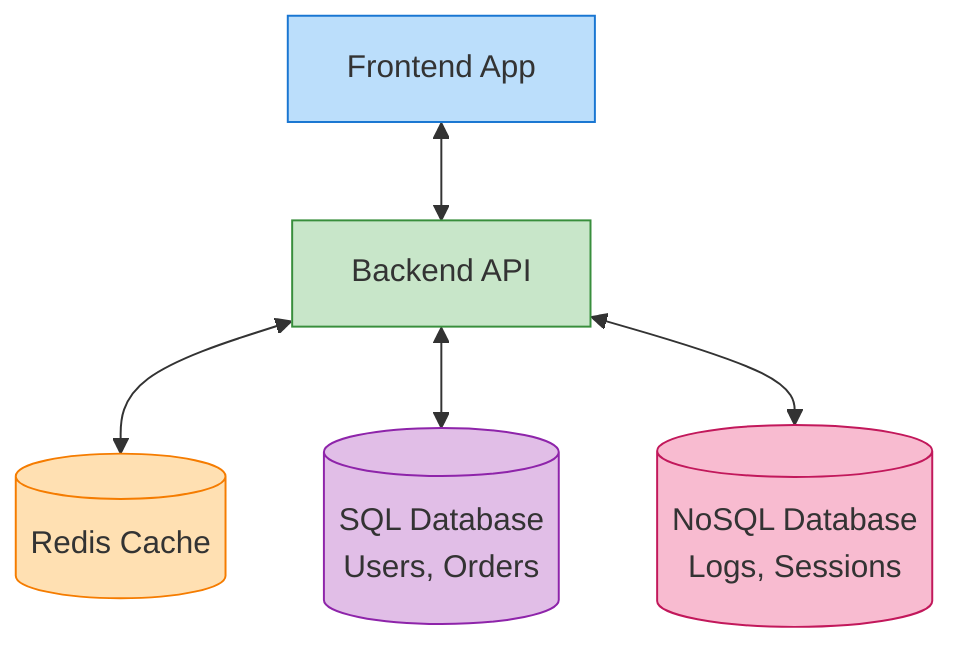

# Databases - Ma'lumotlar Bazasi Asoslari

## Kirish

> [!IMPORTANT]
> **Nima uchun muhim?**  
> Odatda Frontend dasturchilar xatoni faqat o'zidan izlashadi: "Sayt nega qotib qoldi, koddagi qaysi for-loop ko'p aylanib ketdi?". Ammo ko'pincha muammo umuman sizda bo'lmaydi. Saytning qotishi — Backend yozgan noto'g'ri SQL so'rov yoki bazada Index qo'yilmaganidan millionlab qatorlarni titkilashiga (Full Table Scan) ketayotgan vaqt bo'ladi. Ma'lumotlar bazasi (DB) qanday ishlashini bilgan Frontendchi, Backend jamoasi bilan "Nega bu API 3 soniya kutyapti? Pagination yoki Indexing qo'shing!" deb professional savdolasha oladi.

> [!NOTE]
> **Real-hayot analogiyasi: "Kutubxona va Jurnallar"**  
> **SQL (Relational DB)** — Bu mukammal tartibga solingan Kutubxona. Har bir kitob qaysi javonda, kim yozgan, ID si nima hammasi aniq Jadvalda yozib qo'yilgan. Biror ma'lumot qidirish oson, lekin javonga sig'maydigan (standartga tushmaydigan) narsani olib kira olmaysiz.  
> **NoSQL (Non-Relational DB)** — Bu shaxsiy kundalikingiz yoki daftar. Istagan betga rasm chizasiz, istagan betga matn yozasiz, qat'iy qoida yo'q (JSON). Tezkor yozish uchun qulay, lekin butun daftardan qaysidir ma'lumotni topish qiyinroq.

Database - bu ma'lumotlarni tizimli saqlash, boshqarish va olish uchun mo'ljallangan dasturiy ta'minot. Frontend dasturchi sifatida siz database'dan bevosita foydalanmasangiz-da, uning qanday ishlashini tushunish API dizayn va tizim ishlash tezligi (Performance optimization) uchun juda muhimdir.

---

## 🟢 Junior (Asoslar va Tushunchalar)

### SQL vs NoSQL
Ma'lumotlar bazasining ikkita eng katta turi bor. Buni bilsangiz Backend dasturchilar nima haqida tortishayotganini tushunasiz:

**1. SQL (Relational Databases)**
- Qat'iy qoidali Jadvallar (Tables) asosida ishlaydi (huddi Excelga o'xshab).
- Moliya, Bank va qat'iy hisob-kitob talab qilinadigan tizimlarda ishlatiladi.
- Mashhurlari: `PostgreSQL`, `MySQL`, `Oracle`.

**2. NoSQL (Non-Relational Databases)**
- Qat'iy jadvallari yo'q. Ma'lumotlar JS dagi Object (JSON) ko'rinishida saqlanadi.
- O'ta tezkor yozish (Tezkor o'yinlar, Chat xabarlari, Loglar) uchun mo'ljallangan.
- Mashhurlari: `MongoDB`, `Redis`, `Firebase/Firestore`.

### Asosiy Atamalar
- **Table / Collection:** Jadvallar to'plami. (Masalan barcha "Users" ma'lumotlari).
- **Row / Document:** Jadvaldagi bitta qator, ya'ni bitta maxsus ma'lumot (Masalan, sizning shaxsiy profilingiz).
- **Primary Key (ID):** Har bir ma'lumotning takrorlanmas noyob (Unique) raqami yoki matni. Hech qachon ism bo'yicha qidirmang, har doim ID bo'yicha izlang.

---

## 🟡 Middle (Amaliyot va Detallar)

### Indexing (Indekslash)
Agar 1 millionta foydalanuvchi bor jadvaldan elektron pochta orqali bitta odamni qidirmoqchi bo'lsangiz, kompyuter 1 millionta qatorni birma-bir o'qib chiqadi (Full Table Scan). Bu o'nlab soniyalarni oladi. 
**Yechim (Index):** Bazadagi aynan `email` ustuniga "Index" qo'yilsa, baza uni Alfavit bo'yicha tartiblab daraxtsimon tuzilma (B-Tree) yasab oladi. Natijada 1 millionta odam orasidan ma'lumot bor-yo'g'i 20 ta qadamda (ms) topiladi.

### Normalization (Normallashtirish)
Bu ma'lumotlarni to'g'ri bo'laklarga bo'lish qoidasi. Aytaylik buyurtma (Order) saqlamoqchisiz:
- *Noto'g'ri:* Bitta jadvalga mijoz ismi, telefon raqami, sotib olingan maxsulot rasmi, narxi hammmasini 1 ta qatorga tiqish. Natijada ertaga mijoz raqamini o'zgartirsa, uning minglab eski buyurtmalaridagi raqamlarni bittalab topib o'zgartirish kerak bo'ladi.
- *To'g'ri (Normallashtirilgan):* 3 ta alohida jadval qilinadi: `Users`, `Products` va `Orders`. `Orders` jadvali faqatgina `User_ID` va `Product_ID` larni ko'rsatib turadi (Reference/Foreign Key). Natijada mijoz telefonini o'zgartirsa bittagina joyda o'zgaradi holos.

---

## 🔴 Senior (Arxitektura va Optimizatsiya)

### N+1 Query Muammosi
Bu Frontend ishlatadigan REST va GraphQL API lardagi eng og'riqli xatodir.
Faraz qiling, sizga 100 ta eng so'nggi maqolalar (`Posts`) va ularni yozgan muallifning (`Author`) ismi kerak.
- *Xato yondashuv (N+1)*: Backend avval bitta zapros bilan bazadan 100 ta postni oladi (`1 ta so'rov`). Keyin sikl (for-loop) ochib, 100 ta postning muallif ismini topish uchun bazaga **yana 100 marta** alohida zapros beradi (`N ta so'rov`). Umumiy: 101 marta bazaga kirib chiqildi. (API 5 soniya kutadi).
- *To'g'ri yondashuv (JOIN)*: Baza o'zining ichida `JOIN` operatori bilan jadvallarni bog'lab yuboradi va bor yo'g'i **1 ta so'rov** bilan yig'ilgan ma'lumotni qaytaradi.

### ACID Kafolati (SQL)
Nima uchun banklar hech qachon MongoDB (NoSQL) ni asosiy baza sifatida ishlatmaydi? Chunki SQL bazalari ACID ni qo'llab quvvatlaydi:
- **A (Atomicity):** Yoki hammasi bajariladi, yoki hech narsa. Masalan, men senga 100 ming yuborsam: 1) mendan pul yechiladi, 2) senga pul qo'shiladi. Agar senga qo'shilayotgan joyida server o'chib qolsa, mendan yechilgan pul avtomatik joyiga qaytariladi (Rollback). NoSQL larda esa pul osmonda yo'qolib ketishi ehtimoli bor edi.
- **C (Consistency):** Baza qoidalari hech qachon buzilmaydi.
- **I (Isolation):** Bir vaqtning o'zida million kishi pul o'tkazsa ham ular bir-birini bloklab chalkashib ketmaydi.
- **D (Durability):** Kommit bo'ldimi, demak diskga yozildi. Svet o'chsa ham o'chib ketmaydi.

### Intervyu Savollari (Qiyin daraja)
**1. SQL va NoSQL o'rtasidagi asosiy farq nima va qachon qaysi birini tanlaysiz?**
*Javob:* SQL qat'iy jadvallarga asoslangan va ACID kafolati bor (Moliya, E-Commerce tizimlarida ishlatiladi). NoSQL esa qoidasiz (JSON kabi) va moslashuvchan, u o'ta katta tezlik talab qilganda va ma'lumotlar formati tez-tez o'zgarib turadigan holatlarda (Kataloglar, Loglar, IoT, Social Media postlari) ishlatiladi.

**2. Frontend orqali yuborilgan so'rov (Search) 10 soniya kutyapti. Dasturni profiling (tekshiruv) qilsangiz, muammo bazadan o'qishda ekani ma'lum bo'ldi. Backend muhandislariga qanday maslahat berasiz?**
*Javob:* Birinchi navbatda izlanayotgan ustunlarga "Index" qo'yilganligini tekshirishlarini aytaman. Keyin, balki bu N+1 muammosidir deb, so'rovlarni alohida emas `JOIN` yoki `Batching (Dataloader)` orqali bitta qilib olishlarini maslahat beraman. Qolaversa, Frontend da darhol Pagination (yoki Cursor-based pagination) joriy etaman.

---

## Eng Yaxshi Amaliyotlar (Best Practices)

1. **N+1 Muammosidan ehtiyot bo'ling:** Frontenddan turib API ni tsikl (for/map) ichida chaqirmang. Masalan: 10 ta Post ni olib, keyin har bir Post ning avtorini olish uchun yana 10 marta API ga zapros urish — arxitekturaviy jinoyatdir. Buni bitta marta `JOIN` yoki `Populate` orqali Backendning o'zida yig'ib so'rash kerak (GraphQL bunga zo'r yechim).
2. **Optimistic UI:** Database operatsiyasi qachon yakunlanishini bilasiz (masalan Like bosish), javob kelishini kutib turmang. Darhol yurakchani qizilga bo'yang (Optimistic update) va orqa fonda API ga jo'nating. Agar Database dan error (xato) kelsa, sekingina yurakchani qayta oq rangga o'tkazib, "Xatolik" deb alert chiqaring.
3. **UUID vs Serial ID:** URL da `example.com/users/12` kabi oddiy raqamli ID larni ishlatish juda xavfli. Raqobatchilar 1 dan boshlab milliongacha bo'lgan barcha ID larni generatsiya qilib bazangizni ko'chirib olishi mumkin. Har doim `UUID` (masalan: `a3f8b9-4c...`) ishlatishni Backenddan talab qiling.

---

## Xulosa

| Konsept | Izoh | Frontend uchun Ahamiyati |
|---------|------|--------------------------|
| **SQL (Relational)** | Qat'iy jadvallar (Tables) va munosabatlar (Relations) orqali bog'langan baza (PostgreSQL). | API javoblari doim aniq va qat'iy tipga ega bo'lishini ta'minlaydi. |
| **NoSQL (Document)** | Jadvallarsiz, JSON kabi document shaklida saqlovchi baza (MongoDB). | JSON formatda bo'lgani uchun Frontend (JS) bilan ishlashga juda qulay, lekin tartibsizlik ko'p. |
| **Index (Indekslash)** | Kitobning Mundarijasi kabi ishlaydi. Qidiruv tezligini million marta oshiradi. | Agar Frontend da search (qidiruv) 2-3 soniyaga cho'zilsa, bilingki Backend index qo'yishni unutgan. |
| **ACID (Transactions)** | Ma'lumotlarning butunligini kafolatlaydi (Masalan pul o'tkazmalari 100% yetib borishi yoki umuman bekor bo'lishi). | Pul o'tkazishda loading (spinner) ni to'xtatib qo'yish qanchalik muhimligini tushunishga yordam beradi. |

Database bilimi frontend dasturchi uchun ko'zga ko'rinmas, lekin hayotiy muhim texnologiya hisoblanadi. API lar qanday qilib ma'lumotni saqlashi, nega ba'zi so'rovlar sekin ishlashi (Index yetishmasligi) va N+1 muammolarini bilish sizni oddiy UI chizuvchidan haqiqiy Software Engineer darajasiga ko'taradi. Backend bilan bir tilda gaplashish - Senior darajaning birinchi belgisidir.
