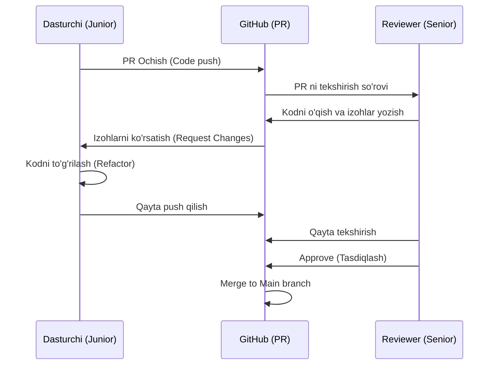

# Code Review - Professional Kod Ko'rib Chiqish

## Kirish

> [!IMPORTANT]
> **Nima uchun muhim?**  
> Dasturchilarning ko'pchiligi kodi ishlasa bo'ldi, uni boshqalar qanday tushunishi muhim emas deb o'ylaydi. Lekin, Code Review (Kodni tekshirish) bu shunchaki "Xatolarni izlash" emas, balki kompaniyaning Kod Sifatini bir xil darajada ushlab turish va o'zaro tajriba almashish jarayonidir. Yaxshi Code Review bera oladigan dasturchi Jamoaning 1-raqamli yordamchisi (Lideri) hisoblanadi. Agar siz faqat "LGTM" (Looks Good To Me) deb review bersangiz, siz hali Senior emassiz.

> [!NOTE]
> **Real-hayot analogiyasi: "Yozuvchi va Muharrir"**  
> Siz qanchalik iste'dodli yozuvchi bo'lmang (Dasturchi), kitobingiz nashr etilishidan oldin baribir Tajribali Muharrir (Reviewer) ko'rigidan o'tadi.  
> Muharrir so'zlarni o'zgartirishi, noto'g'ri tasvirlarni to'g'rilashi yoki hatto bitta sahifani butunlay o'chirib, "Boshqacha yozing" deyishi mumkin. U buni sizni yomon ko'rgani uchun emas, Kitob (Loyiha) sifatli chiqib, xaridorlarga (Foydalanuvchiga) manzur bo'lishi uchun qiladi.



Code review - bu jamoa a'zolari tomonidan yozilgan kodni ko'rib chiqish jarayoni. Bu faqat xatolarni topish emas - bu **bilim almashish, standartlarni saqlash va jamoa sifatini oshirish** vositasidir.

---

## 🟢 Junior (Asoslar va Tushunchalar)

### Nega Code Review Muhim?
- **Sifat Nazorati:** Ko'zdan qochgan xatolarni (Buglarni) Productionga (Jonli saytga) chiqib ketishidan oldin aniqlash.
- **Bilim Almashish:** Juniorlar Seniorlarning yozgan kodini ko'rib katta tajriba orttirishadi.
- **Consistency (Bir xillik):** Kodni 5 xil odam yozgan bo'lsa ham, u tashqaridan qaraganda 1 ta odam yozgandek o'qilishi kerak. Code Review shuni ta'minlaydi.

### Code Review da o'zingizni qanday tutishingiz kerak?
- **Shaxsiy qabul qilmang:** Agar kodingizga 20 ta izoh yozilgan bo'lsa, bu "Siz yomon dasturchisiz" degani emas. Bu "Kodni mukammalroq qilish imkoni bor" degani. Egoningizni chetga surib qo'ying.
- **Savol berishdan uyalmang:** Agar katta dasturchi (Senior) sizga qandaydir izoh qoldirgan va siz tushunmagan bo'lsangiz, albatta uning tagidan so'rang: "Kechirasiz, buning o'rniga Object.keys ishlatsam nega yaxshiroq bo'ladi?".

---

## 🟡 Middle (Amaliyot va Detallar)

### Samarali Review Berish
Endi siz boshqalarning (Juniorlarning) kodini tekshirishni boshlashingiz kerak. Review izohlarini yozishda toifalarga bo'ling:

**1. Blocker (Kritik Xato)**
Bu xato tuzatilmaguncha kod qabul qilinmaydi (Merge qilinmaydi).
```javascript
// Izoh: "BLOCKER: Bu yerda ochiqdan-ochiq SQL Injection qilinmoqda. 
// Iltimos, parametrlangan Query ishlatamiz."
const query = `SELECT * FROM users WHERE id = ${userId}`;
```

**2. Suggestion (Taklif)**
Bu xato emas, lekin koddagi o'qilish yoki tezlikni (Performance) ni oshirish mumkin bo'lgan joylar.
```javascript
// Izoh: "SUGGESTION: filter().map() o'rniga reduce() ishlatsak, 
// aylanma sikllar (loops) soni kamayar edi."
const result = items.filter(x => x.active).map(x => x.name);
```

**3. Nitpick (Arzimagan Izoh)**
Bu shunchaki sizning shaxsiy xohishingiz, muallif o'zgartirmasa ham bo'ladi. 
```javascript
// Izoh: "NITPICK: `data` juda umumiy nom. Keling buni `userProfiles` deb nomlaymiz."
const data = await fetchProfiles();
```

---

## 🔴 Senior (Arxitektura va Optimizatsiya)

### Katta Reviewlarni Boshqarish
Katta loyihalarda kimdir 1000+ qatorli PR (Pull Request) ochishi mumkin. Buni qanday review qilasiz?

1. **Top-Down Yondashuv:** Oldin katta fayllarga, ya'ni Arxitekturaga (Qanday Pattern ishlatilgan? Papkalar strukturasi qanaqa?) qarang. Agar Arxitektura xato bo'lsa, kod ichidagi mayda nuqta-vergul qidirishning foydasi yo'q, baribir qayta yoziladi.
2. **Kichik qismlarga bo'lishni talab qilish:** Senior sifatida dasturchilarga "PR lar 400 qatordan oshmasin" degan qat'iy madaniyatni o'rnating. Katta PR ni sifatli review qilib bo'lmaydi.
3. **Avtomatlashtirish:** Senior hech qachon "Bu yerda bo'sh joy qolib ketibdi" yoki "O'zgaruvchi nomi noto'g'ri (camelCase emas)" deb review yozmaydi. Bularning barchasini u Github Actions orqali ESLint va Prettier ga bog'lab CI/CD pipeline da avtomatlashtirib qo'ygan bo'lishi kerak.

### Intervyu Savollari (Qiyin daraja)
**1. "Qanday qilib sifatli code review berasiz?"**
*Javob:*
Men PR qabul qilganimda, avval uni tavsifini (Description) o'qiyman va aynan qaysi muammo hal qilinayotganini tushunaman. So'ngra kodni yuqoridan pastga emas, Logika nuqtai nazaridan o'qiyman. Topilgan narsalarni guruhlarga ajrataman (Blocker, Suggestion, Nitpick). Har bir izohda "Shunday qiling" deb buyruq bermayman, balki "Shunday qilsak, performans oshmaydimi?" deb jamoaviy dialog quraman va sababini albatta ko'rsataman. Va albatta, kodda zo'r yozilgan joy bo'lsa, ruxlantirish uchun albatta maqtab (Praise) qo'yaman.

**2. "Kod review'da hamkasbingiz bilan kelisha olmasangiz nima qilasiz?"**
*Javob:*
1. Agar github izohlarida bahsimiz 2 yoki 3 tadan oshsa, yozishishni to'xtataman.
2. Birga qisqa Zoom (Huddle) chaqiruvi qilib, yoki ofisda oldiga borib ovozli gaplashaman (Yozuvdagi emotsiyani noto'g'ri tushunish oson).
3. Egom ni chetga surib, nega u bunday yozganini sababini eshitaman. Buni shaxsiy urushga emas, arxitektura foydasiga buraman. Agar kelisha olmasak, jamoaning boshqa tajribali a'zosini "Kechirimli (Tie-breaker)" hakam sifatida qo'shamiz.

---

## Eng Yaxshi Amaliyotlar (Best Practices)

1. **"Sen" o'rniga "Biz" yoki "Kod" ni ishlating:** EGO ni chetga suring. "Sen bu yerda xato qilibsan" deyish o'rniga, "Bu funksiyani boshqacharoq yozsak nima deysiz?" yoki "Bu kod Edge Caselarda qulab tushishi mumkin" deb izoh yozing. Insonni emas, Kodni tanqid qiling.
2. **Kichik va tez-tez PR ochish:** 2000 qator kod o'zgargan PR ni hech kim sifatli Review qila olmaydi (Odatda charchab shunchaki Approve bosib yuborishadi). PR laringiz imkon qadar kichik (max 400 qator) va bitta maqsadga yo'naltirilgan bo'lishini ta'minlang.
3. **Avtomatlashtirish mumkin bo'lgan narsani insonga qoldirmang:** Reviewer vergul, probel (Space) yoki qavslarni tekshirishiga vaqt sarflamasligi kerak. ESLint, Prettier va Husky (Pre-commit hooks) larni to'g'rilang. Insondan faqat "Biznes Mantiqi" va "Arxitektura" ni tekshirishni so'rang.

---

## Xulosa

| Yondashuv | Yomon Review (Toxic) | Yaxshi Review (Senior) |
|-----------|----------------------|------------------------|
| **Fikr bildirish (Feedback)** | "Bu xato, o'zgartir." | "Bu yechim yaxshi, lekin `Array.map` o'rniga `Array.reduce` ishlatsak tezroq bo'lmaydimi?" |
| **Xatolarni ko'rsatish** | Faqat xatoning o'zini yozib qoldirish. | Xatoni yozish bilan birga, yechimga havolani (Doc link) yoki kichik kod snippetni ilova qilish. |
| **Maqtov (Praise)** | Hech qachon maqtamaslik. Faqat xato qidirish. | Chiroyli yechim ko'rsa albatta "Nice approach!" deb ruxlantirish. |
| **Qarama-qarshilik (Conflict)** | "Mening aytganim to'g'ri" deb oxirigacha bahslashish. | Agar bahs 2 tadan ko'p Commentga aylansa, "Zoom ga kirib gaplashib olaylik" deyish. |

Code review - bu:
1. **Sifat vositasi** - xatolarni topish
2. **O'rganish vositasi** - bilim almashish
3. **Kommunikatsiya vositasi** - jamoa birlikda ishlashi
4. **Madaniyat vositasi** - professional standartlar

> "Code review yoqmasa, yolg'iz ishlang. Jamoa bilan ishlasangiz - review majburiy."
